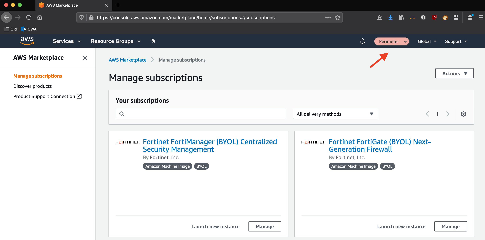

# AWS Secure Environment Accelerator v1.1.0

The AWS Accelerator is a tool designed to deploy and operate secure multi-account AWS environments. The power of the solution is the configuration file that drives the architecture deployed by the tool. This enables extensive flexibility and for the completely automated deployment of a customized architecture within AWS without changing a single line of code.

While flexible, the AWS Accelerator is delivered with a sample configuration file which deploys an opinionated and prescriptive architecture designed to meet the security requirements of many governments around the world (initial focus was the Government of Canada). Tuning the parameters within the configuration file allows for the deployment of these customized architectures and enables the solution to meet the requirements of a broad range of governments and public sector organizations.

Installation of the provided prescriptive architecture is reasonably simple, deploying a customized architecture does require extensive understanding of the AWS platform.

### Relationship with AWS Landing Zone Solution (ALZ)

The ALZ is an AWS Solution designed to deploy a multi-account AWS architecture for customers based on best practices and lessons learned from some of AWS' largest customers. The AWS Accelerator draws on design patterns from the Landing Zone, and re-uses several concepts and nomenclature, but it is not directly derived from it, nor does it leverage any code from the ALZ.

The AWS Accelerator is a superset of the ALZ. The initial versions of the AWS Accelerator presupposed the existence of an AWS Landing Zone Solution in the AWS Organization; this requirement has since been removed as of release `v1.1.0`.

While the option remains to deploy the AWS Accelerator on top of the ALZ, all new customers are strongly encourage to let the AWS Accelerator deploy and manage the entire environment by performing a standalone installation of the AWS Accelerator.

### Relationship with AWS Control Tower

AWS Control Tower is the successor to the ALZ, but offered as an AWS managed service. Many Public Sector customers have found Control Towers limited regional coverage, limited functionality and lack of customizability has made it unsuitable in meeting their requirements.

When appropriate, it is envisioned that the AWS Accelerator will add the capability to be deployed on top of AWS Control Tower, as we allow with the ALZ today.

## Installation

**_Deploying the AWS Accelerator requires the assistance of your local AWS Account team. Attempts to deploy the Accelerator without the support of your AWS SA, TAM, Proserve, or AM will fail as new AWS accounts do not have appropriate limits established to facilitate installation._**

Installation of the provided prescriptive AWS architecture, as-is, requires a limit increase to support a minimum of 6 AWS accounts in the AWS Organization plus any additional required workload accounts.

These installation instructions assume the prescribed architecture is being deployed.

## Prerequisites

- Master or Root AWS account (the AWS Accelerator cannot be deployed in an AWS sub-account)
- Limit increase to support a minimum of 6 sub-accounts plus any additional workload accounts
- Determine if you will install on top of ALZ or as a standalone installation
  - We recommend customers with deployed ALZ's consider uninstalling the ALZ and proceeding with a standalone installation
- Valid configuration file, updated to reflect your deployment (see below)
- Determine your primary or Accelerator 'control' region. These instructions have been written assuming ca-central-1, but any supported region can be substituted.

### Standalone Accelerator Installation (No ALZ base)

Before installing, you must first:

1. Login to the Organization **Master AWS account** with `AdministratorAccess`.
2. **_Set the region to `ca-central-1`._**
3. Enable AWS Organizations
4. Enable Service Control Policies
5. In AWS Organizations, "Verify" the master account email address (this is a technical process)
6. Set `alz-baseline=false` in the configuration file
7. Create a new KMS key to encrypt your source configuration bucket (you can use an existing key)

- AWS Key Managerment Service, Customer Managed Keys, Create Key, Symmetric, and then provide a key name
  (Accel-Source-Bucket), Next
- Select a key administrator (Admin Role or Group for the master account), Next
- Select key users (Admin Role or Group for the master account), Next
- Validate an entry exists to "Enable IAM User Permissions" (critical step if using an existing key)
  - `"arn:aws:iam::123456789012:root"`, where `123456789012` is your **_master_** account id.
- Click Finish

### ALZ Based Accelerator Installation

You need an AWS account with the AWS Landing Zone (ALZ) v2.3.1 or v2.4.0 deployed. It is strongly encouraged to upgrade to ALZ v2.4.0 before deploying the Accelerator.

When deploying the ALZ select:

1. Set `Lock StackSetExecution Role` to `No`
2. For production deployments, deploy to `All regions`, or `ca-central-1` for testing
3. Specify Non-Core OU Names: `Dev,Test,Prod,Central,UnClass,Sandbox` (case sensitive)
   - these match the provided prescriptive Accelerator configuration file (config.example.json)

Before installing, you must first:

1. Set `alz-baseline=true` in the configuration file
2. Login to the Organization **Master AWS account** where AWS Landing Zone is deployed with `AdministratorAccess`.
3. **_Set the region to `ca-central-1`._**
4. Enable IAM permissions to control access to use the `AwsLandingZoneKMSKey` KMS key.
   - i.e. add a root entry - `"arn:aws:iam::123456789012:root"`, where `123456789012` is your **_master_** account id.

### BOTH Installation Types

In the Master or root AWS account, manually:

1. Enable `"Cost Explorer"` (My Account, Cost Explorer, Enable Cost Explorer)
2. Enable `"Receive Billing Alerts"` (My Account, Billing Preferences, Receive Billing Alerts)
3. It is **_extremely important_** that **_all_** the account contact details be validated in the MASTER account before deploying any new sub-accounts.

- This information is copied to every new sub-account on creation.
- Subsequent changes to this information require manually updating it in **\*each** sub-account.
- Go to `My Account` and verify/update the information lists under both the `Contact Information` section and the `Alternate Contacts` section.
- Please ESPECIALLY make sure the email addresses and Phone numbers are valid and regularly monitored. If we need to reach you due to suspicious account activity, billing issues, or other urgent problems with your account - this is the information that is used. It is CRITICAL it is kept accurate and up to date at all times.

### AWS Internal Accounts Only

If deploying to an internal AWS account, to successfully install the entire solution, you need to enable private marketplace before starting:

1. In the master account go here: https://aws.amazon.com/marketplace/privatemarketplace/create
2. Click Create Marketplace
3. Go to Profile sub-tab, click the `Not Live` slider to make it `Live`
4. Click the `Software requests` slider to turn `Requests off`
5. Change the name field (i.e. append `-PMP`) and change the color, so it is clear PMP is enabled for users
6. Search PrivateMarketplace for Fortinet products
7. Unselect the `Approved Products` filter and then select:
   - `Fortinet FortiGate (BYOL) Next-Generation Firewall`
8. Select "Add to Private Marketplace" in the top right
9. Wait a couple of minutes while it adds item to your PMP - do NOT subscribe or accept the EULA
   - Repeat for `Fortinet FortiManager (BYOL) Centralized Security Management`

## Preparation

#### Create a GitHub Personal Access Token.

1. You require a Github access token to access the code repository
2. Instructions on how to create a personal access token are located here: https://help.github.com/en/github/authenticating-to-github/creating-a-personal-access-token-for-the-command-line
3. Select the scope `repo: Full control over private repositories`.
4. Store the personal access token in Secrets Manager as plain text. Name the secret `accelerator/github-token` (case sensitive).
   - Via AWS console
     - Store a new secret, and select `Other type of secrets`, `Plaintext`
     - Paste your secret with no formatting no leading or trailing spaces
     - Select `DefaultEncryptionKey`,
     - Set the secret name to `accelerator/github-token` (case sensitive)
     - Select `Disable rotation`

## Accelerator Configuration

1. You can use the [`config.example.json`](./config.example.json) file as base
   - Use the version from the branch you are deploying from as some parameters have changed over time
   - This configuration file can be used, as-is, with only minor modification to successfully deploy the standard architecture
2. At minimum, you MUST update the AWS account names and email addresses in the sample file:
   1. For existing accounts, they must match identically to the ones defined in your AWS Landing Zone;
   2. For new accounts, they must reflect the new account name/email you want created;
   3. All new AWS accounts require a unique email address which has never before been used to create an AWS account;
   4. When updating the budget notification email addresses within the example, a single email address for all is sufficient;
   5. For a test deployment, the remainder of the values can be used as-is.
3. In the ALZ version of the Accelerator, we strongly recommend removing _all_ workload accounts from the configuration file during initial deployment. Workload accounts can be added in the future. The ALZ AVM takes 42 minutes per sub-account. Additionally, importing existing accounts during initial deployment increases the risk of initial deployment failures.

### Key Production Config File Requirements:

- **For a production deployment, THIS REQUIRES EXTENSIVE PREPARATION AND PLANNING**
  - Plan your OU structure, we are suggesting:
    - core, Central, Sandbox, Unclass, Dev, Test, Prod
  - 6 \* RFC1918 Class B address blocks (CIDR's) which do not conflict with your on-premise networks
    - (one for each OU, except Sandbox which is not routable)
    - core Class B range will be split to support the Endpoint VPC and Perimeter VPC
  - 3 \* RFC6598 /23 address blocks (Government of Canada (GC) requirement only)
    - (MAD, perimeter underlay, perimeter overlay)(non-GC customers can use address space from the core CIDR range)
  - 3 \* BGP ASN's (TGW, FW Cluster, VGW)
  - A Unique Windows domain name (`deptaws`/`dept.aws`, `deptcloud`/`dept.cloud`, etc.)
  - DNS Domain names and DNS server IP's for on-premise private DNS zones requiring cloud resolution
  - DNS Domain for a cloud hosted public zone `"public": ["dept.cloud-nuage.canada.ca"]`
  - DNS Domain for a cloud hosted private zone `"private": ["dept.cloud-nuage.gc.ca"]`
  - Wildcard TLS certificate for each of the 2 previous zones
  - 2 Fortinet Fortigate firewall licenses
  - we also recommend at least 20 unique email ALIASES associated with a single mailbox, never used before to open AWS accounts, such that you do not need to request new email aliases every time you need to create a new AWS account.

4. Create an S3 bucket in your master account with versioning enabled `your-bucket-name`
   - you must supply this bucket name in the CFN parameters _and_ in the config file
   - the bucket name _must_ be the same in both spots
   - the bucket should be `S3-KMS` encrypted using either the `AwsLandingZoneKMSKey` or the key you created above
5. Place your customized config file, named `config.json`, in your new bucket
6. Place the firewall configuration and license files in the folder and path defined in the config file
   - i.e. `firewall/firewall-example.txt`, `firewall/license1.lic` and `firewall/license2.lic`
   - Sample available here: `./reference-artifacts/Third-Party/firewall-example.txt`
   - If you don't have any license files, update the config file with an empty array []
7. Place any defined certificate files in the folder and path defined in the config file
   - i.e. `certs/example1-cert.key`, `certs/example1-cert.crt`
   - Sample available here: `./reference-artifacts/Certs-Sample/*`
   - Ideally you would generate real certificates using your existing certificate authority
   - Should you wish, instructions are provided to aid in generating your own self-signed certificates
   - Use the examples to demonstrate Accelerator TLS functionality only
8. Detach **_ALL_** SCPs (except `FullAWSAccess` which remains in place) from all OU's and accounts before proceeding
   - Installation **will fail** if this step is skipped

## Deploy the Accelerator Installer Stack

1. You can find the latest release in the repository here: https://github.com/aws-samples/aws-pbmm-accelerator/releases
2. Download the CloudFormation template `AcceleratorInstaller.template.json`
3. Use the template to deploy a new stack in your AWS account
4. **_Make sure you are in `ca-central-1` (or your desired primary region)_**
5. Fill out the required parameters - **_LEAVE THE DEFAULTS UNLESS SPECIFIED BELOW_**
6. Specify `Stack Name` STARTING with `PBMMAccel-` (case sensitive) suggest a suffix of `deptname` or `username`
7. Change `ConfigS3Bucket` to the name of the bucket you created above `your-bucket-name`
8. Add an `Email` address to be used for notification of code releases
9. The `GithubBranch` should point to the release you selected
   - if upgrading, change it to point to the desired release
   - the latest stable branch is currently `release/v1.0.5`, case sensitive
10. Apply a tag on the stack, Key=`Accelerator`, Value=`PBMM` (case sensitive).
11. **ENABLE STACK TERMINATION PROTECTION** under `Stack creation options`
12. The stack typically takes under 5 minutes to deploy.
13. Once deployed, you should see a CodePipeline project named `PBMMAccel-InstallerPipeline` in your account. This pipeline connects to Github, pulls the code from the prescribed branch and deploys the Accelerator state machine.
14. For new stack deployments, when the stack deployment completes, the Accelerator state machine will automatically execute (in Code Pipeline). When upgrading you must manually `Release Change` to start the pipeline.
15. Approve the `Manual Approval` step in the pipeline to start the Accelerator code deployment or upgrade.
16. Once the pipeline completes (typically under 15 minutes), the state machine, named `PBMMAccel-MainStateMachine_sm`, will start in Step Functions
17. The state machine takes several hours to execute on an initial installation. Timing for subsequent executions depends entirely on what resources are changed in the configuration file, but can take as little as 20 minutes.
18. The configuration file will be automatically moved into Code Commit (and deleted from S3). From this point forward, you must update your configuration file in CodeCommit.
19. After the perimeter account is created in AWS Organizations, but before the Accelerator reaches Stage 2:
    1. NOTE: If you miss the step, or fail to execute it in time, no need to be concerned, you will simply need to re-run the state machine to deploy the firewall products
    2. Login to the **perimeter** sub-account
    3. Activate the Fortinet Fortigate BYOL AMI and the Fortinet FortiManager BYOL AMI at the URL: https://aws.amazon.com/marketplace/privatemarketplace
       - Note: you should see the private marketplace, including the custom color specified in prerequisite step 4 above.
       - When complete, you should see the marketplace products as subscriptions **in the Perimeter account**:

20. Once the state machine completes successfully, confirm the status of your perimeter firewall deployment.
21. If your perimeter firewalls were not deployed on first run, you will need to rerun the state machine. This happens when:
    1. you were unable to activate the firewall AMI's before stage 2 (step 19)
    2. we were not able to fully activate your account before we were ready to deploy your firewalls
    3. In these cases, simply select the `PBMMAccel-MainStateMachine_sm` in Step Functions and select `Start Execution`
22. The Accelerator installation is complete, but several manual steps remain:
    1. recover root passwords for all sub-accounts
    2. enable MFA for **all** IAM users and **all** root users
    3. Login to the firewalls and firewall manager appliance and set default passwords
       - Update firewall configuration per your organizations security best practices
    4. In ca-central-1, Enable AWS SSO, Set the SSO directory to MAD, set the SSO email attrib to: \${dir:email}, create all default permission sets and any desired custom permission sets, map MAD groups to perm sets
    5. On a per role basis, you need to enable the CWL Account Selector in the Security and the Ops accounts
23. During the installation we request required limit increases, resources dependent on these limits were not deployed
    1. You should receive emails from support confirming the limit increases
    2. Unfortunately, once the VPC endpoint limit is increased, it does not properly register in AWS Quota tool
       - If and when you receive confirmation from support that the **VPC Endpoint** limit in the shared network account has been increased
       - Set `"customer-confirm-inplace"` to **true** in the config file for the limit `"Amazon VPC/Interface VPC endpoints per VPC"` in the shared network account
    3. On the next state machine execution, resources blocked by limits should be deployed (i.e. VPC's, endpoints if you set the )
    4. If more than 2 days elapses without the limits being increased, on the next state machine execution, they will be re-requested

## Notes

### Configuration File Notes

- You cannot supply (or change) configuration file values to something not supported by the AWS platform
  - For example, CWL retention only supports specific retention values (not any number)
  - Shard count - can only increase/reduce by 1/2 the current limit. can change 1-2,2-3, 4-6
- Always add any new items to the END of all lists or sections in the config file, otherwise
  - update validation checks will fail (vpc's, subnets, share-to, etc.)
  - VPC endpoint deployments to blow up - do NOT re-order or insert VPC endpoints (unless you first remove them completely, execute SM, and then re-add them, run SM)
- To skip, remove or uninstall a component, you can simply change the section header
  - change "deployments"/"firewall" to "deployments"/"xxfirewall" and it will uninstall the firewalls
- As you grow and add AWS accounts, the Kinesis Data stream in the log-archive account will need to be monitored and have its capacity (shard count) increased by setting `"kinesis-stream-shard-count"` variable under `"central-log-services"` in the config file
- Updates to NACL's requires changing the rule number (100 to 101) or they will fail to update
- The firewall configuration uses an instance with **4** NIC's, make sure you use an instance size that supports 4 ENI's
- Re-enabling individual security controls in Security Hub requires toggling the entire security standard off and on again, controls can be disabled at any time

### General Notes

- Do not mess with _any_ buckets in the master account
- While likely protected, do not mess with CDK, CFN, or PBMMAccel- buckets in _any_ sub-accounts
- Log group deletion is prevented for security purposes. Users of the Accelerator environment will need to ensure they set CFN stack Log group retention type to RETAIN, or stack deletes will fail when attempting to delete a stack and your users will complain.

### Known limitations/purposeful exclusions:

- ALB automated deployments currently only supports Forward and not redirect rules
- Amazon Detective - not included
- Only 1 auto-deployed MAD per account is supported
- Only 1 auto-deployed TGW per account is supported
- VPC Endpoints have no Name tags applied as CloudFormation does not currently support tagging VPC Endpoints
- If the master account coincidentally already has an ADC with the same domain name, we do not create/deploy a new ADC. You must manually create a new ADC and it won't cause issues.
- Firewall updates are to be performed using the firewall OS based update capabilities. To update the AMI using the Accelerator, you must first remove the firewalls and then redeploy them (as the EIP's will block a parallel deployment)

# **STOP HERE, YOU ARE DONE, ENJOY!**

## Creating a new Accelerator Release (GitHub Release Process)

1. Ensure `master` is in a suitable state
2. Create a version branch with [SemVer](https://semver.org/) semantics and a `release/` prefix: e.g. `release/v1.0.5`

- **Important:** Certain git operations are ambiguous if tags and branches have the same name. Using the `release/` prefix reserves the actual version name for the tag itself.

3. Push that branch to GitHub (if created locally)
4. The release workflow will run, and create a **draft** release if successful with all commits since the last tagged release.
5. Prune the commits that have been added to the release (e.g. remove any low-information commits)
6. Publish the release - this creates the git tag in the repo and marks the release as latest.
