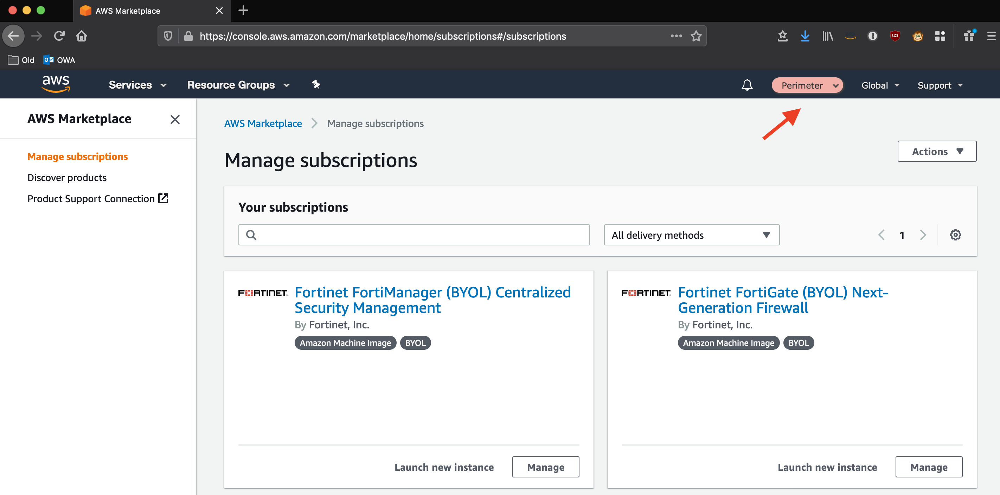

# Installation, Upgrades and Basic Operations

**_Deploying the AWS Accelerator requires the assistance of your local AWS Account team. Attempts to deploy the Accelerator without the support of your AWS SA, TAM, Proserve, or AM will fail as new AWS accounts do not have appropriate limits established to facilitate installation._**

Installation of the provided prescriptive AWS architecture, as-is, requires a limit increase to support a minimum of 6 AWS accounts in the AWS Organization plus any additional required workload accounts.

These installation instructions assume the prescribed architecture is being deployed.

## Prerequisites

- Master or Root AWS account (the AWS Accelerator cannot be deployed in an AWS sub-account)
  - No additional AWS accounts need to be pre-created before Accelerator installation
- Limit increase to support a minimum of 6 new sub-accounts plus any additional workload accounts
- Determine if you will install on top of ALZ or as a standalone installation
  - We recommend customers with deployed ALZ's consider uninstalling the ALZ and proceeding with a standalone installation
- Valid configuration file, updated to reflect your deployment (see below)
- Determine your primary or Accelerator 'control' region. These instructions have been written assuming ca-central-1, but any supported region can be substituted.

#### Existing AWS Organizations or AWS Accounts

- The Accelerator _can_ be installed into existing AWS Organizations
  - our early adopters have all successfully deployed into existing organizations
- Existing AWS accounts _can_ also be imported into an Accelerator managed Organization
- Caveats:
  - Prior to v1.1.5 customers that previously enabled Security Hub or deployed the fixed CloudWatch cross-account role in existing accounts were required to disable these services/remove the roles in each AWS account before Accelerator deployment or account import
  - Per AWS Best Practices, the Accelerator deletes the default VPC's in all AWS accounts. The inability to delete default VPC's in preexisting accounts will fail the installation/account import process. Ensure default VPC's can or are deleted before importing existing accounts. On failure, either rectify the situation, or remove the account from Accelerator management and rerun the state machine.
  - The Accelerator will NOT alter existing (legacy) constructs (e.g. VPC's, EBS volumes, etc.). For imported and pre-existing accounts, objects the Accelerator prevents from being created using preventative guardrails will continue to exist and not conform to the prescriptive security guidance.
    - Existing workloads should be migrated to Accelerator managed VPC's and legacy VPC's deleted to gain the full governance benefits of the Accelerator (centralized flow logging, centralized ingress/egress, no IGW's, Session Manager access, existing non-encrypted EBS volumes, etc.).
  - Existing AWS services will be reconfigured as defined in the Accelerator configuration file (overwriting existing settings)
  - We do NOT support _any_ workloads running or users operating in the master AWS account. The master AWS account MUST be tightly controlled
  - Importing existing _workload_ accounts is fully supported, we do NOT support, recommend and strongly discourage importing mandatory accounts, unless they were clean/empty accounts. Mandatory accounts are critical to ensuring governance across the entire solution

### Standalone Accelerator Installation (No ALZ base) (Preferred)

Before installing, you must first:

1. Login to the Organization **Master AWS account** with `AdministratorAccess`.
2. **_Set the region to `ca-central-1`._**
3. Enable AWS Organizations
4. Enable Service Control Policies
5. In AWS Organizations, "Verify" the master account email address (this is a technical process)
6. Set `alz-baseline=false` in the configuration file
7. Create a new KMS key to encrypt your source configuration bucket (you can use an existing key)

- AWS Key Management Service, Customer Managed Keys, Create Key, Symmetric, and then provide a key name
  (`Accel-Source-Bucket-Key`), Next
- Select a key administrator (Admin Role or Group for the master account), Next
- Select key users (Admin Role or Group for the master account), Next
- Validate an entry exists to "Enable IAM User Permissions" (critical step if using an existing key)
  - `"arn:aws:iam::123456789012:root"`, where `123456789012` is your **_master_** account id.
- Click Finish

### ALZ Based Accelerator Installation

You need an AWS account with the AWS Landing Zone (ALZ) v2.3.1 or v2.4.0 deployed. It is strongly encouraged to upgrade to ALZ v2.4.0 before deploying the Accelerator.

When deploying the ALZ select:

1. Set `Lock StackSetExecution Role` to `No`
2. For production deployments, deploy to `All regions`, or `ca-central-1` for testing
3. Specify Non-Core OU Names: `Dev,Test,Prod,Central,UnClass,Sandbox` (case sensitive)
   - these match the provided prescriptive Accelerator configuration file (config.example.json)

Before installing, you must first:

1. Set `alz-baseline=true` in the configuration file
2. Login to the Organization **Master AWS account** where AWS Landing Zone is deployed with `AdministratorAccess`.
3. **_Set the region to `ca-central-1`._**
4. Enable IAM permissions to control access to use the `AwsLandingZoneKMSKey` KMS key.
   - i.e. add a root entry - `"arn:aws:iam::123456789012:root"`, where `123456789012` is your **_master_** account id.

### BOTH Installation Types

In the Master or root AWS account, manually:

1. Enable `"Cost Explorer"` (My Account, Cost Explorer, Enable Cost Explorer)
2. Enable `"Receive Billing Alerts"` (My Account, Billing Preferences, Receive Billing Alerts)
3. It is **_extremely important_** that **_all_** the account contact details be validated in the MASTER account before deploying any new sub-accounts.

- This information is copied to every new sub-account on creation.
- Subsequent changes to this information require manually updating it in **\*each** sub-account.
- Go to `My Account` and verify/update the information lists under both the `Contact Information` section and the `Alternate Contacts` section.
- Please ESPECIALLY make sure the email addresses and Phone numbers are valid and regularly monitored. If we need to reach you due to suspicious account activity, billing issues, or other urgent problems with your account - this is the information that is used. It is CRITICAL it is kept accurate and up to date at all times.

### AWS Internal Accounts Only

If deploying to an internal AWS account, to successfully install the entire solution, you need to enable Private Marketplace (PMP) before starting:

1. In the master account go here: https://aws.amazon.com/marketplace/privatemarketplace/create
2. Click Create Marketplace
3. Go to Profile sub-tab, click the `Not Live` slider to make it `Live`
4. Click the `Software requests` slider to turn `Requests off`
5. Change the name field (i.e. append `-PMP`) and change the color, so it is clear PMP is enabled for users
6. Search Private Marketplace for Fortinet products
7. Unselect the `Approved Products` filter and then select:
   - `Fortinet FortiGate (BYOL) Next-Generation Firewall`
8. Select "Add to Private Marketplace" in the top right
   - Due to PMP provisioning delays, this sometimes fails when attempted immediately following enablement of PMP - retry after 20 minutes.
9. Wait a couple of minutes while it adds item to your PMP - do NOT subscribe or accept the EULA
   - Repeat for `Fortinet FortiManager (BYOL) Centralized Security Management`

## Preparation

### Create a GitHub Personal Access Token.

1. You require a GitHub access token to access the code repository
2. Instructions on how to create a personal access token are located here: https://help.github.com/en/github/authenticating-to-github/creating-a-personal-access-token-for-the-command-line
3. Select the scope `repo: Full control over private repositories`.
4. Store the personal access token in Secrets Manager as plain text. Name the secret `accelerator/github-token` (case sensitive).
   - Via AWS console
     - Store a new secret, and select `Other type of secrets`, `Plaintext`
     - Paste your secret with no formatting no leading or trailing spaces
     - Select either the key you created above (`Accel-Source-Bucket-Key`) or the `AwsLandingZoneKMSKey`,
     - Set the secret name to `accelerator/github-token` (case sensitive)
     - Select `Disable rotation`

### Accelerator Configuration

1. You can use the [`config.example.json`](../../reference-artifacts/config.example.json) file as base
   - Use the version from the branch you are deploying from as some parameters have changed over time
   - On upgrades, compare your deployed configuration file with the latest branch configuration file for any new or changed parameters
   - This configuration file can be used, as-is, with only minor modification to successfully deploy the standard architecture
2. At minimum, you MUST update the AWS account names and email addresses in the sample file:
   1. For existing accounts, they must match identically to the ones defined in your AWS Landing Zone;
   2. For new accounts, they must reflect the new account name/email you want created;
   3. All new AWS accounts require a unique email address which has never before been used to create an AWS account;
   4. When updating the budget notification email addresses within the example, a single email address for all is sufficient;
   5. For a test deployment, the remainder of the values can be used as-is.
3. In the ALZ version of the Accelerator, we strongly recommend removing _all_ workload accounts from the configuration file during initial deployment. Workload accounts can be added in the future. The ALZ AVM takes 42 minutes per sub-account. Additionally, importing existing accounts during initial deployment increases the risk of initial deployment failures.
4. A successful deployment requires VPC access to 6 AWS endpoints, you cannot remove both the perimeter firewalls (all public endpoints) and the 6 required central VPC endpoints from the config file (ec2, ec2messages, ssm, ssmmessages, cloudformation, secretsmanager).

### Key Production Config File Requirements:

- **For a production deployment, THIS REQUIRES EXTENSIVE PREPARATION AND PLANNING**
  - Plan your OU structure, we are suggesting:
    - core, Central, Sandbox, Unclass, Dev, Test, Prod
  - 6 \* RFC1918 Class B address blocks (CIDR's) which do not conflict with your on-premise networks
    - (one for each OU, except Sandbox which is not routable)
    - core Class B range will be split to support the Endpoint VPC and Perimeter VPC
  - 3 \* RFC6598 /23 address blocks (Government of Canada (GC) requirement only)
    - (MAD, perimeter underlay, perimeter overlay)(non-GC customers can use address space from the core CIDR range)
  - 3 \* BGP ASN's (TGW, FW Cluster, VGW)
  - A Unique Windows domain name (`deptaws`/`dept.aws`, `deptcloud`/`dept.cloud`, etc.)
  - DNS Domain names and DNS server IP's for on-premise private DNS zones requiring cloud resolution
  - DNS Domain for a cloud hosted public zone `"public": ["dept.cloud-nuage.canada.ca"]`
  - DNS Domain for a cloud hosted private zone `"private": ["dept.cloud-nuage.gc.ca"]`
  - Wildcard TLS certificate for each of the 2 previous zones
  - 2 Fortinet FortiGate firewall licenses
  - We also recommend at least 20 unique email ALIASES associated with a single mailbox, never used before to open AWS accounts, such that you do not need to request new email aliases every time you need to create a new AWS account.

4. Create an S3 bucket in your master account with versioning enabled `your-bucket-name`
   - you must supply this bucket name in the CFN parameters _and_ in the config file
   - the bucket name _must_ be the same in both spots
   - the bucket should be `S3-KMS` encrypted using either the `AwsLandingZoneKMSKey` or the `Accel-Source-Bucket-Key` created above
5. Place your customized config file, named `config.json`, in your new bucket
6. Place the firewall configuration and license files in the folder and path defined in the config file
   - i.e. `firewall/firewall-example.txt`, `firewall/license1.lic` and `firewall/license2.lic`
   - Sample available here: `./reference-artifacts/Third-Party/firewall-example.txt`
   - If you don't have any license files, update the config file with an empty array []
7. Place any defined certificate files in the folder and path defined in the config file
   - i.e. `certs/example1-cert.key`, `certs/example1-cert.crt`
   - Sample available here: `./reference-artifacts/Certs-Sample/*`
   - Ideally you would generate real certificates using your existing certificate authority
   - Should you wish, instructions are provided to aid in generating your own self-signed certificates
   - Use the examples to demonstrate Accelerator TLS functionality only
8. Detach **_ALL_** SCPs (except `FullAWSAccess` which remains in place) from all OU's and accounts before proceeding
   - Installation **will fail** if this step is skipped

### Deploy the Accelerator Installer Stack

1. You can find the latest release in the repository [here:](../../releases)
2. Download the CloudFormation template `AcceleratorInstaller.template.json`
3. Use the template to deploy a new stack in your AWS account
4. **_Make sure you are in `ca-central-1` (or your desired primary or control region)_**
5. Fill out the required parameters - **_LEAVE THE DEFAULTS UNLESS SPECIFIED BELOW_**
6. Specify `Stack Name` STARTING with `PBMMAccel-` (case sensitive) suggest a suffix of `deptname` or `username`
7. Change `ConfigS3Bucket` to the name of the bucket you created above `your-bucket-name`
8. Add an `Email` address to be used for notification of code releases
9. The `GithubBranch` should point to the release you selected
   - if upgrading, change it to point to the desired release
   - the latest stable branch is currently `release/v1.1.4`, case sensitive
10. For deployments before v1.1.6, update the `GithubRepository` name to `aws-secure-environment-accelerator`
11. Apply a tag on the stack, Key=`Accelerator`, Value=`PBMM` (case sensitive).
12. **ENABLE STACK TERMINATION PROTECTION** under `Stack creation options`
13. The stack typically takes under 5 minutes to deploy.
14. Once deployed, you should see a CodePipeline project named `PBMMAccel-InstallerPipeline` in your account. This pipeline connects to Github, pulls the code from the prescribed branch and deploys the Accelerator state machine.
15. For new stack deployments, when the stack deployment completes, the Accelerator state machine will automatically execute (in Code Pipeline). When upgrading you must manually `Release Change` to start the pipeline.
16. Once the pipeline completes (typically 15-20 minutes), the state machine, named `PBMMAccel-MainStateMachine_sm`, will start in Step Functions
17. The state machine takes several hours to execute on an initial installation. Timing for subsequent executions depends entirely on what resources are changed in the configuration file, but can take as little as 20 minutes.
18. The configuration file will be automatically moved into Code Commit (and deleted from S3). From this point forward, you must update your configuration file in CodeCommit.
19. You will receive an email from the State Machine SNS topic. Please confirm the email subscription to enable receipt of state machine status messages. Until completed you will not receive any email messages.
20. After the perimeter account is created in AWS Organizations, but before the Accelerator reaches Stage 2:
    1. NOTE: If you miss the step, or fail to execute it in time, no need to be concerned, you will simply need to re-run the state machine to deploy the firewall products
    2. Login to the **perimeter** sub-account (Assume your `organization-admin-role`)
    3. Activate the Fortinet Fortigate BYOL AMI and the Fortinet FortiManager BYOL AMI at the URL: https://aws.amazon.com/marketplace/privatemarketplace
       - Note: you should see the private marketplace, including the custom color specified in prerequisite step 4 above.
       - When complete, you should see the marketplace products as subscriptions **in the Perimeter account**:



21. Once the state machine completes successfully, confirm the status of your perimeter firewall deployment.
    - While you can watch the state machine in Step Functions, you will also be notified via email when the State Machine completes (or fails). Successful state machine executions include a list of all accounts which were successfully processed by the Accelerator.
22. If your perimeter firewalls were not deployed on first run, you will need to rerun the state machine. This happens when:
    1. you were unable to activate the firewall AMI's before stage 2 (step 19)
    2. we were not able to fully activate your account before we were ready to deploy your firewalls
    3. In these cases, simply select the `PBMMAccel-MainStateMachine_sm` in Step Functions and select `Start Execution`
23. The Accelerator installation is complete, but several manual steps remain:

    1. recover root passwords for all sub-accounts
    2. enable MFA for **all** IAM users and **all** root users
    3. Login to the firewalls and firewall manager appliance and set default passwords
       - Update firewall configuration per your organizations security best practices
       - manually update firewall configuration to forward all logs to the Accelerator deployed NLB addresses fronting the rsyslog cluster
       - manually update the firewall configuration to connect perimeter ALB high port flows through to internal account ALB's
    4. In ca-central-1, Enable AWS SSO, Set the SSO directory to MAD, set the SSO email attrib to: \${dir:email}, create all default permission sets and any desired custom permission sets, map MAD groups to perm sets
    5. On a per role basis, you need to enable the CWL Account Selector in the Security and the Ops accounts

24. During the installation we request required limit increases, resources dependent on these limits were not deployed
    1. You should receive emails from support confirming the limit increases
       ~~2. Unfortunately, once the VPC endpoint limit is increased, it does not properly register in AWS Quota tool~~
       ~~- If and when you receive confirmation from support that the **VPC Endpoint** limit in the shared network account has been increased~~
       ~~- Set `"customer-confirm-inplace"` to **true** in the config file for the limit `"Amazon VPC/Interface VPC endpoints per VPC"` in the shared network account~~
    2. On the next state machine execution, resources blocked by limits should be deployed (i.e. additional VPC's and Endpoints)
    3. If more than 2 days elapses without the limits being increased, on the next state machine execution, they will be re-requested

# Accelerator Basic Operation

### How do I add new AWS accounts to my AWS Organization?

- We offer two options and both can be used in the same deployment:

  - In both the ALZ and standalone versions of the Accelerator, you can simply add the following five lines to the configuration file `workload-account-configs` section and rerun the state machine. The majority of the account configuration will be picked up from the ou the AWS account has been assigned. You can also add additional account specific configuration, or override items like the default ou budget with an account specific budget. This mechanism is often used by customers that wish to programmatically create AWS accounts using the Accelerator and allows for adding many new accounts at one time.

  ```
  "fun-acct": {
    "account-name": "TheFunAccount",
    "email": "myemail+pbmmT-funacct@example.com",
    "ou": "Sandbox"
  }
  ```

  - STANDALONE VERSION ONLY: We've heard consistent feedback that our customers wish to use native AWS services and do not want to do things differently once security controls, guardrails, or accelerators are applied to their environment. In this regard, simply create your new AWS account in AWS Organizations as you did before\*\*.

    - \*\* **IMPORTANT:** When creating the new AWS account using AWS Organizations, you need to specify the role name you provided in the Accelerator configuration file `global-options\organization-admin-role`, the default value is `AWSCloudFormationStackSetExecutionRole`, otherwise we cannot bootstrap the account.
    - On account creation we will apply a quarantine SCP which prevents the account from being used by anyone until the Accelerator has applied the appropriate guardrails
    - Moving the account into the appropriate OU triggers the state machine and the application of the guardrails to the account, once complete, we will remove the quarantine SCP

### Can I use AWS Organizations for all tasks I currently use AWS Organizations for? (Standalone Version Only)

- In AWS Organizations you can continue to:
  - create and rename AWS accounts
  - move AWS accounts between ou's
  - create, delete and rename ou's, including support for nested ou's
  - create, rename, modify, apply and remove SCP's
- What can't I do:
  - modify Accelerator controlled SCP's
  - add/remove SCP's on top-level OU's (these are Accelerator controlled)
    - users can change SCP's on non-top-level ou's and accounts as they please
  - move an AWS account between top-level ou's (i.e. `Sandbox` to `Prod` is a security violation)
    - moving between `Prod/sub-ou-1` to `Prod/sub-ou2` or `Prod/sub-ou2/sub-ou2a/sub-ou2ab` is fully supported
  - create a top-level ou (need to validate, as they require config file entries)
  - remove quarantine SCP from newly created accounts
  - we do not support forward slashes (`/`) in ou names, even though the AWS platform does
- More details:
  - If you edit an Accelerator controlled SCP through Organizations, we will reset it per what is defined in the Accelerator configuration files.
  - If you add/remove an SCP from a top-level ou, we will put them back as defined in the Accelerator configuration file.
  - If you move an account between top-level ou's, we will put it back to its original designated top-level ou.
  - The Accelerator fully supports nested ou's, customers can create any depth ou structure in AWS Organizations and add/remove/change SCP's _below_ the top-level as they desire or move accounts between these ou's without restriction. Users can create ou's to the full AWS ou structure/depth.
  - Except for the Quarantine SCP applied to specific accounts, we do not 'control' SCP's below the top level, customers can add/create/customize SCP's

### How do I import an existing AWS account into my Accelerator managed AWS Organization (or what if I created a new AWS account with a different Organization trust role)?\*

- Ensure you have valid administrative privileges for the account to be invited/added
- Add the account to your AWS Organization using standard processes (i.e. Invite/Accept)
  - this process does NOT create an organization trust role
  - imported accounts do NOT have the quarantine SCP applied as we don't want to break existing workloads
- Login to the account using the existing administrative credentials
- Execute the Accelerator provided CloudFormation template to create the required Accelerator bootstrapping role - in the Github repo here: reference-artifacts\Import-Account\cfn-awscloudformationstacksetexecutionrole.template.yml
  - add the account to the Accelerator config file and run the state machine
- If you simply created the account with an incorrect role name, you likely need to take extra steps:
  - Update the Accelerator config file to add the parameter: `global-options\ignored-ous` = `["UnManagedAccounts"]`
  - In AWS Organizations, create a new OU named `UnManagedAccounts` (case sensitive)
  - Move the account to the `UnManagedAccounts` ou
  - You can now remove the Quarantine SCP from the account
  - Assume an administrative role into the account
  - Execute the Accelerator provided CloudFormation template to create the required Accelerator bootstrapping role

\* A slightly different process exists for ALZ versions of the Accelerator

### How do I modify and extend the Accelerator or execute my own code after the Accelerator provisions a new AWS account or the state machine executes?

Flexibility:

- The AWS Secure Environment Accelerator was developed to enable extreme flexibility without requiring a single line of code to be changed. One of our primary goals throughout the development process was to avoid making any decisions that would result in users needing to fork or branch the Accelerator codebase. This would help ensure we had a sustainable and upgradable solution for a broad customer base over time.
- Functionality provided by the Accelerator can generally be controlled by modifying the main Accelerator configuration file.
- Items like SCP's, rsyslog config, Powershell scripts, and iam-policies have config files provided and auto-deployed as part of the Accelerator to deliver on the prescriptive architecture (these are located in the \reference-artifacts folder of the Github repo for reference). If you want to alter the functionality delivered by any of these additional config files, you can simply provide your own by placing it in your specified Accelerator bucket in the appropriate sub-folder. The Accelerator will use your provided version instead of the supplied repo reference version.
- As SCP's and IAM policies are defined in the main config file, you can simply define new policies, pointing to new policy files, and provide these new files in your bucket, and they will be used.
- While a sample firewall config file is provided in the \reference-artifacts folder, it must be manually placed in your s3 bucket/folder on new Accelerator deployments
- Any/all of these files can be updated at any time and will be used on the next execution of the state machine
- Over time, we predict we will provide several sample or reference architectures and not just the current single PBMM architecture (all located in the \reference-artifacts folder).

Extensibility:

- Every execution of the state machine sends a state machine status event to a state machine SNS topic
- These status events include the Success/Failure status of the state machine, and on success, a list of all successfully processed AWS accounts
- While this SNS topic is automatically subscribed to a user provided email address for user notification, users can also create additional SNS subscriptions to enable triggering their own subsequent workflows, state machines, or custom code using any supported SNS subscription type (Lambda, SQS, Email, HTTPS, HTTPS)

Example:

- One of our early adopter customers has developed a custom user interface which allows their clients to request new AWS environments. Clients provide items like cost center, budget, and select their environment requirements (i.e. Sandbox, Unclass or full PBMM SDLC account set). On appropriate approval, this pushes the changes to the Accelerator configuration file and triggers the state machine.
- Once the state machine completes, the SNS topic triggers their follow-up workflow, validates the requested accounts were provisioned, updates the customer's account database, and then executes a collection of customer specific follow-up workflow actions on any newly provisioned accounts.

### What if my State Machine fails? Why? Previous solutions had complex recovery processes, what's involved?

If your state machine fails, review the error(s), resolve the problem and simply re-run the state machine. We've put a huge focus on ensuring the solution is idempotent and to ensure recovery is a smooth and easy process.

Ensuring the integrity of deployed guardrails is critical in operating and maintaining an environment hosting protected data. Based on customer feedback and security best practices, we purposely fail the state machine if we cannot successfuly deploy guardrails.

Additionally, with millions of active customers each supporting different and diverse use cases and with the rapid rate of evolution of the AWS platform, sometimes we will encounter unexpected circumstances and the state machine might fail.

We've spent a lot of time over the course of the Accelerator development process ensuring the solution can roll forward, roll backward, be stopped, restarted, and rerun without issues. A huge focus was placed on dealing with and writing custom code to manage and deal with non-idempotent resources (like S3 buckets, log groups, KMS keys, etc). We've spent a lot of time ensuring that any failed artifacts are automatically cleaned up and don't cause subsequent executions to fail. We've put a strong focus on ensuring you do not need to go into your various AWS sub-accounts and manually remove or cleanup resources or deployment failures. We've also tried to provide usable error messages that are easy to understand and troubleshoot. As we find new issues, we continue to adjust the codebase to handle these situations smoothly and prevent state machine failures when it makes sense.

Will your state machine fail at some point in time, likely. Will you be able to easily recover and move forward without extensive time and effort, YES!

### How do I make changes to items I defined in the Accelerator configuration file during installation?

Simply update your configuration file and rerun the state machine! In most cases, it is that simple.

If you ask the Accelerator to do something that is not supported by the AWS platform, the state machine will fail, so it needs to be a supported capability. For example, the platform does not allow you to change the CIDR block on a VPC, but you can accomplish this as you would today by using the Accelerator to deploy a new second VPC, manually migrating workloads, and then removing the deprecated VPC from the Accelerator configuration.

Below we have also documented additional considerations when creating or updating the configuration file.

It should be noted that we have added code to the Accelerator to block customers from making many 'breaking' or impactful changes to their configuration files. If someone is positive they want to make these changes, we also provide overide switches to allow these changes to be attempted forcefully.

# Notes

## UPGRADES

- Always compare your configuration file with the config file from the latest release to validate new or changed parameters or changes in parameter types / formats
- Upgrades from versions prior to v1.1.4 require dropping the fw AND fwMgr deployments during the upgrade (i.e. simply comment out the fw and fwmgr sections before upgrade). \*\* See below. You can redeploy the firewalls using the Accelerator after the upgrade. If you miss this step, the perimeter stack will likely fail to rollback and require manual intervention before you can re-run the state machine without the fws and fwmgr configurations.
- Upgrades to v1.1.5 requires use of the "overrideComparison": true flag as we are changing file formats and cannot compare to previous config file versions. Use extra caution, as we are not blocking breaking changes to the configuration file once this parameter is set.

\*\* If you have customized the FW configuration, make sure you have backed up the FW configs before upgrade. If you want your fw customizations automatically redeployed, simply add them into the appropriate firewall-example.txt configuration file.

### Summary of Upgrade Steps (to v1.1.4)

- Ensure a valid Github token is stored in secrets manager
- Update the config file with new parameters and updated parameter types
- Remove the **_fw_** AND **_fwmgr_** from the config file
- Delete the Installer CFN stack (take note of the s3 bucket name first)
  - If you are using a pre-existing GitHub token, you can simply Update the stack
- Redeploy the Installer CFN stack using the latest template

## Configuration File Notes

- You cannot supply (or change) configuration file values to something not supported by the AWS platform
  - For example, CWL retention only supports specific retention values (not any number)
  - Shard count - can only increase/reduce by half the current limit. i.e. you can change from `1`-`2`, `2`-`3`, `4`-`6`
- Always add any new items to the END of all lists or sections in the config file, otherwise
  - Update validation checks will fail (vpc's, subnets, share-to, etc.)
  - VPC endpoint deployments will fail - do NOT re-order or insert VPC endpoints (unless you first remove them all completely, execute SM, and then re-add them, run SM)
- To skip, remove or uninstall a component, you can simply change the section header
  - change "deployments"/"firewalls" to "deployments"/"xxfirewalls" and it will uninstall the firewalls
- As you grow and add AWS accounts, the Kinesis Data stream in the log-archive account will need to be monitored and have its capacity (shard count) increased by setting `"kinesis-stream-shard-count"` variable under `"central-log-services"` in the config file
- Updates to NACL's requires changing the rule number (`100` to `101`) or they will fail to update
- The sample firewall configuration uses an instance with **4** NIC's, make sure you use an instance size that supports 4 ENI's
- Re-enabling individual security controls in Security Hub requires toggling the entire security standard off and on again, controls can be disabled at any time
- Firewall names, CGW names, TGW names, MAD Directory ID, account keys, and ou's must all be unique throughout the entire configuration file
- The configuration file _does_ have validation checks in place that prevent users from making certain major unsupported configuration changes
- The configuration file does _NOT_ have extensive error checking. It is expected you know what you are doing. We eventually hope to offer a config file, wizard based GUI editor and add the validation logic in this separate tool. In most cases the State Machine will fail with an error, and you will simply need to troubleshoot, rectify and rerun the state machine.
- You cannot move an account between top-level ou's. This would be a security violation and cause other issues. You can move accounts between sub-ou. Note: The ALZ version of the Accelerator does not support sub-ou.
- v1.1.5 and above adds support for customer provided YAML config file(s) as well as JSON. Once YAML is suppported we will be providing a version of the config file with comments describing the purpose of each configuration item
- Security Group names were designed to be identical between environments, if you want the VPC name in the SG name, you need to do it manually in the config file
- We only support the subset of yaml that converts to JSON (we do not support anchors)

## General Notes

- The master account does NOT have any preventative controls to protect the integrity of the Accelerator codebase, deployed objects or guardrails. Do not delete, modify, or change anything in the master account unless you are certain as to what you are doing.
- More specifically, do NOT delete, or change _any_ buckets in the master account
- While likely protected, do not delete/update/change s3 buckets with CDK, CFN, or PBMMAccel- in _any_ sub-accounts
- Log group deletion is prevented for security purposes. Users of the Accelerator environment will need to ensure they set CFN stack Log group retention type to RETAIN, or stack deletes will fail when attempting to delete a stack and your users will complain.

## Known limitations/purposeful exclusions:

- ALB automated deployments currently only supports Forward and not redirect rules
- AWS Config Aggregator is deployed in the Organization master account as enabling through Organizations is much simpler to implement. Organizations only supports deploying the Aggregator in the Org master account and not in a designated master account at this time. Once supported, we will update the code to move the Aggregator master account.
- Amazon Detective - not included
- Only 1 auto-deployed MAD per AWS account is supported today
- VPC Endpoints have no Name tags applied as CloudFormation does not currently support tagging VPC Endpoints
- If the master account coincidentally already has an ADC with the same domain name, we do not create/deploy a new ADC. You must manually create a new ADC (it won't cause issues).
- Firewall updates are to be performed using the firewall OS based update capabilities. To update the AMI using the Accelerator, you must first remove the firewalls and then redeploy them (as the EIP's will block a parallel deployment)

# AWS Internal - Accelerator Release Process

## Creating a new Accelerator Code Release

1. Ensure `master` is in a suitable state
2. Create a version branch with [SemVer](https://semver.org/) semantics and a `release/` prefix: e.g. `release/v1.0.5`

- **Important:** Certain git operations are ambiguous if tags and branches have the same name. Using the `release/` prefix reserves the actual version name for the tag itself.

3. Push that branch to GitHub (if created locally)
4. The release workflow will run, and create a **draft** release if successful with all commits since the last tagged release.
5. Prune the commits that have been added to the release (e.g. remove any low-information commits)
6. Publish the release - this creates the git tag in the repo and marks the release as latest.

[...Return to Table of Contents](../index.md)
