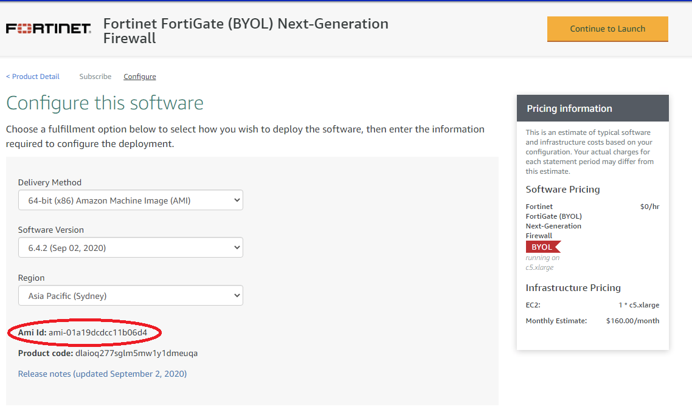

# 1. Accelerator Installation and Upgrade Guide

**_Deploying the AWS Accelerator requires the assistance of your local AWS Account team. Attempts to deploy the Accelerator without the support of your AWS SA, TAM, Proserve, or AM will fail as new AWS accounts do not have appropriate limits established to facilitate installation._**

Installation of the provided prescriptive AWS architecture, as-is, requires a limit increase to support a minimum of 6 AWS accounts in the AWS Organization plus any additional required workload accounts.

_Users are strongly encouraged to also read the Accelerator Operations/Troubleshooting Guide before installation. The Operations/Troubleshooting Guide provides details as to what is being performed at each stage of the installation process, including detailed troubleshooting guidance._

These installation instructions assume the prescribed architecture is being deployed.

<!-- TOC depthFrom:1 depthTo:4 -->

- [1. Accelerator Installation and Upgrade Guide](#1-accelerator-installation-and-upgrade-guide)
- [2. Installation](#2-installation)
  - [2.1. Prerequisites](#21-prerequisites)
    - [2.1.1. General](#211-general)
  - [2.2. Production Deployment Planning](#22-production-deployment-planning)
    - [2.2.1. General](#221-general)
    - [2.2.2. OU Structure Planning](#222-ou-structure-planning)
    - [2.2.3. Network Configuration Planning](#223-network-configuration-planning)
    - [2.2.4. DNS, Domain Name, TLS Certificate Planning](#224-dns-domain-name-tls-certificate-planning)
    - [2.2.5. License and Email Address Planning](#225-license-and-email-address-planning)
    - [2.2.6. Other](#226-other)
  - [2.3. Accelerator Pre-Install Steps](#23-accelerator-pre-install-steps)
    - [2.3.1. General](#231-general)
    - [2.3.2. Create GitHub Personal Access Token and Store in Secrets Manager](#232-create-github-personal-access-token-and-store-in-secrets-manager)
    - [2.3.3. AWS Internal (Employee) Accounts Only](#233-aws-internal-employee-accounts-only)
  - [2.4. Basic Accelerator Configuration](#24-basic-accelerator-configuration)
  - [2.5. Installation](#25-installation)
    - [2.5.1. Known Installation Issues](#251-known-installation-issues)
  - [2.6. Post-Installation](#26-post-installation)
- [3. Upgrades](#3-upgrades)
  - [3.1. Considerations](#31-considerations)
  - [3.2. Summary of Upgrade Steps (all versions)](#32-summary-of-upgrade-steps-all-versions)
- [4. Existing Organizations / Accounts](#4-existing-organizations--accounts)
  - [4.1. Considerations: Importing existing AWS Accounts / Deploying Into Existing AWS Organizations](#41-considerations-importing-existing-aws-accounts--deploying-into-existing-aws-organizations)
  - [4.2. Process to import existing AWS accounts into an Accelerator managed Organization](#42-process-to-import-existing-aws-accounts-into-an-accelerator-managed-organization)
  - [4.3. Deploying the Accelerator into an existing Organization](#43-deploying-the-accelerator-into-an-existing-organization)
- [5. Notes](#5-notes)
  - [5.1. Accelerator Design Constraints / Decisions](#51-accelerator-design-constraints--decisions)

<!-- /TOC -->

# 2. Installation

## 2.1. Prerequisites

### 2.1.1. General

- Management or root AWS Organization account (the AWS Accelerator cannot be deployed in an AWS sub-account)
  - No additional AWS accounts need to be pre-created before Accelerator installation
- Limit increase to support a minimum of 6 new sub-accounts plus any additional workload accounts
- Valid configuration file, updated to reflect your requirements (see below)
- Determine your primary or Accelerator `control` or `home` region, this is the AWS region in which you will most often operate
- The Accelerator _can_ be installed into existing AWS Organizations - see caveats and notes in [section 4](#4-existing-organizations--accounts) below
- Existing AWS Landing Zone Solution (ALZ) customers are required to remove their ALZ deployment before deploying the Accelerator. Scripts are available to assist with this process. Due to long-term supportability concerns, we no longer support installing the Accelerator on top of the ALZ.

## 2.2. Production Deployment Planning

### 2.2.1. General

**For any deployment of the Accelerator which is intended to be used for real workloads, you must evaluate all these decisions carefully. Failure to understand these choices could cause challenges down the road. If this is a "test" or "internal" deployment of the Accelerator which will not be used for workloads, you can leave the default config values.**

### 2.2.2. OU Structure Planning

Plan your OU structure carefully. By default, we suggest: `Core, Central, Sandbox, Unclass, Dev, Test, Prod`. These OUs correspond with major permission shifts in the SDLC cycle and NOT every stage an organization has in their SDLC cycle (i.e. QA or pre-prod would be included in one of the other OUs).

**Note:** While OUs can be renamed or additional OUs added at a later point in time, deployed AWS accounts CANNOT be moved between top-level OUs (guardrail violation), nor can top-level OUs easily be deleted (requires deleting all AWS accounts from within the OU first).

### 2.2.3. Network Configuration Planning

If deploying the prescriptive architecture, you will need the following network constructs:

1. Six (6) RFC1918 Class B address blocks (CIDR's) which do not conflict with your on-premise networks

- VPC CIDR blocks cannot be changed after installation, this is simply the way the AWS platform works, given everything is built on top of them. Carefully consider your address block selection.
- one block for each OU, except Sandbox which is not routable (Sandbox OU will use a 7th non-routed address block)
- the "core" Class B range will be split to support the Endpoint VPC and Perimeter VPC (with extra addresses remaining for future use)

2. Two (2) RFC6598 /23 address blocks (Government of Canada (GC) requirement only)

- Used for MAD deployment and perimeter underlay network
- non-GC customers can a) drop the extra MAD subnets in the Central VPC (i.e. CIDR2) and b) replace the perimeter VPC address space with the extra unused addresses from the core CIDR range

3. Two (2) BGP ASN's (For the Transit Gateway and Firewall Cluster - note: a third is required if you are deploying a VGW for DirectConnect connectivity.)

### 2.2.4. DNS, Domain Name, TLS Certificate Planning

If deploying the prescriptive architecture, you must decide on:

1. A unique Windows domain name (`organizationaws`/`organization.aws`, `organizationcloud`/`organization.cloud`, etc.). Given this is designed as the primary identity store and used to domain join all cloud hosted workloads, changing this in future is difficult. Pick a Windows domain name that does NOT conflict with your on-premise AD domains, ensuring the naming convention conforms to your organizations domain naming standards to ensure you can eventually create a domain trust between the MAD and on-premise domains/forests
2. DNS Domain names and DNS server IP's for on-premise private DNS zones requiring cloud resolution (can be added in future)
3. DNS Domain for a cloud hosted public zone `"public": ["organization.cloud-nuage.canada.ca"]` (can be added in future)
4. DNS Domain for a cloud hosted private zone `"private": ["organization.cloud-nuage.gc.ca"]` (can be added in future)
5. Wildcard TLS certificate for each of the 2 previous zones (can be added/changed in future)

### 2.2.5. License and Email Address Planning

1. 2 Fortinet FortiGate firewall licenses (Evaluation licenses adequate) (can be added in future) (if firewalls are to be deployed)
2. We also recommend at least 20 unique email ALIASES associated with a single mailbox, never used before to open AWS accounts, such that you do not need to request new email aliases every time you need to create a new AWS account.
3. You additionally require email addresses for the following additionaly purposes (these can be existing monitored mailboxes and do not need to be unique):
   - Accelerator execution (state machine) notification events (1 address)
   - High, Medium and Low security alerts (3 addresses if you wish to segregate alerts)
   - Budget notifications

### 2.2.6. Other

1. As of v1.3.0 we have added the capability to deploy with a customer provided Accelerator Name (`PBMM`) and Prefix (`PBMMAccel-`). The Accelerator name and prefix **_CANNOT_** be changed after the initial installation.
2. As of v1.2.5 we allow customers to use the `organization-admin-role` name of their choosing (previously we required `AWSCloudFormationStackSetExecutionRole`). Whatever role name is defined in the config file, it _MUST_ be utilized when creating all new accounts in the Organization.
   - New installs simply need to specify their desired role name in the config file
   - Existing installs wishing to change the role name are required to first deploy a new role with a trust to the root account, in all accounts in the organization
   - If you don't specify a role name during account creation, AWS Organizations gives the role a default name of `OrganizationAccountAccessRole` and may be a good default.

## 2.3. Accelerator Pre-Install Steps

### 2.3.1. General

Before installing, you must first:

1. Login to the Organization **Management or root AWS account** with `AdministratorAccess`.
2. **_Set the region to your desired `home` region_** (i.e. `ca-central-1`)
3. Enable AWS Organizations in `All features` mode
   - Navigate to AWS Organizations, click `Create Organization`, `Create Organization`
4. Enable Service Control Policies
   - In Organizations, select `Policies`, `Service control policies`, `Enable service control policies`
5. Verify the Organization Management (root) account email address
   - In AWS Organizations, Settings, ["Send Verification Request"](https://aws.amazon.com/blogs/security/aws-organizations-now-requires-email-address-verification/)
6. Create a new KMS key to encrypt your source configuration bucket (you can use an existing key)
   - AWS Key Management Service, Customer Managed Keys, Create Key, Symmetric, and then provide a key name (`PBMMAccel-Source-Bucket-Key`), Next
   - Select a key administrator (Admin Role or Group for the Organization Management account), Next
   - Select key users (Admin Role or Group for the Organization Management account), Next
   - Validate an entry exists to "Enable IAM User Permissions" (critical step if using an existing key)
     - `"arn:aws:iam::123456789012:root"`, where `123456789012` is your **_Organization Management_** account id.
   - Click Finish
7. Enable `"Cost Explorer"` (My Account, Cost Explorer, Enable Cost Explorer)
   - With recent platform changes, Cost Explorer _may_ now be auto-enabled (unable to confirm)
8. Enable `"Receive Billing Alerts"` (My Account, Billing Preferences, Receive Billing Alerts)
9. It is **_extremely important_** that **_all_** the account contact details be validated in the Organization Management (root) account before deploying any new sub-accounts.
   - This information is copied to every new sub-account on creation.
   - Subsequent changes to this information require manually updating it in **\*each** sub-account.
   - Go to `My Account` and verify/update the information lists under both the `Contact Information` section and the `Alternate Contacts` section.
   - Please ESPECIALLY make sure the email addresses and Phone numbers are valid and regularly monitored. If we need to reach you due to suspicious account activity, billing issues, or other urgent problems with your account - this is the information that is used. It is CRITICAL it is kept accurate and up to date at all times.

### 2.3.2. Create GitHub Personal Access Token and Store in Secrets Manager

1. You require a GitHub access token to access the code repository
2. Instructions on how to create a personal access token are located [here](https://docs.github.com/en/github/authenticating-to-github/creating-a-personal-access-token).
3. Select the scope `public_repo` underneath the section `repo: Full control over private repositories`.
4. Store the personal access token in Secrets Manager as plain text. Name the secret `accelerator/github-token` (case sensitive).
   - Via AWS console
     - Store a new secret, and select `Other type of secrets`, `Plaintext`
     - Paste your secret with no formatting no leading or trailing spaces (i.e. completely remove the example text)
     - Select the key you created above (`PBMMAccel-Source-Bucket-Key`),
     - Set the secret name to `accelerator/github-token` (case sensitive)
     - Select `Disable rotation`

### 2.3.3. AWS Internal (Employee) Accounts Only

If deploying to an internal AWS employee account, to successfully install the solution with the 3rd party firewalls, you need to enable Private Marketplace (PMP) before starting:

**NOTE: As of Late January 2021 the process has changed - you must now also create an Account Group associated with your Organization management account number and associate this group with your default experience. Will update click-by-click instructions at a future time.**

1. In the Organization Management account go here: https://aws.amazon.com/marketplace/privatemarketplace/create
2. Click Create Marketplace
3. Go to Profile sub-tab, click the `Not Live` slider to make it `Live`
4. Click the `Software requests` slider to turn `Requests off`
5. Change the name field (i.e. append `-PMP`) and change the color, so it is clear PMP is enabled for users
6. Search Private Marketplace for Fortinet products
7. Unselect the `Approved Products` filter and then select:
   - `Fortinet FortiGate (BYOL) Next-Generation Firewall`
8. Select "Add to Private Marketplace" in the top right
   - Due to PMP provisioning delays, this sometimes fails when attempted immediately following enablement of PMP - retry after 20 minutes.
9. Wait a couple of minutes while it adds item to your PMP - do NOT subscribe or accept the EULA
   - Repeat for `Fortinet FortiManager (BYOL) Centralized Security Management`
10. While not used in this account, you must now subscribe to the two subscriptions and accept the EULA for each product (you will need to do the same in the perimeter account, once provisioned below)
    - If you are deploying in any region except ca-central-1 or wish to switch to a different license type, you need the new AMI id's. After successfully subscribing, continue one more step and click the “Continue to Configuration”. When you get the below screen, select your region and version (v6.4.4 recommended at this time). Marketplace will provide the required AMI id. Document the two AMI id's, as you will need to update them in your config.json file below.

## 2.4. Basic Accelerator Configuration

1. Select a sample config file as a baseline starting point
   - **IMPORTANT: Use a config file from the Github code branch you are deploying from, as valid parameters change over time. The `main` branch is NOT the current release and often will not work with the GA release.**
   - sample config files can be found in [this](../../reference-artifacts/SAMPLE_CONFIGS/) folder;
   - descriptions of the sample config files and customization guidance can be found [here](./customization-index.md);
   - unsure where to start, use the [`config.lite-example.json`](../../reference-artifacts/SAMPLE_CONFIGS/config.lite-example.json) file;
   - These configuration files can be used, as-is, with only minor modification to successfully deploy the sample architectures;
   - On upgrades, compare your deployed configuration file with the latest branch configuration file for any new or changed parameters;
2. At minimum, you MUST update the AWS account names and email addresses in the sample file:
   - For existing accounts, they _must_ match identically to both the account names and email addresses defined in AWS Organizations;
   - For new accounts, they must reflect the new account name/email you want created;
   - All new AWS accounts require a unique email address which has never before been used to create an AWS account;
   - When updating the budget or SNS notification email addresses within the sample config, a single email address for all is sufficient;
   - Update the IP addresses in the SSOAuthUnapprovedIPMetric filter with your on-premise IP ranges;
   - For a test deployment, the remainder of the values can be used as-is;
   - While it is generally supported, we recommend not adding more than 1 or 2 workload accounts to the config file during the initial deployment as it will increase risks of hitting a limit. Once the Accelerator is successfully deployed, add the additional accounts to the config file and rerun the state machine.
3. A successful deployment of the presecriptive architecture requires VPC access to 7 AWS endpoints, you cannot remove both the perimeter firewalls (all public endpoints) and the 7 required central VPC endpoints from the config file (ec2, ec2messages, ssm, ssmmessages, cloudformation, secretsmanager, kms).
4. When deploying to regions other than `ca-central-1`, you need to:
   1. Update the firewall and firewall manager AMI id's to reflect your home regions regional AMI id's (see 1.1.3, item 10) Make sure you select the right version, v6.4.4 is recommended at this time.
   2. Validate all the Interface Endpoints defined in your config file are supported in your home region (i.e. Endpoint VPC). Remove unsupported entries from the config file.
5. Create an S3 bucket in your Organization Management account with versioning enabled `your-bucket-name`
   - you must supply this bucket name in the CFN parameters _and_ in the config file (`global-options\central-bucket`)
   - the bucket name _must_ be the same in both spots
   - the bucket should be `S3-KMS` encrypted using the `PBMMAccel-Source-Bucket-Key` created above
6. Place your customized config file, named `config.json` (or `config.yaml`), in your new bucket
7. Place the firewall configuration and license files in the folder and path defined in the config file, if defined in the config file
   - i.e. `firewall/firewall-example.txt`, `firewall/license1.lic` and `firewall/license2.lic`
   - We have made several samples available [here](../../reference-artifacts/Third-Party): `./reference-artifacts/Third-Party/`
     - Both samples comprise an active / active firewall pair. Until recently we only brought up one tunnel per firewall, you now also have an example which brings up both tunnels per firewall
   - If you don't have any license files, update the config file with an empty array (`"license": []`). Do NOT use the following: `[""]`.
8. Place any defined certificate files in the folder and path defined in the config file
   - i.e. `certs/example1-cert.key`, `certs/example1-cert.crt`
   - Sample available [here](../../reference-artifacts/Certs-Sample/): `./reference-artifacts/Certs-Sample/*`
   - Ideally you would generate real certificates using your existing certificate authority
   - Should you wish, instructions are provided to aid in generating your own self-signed certificates (Self signed certificates are NOT secure and simply for demo purposes)
   - Use the examples to demonstrate Accelerator TLS functionality only
9. Detach **_ALL_** SCPs (except `FullAWSAccess` which remains in place) from all OU's and accounts before proceeding
   - Installation **will fail** if this step is skipped

## 2.5. Installation

1. You can find the latest release in the repository [here](https://github.com/aws-samples/aws-secure-environment-accelerator/releases).
2. Download the CloudFormation (CFN) template `AcceleratorInstallerXXX.template.json` for the release you plan to install
3. Use the provided CloudFormation template to deploy a new stack in your Management (root) AWS account
   - As previously stated we do not support installation in sub-accounts
4. **_Make sure you are in your desired `home` region_** (i.e. `ca-central-1`) (your desired primary or control region)
5. Fill out the required parameters - **_LEAVE THE DEFAULTS UNLESS SPECIFIED BELOW_**
6. Specify `Stack Name` STARTING with `PBMMAccel-` (case sensitive) suggest a suffix of `orgname` or `username`
7. Change `ConfigS3Bucket` to the name of the bucket you created above `your-bucket-name`
8. Add an `Email` address to be used for State Machine Status notification
9. The `GithubBranch` should point to the release you selected
   - if upgrading, change it to point to the desired release
   - the latest stable branch is currently `release/v1.2.6-a`, case sensitive
10. Apply a tag on the stack, Key=`Accelerator`, Value=`PBMM` (case sensitive).
11. **ENABLE STACK TERMINATION PROTECTION** under `Stack creation options`
12. The stack typically takes under 5 minutes to deploy.
13. Once deployed, you should see a CodePipeline project named `PBMMAccel-InstallerPipeline` in your account. This pipeline connects to Github, pulls the code from the prescribed branch and deploys the Accelerator state machine.
    - if the CloudFormation fails to deploy with an `Internal Failure`, or, if the pipeline fails connecting to GitHub, then:
      - fix the issue with your GitHub secret created in section 2.3.2, then delete the Installer CloudFormation stack you just deployed, and restart at step 3 of this section.
14. For new stack deployments, when the stack deployment completes, the Accelerator state machine will automatically execute (in Code Pipeline). When upgrading you must manually `Release Change` to start the pipeline.
15. **While the pipeline is running:**
    - review the list of [Known Installation Issues](#251-known-installation-issues) in section 2.5.1 below
    - review the Accelerator Basic Operation and Frequently Asked Questions (FAQ) [Document](../faq/faq.md)
16. Once the pipeline completes (20-25 mins), the main state machine, named `PBMMAccel-MainStateMachine_sm`, will start in Step Functions
17. The state machine takes approximately 1.5 hours to execute on an initial installation using the default PBMM configuration. Timing for subsequent executions depends entirely on what resources are changed in the configuration file, but can take as little as 20 minutes.
18. The configuration file will be automatically moved into Code Commit (and deleted from S3). From this point forward, you must update your configuration file in CodeCommit.
19. You will receive an email from the State Machine SNS topic and the 3 SNS alerting topics. Please confirm all four (4) email subscriptions to enable receipt of state machine status and security alert messages. Until completed, you will not receive any email messages (must be completed within 7-days).
20. If deploying the prescriptive architecture, after the perimeter account is created in AWS Organizations, but before the Accelerator reaches Stage 2:
    1. NOTE: If you miss the step, or fail to execute it in time, no need to be concerned, you will simply need to re-run the main state machine (`PBMMAccel-MainStateMachine_sm`) to deploy the firewall products
    2. Login to the **perimeter** sub-account (Assume your `organization-admin-role`)
    3. Activate the Fortinet Fortigate BYOL AMI and the Fortinet FortiManager BYOL AMI at the URL: https://aws.amazon.com/marketplace/privatemarketplace
       - Note: you should see the private marketplace, including the custom color specified in prerequisite step 4 above.
       - When complete, you should see the marketplace products as subscriptions **in the Perimeter account**:

21. If deploying the prescriptive architecture, once the main state machine (`PBMMAccel-MainStateMachine_sm`) completes successfully, confirm the status of your perimeter firewall deployment.
    - While you can watch the state machine in Step Functions, you will also be notified via email when the State Machine completes (or fails). Successful state machine executions include a list of all accounts which were successfully processed by the Accelerator.
22. If your perimeter firewalls were defined but not deployed on first run, you will need to rerun the state machine. This happens when:
    1. you were unable to activate the firewall AMI's before stage 2 (step 20)
    2. we were not able to fully activate your account before we were ready to deploy your firewalls. This case can be identified by a running EC2 micro instance in the account, or by looking for the following log entry 'Minimum 15 minutes of account warming required for account'.
    3. In these cases, simply select the `PBMMAccel-MainStateMachine_sm` in Step Functions and select `Start Execution`

### 2.5.1. Known Installation Issues

Current Issues:

- Occassionally CloudFormation fails to return a completion signal. After the credentials eventually fail (1 hr), the state machine fails. Simply rerun the state machine.

Issues in Older Releases:

- Releases prior to v1.2.5 - Occassionally during new installs the state machine is failing due to a `File not found` error in the `VerifyFiles` step. Simply rerun the state machine. This is resolved in v1.2.5.
- Releases prior to v1.2.5 - Occassionally during new installs the perimeter firewall fails to load the provided prescriptive firewall configuration. Edit your config file changing `"firewalls":` to `"xxfirewalls":`, and rerun the state machine to remove the firewall deployment, then change your config file back to `"firewalls":` and again rerun your state machine to redeploy the firewalls. This is resolved in v1.2.5.
- Releases prior to v1.2.4 will fail to deploy due to a change in an unpinned 3rd party dependency. This is resolved in v1.2.4 (all dependencies were pinned in v1.2.5).
- Releases prior to v1.2.4 - During Guardduty deployment, occassionally CloudFormation fails to return a completion signal. After the credentials eventually fail (1 hr), the state machine fails. As the credentials timed out, we cannot properly cleanup the failed stack. You need to manually find the failed stack in the specific account/region, delete it, and then rerun the state machine. It appears the API has been fixed.
- Releases prior to v1.2.3 using a YAML config file - we are seeing the OUValidation Lambda randomly timeout. Simply rerun the state machine. This is resolved in v1.2.3.
- Accelerator v1.2.1b may experience a state machine failure when running `Create Config Recorders` due to an `Insufficient Delivery Policy Exception`. Simply rerun the State Machine. This is resolved in v1.2.2.
- Releases prior to v1.2.2 where the home region is not ca-central-1, alb deployments will fail, you need to either: a) remove all alb's from the deployment; or b) after the state machine fails, update the central logging bucket (in the log-archive account) policy with your regions [`elb-account-id`](https://docs.aws.amazon.com/elasticloadbalancing/latest/application/load-balancer-access-logs.html). (i.e. replace `985666609251` with the value for your region)

## 2.6. Post-Installation

1.  The Accelerator installation is complete, but several manual steps remain:

    1. Recover root passwords for all sub-accounts and apply strong passwords
       - Process documented [here](https://docs.aws.amazon.com/IAM/latest/UserGuide/id_credentials_access-keys_retrieve.html#reset-root-password)
    2. Enable MFA for **all** IAM users and **all** root account users, recommendations:
       - Yubikeys provide the strongest form of MFA protection and are strongly encouraged for all account root users and all IAM users in the Organization Management (root) account
       - the Organization Management (root) account requires a dedicated Yubikey (if access is required to a sub-account root user, we do not want to expose the Organization Management accounts Yubikey)
       - every ~50 sub-accounts requires a dedicated Yubikey (minimize the required number of Yubikeys and the scope of impact should a Yubikey be lost or compromised)
       - each IAM breakglass user requires a dedicated Yubikey, as do any additional IAM users in the Organization Management (root) account. While some CSPs do not recommend MFA on the breakglass users, it is strongly encouraged in AWS
       - all other AWS users (AWS SSO, IAM in sub-accounts, etc.) can leverage virtual MFA devices (like Google Authenticator on a mobile device)
    3. Login to the firewalls and firewall manager appliance and set default passwords, if deployed
       - Update firewall configuration per your organizations security best practices
       - Manually update firewall configuration to forward all logs to the Accelerator deployed NLB addresses fronting the rsyslog cluster
         - login to each firewall, select `Log Settings`, check `Send logs to syslog`, put the NLB FQDN in the `IP Address/FQDN` field
       - Manually update the firewall configuration to connect perimeter ALB high port flows through to internal account ALB's
         - login to each firewall, switch to `FG-traffic` vdom, select `Policies & Objects`, select `Addresses`, Expand `Addresses`
         - Set `Prod1-ALB-FQDN` to point to a reliable sub-account ALB FQDN, this is used for full-path health checks on **_all_** ALB's
         - Set additional `DevX-ALB-FQDN`, `TestX-ALB-FQDN` and `ProdX-ALB-FQDN` to point to workload account ALB FQDNs
         - Two of each type of ALB FQDN records have been created, when you need more, you need to create BOTH an additional FQDN and a new VIP, per ALB
           - Each new VIP will use a new high port (i.e. 7007, 7008, etc.), all of which map back to port 443
           - Detailed steps can be read [here](./guides/public-facing-workload-via-fortigate.md).
    4. In your `home` region (i.e. ca-central-1), Enable AWS SSO, Set the SSO directory to MAD, set the SSO email attrib to: \${dir:email}, create all default permission sets and any desired custom permission sets, map MAD groups to perm sets
    5. On a per role basis, you need to enable the CWL Account Selector in the Security and the Ops accounts
    6. Customers are responsible for the ongoing management and rotation of all passwords on a regular basis per their organizational password policy. This includes the passwords of all IAM users, MAD users, firewall users, or other users, whether deployed by the Accelerator or not. We do NOT automatically rotate any passwords, but strongly encourage customers do so, on a regular basis.

2.  During the installation we request required limit increases, resources dependent on these limits will not be deployed
    1. Limit increase requests are controlled through the Accelerator configuration file `"limits":{}` setting
    2. The sample configuration file requests increases to your EIP count in the perimeter account and to the VPC count and Interface Endpoint count in the shared-network account
    3. You should receive emails from support confirming the limit increases
    4. On the next state machine execution, resources blocked by limits should be deployed (i.e. additional VPC's and Endpoints)
    5. If more than 2 days elapses without the limits being increased, on the next state machine execution, they will be re-requested

# 3. Upgrades

## 3.1. Considerations

- Always compare your configuration file with the config file from the release you are upgrading to in order to validate new or changed parameters or changes in parameter types / formats.
  - do NOT update to the latest firewall AMI - see the the last bullet in section [5.1. Accelerator Design Constraints / Decisions](#51-accelerator-design-constraints--decisions)
  - do NOT update the `organization-admin-role` - see section [2.2.6. Other](#226-other) (bullet 2)
  - do NOT update account-keys (i.e. existing installations cannot change the internal values to `management` from `master`)
- If you have customized any of the additional Accelerator provided default configuration files (SCPs, rsyslog config, ssm-documents, iam-policies, etc.):
  - customers must manually merge Accelerator provided updates with your deployed customizations;
  - failure to do so could result in either a) broken Accelerator functionality, or b) dropped customer guardrail enhancements;
  - prior to v1.2.5, if customers don't take action, the utilized configurations will revert to the latest Accelerator provided defaults. Update the last modified date on each custom config file in your input bucket and rerun the state machine post-upgrade to re-apply customizations;
  - post v1.2.5, if customers don't take action, we will continue to utilize a customers customized configurations regardless of each files timestamp;
  - in both cases it is important customers assess the new defaults and integrate them into their custom configuration or it could break Accelerator functionality.
- The below release specific considerations need to be cumulatively applied (an upgrade from v1.2.3 to v1.2.5 requires you to follow both v1.2.4 and v1.2.5 considerations)

**Release Specific Upgrade Considerations:**

- Upgrades to `v1.3.0 and above` from `v1.2.6 and below`:
  - **Please note MAJOR changes to state machine behaviour, as documented [here](./customization-index.md#14-config-file-and-deployment-protections)**
- Upgrades to `v1.2.6 and above` from `v1.2.5 and below` - Ensure you apply the config file changes described in the release notes:
  - Cut-paste the new `"replacements": {},` section at the top of the example config file into your config file, as-is
    - Enables customers to leverage the repo provided SCP's without customization, simplifying upgrades, while allowing SCP region customization
    - the cloud-cidrX/cloud-maskX variables are examples of customer provided values that can be used to consistently auto-replace values throughout config files (as we do not reference them in the config file today, these 4 variables are not required at this time)
  - The new ${variable} are auto-replaced across your config files, SCP's and firewall config files.
    - as the variables should resolve to their existing values, you can leave your config file using hardcoded region and Accelerator prefix naming, or you can update them to make subsequent file comparisons easier for future upgrades. These are most useful for new installations in non ca-central-1 regions
  - Some repo provide filenames have changed, where they are referenced within the config file, you must update them to their new filenames
  - We do not delete/cleanup old/unused SCP's, in case they were also used by customers for unmanaged OUs or sub-ou's. After the upgrade, you should manually delete any old/extra SCP's which are no longer required
- Upgrades to `v1.2.5 and above` from `v1.2.4 and below` requires the manual removal of the `PBMMAccel-PipelineRole` StackSet before beginning your upgrade (we have eliminated all use of StackSets in this release)
  - In the root AWS account, go to: CloudFormation, StackSets
  - Find: `PBMMAccel-PipelineRole`, and Select the: `Stack Instances` tab
  - Document all the account numbers, comma separated i.e. 123456789012, 234567890123, 345678901234
  - Select: Actions, Delete Stacks from StackSets
  - Paste the above account numbers (comma separated) in the Account numbers box
  - Select the Accelerator installation/home region from the Specify Regions Box (should be the only region in the dropdown)
  - Change: Concurrency to: 8, Next, Submit
  - Wait for operation to complete (refresh the browser several times)
  - Select Actions, Delete StackSet, click Delete StackSet
  - Wait for the operation to complete
- Upgrades to `v1.2.4 and above` from `v1.2.3 and below` - Ensure you apply the config file changes described in the release notes:
  - failure to set `"central-endpoint": true` directly on the endpoint VPC (instead of in global-options), will result in the removal of your VPC endpoints
  - failure to move your zone definitions to the endpoint VPC, will result in the removal of you Public and Private hosted zones
- Upgrades to `v1.2.1 and above` from `v1.2.0 and below` - if more than 5 VPC endpoints are deployed in any account (i.e. endpoint VPC in the shared network account), before upgrade, they must be removed from the config file and state machine executed to de-provision them. Up to approximately 50 endpoints can be re-deployed during the upgrade state machine execution. Skipping this step will result in an upgrade failure due to throttling issues. Simply rerun the state machine.

## 3.2. Summary of Upgrade Steps (all versions)

1. Login to your Organization Management (root) AWS account with administrative priviliges
2. Ensure a valid Github token is stored in secrets manager [(section 2.3.2)](#232-create-github-personal-access-token-and-store-in-secrets-manager)
3. Review and implement any relevant tasks noted in the upgrade considerations in [section 3.1](#31-considerations)
4. Update the config file in Code Commit with new parameters and updated parameter types based on the version you are upgrading to (this is important as features are iterating rapidly)
   - Compare your running config file with the sample config file from the latest release
   - Review the `Config file changes` section of the [release notes](https://github.com/aws-samples/aws-secure-environment-accelerator/releases) for **all** Accelerator versions since your current deployed release
5. If you customized any of the other Accelerator default config files by overriding them in your S3 input bucket, merge the latest defaults with your customizations
   - Before beginning your upgrade in v1.2.5+, after completing your upgrade in prior releases
6. Download the latest installer template (`AcceleratorInstallerXYZ.template.json`) from the `Assets` section of the latest [release](https://github.com/aws-samples/aws-secure-environment-accelerator/releases)
7. Do **_NOT_** accidentally select the `PBMMAccel-InitialSetup` CloudFormation stack **below**
8. If you are replacing your GitHub Token:
   - Take note of the `ConfigS3Bucket` and `NotificationEmail` values from the Parameters tab of your deployed Installer CloudFormation stack (`PBMMAccel-what-you-provided`)
   - Delete the Installer CloudFormation stack (`PBMMAccel-what-you-provided`)
   - Redeploy the Installer CloudFormation stack using the template downloaded in step 5, providing the `ConfigS3Bucket` and `NotificationEmail` values you just documented
   - The pipeline will automatically run and trigger the upgraded state machine
9. If you are using a pre-existing GitHub token:

- Update the Installer CloudFormation stack using the template downloaded in step 5, updating the `GithubBranch` to the latest release (eg. `release/v1.2.5`)
  - Go to AWS CloudFormation and select the stack: `PBMMAccel-what-you-provided`
  - Select Update, select Replace current template, Select Upload a template file
  - Select Choose File and select the template you downloaded in step 5 (`AcceleratorInstallerXYZ.template.json`)
  - Select Next, Update `GithubBranch` parameter to `release/vX.Y.Z` where X.Y.Z represents the latest release
  - Click Next, Next, I acknowledge, Update
- Go To Code Pipeline and Release the PBMMAccel-InstallerPipeline

# 4. Existing Organizations / Accounts

## 4.1. Considerations: Importing existing AWS Accounts / Deploying Into Existing AWS Organizations

- The Accelerator _can_ be installed into existing AWS Organizations
  - our early adopters have all successfully deployed into existing organizations
- Existing AWS accounts _can_ also be imported into an Accelerator managed Organization
- Caveats:
  - Per AWS Best Practices, the Accelerator deletes the default VPC's in all AWS accounts, worldwide. The inability to delete default VPC's in pre-existing accounts will fail the installation/account import process. Ensure default VPC's can or are deleted before importing existing accounts. On failure, either rectify the situation, or remove the account from Accelerator management and rerun the state machine
  - The Accelerator will NOT alter existing (legacy) constructs (e.g. VPC's, EBS volumes, etc.). For imported and pre-existing accounts, objects the Accelerator prevents from being created using preventative guardrails will continue to exist and not conform to the prescriptive security guidance
    - Existing workloads should be migrated to Accelerator managed VPC's and legacy VPC's deleted to gain the full governance benefits of the Accelerator (centralized flow logging, centralized ingress/egress, no IGW's, Session Manager access, existing non-encrypted EBS volumes, etc.)
  - Existing AWS services will be reconfigured as defined in the Accelerator configuration file (overwriting existing settings)
  - We do NOT support _any_ workloads running or users operating in the Organization Management (root) AWS account. The Organization Management (root) AWS account MUST be tightly controlled
  - Importing existing _workload_ accounts is fully supported, we do NOT support, recommend and strongly discourage importing mandatory accounts, unless they were clean/empty accounts. Mandatory accounts are critical to ensuring governance across the entire solution
  - We've tried to ensure all customer deployments are smooth. Given the breadth and depth of the AWS service offerings and the flexibility in the available deployment options, there may be scenarios that cause deployments into existing Organizations to initially fail. In these situations, simply rectify the conflict and re-run the state machine.
  - If the Firewall Manager administrative account is already set for your organization, it needs to be unset before starting a deployment.

## 4.2. Process to import existing AWS accounts into an Accelerator managed Organization

- Newly invited AWS accounts in an Organization will land in the root ou
- Unlike newly created AWS accounts which immediately have a Deny-All SCP applied, imported accounts are not locked down as we do not want to break existing workloads (these account are already running without Accelerator guardrails)
- In AWS Organizations, select ALL the newly invited AWS accounts and move them all (preferably at once) to the correct destination OU (assuming the same OU for all accounts)
  - In case you need to move accounts to multiple OU's we have added a 2 minute delay before triggering the State Machine
  - Any accounts moved after the 2 minute window will NOT be properly ingested, and will need to be ingested on a subsequent State Machine Execution
- This will first trigger an automated update to the config file and then trigger the state machine after a 2 minute delay, automatically importing the moved accounts into the Accelerator per the destination OU configuration
- As previously documented, accounts CANNOT be moved between OU's to maintain compliance, so select the proper top-level OU with care
- If you need to customize each of the accounts configurations, you can manually update the configuration file either before or after you move the account to the correct ou
  - if before, you also need to include the standard 4 account config file parameters, if after, you can simply add your new custom parameters to the account entry the Accelerator creates
  - if you add your imported accounts to the config file, moving the first account to the correct ou will trigger the state machine after a 2 minutes delay. If you don't move all accounts to their correct ou's within 2 minutes, your state machine will fail. Simply finish moving all accounts to their correct ou's and then rerun the state machine.
- If additional accounts are moved into OUs while the state machine is executing, they will not trigger another state machine execution, those accounts will only be ingested on the next execution of the state machine
  - customers can either manually initiate the state machine once the current execution completes, or, the currently running state machine can be stopped and restarted to capture all changes at once
  - Are you unsure if an account had its guardrails applied? The message sent to the state machine Status SNS topic (and corresponding email address) on a successful state machine execution provides a list of all successfully processed accounts.
- The state machine is both highly parallel and highly resilient, stopping the state machine should not have any negative impact. Importing 1 or 10 accounts generally takes about the same amount of time for the Accelerator to process, so it may be worth stopping the current execution and rerunning to capture all changes in a single execution.
- We have added a 2 min delay before triggering the state machine, allowing customers to make multiple changes within a short timeframe and have them all captured automatically in the same state machine execution.

## 4.3. Deploying the Accelerator into an existing Organization

- As stated above, if the ALZ was previously deployed into the Organization, please work with your AWS account team to find the best mechanism to uninstall the ALZ solution
- Ensure all existing sub-accounts have the role name defined in `organization-admin-role` installed and set to trust the Organization Management (root) AWS Organization account
  - prior to v1.2.5, this role must be named: `AWSCloudFormationStackSetExecutionRole`
  - if using the default role (`AWSCloudFormationStackSetExecutionRole`) we have provided a CloudFormation stack which can be executed in each sub-account to simplify this process
- As stated above, we recommend starting with new AWS accounts for the mandatory functions (shared-network, perimeter, security, log-archive accounts).
- To better ensure a clean initial deployment, we also recommend the installation be completed while ignoring most of your existing AWS sub-accounts, importing them post installation:
  - create a new OU (i.e. `Imported-Accounts`), placing most of the existing accounts into this OU temporarily, and adding this OU name to the `global-options\ignored-ous` config parameter;
  - any remaining accounts must be in the correct ou, per the Accelerator config file;
  - install the Accelerator;
  - import the skipped accounts into the Accelerator using the above import process, paying attention to the below notes
- NOTES:
  - Do NOT move any accounts from any `ignored-ous` to the root ou, they will immediately be quarantined with a Deny-All SCP, they need to be moved directly to their destination ou
  - As stated above, when importing accounts, there may be situations we are not able to fully handle
    - If doing a mass import, we suggest you take a quick look and if the solution is not immediately obvious, move the account which caused the failure back to ignored-ous and continue importing the remainder of your accounts. Once you have the majority imported, you can circle back and import outstanding problem accounts with the ability to focus on each individual issue
    - The challenge could be as simple as someone has instances running in a default VPC, which may require some cleanup effort before we can import (coming soon, you will be able to exclude single account/region combinations from default VPC deletion to gain the benefits of the rest of the guardrails while you migrate workloads out of the default VPC)

# 5. Notes

## 5.1. Accelerator Design Constraints / Decisions

- The Organization Management (root) account does NOT have any preventative controls to protect the integrity of the Accelerator codebase, deployed objects or guardrails. Do not delete, modify, or change anything in the Organization Management (root) account unless you are certain as to what you are doing. More specifically, do NOT delete, or change _any_ buckets in the Organization Management (root) account.
- While generally protected, do not delete/update/change s3 buckets with CDK, CFN, or PBMMAccel- in _any_ sub-accounts.
- ALB automated deployments only supports Forward and not redirect rules.
- The Accelerator deploys SNS topics to send email alerts and notifications. Given email is not a secure transport mechanism, we have chosen not to enable SNS encryption on these topics at this time.
- AWS generally discourages cross-account KMS key usage. As the Accelerator centralizes logs across an entire organization (security best practice), this is an exception/example of a unique situation where cross-account KMS key access is required.
- The Accelerator aggregates all logs in the log-archive account using Kinesis Data and Kinesis Firehose as aggregation tools where the logs could persist for up to 24 hours. These logs are encrypted with Customer Managed KMS keys once stored in S3 (ELB logs only support AES256). These logs are also encrypted in transit using TLS encryption. At this time, we have not enabled Kinesis at-rest encryption, we will reconsider this decision based on customer feedback.
- AWS Config Aggregator is deployed in the Organization Management (root) account as enablement through Organizations is simpler to implement. AWS Organizations only supports deploying the Aggregator in the Organization Management (root) account and not in a designated administrative account at this time. Once supported, we plan to update the code to move the Aggregator administrative account.
- An Organization CloudTrail is deployed, which is created in the primary region in the Organization Management (root) AWS account. All AWS account CloudTrails are centralized into this single CloudWatch Log Group. Starting in v1.1.9 this is where we deploy the CloudWatch Alarms which trigger for ALL accounts in the organization. Security Hub will erroneously report that the only account and/or region that is compliant with certain rules is the primary region of the Organization Management (root) account. We are working with the Security Hub team to rectify this situation in future Security Hub/Accelerator releases.
- Amazon Detective - we have chosen not to enable at this time.
- Only 1 auto-deployed MAD per AWS account is supported today.
- VPC Endpoints have no Name tags applied as CloudFormation does not currently support tagging VPC Endpoints.
- If the Organization Management (root) account coincidentally already has an ADC with the same domain name, we do not create/deploy a new ADC. You must manually create a new ADC (it won't cause issues).
- Firewall updates are to be performed using the firewall OS based update capabilities. To update the AMI using the Accelerator, you must first remove the firewalls and then redeploy them (as the EIP's will block a parallel deployment), or deploy a second parallel FW cluster and de-provision the first cluster when ready.

---

[...Return to Accelerator Table of Contents](../index.md)
