# Operations & Troubleshooting Guide

> TODO: Purpose of document. Target audience.

> TODO:
>
> - How to update the configuration file?
> - How to restart the installer?

- [Operations & Troubleshooting Guide](#operations--troubleshooting-guide)
  - [System Overview](#system-overview)
    - [Installer Stack](#installer-stack)
    - [Initial Setup Stack](#initial-setup-stack)
      - [Get or Create Configuration from S3](#get-or-create-configuration-from-s3)
      - [Compare Configurations](#compare-configurations)
      - [Get Baseline from Configuration](#get-baseline-from-configuration)
      - [Load Landing Zone Configuration](#load-landing-zone-configuration)
      - [Add Execution Role to Service Catalog](#add-execution-role-to-service-catalog)
      - [Create Landing Zone Account](#create-landing-zone-account)
      - [Organizational Unit Validation](#organizational-unit-validation)
      - [Load Organization Configuration](#load-organization-configuration)
      - [Install CloudFormation Role in Master](#install-cloudformation-role-in-master)
      - [Create Organization Account](#create-organization-account)
      - [Load Organizational Units](#load-organizational-units)
      - [Load Accounts](#load-accounts)
      - [Install Execution Roles](#install-execution-roles)
      - [Delete Default VPCs](#delete-default-vpcs)
      - [Load Limits](#load-limits)
      - [Enable Trusted Access for Services](#enable-trusted-access-for-services)
      - [Deploy Phase 0](#deploy-phase-0)
      - [Store Phase 0 Output](#store-phase-0-output)
      - [Add SCPs to Organization](#add-scps-to-organization)
      - [Deploy Phase 1](#deploy-phase-1)
      - [Store Phase 1 Output](#store-phase-1-output)
      - [Account Default Settings](#account-default-settings)
      - [Deploy Phase 2](#deploy-phase-2)
      - [Store Phase 2 Output](#store-phase-2-output)
      - [Deploy Phase 3](#deploy-phase-3)
      - [Store Phase 3 Output](#store-phase-3-output)
      - [Deploy Phase 4](#deploy-phase-4)
      - [Store Phase 4 Output](#store-phase-4-output)
      - [Associate Hosted Zones](#associate-hosted-zones)
      - [Add Tags to Shared Resources](#add-tags-to-shared-resources)
      - [Enable Directory Sharing](#enable-directory-sharing)
      - [Deploy Phase 5](#deploy-phase-5)
      - [Create AD Connector](#create-ad-connector)
      - [Store Commit ID](#store-commit-id)
      - [Detach Quarantine SCP](#detach-quarantine-scp)
  - [Troubleshooting](#troubleshooting)
    - [Components](#components)
      - [CodePipeline](#codepipeline)
      - [CodeBuild](#codebuild)
      - [CloudFormation](#cloudformation)
      - [Custom Resource](#custom-resource)
      - [CloudWatch](#cloudwatch)
      - [State Machine](#state-machine)
    - [How-to](#how-to)
      - [Restart the State Machine](#restart-the-state-machine)
      - [Switch To a Managed Account](#switch-to-a-managed-account)

## System Overview

The system can be thought of in two levels. The first level of the system consists of Accelerator stacks and resources. Let's call these the Accelerator-management resource. The second level of the system consists of stacks and resources that are deployed by the Accelerator-management resource. Let's call these the Accelerator-managed resources. The Accelerator-management resources are responsible for deploying the Accelerator-managed resources.

There are two Accelerator-management stacks:

- the `Installer` stack that is responsible for creating the next listed stack;
- the `Initial Setup` stack. This stack is responsible for reading configuration file and creating Accelerator-managed resources in the relevant accounts.

There are multiple Accelerator-managed stacks. Currently there are at most six Accelerator-managed stacks per managed account.

The figure below shows a zoomed-out overview of the Accelerator. The top of the overview shows the Accelerator-management resources, i.e. the `Installer` stack and the `Initial Setup` stack. The bottom of the overview shows the Accelerator-managed resources in the different accounts.

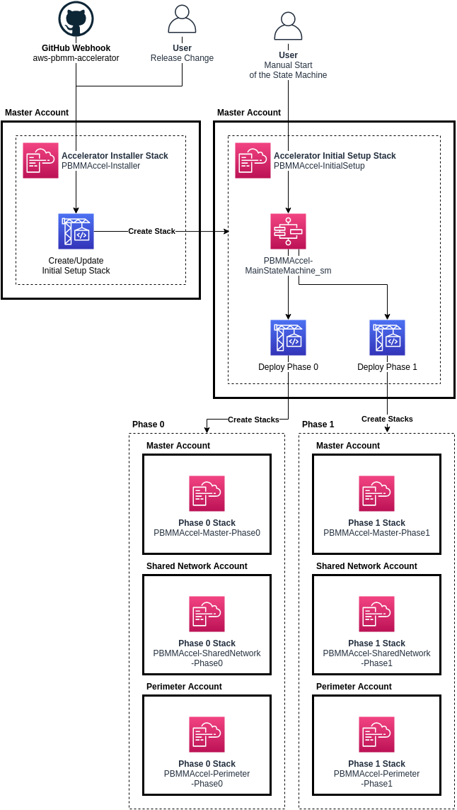

### Installer Stack

The Accelerator-management `Installer` stack contains the necessary resources to deploy the Accelerator-management `Initial Setup` stack in an AWS account. This AWS account will be referred to as the 'master' account in this document.

It consists of the following resources:

- `PBMMAccel-InstallerPipeline`: this is a `AWS::CodePipeline::Pipeline` that pulls the latest Accelerator code from
  GitHub. It launches the CodeBuild project `PBMMAccel-InstallerProject_pl` and launches the Accelerator state machine.
- `PBMMAccel-InstallerProject_pl`: this is a `AWS::CodeBuild::Project` that installs the Accelerator in AWS account.
- `PBMMAccel-Installer-StartExecution`: this is a `AWS::Lambda::Function` that launches the Accelerator after
  CodeBuild deploys the Accelerator.

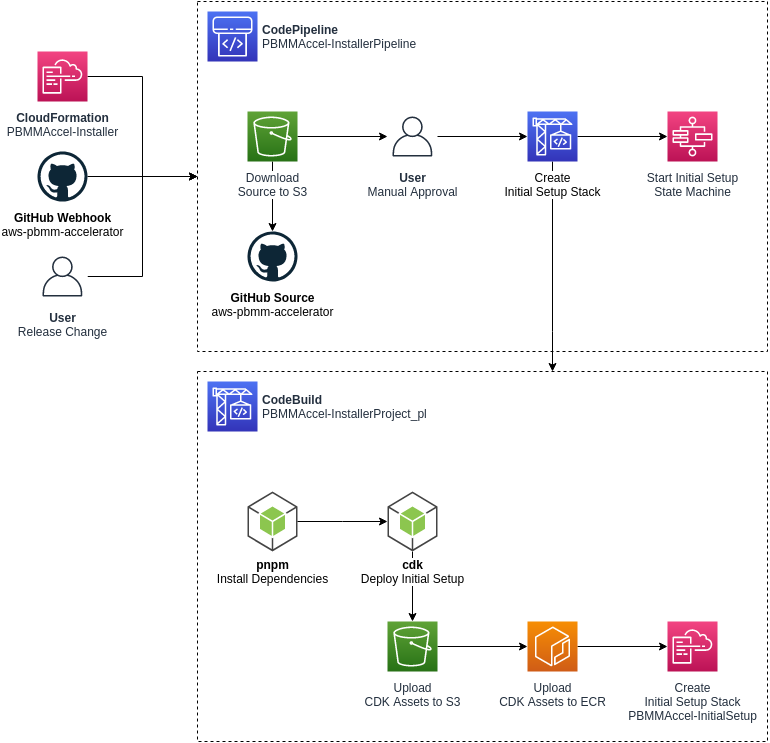

The `PBMMAccel-InstallerPipeline` starts when first installed using the CloudFormation template. The pipeline also runs after every GitHub update for the configured branch. The administrator can also start the pipeline manually by clicking the `Release Change` button in the AWS Console.


After pulling the source from GitHub the pipeline needs manual approval from the administrator to continue deploying the Accelerator in the AWS account.

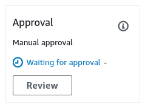

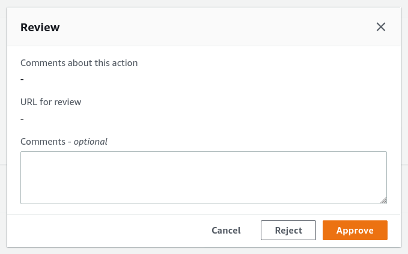

After the administrator approves the change, the `PBMMAccel-InstallerProject_pl` CodeBuild project starts. The CodeBuild project uses the GitHub source artifact. The CodeBuild projects spins up a new Linux instances and installs the Accelerator dependencies and starts the deployment of the Accelerator using the AWS Cloud Development Kit (CDK<sup>[1](#cdk)</sup>).

CDK bootstraps its environment and creates the `CDKToolkit` stack in the AWS account. It creates the S3 bucket `cdktoolkit-stagingbucket-*` and the ECR repository `aws-cdk/assets`.

CDK copies assets to the bootstrap bucket and bootstrap repository that are used by the Accelerator. The assets that are stored on S3 include default IAM policies, default SCPs, default firewall configuration. The assets that are pushed to ECR include the Accelerator Docker build image. This Docker image is responsible for deploying Accelerator resources using the CDK.

CDK finally deploys the `Initial Setup` stack, and launches the Accelerator state machine. The Accelerator state machine is described in the next section.

### Initial Setup Stack

The Accelerator-management `Initial Setup` stack, named `PBMMAccel-InitialSetup`, consists of a state machine, named `PBMMAccel-MainStateMachine_sm`, that executes various steps to create the Accelerator-managed stacks and resources in the Accelerator-managed accounts. Using a state machine, we can clearly define the deployment process and systematically control branches of execution and handle exceptions.

The image below describes the latest state machine. Each white square in the image represents a step in the state machine.

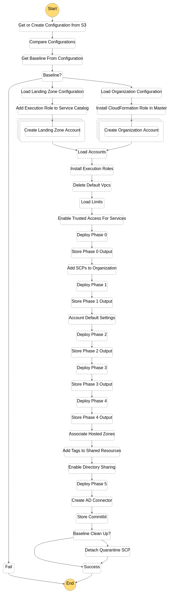

The state machine contains three types of steps:

1. steps that execute a Lambda function;
2. steps that start another state machine, e.g. `Create Accounts` step;
3. steps that start another state machine that starts a CodeBuild project, e.g. the `Phase {0,1,2,3,4,5}` steps.

The stack additionally consists of the following resources:

- AWS::CodeBuild::Project
  - `PBMMAccel-Deploy` or `PBMMAccel-DeployPrebuilt`
- AWS::CodeCommit::Repository
  - `PBMMAccel-Config-Repo`
- AWS::IAM::Role
  - `PBMMAccel-L-SFN-MasterRole`
  - `PBMMAccel-L-SFN-Execution`
  - An AWS::IAM::Role for every state machine (might be merged into a single role);
- AWS::Lambda::Function
  - A Lambda function for every Lambda function step in the state machine.
- AWS::SecretsManager::Secret
  - `accelerator/accounts`
  - `accelerator/organizations`
  - `accelerator/outputs`
  - `accelerator/limits`
- AWS::StepFunctions::StateMachine
  - `PBMMAccel-ALZCreateAccount_sm`: See [_Create Landing Zone Account_](#create-landing-zone-account);
  - `PBMMAccel-OrgCreateAccount_sm`: See [_Create Organization Account_](#create-organization-account);
  - `PBMMAccel-InstallCfnRoleMaster_sm`: See [Install CloudFormation Execution Role](#install-cloudformation-role-in-master);
  - `PBMMAccel-InstallRoles_sm`: See [_Install Execution Roles_](#install-execution-roles);
  - `PBMMAccel-DeleteDefaultVpcs_sfn`: See [_Delete Default VPCs_](#delete-default-vpcs);
  - `PBMMAccel-CodeBuild_sm`: See [_Deploy Phase 0_](#deploy-phase-0);
  - `PBMMAccel-CreateConfigRecorder_sfn`;
  - `PBMMAccel-CreateAdConnector_sm`: See [_Create AD Connector_](#create-ad-connector).

_Note: Most resources have a random suffix to their name. This is because we use CDK to deploy the resources. See [https://docs.aws.amazon.com/cdk/latest/guide/identifiers.html#identifiers_logical_ids]()_

#### Get or Create Configuration from S3

This step calls a Lambda function that finds or creates the configuration repository. Finds the configuration file in the repository. If the configuration file cannot be found in the repository it is copied from the customer's configuration bucket. If the copy is successful then the configuration file in the S3 bucket will be removed.

The configuration file is parsed and validated. This step will fail if the configuration file is not valid JSON or does not adhere to the configuration file specification.

#### Compare Configurations

This step calls a Lambda function that compares the previous version of the configuration file with the current version of the configuration file. The previous configuration file version is stored in the secret `accelerator/config/last-successful-commit` in AWS Secrets Manager in fthe master account.

The following configuration file changes are not allowed:

- changing ALZ baseline;
- changing master account or region;
- changing central log services account or region;
- changing the organizational unit, name or email address of an account;
- removing an account;
- changing the name, CIDR or region of a VPC;
- disabling a VPC;
- changing the name, availability zone, CIDR of a subnet;
- disabling a subnet;
- removing a subnet;
- changing the name, ASN, region or features of a transit gateway;
- changing the ID, VPC, subnet, region, size, DNS, Netbios of a Managed Active Directory;
- disabling a Managed Active Directory;
- changing the ASN of a virtual private gateway;
- changing the sharing to accounts of a VPC;
- changing the NACLs of a subnet.

It is possible to ignore certain configuration file changes. See [Restart the State Machine](#restart-the-state-machine) how to pass these options to the state machine.

#### Get Baseline from Configuration

This step calls a Lambda function that gets the `alz-baseline` of the configuration file to decide which path in the state machine will be taken.

#### Load Landing Zone Configuration

_Executed only when using AWS Landing Zone baseline_

This step calls a Lambda function that validates the ALZ deployment and configuration.

This step fails when

- an existing ALZ deployment in the master account can not be found;
- an organizational unit that is used by ALZ or the Accelerator can not be found;
- an account is present in the Accelerator configuration but does not exist in AWS Organizations;
- an account has a name, email address or organizational unit that is different from the ALZ configuration;
- an account has a name, email address or organizational unit that is different from the Accelerator configuration;
- the organizational units in the ALZ configuration are different from the ones in AWS Organizations;
- the account type of ALZ configuration accounts can not be detected;
- the accounts of type `primary`', `security`, `log-archive`, `shared-services` are missing from the ALZ configuration.

#### Add Execution Role to Service Catalog

_Executed only when using AWS Landing Zone baseline_

This step calls a Lambda function that adds the state machine's IAM role to the ALZ Account Vending Machine (AVM) service catalog portfolio.

#### Create Landing Zone Account

_Executed only when using AWS Landing Zone baseline_

This step starts the `PBMMAccel-ALZCreateAccount_sm` state machine. This state machine is responsible for creating an account using the AVM and waits for the account to be created and configured.

#### Organizational Unit Validation

_Executed only when using AWS Organizations baseline_

> TODO: Document

#### Load Organization Configuration

_Executed only when using AWS Organizations baseline_

This step calls a Lambda function that validates the Accelerator deployment and configuration.

This step fails when

- an organizational unit that is used by the Accelerator can not be found;
- an account is present in the Accelerator configuration but does not exist in AWS Organizations;
- an account has a name, email address or organizational unit that is different from the Accelerator configuration.

#### Install CloudFormation Role in Master

_Executed only when using AWS Organizations baseline_

This step starts the `PBMMAccel-InstallCfnRoleMaster_sm` state machine. This state machine is responsible for creating the IAM role `AWSCloudFormationStackSetAdministrationRole` in the master account. You can read more about why this role is created [here](https://docs.aws.amazon.com/AWSCloudFormation/latest/UserGuide/stacksets-prereqs.html).

#### Create Organization Account

_Executed only when using AWS Organizations baseline_

This step starts the `PBMMAccel-OrgCreateAccount_sm` state machine. This state machine is responsible for creating an account using the AWS Organizations and waits for the account to be created and configured. The newly created account will be moved to the correct organizational unit and will have an the `PBMMAccel-Quarantine-New-Object` Service Control Policy (SCP) attached to it. The SCP will only be removed after the Accelerator state machine has completed.

> TODO(bmycroft): Explain why the SCP is attached.

#### Load Organizational Units

> TODO: Document

#### Load Accounts

This step calls a Lambda function that loads all accounts and organizational units. The accounts and organizational units are stored in the secret `accelerator/accounts` and `accelerator/organizations` in AWS Secrets Manager in the master account. The accounts and organizational units will later be used to deploy stacks in the correct accounts.

#### Install Execution Roles

This step calls a Lambda function that creates stack sets in all Accelerator accounts. This stack sets contains a single resource, i.e. an IAM role `PBMMAccel-PipelineRole` that can be assumed by the `PBMMAccel-L-SFN-MasterRole`. This IAM role allows the master account to administer the Accelerator accounts.

#### Delete Default VPCs

This step starts the `PBMMAccel-DeleteDefaultVpcs_sfn` state machine. This state machine is responsible for deleting default subnets, internet gateways and VPCs for all regions and accounts in the Accelerator configuration.

This step fails when one or more default VPCs cannot be deleted.

#### Load Limits

This step calls a Lambda function that loads service quotas and requests a service quota increase according to the configuration file. When a service quota increase request has been closed but not increased, then the service quota request will be issued again when the creation of the last request was at least two days ago.

#### Enable Trusted Access for Services

This step calls a Lambda function that is responsible for

- enabling AWS service access in the organization;
- enabling AWS Resource Access Manager sharing in the organization;
- creating a service-linked role for AWS IAM Access Analyzer;
- setting the security account as delegated administrator for AWS Firewall Manager;
- setting the security account as delegated administrator for AWS IAM Access Analyzer;
- setting the security account as delegated administrator for Amazon GuardDuty.

#### Deploy Phase 0

This step starts the `PBMMAccel-CodeBuild_sm` state machine. This state machine is responsible for starting a CodeBuild execution that deploys CloudFormation stacks in Accelerator-managed accounts using CDK.

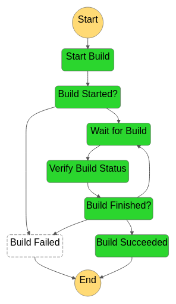


The same CodeBuild project is used to deploy all phases. The environment variable `ACCELERATOR_PHASE` in the CodeBuild execution decides which phase to deploy.

- create default EBS encryption key;
- create an AWS log bucket with encryption key;
- create the central log services bucket with encryption key;
- create the Accelerator configuration bucket with encryption key;
- copy artifacts to the Accelerator configuration bucket:
  - SCPs;
  - firewall configuration;
- account warming (step 1);
- set password policy (step 1);
- create IAM users (step 1):
  - create passwords and store in Secrets Manager;
- create MAD deployment (step 1):
  - create passwords and store in Secrets Manager;
  - create service-linked role;
- create `rsyslog` deployment (step 1);
- create firewalls (step 1);
- create budgets (step 1);
- create transit gateways (step 1);
- create Route53 DNS logging log group;
- enable Macie (step 1);
- enable GuardDuty;
- enable Access Analyzer;

#### Store Phase 0 Output

This step calls a Lambda function that stores the outputs from the deployed stacks in subaccounts in the secret `accelerator/outputs` in AWS Secrets Manager in the master account.

#### Add SCPs to Organization

This step calls a Lambda function that creates and attaches the SCPs listed in the Accelerator configuration. The SCP policies are loaded from the Accelerator configuration bucket.

This step fails when

- an SCP policy cannot be found in the Accelerator configuration bucket;
- an SCP could not be attached to an organizational unit or account, e.g. when the maximum number of attached SCPs is exceeded

#### Deploy Phase 1

- create VPCs;
  - subnets;
  - route tables;
  - security groups;
  - interface endpoints;
  - transit gateway attachments;
  - flow logs;
  - resource sharing in case the VPC is shared;
  - role to accept peering connection requests;
- create firewalls (step 2);
- create IAM roles (step 2);
- create budgets (step 2);
- create certificates (step 1);
- create reports (step 1);
- enable SSM (step 1);
- enable Security Hub (step 1);
- enable Macie (step 2);
- enable GuardDuty (step 3);
- enable central logging to S3 (step 1);

#### Store Phase 1 Output

See [_Deploy Phase 0_](#deploy-phase-0).

#### Account Default Settings

This step calls a Lambda function that

- enables and sets EBS default encryption for all accounts in the Accelerator configuration;
- enables S3 object level ALZ Cloudtrail logging;
- enables Log Insight events;
- enables KMS encryption using the CMK from the central logging account;
- sets AWS Systems Manager Session Manager default configuration in every Accelerator-managed account in every region with a VPC.

#### Deploy Phase 2

- create peering connections;
- create security groups in shared account;
- create MAD deployment (step 2);
- create firewalls (step 3);
- create firewall manager (step 1);
- create transit gateways (step 2);
- enable Security Hub (step 2);
- enable Macie (step 3);

#### Store Phase 2 Output

See [_Deploy Phase 0_](#deploy-phase-0).

#### Deploy Phase 3

- create peering connection routes;
- create ALB (step 1);
- create `rsyslog` deployment (step 2);
- create hosted zones, resolver rules and resolver endpoints;

#### Store Phase 3 Output

See [_Deploy Phase 0_](#deploy-phase-0).

#### Deploy Phase 4

- share resolver rules;

#### Store Phase 4 Output

See [_Deploy Phase 0_](#deploy-phase-0).

#### Associate Hosted Zones

This step calls a Lambda function that associates the private zones, all the interface endpoint zones, and the resolver rules with each VPC that leverages endpoint services.

#### Add Tags to Shared Resources

This step calls a Lambda function that adds tags to shared resources in the share destination account. For example, when a subnet is shared into another account, this step will add the `Name` tag to the subnet in the shared account.

The supported resources are

- VPCs;
- subnets;
- security groups;
- transit gateway attachments.

#### Enable Directory Sharing

This step calls a Lambda function that shares Managed Active Directory according to the Accelerator configuration. The directory is shared from the source account to the target account. The directory will be accepted in the target account.

#### Deploy Phase 5

- create Remote Desktop Gateway;
  - create launch configuration;
  - create autoscaling group;
- enable central logging to S3 (step 2);

#### Create AD Connector

This step starts the `PBMMAccel-DeleteDefaultVpcs_sfn` state machine. This state machine is responsible for creating AD connectors according to the Accelerator configuration.

This step fails when one or more AD connectors failed to be created.

#### Store Commit ID

This step calls a Lambda function that stores the commit ID of the configuration file for which the state machine ran.

#### Detach Quarantine SCP

_Executed only when using AWS Organizations baseline_

This step calls a Lambda function that stores the commit ID for which the state machine just ran.

## Troubleshooting

Issues could occur in different parts of the Accelerator. We'll guide you through troubleshooting these issues in this section.

### Components

#### CodePipeline

> TODO(ggindera):
>
> - Installer Pipeline
>   - "Internal Failure" incorrect Github token, repo or branch

#### CodeBuild

There are two Accelerator CodeBuild projects that we need to be able to troubleshoot: `PBMMAccel-InstallerProject_pl` and `PBMMAccel-DeployPrebuilt`. Both are similar in that they use CDK to deploy stacks.

When an error occurs you will see that the CodeBuild project execution fails when looking in the execution overview.

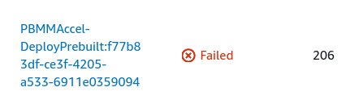

You can click on the name of the CodeBuild execution and then look inside the logs what caused the failure.


You can for example see the error message `The stack named PBMMAccel-Perimeter-Phase2 is in a failed state: UPDATE_ROLLBACK_COMPLETE`. This means the stack `PBMMAccel-Perimeter-Phase2` failed to update and it had to rollback. When you scroll up in the logs there should be a failure listed in the CloudFormation update logs.


In this example we can see that the resource `FirewallManager` failed to create through CloudFormation. One way to solve this issue is to deprovision the firewall manager in the configuration file and then run the state machine. Next, provision the firewall manager and run the state machine again.

If the error message is not clear, or the error occurred in a nested stack, then a more detailed error will be available in the CloudFormation stack events. See the [CloudFormation](#cloudformation) section below.

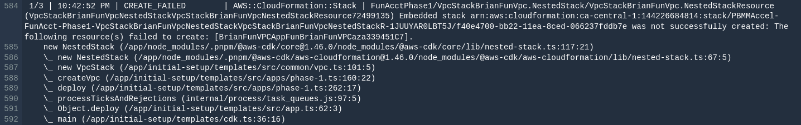

#### CloudFormation

In case you want to troubleshoot errors that occurred in CloudFormation, the best way is to look in the CloudFormation stack's events.


When a native resource fails to create or update there are no additional logs available except what is displayed in the `Status reason` column. When a custom resource fails to create or update -- i.e. not a native CloudFormation resource but a resource backed by a custom Lambda function -- then we can find additional logs in CloudWatch.

Sometimes the stack failure could have occurred in a managed account instead of the master account. See [Switch To a Managed Account](#switch-to-a-managed-account) to switch to the CloudFormation console in the managed account.

#### Custom Resource

Custom resources are backed by a Lambda function that implements the creation, modification or deletion or the resource. Every Lambda function has a CloudWatch log group that contains logs about the custom resource creation. To troubleshoot errors in custom resource, you need to check the custom resource's log group.

Example custom resource log group names:

```
/aws/lambda/PBMMAccel-Master-Phase1-CustomCurReportDefinitionL-14IHLQCC1LY8L
/aws/lambda/PBMMAccel-Master-Phase2-AWS679f53fac002430cb0da5b7-Z75Q4GG9LIV5
/aws/lambda/PBMMAccel-Operations-Phas-AWS679f53fac002430cb0da5-HMV2YF6OKJET
/aws/lambda/PBMMAccel-Operations-Phas-CustomGetDetectorIdLambd-HEM07DR0DOOJ
```

#### CloudWatch

When you arrived in CloudWatch logs by clicking on the state machine's step `CloudWatch Logs` link you will immediately see the list of log streams. Every log stream represents an instance of the Lambda function.

You can find errors in multiple log groups using CloudWatch Log Insights.

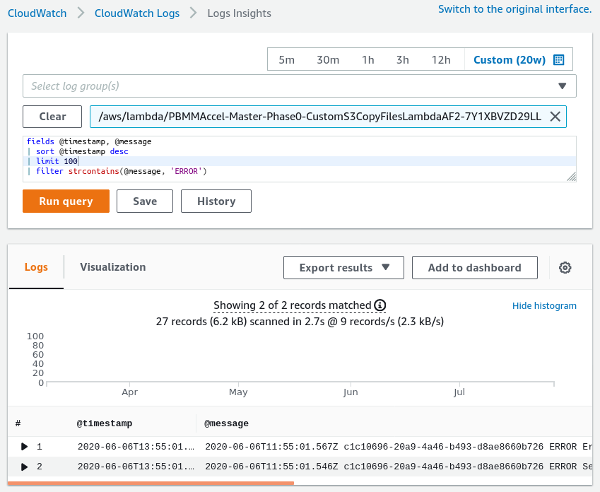

```
fields @timestamp, @message
| sort @timestamp desc
| filter strcontains(@message, 'ERROR')
| limit 100
```

#### State Machine

When troubleshooting a failed step in the state machine it is important to know what type of step failed. If the step is calling a Lambda function then you will see the following after clicking the failed step.

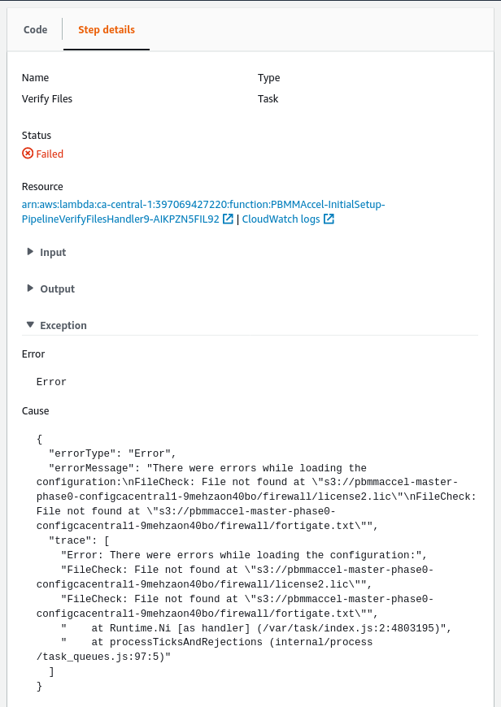

You can see that the exception contains a useful message. This message will differ between Lambda functions. In case this message does not make the issue clear, you can click on the `CloudWatch Logs` link in the `Resource` section to view the output of the Lambda function that was called by the step. See the section [CloudWatch Logs](#cloudwatch-logs).

In case the failed step started another state machine, you will see the following after clicking the failed step.


To view the state machine execution that failed you can click the link in the `Resource` section.

In case the failed step started the CodeBuild state machine, `PBMMAccel-CodeBuild_sm`, you will be able to see the CodeBuild project and execution ID that failed by looking at the output of the `Start Build` step in the `PBMMAccel-CodeBuild_sm` state machine.

.

In the image above the execution of CodeBuild project `PBMMAccel-DeployPrebuilt` with ID `PBMMAccel-DeployPrebuilt:717584a9-c406-4569-9cc2-0d23e9ff9ef0` failed. See the [CodeBuild](#codebuild) section to troubleshoot.

### How-to

#### Restart the State Machine

> TODO(ggindera)
>
> ```
> {
>   'ov-global-options': true,
>   'ov-del-accts': true,
>   'ov-ren-accts': true,
>   'ov-acct-email': true,
>   'ov-acct-ou': true,
>   'ov-acct-vpc': true,
>   'ov-acct-subnet': true,
>   'ov-tgw': true,
>   'ov-mad': true,
>   'ov-ou-vpc': true,
>   'ov-ou-subnet': true,
>   'ov-share-to-ou': true,
>   'ov-share-to-accounts': true,
>   'ov-nacl': true
> }
> ```

#### Switch To a Managed Account

To switch from the master account to a managed account you can click on your account name in the AWS Console. Then choose `Switch Role` in the menu.

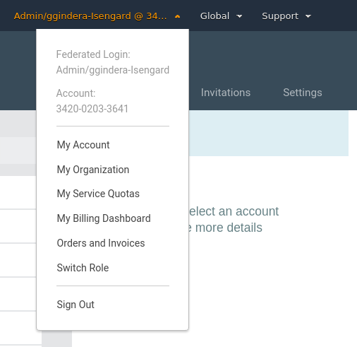

In the page that appears next you need to fill out the account ID of the managed account you want to switch to. Next, you need to enter the role name `PBMMAccel-PipelineRole`. And lastly, you need to enter a relevant name so you can later switch roles by using this name.


After switching to the managed account, the AWS Console header will look like the following image.


You can switch to the same account again quickly by clicking the name you entered previously in the menu.

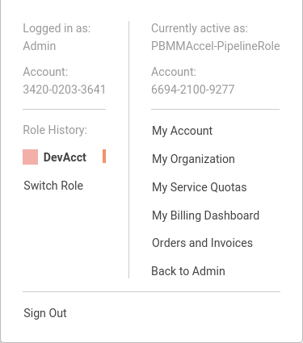

<a name="cdk">[1]</a>: https://docs.aws.amazon.com/cdk/latest/guide/home.html
