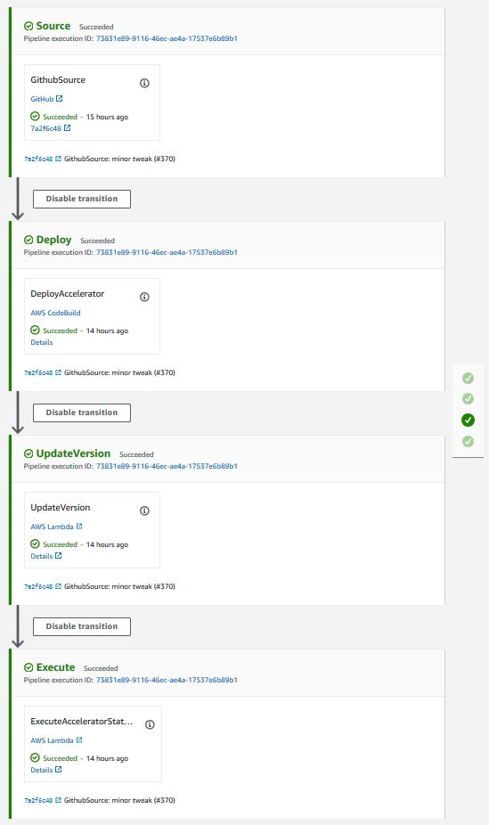
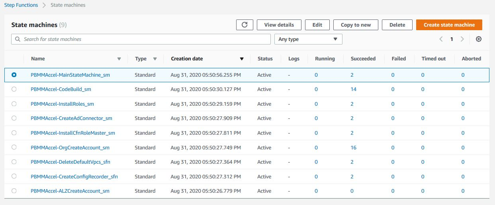
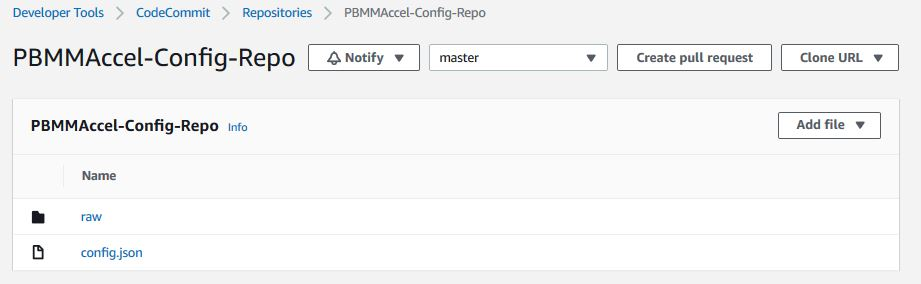
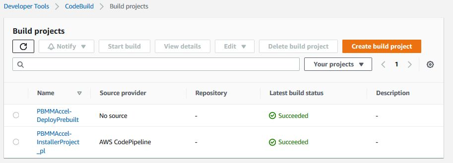
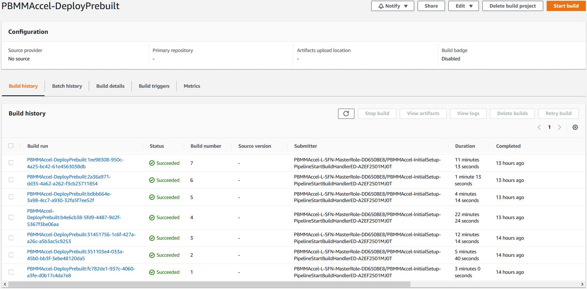
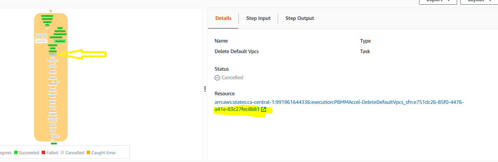
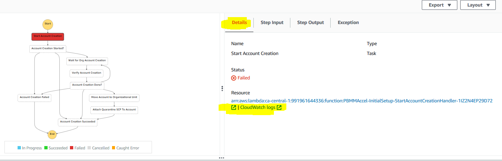
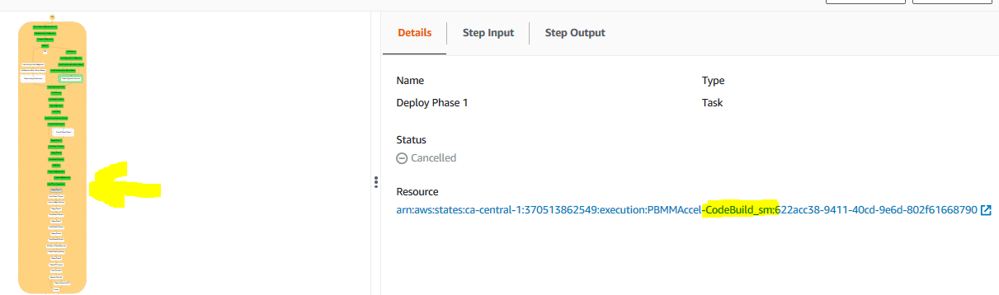

# 1. Operations & Troubleshooting Guide

## 1.1. Table of Contents

<!-- TOC depthFrom:1 depthTo:4 -->

- [1. Operations & Troubleshooting Guide](#1-operations--troubleshooting-guide)
  - [1.1. Table of Contents](#11-table-of-contents)
- [2. Purpose](#2-purpose)
- [3. System Overview](#3-system-overview)
  - [3.1. Installer Stack](#31-installer-stack)
  - [3.2. Initial Setup Stack](#32-initial-setup-stack)
    - [3.2.1. Get or Create Configuration from S3](#321-get-or-create-configuration-from-s3)
    - [3.2.2. Get Baseline from Configuration](#322-get-baseline-from-configuration)
    - [3.2.3. Compare Configurations](#323-compare-configurations)
    - [3.2.4. Load Landing Zone Configuration](#324-load-landing-zone-configuration)
    - [3.2.5. Add Execution Role to Service Catalog](#325-add-execution-role-to-service-catalog)
    - [3.2.6. Create Landing Zone Account](#326-create-landing-zone-account)
    - [3.2.7. Organizational Unit (OU) Validation](#327-organizational-unit-ou-validation)
    - [3.2.8. Load Organization Configuration](#328-load-organization-configuration)
    - [3.2.9. Install CloudFormation Role in root](#329-install-cloudformation-role-in-root)
    - [3.2.10. Create Organization Account](#3210-create-organization-account)
    - [3.2.11. Load Organizational Units](#3211-load-organizational-units)
    - [3.2.12. Load Accounts](#3212-load-accounts)
    - [3.2.13. Install Execution Roles](#3213-install-execution-roles)
    - [3.2.14. Delete Default VPCs](#3214-delete-default-vpcs)
    - [3.2.15. Load Limits](#3215-load-limits)
    - [3.2.16. Enable Trusted Access for Services](#3216-enable-trusted-access-for-services)
    - [3.2.17. Store All Phase Outputs](#3217-store-all-phase-outputs)
    - [3.2.18. Deploy Phase -1 (Negative one)](#3218-deploy-phase--1-negative-one)
    - [3.2.19. Store Phase -1 Output](#3219-store-phase--1-output)
    - [3.2.20. Deploy Phase 0](#3220-deploy-phase-0)
    - [3.2.21. Store Phase 0 Output](#3221-store-phase-0-output)
    - [3.2.22. Verify Files](#3222-verify-files)
    - [3.2.23. Create Config Recorders](#3223-create-config-recorders)
    - [3.2.24. Add SCPs to Organization](#3224-add-scps-to-organization)
    - [3.2.25. Deploy Phase 1](#3225-deploy-phase-1)
    - [3.2.26. Store Phase 1 Output](#3226-store-phase-1-output)
    - [3.2.27. Account Default Settings](#3227-account-default-settings)
    - [3.2.28. Deploy Phase 2](#3228-deploy-phase-2)
    - [3.2.29. Store Phase 2 Output](#3229-store-phase-2-output)
    - [3.2.30. Deploy Phase 3](#3230-deploy-phase-3)
    - [3.2.31. Store Phase 3 Output](#3231-store-phase-3-output)
    - [3.2.32. Deploy Phase 4](#3232-deploy-phase-4)
    - [3.2.33. Store Phase 4 Output](#3233-store-phase-4-output)
    - [3.2.34. Associate Hosted Zones (Step removed in v1.2.1)](#3234-associate-hosted-zones-step-removed-in-v121)
    - [3.2.35. Add Tags to Shared Resources](#3235-add-tags-to-shared-resources)
    - [3.2.36. Enable Directory Sharing](#3236-enable-directory-sharing)
    - [3.2.37. Deploy Phase 5](#3237-deploy-phase-5)
    - [3.2.38. Create AD Connector](#3238-create-ad-connector)
    - [3.2.39. Store Commit ID](#3239-store-commit-id)
    - [3.2.40. Detach Quarantine SCP](#3240-detach-quarantine-scp)
- [4. Troubleshooting](#4-troubleshooting)
  - [4.1. Components](#41-components)
    - [4.1.1. State Machine](#411-state-machine)
    - [4.1.2. CodeBuild](#412-codebuild)
    - [4.1.3. CloudFormation](#413-cloudformation)
    - [4.1.4. Custom Resource](#414-custom-resource)
    - [4.1.5. CloudWatch](#415-cloudwatch)
    - [4.1.6. CodePipeline](#416-codepipeline)
  - [4.2. Examples](#42-examples)
    - [4.2.1. Example 1](#421-example-1)
    - [4.2.2. Example 2:](#422-example-2)
    - [4.2.3. Example 3:](#423-example-3)
- [5. How-to](#5-how-to)
  - [5.1. Restart the State Machine](#51-restart-the-state-machine)
  - [5.2. Switch To a Managed Account](#52-switch-to-a-managed-account)

<!-- /TOC -->

# 2. Purpose

This document is targeted at individuals installing or executing the AWS Secure Environment Accelerator. It is intended to guide individuals who are executing the Accelerator by providing an understanding as to what happens at each point throughout execution and to assist in troubleshooting state machine failures and/or errors. This is one component of the provided documenation package and should be read after the Installation Guide, but before the Developer Guide.

# 3. System Overview

The system can be thought of in two levels. The first level of the system consists of Accelerator stacks and resources. Let's call these the Accelerator-management resource. The second level of the system consists of stacks and resources that are deployed by the Accelerator-management resource. Let's call these the Accelerator-managed resources. The Accelerator-management resources are responsible for deploying the Accelerator-managed resources.

There are two Accelerator-management stacks:

- the `Installer` stack that is responsible for creating the next listed stack;
- the `Initial Setup` stack. This stack is responsible for reading configuration file and creating Accelerator-managed resources in the relevant accounts.

There are multiple Accelerator-managed stacks. Currently there are as many as twelve Accelerator-managed stacks per managed account.

The figure below shows a zoomed-out overview of the Accelerator. The top of the overview shows the Accelerator-management resources, i.e. the `Installer` stack and the `Initial Setup` stack. The bottom of the overview shows the Accelerator-managed resources in the different accounts.


## 3.1. Installer Stack

The Accelerator-management `Installer` stack contains the necessary resources to deploy the Accelerator-management `Initial Setup` stack in an AWS account. This AWS account will be referred to as the 'root' account in this document.


The Installer stack consists of the following resources:

- `PBMMAccel-InstallerPipeline`: this is a `AWS::CodePipeline::Pipeline` that pulls the latest Accelerator code from GitHub. It launches the CodeBuild project `PBMMAccel-InstallerProject_pl`, executes the `PBMMAccel-Installer-SaveApplicationVersion` Lambda and launches the Accelerator state machine.
- `PBMMAccel-InstallerProject_pl`: this is a `AWS::CodeBuild::Project` that installs the Accelerator in AWS account.
- `PBMMAccel-Installer-SaveApplicationVersion`: this is a `AWS::Lambda::Function` that stores the current Accelerator version into Parameter Store.
- `PBMMAccel-Installer-StartExecution`: this is a `AWS::Lambda::Function` that launches the Accelerator after CodeBuild deploys the Accelerator.
- Creation of AWS::DynamoDB::Table - `PBMMAccel-Parameters` and `PBMMAccel-Outputs` which are used for the internal operation of the Accelerator. `PBMMAccel-Outputs` is used to share CloudFormation stack outputs between regions, stacks and phases. `PBMMAccel-Parameters` is used to various configuration items like managed accounts, organizations structure, and limits.


The `PBMMAccel-InstallerPipeline` starts when first installed using the CloudFormation template. The administrator can also start the pipeline manually by clicking the `Release Change` button in the AWS Console.


This starts the `PBMMAccel-InstallerProject_pl` CodeBuild project. The CodeBuild project uses the GitHub source artifact. The CodeBuild projects spins up a new Linux instances and installs the Accelerator dependencies and starts the deployment of the Accelerator using the AWS Cloud Development Kit (CDK<sup>[1](#cdk)</sup>).

CDK bootstraps its environment and creates the `CDKToolkit` stack in the AWS account. It creates the S3 bucket `cdktoolkit-stagingbucket-*` and the ECR repository `aws-cdk/assets`.

CDK copies assets to the bootstrap bucket and bootstrap repository that are used by the Accelerator. The assets that are stored on S3 include default IAM policies, default SCPs, default firewall configuration. The assets that are pushed to ECR include the Accelerator Docker build image. This Docker image is responsible for deploying Accelerator resources using the CDK.

CDK finally deploys the `Initial Setup` stack. The Accelerator state machine is described in the next section.

This diagram depicts the Accelerator Installer CodePipeline as of v1.2.1:



Once the Code Pipeline completes successfully:

- the Accelerator codebase was pulled from GitHub
- the Accelerator codebase was deployed/installed in the Organization Management (root) AWS account
- parameter store `/accelerator/version` was updated with the new version information
  - this provides a full history of all Accelerator versions and upgrades
- the newly installed Accelerator state machine is started

At this time the resources deployed by the Installer Stack are no longer required. The Installer stack **could** be removed (which would remove the Code Pipeline) with no impact on Accelerator functionality.

If the Installer Stack was removed, it would need to be re-installed to upgrade the Accelerator. If the stack was not removed, an Accelerator codebase upgrade often only requires updating a single stack parameter to point to the latest Accelerator code branch, and re-releasing the pipeline. No files to manually copy, change or update, an upgrade can be initiated with a simple variable update.


## 3.2. Initial Setup Stack

The Accelerator-management `Initial Setup` stack, named `PBMMAccel-InitialSetup`, consists of a state machine, named `PBMMAccel-MainStateMachine_sm`, that executes various steps to create the Accelerator-managed stacks and resources in the Accelerator-managed accounts. Using a state machine, we can clearly define the deployment process and systematically control branches of execution and handle exceptions.

The Accelerator comprises a primary state machine `PBMMAccel-MainStateMachine_sm`, and nine supporting state machines (as of v1.2.1). Customer will only ever Execute the `PBMMAccel-MainStateMachine_sm`. All troubleshooting will also typically begin with the `PBMMAccel-MainStateMachine_sm`.



The image below depicts the latest state `PBMMAccel-MainStateMachine_sm` machine. Each green or white square in the image represents a step in the state machine. This all green diagram represents a successul Accelerator state machine execution.


Notice the extremely linear state machine design. This was done to reduce complexity and ease troubleshooting. You may notice a small fork in the state machine. The left path is executed if the Accelerator is deployed on top of an ALZ, The right path is executed if the Accelerator is deployed as a standalone solution. If we eventually add a Control Tower deployment option, it is likely it could also leverage the existing ALZ path.

The state machine contains three different types of steps:

1. steps that execute a Lambda function;
2. steps that start another state machine, e.g. `Create Accounts` step;
3. steps that start another state machine that starts a CodeBuild project, e.g. the `Phase {-1,0,1,2,3,4,5}` steps.

The stack additionally consists of the following resources:

- AWS::CodeBuild::Project
  - `PBMMAccel-Deploy` or `PBMMAccel-DeployPrebuilt`
- AWS::CodeCommit::Repository
  - `PBMMAccel-Config-Repo`
- AWS::IAM::Role
  - `PBMMAccel-L-SFN-MasterRole`
  - `PBMMAccel-L-SFN-Execution`
- AWS::Lambda::Function
  - A Lambda function for every Lambda function step in the state machine.
- AWS::StepFunctions::StateMachine
  - `PBMMAccel-ALZCreateAccount_sm`: See [_Create Landing Zone Account_](#create-landing-zone-account);
  - `PBMMAccel-OrgCreateAccount_sm`: See [_Create Organization Account_](#create-organization-account);
  - `PBMMAccel-InstallCfnRoleMaster_sm`: See [Install CloudFormation Execution Role](#install-cloudformation-role-in-root);
  - `PBMMAccel-InstallRoles_sm`: See [_Install Execution Roles_](#install-execution-roles);
  - `PBMMAccel-DeleteDefaultVpcs_sfn`: See [_Delete Default VPCs_](#delete-default-vpcs);
  - `PBMMAccel-CodeBuild_sm`: See [_Deploy Phase 0_](#deploy-phase-0);
  - `PBMMAccel-CreateConfigRecorder_sfn`: See [_Create Config Recorders_]();
  - `PBMMAccel-CreateAdConnector_sm`: See [_Create AD Connector_](#create-ad-connector);
  - `PBMMAccel-StoreOutputs_sm`: See [_Share Outputs_]() - new in v1.2.1.

_Note: Most resources have a random suffix to their name. This is because we use CDK to deploy the resources. See [https://docs.aws.amazon.com/cdk/latest/guide/identifiers.html#identifiers_logical_ids]()_

### 3.2.1. Get or Create Configuration from S3

This step calls a Lambda function that finds or creates the configuration repository. Finds the configuration file(s) in the CodeCommit repository. If the configuration file cannot be found in the repository it is copied from the customer's S3 configuration bucket. If the copy is successful then the configuration file(s) in the S3 bucket will be removed.

The configuration file `config.json` or `config.yaml` is parsed and validated. This step will fail if both file types exist, the configuration file is not valid JSON or YAML or does not adhere to the configuration file specification. Internally the Accelerator always leverages JSON, but accepts JSON or YAML as the source input file and converts it to JSON prior to each execution, storing the converted and fully expanded file if in the raw folder.



### 3.2.2. Get Baseline from Configuration

This step calls a Lambda function that gets the `alz-baseline` of the configuration file to decide which path in the state machine will be taken.

### 3.2.3. Compare Configurations

This step calls a Lambda function that compares the previous version of the configuration file with the current version of the configuration file. The previous configuration file CodeCommit commit id is stored in the secret `accelerator/config/last-successful-commit` in AWS Secrets Manager in the root account.

The following configuration file changes are not allowed:

- changing ALZ baseline;
- changing root account or region;
- changing central log services account or region;
- changing the organizational unit, name or email address of an account;
- removing an account;
- changing the name, CIDR or region of a VPC;
- disabling a VPC;
- changing the name, availability zone, CIDR of a subnet;
- disabling or removing a subnet;
- changing the name, ASN, region or features of a transit gateway;
- changing the ID, VPC, subnet, region, size, DNS, Netbios of a Managed Active Directory;
- disabling a Managed Active Directory;
- changing the ASN of a virtual private gateway;
- changing the sharing to accounts of a VPC;
- changing the NACLs of a subnet.

It is possible to ignore certain configuration file changes. See [Restart the State Machine](#restart-the-state-machine) how to pass these options to the state machine.

### 3.2.4. Load Landing Zone Configuration

_Executed only when using AWS Landing Zone baseline_

This step calls a Lambda function that validates the ALZ deployment and configuration.

This step fails when

- an existing ALZ deployment in the root account can not be found;
- an organizational unit that is used by ALZ or the Accelerator can not be found;
- an account is present in the Accelerator configuration but does not exist in AWS Organizations;
- an account has a name, email address or organizational unit that is different from the ALZ configuration;
- an account has a name, email address or organizational unit that is different from the Accelerator configuration;
- the organizational units in the ALZ configuration are different from the ones in AWS Organizations;
- the account type of ALZ configuration accounts can not be detected;
- the accounts of type `primary`', `security`, `log-archive`, `shared-services` are missing from the ALZ configuration.

### 3.2.5. Add Execution Role to Service Catalog

_Executed only when using AWS Landing Zone baseline_

This step calls a Lambda function that adds the state machine's IAM role to the ALZ Account Vending Machine (AVM) service catalog portfolio.

### 3.2.6. Create Landing Zone Account

_Executed only when using AWS Landing Zone baseline_

This step starts the `PBMMAccel-ALZCreateAccount_sm` state machine. This state machine is responsible for creating an account using the AVM and waits for the account to be created and configured.

### 3.2.7. Organizational Unit (OU) Validation

_Executed only when using AWS Organizations baseline_

This step validates that the OU structure defined in the Accelerator configuration file matches the OU and account structure defined in AWS Organizations. Missing OUs are created. If any AWS Accounts or OUs have been renamed, this step updates the configuration file with the latest information. Accounts located in the incorrect top-level OU cause a state machine failure.

### 3.2.8. Load Organization Configuration

_Executed only when using AWS Organizations baseline_

This step calls a Lambda function that validates the Accelerator deployment and configuration.

This step fails when

- an organizational unit that is used by the Accelerator can not be found;
- an account is present in the Accelerator configuration but does not exist in AWS Organizations;
- an account has a name, email address or organizational unit that is different from the Accelerator configuration.
- ** returns accounts that have not been created **
- duplicates some validation functionality

### 3.2.9. Install CloudFormation Role in root

_Executed only when using AWS Organizations baseline_

This step starts the `PBMMAccel-InstallCfnRoleMaster_sm` state machine. This state machine is responsible for creating the IAM role `AWSCloudFormationStackSetAdministrationRole` in the root account. You can read more about why this role is created [here](https://docs.aws.amazon.com/AWSCloudFormation/latest/UserGuide/stacksets-prereqs.html).

### 3.2.10. Create Organization Account

_Executed only when using AWS Organizations baseline_

This step starts the `PBMMAccel-OrgCreateAccount_sm` state machine. This state machine is responsible for creating an account using the AWS Organizations and waits for the account to be created and configured. The newly created account will be moved to the correct organizational unit and will have an the `PBMMAccel-Quarantine-New-Object` Service Control Policy (SCP) attached to it. The SCP will only be removed after the Accelerator state machine has completed.

Application of this SCP ensures that new AWS accounts cannot be used until they have been properly configured and had all Accelerator guardrails applied per the configuration file. It is important that guardrails be consistently in place from the time a user first accesses a new AWS account, until the account is decommissioned. Should the state machine fail, still be in-progress, or has not yet processed the account (for whatever reason), users who access it will be prevented from doing _anything_.

### 3.2.11. Load Organizational Units

This step calls a Lambda function that loads all Organizational Units. The Organizational Units are stored in the DynamoDB table `PBMMAccel-Parameters` in the root account. The Organizational Units will later be used to determine which configuration file options apply to an AWS account.

### 3.2.12. Load Accounts

This step calls a Lambda function that loads all accounts. The accounts are stored in the DynamoDB table `PBMMAccel-Parameters` in the root account. The accounts will later be used to deploy stacks in the correct accounts.

### 3.2.13. Install Execution Roles

This step calls a Lambda function that creates stack sets in all Accelerator accounts. This stack sets contains a single resource, i.e. an IAM role `PBMMAccel-PipelineRole` that can be assumed by the `PBMMAccel-L-SFN-MasterRole`. This IAM role allows the root account to administer the Accelerator accounts.

### 3.2.14. Delete Default VPCs

This step starts the `PBMMAccel-DeleteDefaultVpcs_sfn` state machine. This state machine is responsible for deleting default subnets, internet gateways and VPCs for all regions and accounts in the Accelerator configuration.

This step fails when one or more default VPCs cannot be deleted. This step does not fail on the first error, it executes on all accounts/regions and then fails with a complete list of errors.

### 3.2.15. Load Limits

This step calls a Lambda function that loads service quotas and requests a service quota increase according to the configuration file. When a service quota increase request has been closed but not increased, then the service quota request will be issued again when the creation of the last request was at least two days ago.

### 3.2.16. Enable Trusted Access for Services

This step calls a Lambda function that is responsible for

- enabling AWS service access in the organization;
- enabling AWS Resource Access Manager sharing in the organization;
- creating a service-linked role for AWS IAM Access Analyzer;
- setting the security account as delegated administrator for AWS Firewall Manager;
- setting the security account as delegated administrator for AWS IAM Access Analyzer;
- setting the security account as delegated administrator for Amazon GuardDuty.

### 3.2.17. Store All Phase Outputs

This step only executes on the first run of the state machine after it has been upgraded to v1.2.0 or above. This step exists solely to support upgrades from Accelerator versions prior to v1.2.0 and can be removed when no existing customers are running versions older than v1.2.0. This steps populates the DynamoDB Outputs table with the outputs from previous executions which were previously stored in S3 (and at one time even stored in secrets manager).

### 3.2.18. Deploy Phase -1 (Negative one)

- The following resources are deployed in phase -1:
  - Creating required roles for macie custom resources
  - Creating required roles for guardDuty custom resources
  - Creating required roles for securityHub custom resources
  - Creating required roles for IamCreateRole custom resource
  - Creating required roles for createSSMDocument custom resource
  - Creating required roles for createLogGroup custom resource
  - Creating required roles for CWLCentralLoggingSubscriptionFilterRole custom resource
  - Creating required roles for TransitGatewayCreatePeeringAttachment custom resource
  - Creating required roles for TransitGatewayAcceptPeeringAttachment custom resource
  - Creating required roles for createLogsMetricFilter custom resource
  - Creating required roles for SnsSubscriberLambda custom resource

### 3.2.19. Store Phase -1 Output

This step calls a Lambda function that stores the outputs from the deployed stacks in subaccounts in the DynamoDB table `PBMMAccel-Outputs` in AWS Secrets Manager in the root account.

### 3.2.20. Deploy Phase 0

This step starts the `PBMMAccel-CodeBuild_sm` state machine. This state machine is responsible for starting a CodeBuild execution that deploys CloudFormation stacks in Accelerator-managed accounts using CDK.


The same CodeBuild project is used to deploy all phases. The environment variable `ACCELERATOR_PHASE` in the CodeBuild execution decides which phase to deploy.

The following resources are deployed in phase 0:

- create default EBS encryption key;
- create an AWS log bucket with encryption key;
- create the central log services bucket with encryption key;
- create the Accelerator configuration bucket with encryption key;
- copy artifacts to the Accelerator configuration bucket:
  - SCPs;
  - firewall configuration;
- account warming (step 1);
- set password policy (step 1);
- create IAM users (step 1):
  - create passwords and store in Secrets Manager;
- create MAD deployment (step 1):
  - create passwords and store in Secrets Manager;
  - create service-linked role;
- create `rsyslog` deployment (step 1);
- create firewalls (step 1);
- create budgets (step 1);
- create transit gateways (step 1);
- create Route53 DNS logging log group;
- enable Macie (step 1);
- enable GuardDuty;
- enable Access Analyzer;

### 3.2.21. Store Phase 0 Output

This step calls a Lambda function that stores the outputs from the deployed stacks in subaccounts in the secret `PBMMAccel-Outputs` in AWS Secrets Manager in the root account.

### 3.2.22. Verify Files

This step verifies that all required files to complete the installation have been provided by the user. If any required files have not been provided, this step will fail and provide a list of _all_ missing files.

Why do we wait until so late in the state machine execution to perform this task?

1. we do not want to add or delete files from a customer supplied bucket
2. we do not want to force customers to need to copy and supply standard configuration files for 3. prescriptive installation
3. we want to allow customers to overide the sample or standard configuration files
4. the config bucket is only created in Phase 0
5. we copy all the relevant sample files from reference-artifacts folders to our config bucket, and then, we copy any customer supplied config files over top of our sample files
6. This allows customers to overide the sample configs, with customer custom configs without needing to either fork the repo, or supply the files on a vanilla install
7. Until we do this file copy, we cannot be sure that the combination of customer supplied and reference-artifact sample files provides all the required files.

### 3.2.23. Create Config Recorders

This step starts the `PBMMAccel-CreateConfigRecorder_sfn` state machine. This state machine is responsible for creating Config recorders in all accounts and regions.

### 3.2.24. Add SCPs to Organization

This step calls a Lambda function that creates and attaches the SCPs listed in the Accelerator configuration. The SCP policies are loaded from the Accelerator configuration bucket.

This step fails when

- an SCP policy cannot be found in the Accelerator configuration bucket;
- an SCP could not be attached to an organizational unit or account, e.g. when the maximum number of attached SCPs is exceeded

### 3.2.25. Deploy Phase 1

- Create S3 Bucket in all accounts and replicate to Log Account Bucket
- Deploy VPC:
  - Vpc
  - Subnets
  - Subnet sharing (RAM)
  - Route tables
  - Internet gateways
  - NAT gateways
  - Interface endpoints
  - Gateway endpoints
  - Transit Gateway Attachments
  - IAM Role required for VPC Peering Auto accept
- Firewall images subscription check
- Creates the customer gateways for the EIPs of the firewall
- Create IAM Roles, Users in account based on configuration
- Creates the additional budgets for the account stacks.
- Import Certificates
- Setup SSMSessionManagerDocument
- Create Cost and Usage reports
- Enable Macie in root Account
- GuardDuty setup in Security Account
- Setup CWL Central Logging
- Create Roles required for Flow Logs
- Transit Gateway Peering
- Create LogGroup required for DNS Logging

### 3.2.26. Store Phase 1 Output

See [_Deploy Phase 0_](#deploy-phase-0).

### 3.2.27. Account Default Settings

This step calls a Lambda function that

- enables and sets EBS default encryption for all accounts in the Accelerator configuration;
- enables S3 object level ALZ Cloudtrail logging;
- enables Log Insight events;
- enables KMS encryption using the CMK from the central logging account;
- sets AWS Systems Manager Session Manager default configuration in every Accelerator-managed account in every region with a VPC.

### 3.2.28. Deploy Phase 2

- Create CloudTrail in root account
- Create VPC Peering Connection
- Create Security Groups for shared VPC in sub accounts
- Setup Security Hub in Security Account
- Setup Cross Account CloudWatch logs sharing by creating roles in sub accounts
- Enable VPC FlowLogs
- Create Active Directory (MAD)
- Create Firewall clusters
- Create Firewall Management instance
- Create Transit Gateway Routes, Association and Propagation
- Enable Macie in Security account and Create Members, Update Config
- GuardDuty - Add existing Org accounts as members and allow new accounts to be members and Publish
- Create SNS Topics in Log Account
- TGW Peering Attachments

### 3.2.29. Store Phase 2 Output

See [_Deploy Phase 0_](#deploy-phase-0).

### 3.2.30. Deploy Phase 3

- create peering connection routes;
- create ALB (step 1);
- create `rsyslog` deployment (step 2);
- create hosted zones, resolver rules and resolver endpoints and Share;
- Enable Security Hub and Invite Sub accounts as members;
- TransitGateway Peering attachment and routes;
- Macie update Session;

### 3.2.31. Store Phase 3 Output

See [_Deploy Phase 0_](#deploy-phase-0).

### 3.2.32. Deploy Phase 4

- SecurityHub Disable Controls
- Creates CloudWatch Metrics on LogGroups
- Associate Shared Resolver Rules to VPC
- Associate Hosted Zones to VPC

### 3.2.33. Store Phase 4 Output

See [_Deploy Phase 0_](#deploy-phase-0).

### 3.2.34. Associate Hosted Zones (Step removed in v1.2.1)

This step calls a Lambda function that associates the private zones, all the interface endpoint zones, and the resolver rules with each VPC that leverages endpoint services. This step was removed in v1.2.1 of the Accelerator codebase.

### 3.2.35. Add Tags to Shared Resources

This step calls a Lambda function that adds tags to shared resources in the share destination account. For example, when a subnet is shared into another account, this step will add the `Name` tag to the subnet in the shared account.

The supported resources are

- VPCs;
- subnets;
- security groups;
- transit gateway attachments.

### 3.2.36. Enable Directory Sharing

This step calls a Lambda function that shares Managed Active Directory according to the Accelerator configuration. The directory is shared from the source account to the target account. The directory will be accepted in the target account.

### 3.2.37. Deploy Phase 5

- create Remote Desktop Gateway;
  - create launch configuration;
  - create autoscaling group;
- enable central logging to S3 (step 2);
- Create CloudWatch Events for moveAccount, policyChanges and createAccount
- Creates CloudWatch Alarms

### 3.2.38. Create AD Connector

This step starts the `PBMMAccel-DeleteDefaultVpcs_sfn` state machine. This state machine is responsible for creating AD connectors according to the Accelerator configuration.

This step fails when one or more AD connectors failed to be created.

### 3.2.39. Store Commit ID

This step calls a Lambda function that stores the commit ID of the configuration file for which the state machine ran.

### 3.2.40. Detach Quarantine SCP

_Executed only when using AWS Organizations baseline_

This step calls a Lambda function that stores the commit ID for which the state machine just ran.

# 4. Troubleshooting

Issues could occur in different parts of the Accelerator. We'll guide you through troubleshooting these issues in this section.

## 4.1. Components

### 4.1.1. State Machine

Viewing the step function `Graph inspector` (depicted above in 2.2), the majority of the main state machine has a large colored box around which is the functionality to catch state machine failures `Main Try Catch block to Notify users`. This large outer box will be blue while the state machine is still executing, it will be green upon a successful state machine execution and will turn orange/yellow on a state machine failure.

_What if my State Machine fails? Why? Previous solutions had complex recovery processes, what's involved?_

If your main state machine fails, review the error(s), resolve the problem and simply re-run the state machine. We've put a huge focus on ensuring the solution is idempotent and to ensure recovery is a smooth and easy process.

Ensuring the integrity of deployed guardrails is critical in operating and maintaining an environment hosting protected data. Based on customer feedback and security best practices, we purposely fail the state machine if we cannot successfully deploy guardrails.

Additionally, with millions of active customers each supporting different and diverse use cases and with the rapid rate of evolution of the AWS platform, sometimes we will encounter unexpected circumstances and the state machine might fail.

We've spent a lot of time over the course of the Accelerator development process ensuring the solution can roll forward, roll backward, be stopped, restarted, and rerun without issues. A huge focus was placed on dealing with and writing custom code to manage and deal with non-idempotent resources (like S3 buckets, log groups, KMS keys, etc.). We've spent a lot of time ensuring that any failed artifacts are automatically cleaned up and don't cause subsequent executions to fail. We've put a strong focus on ensuring you do not need to go into your various AWS sub-accounts and manually remove or cleanup resources or deployment failures. We've also tried to provide usable error messages that are easy to understand and troubleshoot. As new scenario's are brought to our attention, we continue to adjust the codebase to better handle these situations.

Will your state machine fail at some point in time, likely. Will you be able to easily recover and move forward without extensive time and effort, YES!

As the state machine executes, each step will turn from white (not started), to blue (executing), to green (Success), or grey/red (failure). To diagnose the problem select the grey/red step that failed. If you miss the step and select the outer box, you will have selected the `Main Try Catch block to Notify users`. You need to carefully select the failed step.


As stated in section 2.2, the state machine contains 3 different types of states, which are each diagnosed differently.

a. If the step is calling a Lambda function then you will see the following after clicking the failed step.


In this case, you can see that the `Cause` section contains a useful message. This message will differ between Lambda functions. In case this message does not make the issue clear, you can click on the `CloudWatch Logs` link in the `Resource` section to view the output of the Lambda function that was called by the step. See the section [CloudWatch Logs](#cloudwatch-logs). Note: The `Resource` section contains two links that blend together. You need to click the second link (`CloudWatch Logs`), not the first link which will open the actual resource/Lambda.

b. In case the failed step started another state machine, you will see the following after clicking the failed step.


To view the state machine execution that failed you can click the link in the `Resource` section.

In case the failed step started the CodeBuild state machine, `PBMMAccel-CodeBuild_sm`, you will be able to see the CodeBuild project and execution ID that failed by looking at the output of the `Start Build` step in the `PBMMAccel-CodeBuild_sm` state machine.

.

In the image above the execution of CodeBuild project `PBMMAccel-DeployPrebuilt` with ID `PBMMAccel-DeployPrebuilt:717584a9-c406-4569-9cc2-0d23e9ff9ef0` failed. See the [CodeBuild](#codebuild) section to troubleshoot.

### 4.1.2. CodeBuild

The Accelerator deploys and leverages two CodeBuild projects. The `PBMMAccel-InstallerProject_pl` project is used by the Code Pipeline/Installer stack and `PBMMAccel-DeployPrebuilt` which is used throughout the Accelerator state machine. Both are similar in that they use CDK to deploy stacks. The installer project will not exist, if the installer has been removed.



After a successful installation you will see the following in Codebuild, for the `PBMMAccel-DeployPrebuilt` project:



When an error occurs you will see that the CodeBuild project execution fails when looking in the execution overview.


You can click on the name of the CodeBuild execution and then look inside the logs what caused the failure. These logs can be confusing. We are deploying multiple stacks in parallel and all the messages for all the parallel deployments are interleaved together, so make sure you are correlating the events back to the correct event source. Because we are deploying to 16 regions in parallel, you will also see messages for the same stack deployment interleaved. Even though a task may indicate it is complete and then another seemingly identical task indicates in-progress, the second message is coming from one of the alternate regions.


You can for example see the error message `The stack named PBMMAccel-Perimeter-Phase2 is in a failed state: UPDATE_ROLLBACK_COMPLETE`. This means the stack `PBMMAccel-Perimeter-Phase2` failed to update and it had to rollback. The error indicated at the bottom of the Codebuild screen is typically NOT the cause of the failure, just the end result. You need to scroll up and find the FIRST occurance of an error in the log file. Often starting at the top of the log file and searching for the text `FAIL` (case sensitive), will allow you to find the relevant error message(s) quickly. The failure is typically listed in the CloudFormation update logs.


In this example we can see that the resource `FirewallManager` failed to create through CloudFormation. One way to solve this issue is to deprovision the firewall manager in the configuration file and then run the state machine. Next, provision the firewall manager and run the state machine again.

If the error message is not clear, or the error occurred in a nested stack, then a more detailed error will be available in the CloudFormation stack events. See the [CloudFormation](#cloudformation) section below.


### 4.1.3. CloudFormation

In case you want to troubleshoot errors that occurred in CloudFormation, the best way is to look in the CloudFormation stack's events. This requires you to assume a role into the relevant sub-account, and to locate the relevant failed, rolled-back, or deleted stack. Unfortunately, we are unable to log the region of the error message, so depending on what's being deployed, you may need to search all 16 regions for the failed stack.


When a native resource fails to create or update there are no additional logs available except what is displayed in the `Status reason` column. When a custom resource fails to create or update -- i.e. not a native CloudFormation resource but a resource backed by a custom Lambda function -- then we can find additional logs in CloudWatch.

Often the stack failure occurrs in a managed account instead of the root account. See [Switch To a Managed Account](#switch-to-a-managed-account) to switch to the CloudFormation console in the managed account.

### 4.1.4. Custom Resource

Custom resources are backed by a Lambda function that implements the creation, modification or deletion or the resource. Every Lambda function has a CloudWatch log group that contains logs about the custom resource creation. To troubleshoot errors in custom resource, you need to check the custom resource's log group.

Example custom resource log group names:

```
/aws/lambda/PBMMAccel-Master-Phase1-CustomCurReportDefinitionL-14IHLQCC1LY8L
/aws/lambda/PBMMAccel-Master-Phase2-AWS679f53fac002430cb0da5b7-Z75Q4GG9LIV5
/aws/lambda/PBMMAccel-Operations-Phas-AWS679f53fac002430cb0da5-HMV2YF6OKJET
/aws/lambda/PBMMAccel-Operations-Phas-CustomGetDetectorIdLambd-HEM07DR0DOOJ
```

### 4.1.5. CloudWatch

When you arrived in CloudWatch logs by clicking on the state machine's step `CloudWatch Logs` link you will immediately see the list of log streams. Every log stream represents an instance of the Lambda function.

You can find errors in multiple log groups using CloudWatch Log Insights.


```
fields @timestamp, @message
| sort @timestamp desc
| filter strcontains(@message, 'ERROR')
| limit 100
```

### 4.1.6. CodePipeline

- "Internal Failure" incorrect Github token, repo or branch

## 4.2. Examples

Lets walk through a couple of example:

### 4.2.1. Example 1

State Machine failed (Lambda), click on the grey box, then click on the Resource object:

Click on the red failed box, click on `Step Input`. The error is clearly indicated, we could not delete a Default VPC because the default VPC had dependencies, in a specified account and region. In this case several dependencies exist and need to be cleaned up to proceed (EIP's and something less obvious like security groups).


### 4.2.2. Example 2:

In the next example the state machine failed (sub-state machine) on the create accounts step. In this case rather than clicking on the `Graph inspector` we are going to scroll down through the `Execution event history` underneath the Graph inspector. We are going to find the FIRST failed task from the top of the list and then select the state machine from the prior task:

We will then click onn the red failed box, select `Exception` and we can see a clear error message - we have exceeded the maximum number of AWS accounts allowed in your organization:

Alternatively, in case the `Exception` error is not clear, we can select `Details` and then select `CloudWatch logs` for the **end** of the `Resource` section:

If you open the latest log stream in the opened log group (`/aws/lambda/PBMMAccel-InitialSetup-StartAccountCreationHandler-1IZ2N4EP29D72`) and review the last several messages in the stream, the following clear message also appears:


### 4.2.3. Example 3:

In the next example the state machine failed in one of the CodeBuild state machine steps, based on the `Resource` name of the failed step.

Rather than tracing this failure through the sub-state machine and then into the failed CodeBuild task, we are simply going to open AWS CodeBuild, and open the `PBMMAccel-DeployPrebuilt` task. The failed task should be on the top of the Codebuild `build run` list. Open the build job.

Using your browser, from the top of the page, search for "FAIL", and we are immediately brought to the error. In this particular case we had an issue with the creation of VPC endpoints. We defined something not supported by the current configuration file. The solution was to simply remove the offending endpoints from the config file and re-run the state machine.


# 5. How-to

## 5.1. Restart the State Machine

The state machine can be stopped and restarted at any time. The Accelerator has been design to be able to rollback to a stable state, such that should the state machine be stopped or fail for any reason, subsequent state machine executions can simply proceed through the failed step without manual cleanup or issues (assuming the failure scenario has been resolved). An extensive amount of effort was placed on ensuring seamless customer recovery in failure situations. The Accelerator is indempotent - it can be run as many or as few times as desired with no negative effect. On each state machine execution, the state machine, primarily leveraging the capabilities of CDK, will evaluate the delta's between the old previously deployed configuration and the new configuration and update the environment as appropriate.

The state machine will execute:

- automatically after each execution of the Code Pipeline (new installs, code upgrades, or manual pipeline executions)
- automatically when new AWS accounts are moved into any Accelerator controller OU in AWS Organizations
- when someone manual starts it: `Step Functions`, `PBMMAccel-MainStateMachine_sm`, `Start Execution`, `Start Execution` (leave default values in name and json box)

The state machine prevents users from accidentally performing certain major breaking changes, specifically unsupported AWS platform changes, changes that will fail to deploy, or changes that could be catastrophic to users. If someone knows exactly what they are doing and the full implications of these changes, we provide the option to overide these checks. Customers should expect that items we have blocked CANNOT be changed after the Accelerator installation.

**_These flags should be used with extreme caution. Specifying any of these flags without proper guidance will likely leave your Accelerator in a state of disrepair. These flags were added for internal purposes only - we do NOT support customers providing these flags._**

Providing this parameter to the state machine overides _all_ checks:

```
{
   "overrideComparison": true
}
```

Providing any one or more of the following flags will only overide the specified check(s):

```
 {
   'ov-global-options': true,
   'ov-del-accts': true,
   'ov-ren-accts': true,
   'ov-acct-email': true,
   'ov-acct-ou': true,
   'ov-acct-vpc': true,
   'ov-acct-subnet': true,
   'ov-tgw': true,
   'ov-mad': true,
   'ov-ou-vpc': true,
   'ov-ou-subnet': true,
   'ov-share-to-ou': true,
   'ov-share-to-accounts': true,
   'ov-nacl': true
 }
```

## 5.2. Switch To a Managed Account

To switch from the root account to a managed account you can click on your account name in the AWS Console. Then choose `Switch Role` in the menu.


In the page that appears next you need to fill out the account ID of the managed account you want to switch to. Next, you need to enter the role name `AWSCloudFormationStackSetExecutionRole`. And lastly, you need to enter a relevant name so you can later switch roles by using this name.

**_Caution:_** This mechanism is ONLY to be used for troubleshooting Accelerator problems. This role is outside the Accelerator governance process and bypasses **all** the preventative guardrails that protect the Accelerator contructs and prevent users from performing activities in violation of the security guardrails. This role should NOT be used outside this context, all users should be authenticating and logging into the environment through AWS SSO.


After switching to the managed account, the AWS Console header will look like the following image.


You can switch to the same account again quickly by clicking the name you entered previously in the menu.


<a name="cdk">[1]</a>: https://docs.aws.amazon.com/cdk/latest/guide/home.html

---

[...Return to Accelerator Table of Contents](../index.md)
