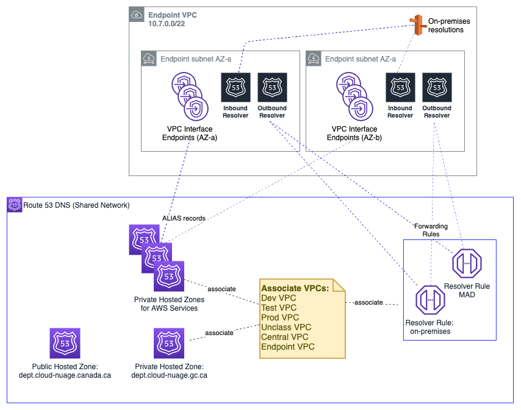
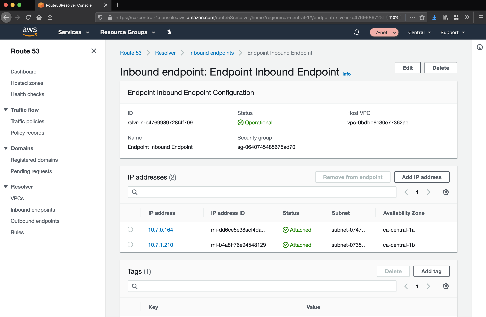

# PBMM Accelerator Architecture

## I. Introduction

The PBMM Accelerator Architecture is a comprehensive, multi-account AWS cloud architecture, designed for use within the Government of Canada for PBMM workloads. The Accelerator Architecture has been designed to address central identity and access management, governance, data security, comprehensive logging, and network design/segmentation per ITSG-33 specifications.

The Accelerator Architecture has been built with the following design principles in mind:

1. Maximize agility, scalability, and availability
2. Enable the full capability of the AWS cloud and do not artificially limit capabilities based on lowest common denominator supported capabilities of other cloud providers
4. Be adaptable to evolving technological capabilities in the underlying platform being used in the architecture
5. Allow for seamless auto-scaling and provide unbounded bandwidth as bandwidth requirements increase (or decrease) based on actual customer load (a key aspect of the value proposition of cloud computing)
6. High availability is paramount: the design stretches across two physical AWS Availability Zones (AZ), such that the loss of any one AZ does not impact application availability. The design can be easily extended to a third availability zone.


### 1.1 Purpose of Document

This document is intended to outline the technical measures that are delivered by the Accelerator Architecture that make it suitable for PBMM workloads. An explicit **non-goal** of this document is to explain the delivery architecture of the [_PBMM Accelerator_][accel_tool] tool itself, an open-source software project built by AWS.

While the central purpose of the _PBMM Accelerator_ is to establish an Accelerator Architecture into an AWS account footprint, this amounts to an implementation detail as far as the Accelerator Architecture is concerned. The Architecture is a standalone design, irrespective of how it was delivered into a customer AWS environment. It is nonetheless anticipated that most customers will choose to realize their Accelerator Architecture via the delivery mechanism of the _PBMM Accelerator_.

Comprehensive details on the tool itself are available elsewhere:

1. [PBMM Accelerator Operations & Troubleshooting Guide][ops_guide]
2. [PBMM Accelerator Developer Guide][dev_guide]

Except where absolutely necessary, this document will refrain from referencing the _PBMM Accelerator_ further.

### 1.2 Overview

The central features of the Accelerator Architecture are as follows:

* **AWS Organization with multiple-accounts:** An [AWS Organization][aws_org] is a grouping construct for a number of separate AWS accounts that are controlled by a single customer entity. This provides consolidated billing, organizational units, and facilitates the deployment of pan-Organizational guardrails such as CloudTrail logs and Service Control Policies. The separate accounts provide strong control-plane and data-plane isolation between workloads and/or environments.
* **Encryption:** AWS KMS with customer-managed CMKs is used extensively for any data stored at rest, in S3 buckets, EBS volumes, RDS encryption.
* **Service Control Policies:** [SCPs][aws_scps] provide a guardrail mechanism principally used to deny entire categories of API operations at an AWS account, OU, or Organization level. These can be used to ensure workloads are deployed only in prescribed regions, ensure only whitelisted services are used, or prevent the disablement of detective/preventative controls. Prescriptive SCPs are provided.
* **Centralized, Isolated Networking:** [Virtual Private Clouds][aws_vpc] (VPCs) are used to create data-plane isolation between workloads, centralized in a shared-network account. Connectivity to on-prem environments, internet egress, shared resources and AWS APIs are mediated at a central point of ingress/egress via the use of [Transit Gateway][aws_tgw], [Site-to-Site VPN][aws_vpn], Next-Gen Firewalls, and [AWS Direct Connect][aws_dc] (where applicable).
* **Centralized DNS Management:** [Amazon Route 53][aws_r53] is used to provide unified public and private hosted zones across the cloud environment. Inbound and Outbound Route 53 Resolvers extend this unified view of DNS to on-premises networks.
* **Comprehensive Logging:** CloudTrail logs are enabled Organization-wide to provide auditability across the cloud environment. CloudWatch Logs, for applications, as well as VPC flow logs, are centralized and deletion is prevented via SCPs.
* **Detective Security Controls:** Potential security threats are surfaced across the cloud environment via automatic deployment of detective security controls such as GuardDuty, AWS Config, and Security Hub.
* **Single-Sign-On**: AWS SSO is used to provide AD-authenticated IAM role assumption into accounts across the Organization for authorized principals.

### 1.3 Document Convention

Several conventions are used throughout this document to aid understanding.


#### AWS Account Numbers

AWS account numbers are decimal-digit pseudorandom identifiers with 12 digits (e.g. `651278770121`). This document will use the convention that an AWS master account has the account ID `123456789012`, and child accounts are given by `111111111111`, `222222222222`, etc.

For example the following ARN would refer to a VPC subnet in the `ca-central-1` region in the master account:


    arn:aws:ec2:ca-central-1:123456789012:subnet/subnet-024759b61fc305ea3

#### JSON Annotation

Throughout the document, JSON snippets may be annotated with comments (starting with `# `). The JSON language itself does not define comments as part of the specification; these must be removed prior to use in most situations, including the AWS Console and APIs.

For example:

```json
{
  "Effect": "Allow",
  "Principal": {
    "AWS": "arn:aws:iam::123456789012:root"  # Trust the master account.
  },
  "Action": "sts:AssumeRole"
}
```

The above is not valid JSON without first removing the comment on the fourth line.

#### IP Addresses

 The design makes use of [RFC1918][1918] addresses and [RFC6598][6598] for various networks; these will be labeled accordingly. Any specific range or IP shown is purely for illustration purposes only.


### 1.4 Department Naming

This document will make no reference to specific Government of Canada departments. Where naming is required (e.g. in domain names), this document will use a placeholder name as needed; e.g. `dept.gc.ca`.

### 1.5 Relationship to AWS Landing Zone
AWS Landing Zone is an AWS Solution designed to deploy multi-account cloud architectures for customers. The Accelerator Architecture draws on design patterns from Landing Zone, and re-uses several concepts and nomenclature, but it is not directly derived from it. An earlier internal release of the Accelerator Architecture presupposed the existence of an AWS Landing Zone in the Organization; this requirement has since been removed as of release `vTODO`.


## 2. Account Structure

AWS accounts are a strong isolation boundary; by default there is zero control plane or data plane access from one AWS account to another. AWS Organizations is a service that provides centralized billing across a fleet of accounts, and optionally, some integration-points for cross-account guardrails and cross-account resource sharing. The Accelerator Architecture uses these features of AWS Organizations to realize its design.

## Accounts

The Accelerator Architecture includes the following AWS accounts.

Note that the account structure is strictly a control plane concept - nothing about this structure implies anything about the network design or network flows.


### Master Account
The AWS Organization resides in the master account. This account is not used for workloads (to the full extent possible) - it functions primarily as a billing aggregator, and a gateway to the entire cloud footprint for a high-trust principal. There exists a trust relationship between child AWS accounts in the Organization and the master account; i.e. the child accounts have a role of this form:

```json
{
  "Role": {
    "Path": "/",
    "RoleName": "AWSCloudFormationStackSetExecutionRole",
    "Arn": "arn:aws:iam::111111111111:role/AWSCloudFormationStackSetExecutionRole",  # Child account.
    "AssumeRolePolicyDocument": {
      "Version": "2012-10-17",
      "Statement": [
        {
          "Effect": "Allow",
          "Principal": {
            "AWS": "arn:aws:iam::123456789012:root"  # Master account may assume this role.
          },
          "Action": "sts:AssumeRole"
        }
      ]
    }
  }
}
```

Note that this is a different role name than the default installed by AWS Organizations (`OrganizationAccountAccessRole`).


#### AWS SSO
AWS SSO resides in the master account in the organization, due to a current requirement of the AWS SSO service. This service deploys IAM roles into the accounts in the Organization.

TODO(Dave): more details on SSO


#### Organizational Units
Underneath the root of the Organization, Organizational Units (OUs) provide an optional mechanism for grouping accounts into logical collections. Aside from the benefit of the grouping itself, these collections serve as the attachment points for SCPs (preventative API-blocking controls), and Resource Access Manager sharing (cross-account resource sharing).


Example use cases are as follows:


* An SCP is attached to the core OU to prevent the deletion of Transit Gateway resources in the associated accounts.
* The shared network account uses RAM sharing to share the development line-of-business VPC with a development OU. This makes the VPC available to a functional account in that OU used by developers, despite residing logically in the shared network account.

OUs may be nested (to a total depth of five), with SCPs and RAM sharing applied at the desired level. A typical Accelerator Architecture environment will have the following OUs:

##### Core OU
This OU houses all administrative accounts, such as the core landing zone accounts. No application accounts or application workloads are intended to exist within this OU. This OU also contains the centralized networking infrastructure in the `SharedNetwork` account.


##### Central OU
This OU houses accounts containing centralized resources, such as a shared AWS Directory Service (Microsoft AD) instance. Other shared resources such as software development tooling (source control, testing infrastructure), or asset repositories should be created in this OU.

##### Functional OU: Sandbox
This OU contains a set of Sandbox accounts used by development teams for proof of concept / prototyping work. These accounts are isolated at a network level and are not connected to the VPCs hosting development, test and production workloads. These accounts have direct internet access via an internet gateway (IGW). They do not route through the Perimeter Security services VPC for internet access.

##### Functional OU: UnClass
Accounts in this OU host unclassified application solutions. These accounts have internet access via the Perimeter firewall. This is an appropriate place to do cross-account unclassified collaboration with other departments or entities, or test services that are not available in the Canadian region.

##### Functional OU: Dev
Accounts in this OU host development tools and line of business application solutions that are part of approved releases and projects. These accounts have internet access via the Perimeter firewall.

##### Functional OU: Test
Accounts in this OU host test tools and line of business application solutions that are part of approved releases and projects. These accounts have internet access via the Perimeter firewall.

##### Functional OU: Prod
Accounts in this OU host production tools and line of business application solutions that are part of approved releases and projects. These accounts have internet access via the Perimeter firewall. Accounts in this OU are locked down with only specific Operations and Security personnel having access.

##### Suspended OU
A suspended OU is created to act as a container for end-of-life accounts or accounts with suspected credential leakage. The `DenyAll` SCP is applied, which prevents all control-plane API operations from taking place by any account principal.

### Mandatory Accounts
The Accelerator Architecture is an opinionated design, which partly manifests in the accounts that are deemed mandatory within the Organization. The following accounts are assumed to exist, and each has an important function with respect to the goals of the overall Architecture (mandatory in red)


#### Master
As discussed above, the master account functions as the root of the AWS Organization, the billing aggregator, attachment point for SCPs. Workloads are not intended to run in this account.

**Note:** Customers deploying the Accelerator Architecture via the PBMM Accelerator tool will deploy into this account. See the [Operations Guide][ops_guide] for more details.

#### Perimeter
The perimeter account, and in particular the perimeter VPC therein, functions as the single point of ingress/egress from the PBMM cloud environment to the public internet and/or on-premises network. This provides a central point of network control through which all workload-generated traffic, ingress and egress, must transit. The perimeter VPC hosts next-generation firewall instances that provide security services such as virus scanning, malware protection, intrusion protection, TLS inspection, and web application firewall functionality. More details on can be found in the Networking section of this document.

#### Shared Network
The shared network account hosts the vast majority of the AWS-side of the networking resources throughout the Architecture. Workload-scoped VPCs (`Dev`, `Test`, `Prod`, etc) are defined here, and shared via RAM sharing to the respective OUs in the Organization. A Transit Gateway provides connectivity from the workloads to the internet or on-prem, without permitting cross-environment (AKA "East:West traffic") traffic (e.g. there is no Transit Gateway route from the `Dev` VPC to the `Prod` VPC). More details on can be found in the Networking section of this document.

#### Operations
The operations account provides a central location for the cloud team to provide cloud operation services to other AWS accounts within the Organization; for example CICD, developer tooling, and a managed Active Directory installation.


#### Log Archive
The log archive account is provide a central aggregation and secure storage point for all audit logs created within the AWS Organization. This account contains a centralized location for copies of every account’s Audit and Configuration compliance logs. It also provides a storage location for any other audit/compliance logs, as well as application/OS logs.

The AWS CloudTrail service provides a full audit history of all actions taken against AWS services, including users logging into accounts. We recommend access to this account be restricted to auditors or security teams for compliance and forensic investigations related to account activity. Additional CloudTrail trails for operational use can be created in each account.


#### Security
The security account is restricted to authorized security and compliance personnel, and related security or audit tools. This is an aggregation point for security services, including AWS Security Hub, and serves as the master for Amazon Guard Duty. A trust relationship with a readonly permission policy exists between every Organization account and the security account for audit and compliance purposes.


### Functional Accounts

Functional accounts are created on demand, and placed into an appropriate OU in the Organization structure. The purpose of functional accounts is to provide a secure and managed environment where project teams can use AWS resources. They provide an isolated control plane so that the actions of one team in one account cannot inadvertently affect the work of other teams in other accounts.

Functional accounts will gain access to the RAM shared resources of their respective parent OU. Accounts created for `systemA` and `systemB` in the `Dev` OU would have control plane isolation from each other; however these would both have access to the `Dev` VPC (shared from the `SharedNetwork` account).

Data plane isolation within the same VPC is achieved by default, by using appropriate security groups whenever ingress is warranted. For example, the app tier of `systemA` should only permit ingress from the `systemA-web` security group, not an overly broad range such as `0.0.0.0/0`, or even the VPC range.

## 3. Networking

### Overview
The Accelerator Architecture networking is built on a principle of centralized on-premises and Internet ingress/egress, while enforcing data plane isolation between workloads in different environments. Connectivity to on-prem environments, internet egress, shared resources and AWS APIs are mediated at a central point of ingress/egress via the use of a [Transit Gateway][aws_tgw]. Consider the following overall network diagram:


All functional accounts use RAM-shared networking infrastructure as depicted above. The workload VPCs (Dev, Test, Prod, etc) are hosted in the Shared Network account and made available to the appropriate OU in the Organization.

### Perimeter
The perimeter VPC hosts the Organization's perimeter security services. The Perimeter VPC is used to control the flow of traffic between AWS Accounts and external networks: both public and private via GC CAP and GC TIP. This VPC hosts Next Generation Firewalls (NGFW) that provide perimeter security services including virus scanning / malware protection, Intrusion Protection services, TLS Inspection and Web Application Firewall protection. If applicable, this VPC also hosts reverse proxy servers.

The Architecture recommends that the perimeter VPC have a primary range in the [RFC1918][1918] block (e.g. `10.7.4.0/22`) for the detonation subnet, and a secondary range in the [RFC6598][6598] block (e.g. `100.96.250.0/23`) used for the overlay network (NGFW devices inside VPN tunnel) for all other subnets. This secondary range is assigned by an external entity (e.g. Shared Services Canada).


This VPC has four subnets per AZ, each of which hosts a port used by the NGFW devices, which are deployed in an HA pair. The purpose of these subnets is as follows.

* **Detonation**: This is an unused subnet reserved for future use with malware detonation capabilities of the NGFW devices.
    * e.g. `10.7.4.0/24` - not routable except local.
* **Proxy**: This subnet hosts reverse proxy services for web and other protocols. It also contains the [three interface endpoints][ssm_endpoints] necessary for AWS Systems Manager Session Manager, which enables SSH-less CLI access to authorized and authenticated principals in the perimeter account.
    * e.g. `100.96.251.64/26`
* **On-Premises**: This subnet hosts the private interfaces of the firewalls, corresponding to connections from the on-premises network.
    * e.g. `100.96.250.192/26`
* **FW-Management**: This subnet is used to host management tools and the management of the Firewalls itself.
    * e.g. `100.96.251.160/27` - a smaller subnet is permissible due to modest IP requirements for management instances.
* **Public**: This subnet is the public-access zone for the perimeter VPC. It hosts the public interface of the firewalls, as well as application load balancers that are used to balance traffic across the firewall pair. There is one Elastic IPv4 address per public subnet that corresponds to the IPSec Customer Gateway (CGW) for the VPN connection into the Transit Gateway in Shared Networking.
    * e.g. `100.96.250.0/26`

Outbound internet connections (for software updates, etc.) can be initiated from within the workload VPCs, and use the transparent proxy feature of the next-gen Firewalls.

### Shared Network
The shared network account, and the AWS networking resources therein, form the core of the cloud networking infrastructure across the account structure. Rather than the individual accounts define their own networks, these are instead centralized here and shared out to the relevant OUs. Principals in a Dev OU will have access to a Dev VPC, Test OU will have access to a Test VPC and so on - all of which are owned by this account.

You can share AWS Transit Gateways, Subnets, AWS License Manager configurations, and Amazon Route 53 Resolver rules resources with AWS Resource Access Manager (RAM). The RAM service eliminates the need to create duplicate resources in multiple accounts, reducing the operational overhead of managing those resources in every single account.

#### Transit Gateway
The Transit Gateway is a central hub that performs several core functions within the Shared Network account.

1. Routing of permitted flows; for example a Workload to On-premises via the Perimeter VPC.
    * All routing tables in SharedNetwork VPCs send `0.0.0.0/0` traffic to the TGW, where its handling will be determined by the TGW Route Table (TGW-RT) that its attachment is associated with. For example:
        * an HTTP request to `registry.hub.docker.com` from the Test VPC will go to the TGW
        * The Segregated TGW RT will direct that traffic to the Perimeter VPC via the IPsec VPNs
        * The request will be proxied to the internet, via GC-CAP if appropriate
        * The return traffic will again transit the IPsec VPNs
        * The `10.3.0.0/16` bound response traffic will arrive at the Core TGW RT, where a propagation in that TGW RT will direct the response back to the Test VPC.
2. Defining separate routing domains that prohibit undesired east-west flows at the network level; for example, by prohibiting Dev to Prod traffic. For example:
    * All routing tables in SharedNetwork VPCs send `0.0.0.0/0` traffic to the TGW, which defines where the next permissible hop is. For example, `10.2.0.0/16` Dev traffic destined for the `10.0.4.0/16` Prod VPC will be blocked by the blackhole route in the Segregated TGW RT.
3. Enabling centralization of shared resources; namely a shared Microsoft AD installation in the Central VPC, and access to shared VPC Endpoints in the Endpoint VPC.
    * The Central VPC, and the Endpoint VPC are routable from Workload VPCs. This provides an economical way to share Organization wide resources that are nonetheless isolated into their own VPCs. For example:
        * a `git` request in the `Dev` VPC to `git.private-domain.ca` resolves to a `10.1.0.0/16` address in the `Central` VPC.
        * The request from the `Dev` VPC will go to the TGW due to the VPC routing table associated with that subnet
        * The TGW will send the request to the `Central` VPC via an entry in the Segregated TGW RT
        * The `git` response will go to the TGW due to the VPC routing table associated with that subnet
        * The Shared TGW RT will direct the response back to the `Dev` VPC

The four TGW RTs exist to serve the following main functions:

* **Segregated TGW RT**: Used as the association table for the workload VPCs; prevents  east-west traffic, except to shared resources.
* **Core TGW RT**: Used for internet/on-premises response traffic, and Endpoint VPC egress.
* **Shared TGW RT**: Used to provide `Central` VPC access east-west for the purposes of response traffic to shared workloads
* **Standalone TGW RT**: Reserved for future use. Prevents TGW routing except to the Endpoint VPC.

#### Endpoint VPC

DNS functionality for the network architecture is centralized in the Endpoint VPC. It is recommended that the Endpoint VPC use a [RFC1918][1918] range - e.g. `10.7.0.0/22` with sufficient capacity to support 60+ AWS services and future endpoint expansion, and inbound and outbound resolvers (all figures per AZ).



#### Endpoint VPC: Interface Endpoints

The endpoint VPC hosts VPC Interface Endpoints (VPCEs) and associated Route 53 private hosted zones for all applicable services in the `ca-central-1` region. This permits traffic destined for an eligible AWS service; for example SQS, to remain entirely within the SharedNetwork account rather than transiting via the IPv4 public endpoint for the service:


From within an associated workload VPC such as `Dev`, the service endpoint (e.g. `sqs.ca-central-1.amazonaws.com`) will resolve to an IP in the `Endpoint` VPC:

```bash
sh-4.2$ nslookup sqs.ca-central-1.amazonaws.com
Server:         10.2.0.2                  # Dev VPC's .2 resolver.
Address:        10.2.0.2#53

Non-authoritative answer:
Name:   sqs.ca-central-1.amazonaws.com
Address: 10.7.1.190                       # IP in Endpoint VPC - AZ-a.
Name:   sqs.ca-central-1.amazonaws.com
Address: 10.7.0.135                       # IP in Endpoint VPC - AZ-b.
```

This cross-VPC resolution of the service-specific private hosted zone functions via the association of each VPC to each private hosted zone, as depicted above.

#### Endpoint VPC: Hybrid DNS

The Endpoint also VPC hosts the common DNS infrastructure used to resolve DNS queries:

* within the cloud
* from the cloud to on-premises
* from on-premises to the cloud


##### Within The Cloud
In-cloud DNS resolution applies beyond the DNS infrastructure that is put in place to support the Interface Endpoints for the AWS services in-region. Other DNS zones, associated with the Endpoint VPC, are resolvable the same way via an association to workload VPCs.

##### From Cloud to On-Premises
DNS Resolution from the cloud to on-premises is handled via the use of a Route 53 Outbound Endpoint, deployed in the Endpoint VPC, with an associated Resolver rule that fowards DNS traffic to the outbound endpoint. Each VPC is associated to this rule.


##### From On-Premises to Cloud
Conditional forwarding from on-premises networks is made possible via the use of a Route 53 Inbound Endpoint. On-prem networks send resolution requests for relevant domains to the endpoints deployed in the Endpoint VPC:




#### Workload VPCs
The workload VPCs are where line of business applications ultimately reside, segmented by environment (`Dev`, `Test`, `Prod`, etc). It is recommended that the Workload VPC use a [RFC1918][1918] range (e.g. `10.2.0.0/16` for `Dev`, `10.3.0.0/16` for `Test`, etc).


Note that security groups are recommended as the primary data-plane isolation mechanism between applications that may coexist in the same VPC. It is anticipated that unrelated applications would coexist in their respective tiers without ever permitting east-west traffic flows.

The following subnets are defined by the Architecture:

* **TGW subnet**: This subnet hosts the elastic-network interfaces for the TGW attachment. A `/27` subnet is sufficient.
* **Web subnet**: This subnet hosts front-end or otherwise 'client' facing infrastructure. A `/20` or larger subnet is recommended to facilitate auto-scaling.
* **App subnet**: This subnet hosts app-tier code (EC2, containers, etc). A `/19` or larger subnet is recommended to facilitate auto-scaling.
* **Data subnet**:  This subnet hosts data-tier code (RDS instances, ElastiCache instances). A `/21` or larger subnet is recommended.
* **Mgmt subnet**: This subnet hosts bastion or other management instances. A `/21` or larger subnet is recommended.

Gateway Endpoints for relevant services (Amazon S3, Amazon DynamoDB) are installed in the route tables of all Workload VPCs.


##### Security Groups
Security Groups are instance level firewalls, and represent a foundational unit of network segmentation across AWS networking. Security groups are stateful, and support ingress/egress rules based on protocols and source/destinations. While CIDR ranges are supported by the latter, it is preferable to instead use other security groups as source/destinations. This permits a higher level of expressiveness that is not coupled to particular CIDR choices and works well with autoscaling; e.g.

>  "permit port 3306 traffic from the `App` tier to the `Data` tier"

versus

> "permit port 3306 traffic from `10.0.1.0/24`  to `10.0.2.0/24`.

Note that in practice, egress rules are generally used in 'allow all' mode, with the focus primarily being on whitelisting certain ingress traffic.

##### NACLs
Network Access-Control Lists (NACLs) are used sparingly as a defense-in-depth measure. Given that each network flow requires potentially four NACL entries (egress from ephemeral, ingress to destination, egress from destination, ingress to ephemeral), the marginal security value of exhaustive NACL use is generally not worth the administrative complexity. The architecture recommends NACLs as a segmentation mechanism for `Data` subnets; i.e. `DENY` all inbound traffic to such a subnet except that which originates in the `App` subnet for the same VPC.


#### Central VPC
The Central VPC is a network for localizing operational infrastructure that may be needed across the Organization, such as code repositories, artifact repositories, and notably, the managed Directory Service (Microsoft AD). Instances that are domain joined will connect to this AD domain - a network flow that is made possible from anywhere in the network structure due to the inclusion of the Central VPC in all relevant association TGW RTs.

It is recommended that the Central VPC use a [RFC1918][1918] range (e.g. `10.1.0.0/16`) for the purposes of routing from the workload VPCs, and a secondary range from the [RFC6598][6598] block (e.g. 100.96.252.0/23) to support the Microsoft AD workload.

Note that this VPC also contains a peering relationship to the `ForSSO` VPC in the master account. This exists purely to support connectivity from an AD-Connector instance in the master account, which in turn enables AWS SSO for federated login to the AWS control plane.


#### Sandbox VPC
A sandbox VPC, not depicted, may be included in the architecture. This is **not** connected to the Transit Gateway, Perimeter VPC, on-premises network, or other common infrastructure. It contains its own Internet Gateway, and is an entirely separate VPC with respect to the rest of the architecture.

The sandbox VPC should be used exclusively for time-limited experimentation, particularly with out-of-region services, and never used for any line of business workload or data.

## 4. Authorization and Authentication
The Accelerator Architecture makes extensive use of AWS authorization and authentication primitives from the Identity and Access Management (IAM) service as a means to enforce the guardrailing objectives of the architecture.

### Relationship Between Accounts

AWS accounts, as a default position, are entirely self-contained with respect to IAM principals - their Users, Roles, Groups therein. Having access to one AWS account, even with Administrator privileges, does not imply any access to another, even within the same Organization or OU. There is one notable exception to this statement: the master account of the Organization. Accounts created by AWS Organizations deploy a default role with a trust policy back to the master:

```json
{
  "Role": {
    "Path": "/",
    "RoleName": "OrganizationAccountAccessRole",
    "Arn": "arn:aws:iam::111111111111:role/OrganizationAccountAccessRole",  # Child account.
    "AssumeRolePolicyDocument": {
      "Version": "2012-10-17",
      "Statement": [
        {
          "Effect": "Allow",
          "Principal": {
            "AWS": "arn:aws:iam::123456789012:root"  # Master account may assume this role.
          },
          "Action": "sts:AssumeRole"
        }
      ]
    }
  }
}
```

The Accelerator Architecture replaces this role with another,

 have an entirely separate control plane

Although the control  As discussed in section (2) the Organization master account acts as a gateway to the


## 5. Logging and Monitoring


[ops_guide]: https://TODO
[dev_guide]: https://TODO
[accel_tool]: https://github.com/aws-samples/aws-pbmm-accelerator
[aws_org]: https://aws.amazon.com/organizations/
[aws_scps]: https://docs.aws.amazon.com/organizations/latest/userguide/orgs_manage_policies_type-auth.html#orgs_manage_policies_scp
[aws_vpn]: https://aws.amazon.com/TODO
[aws_dc]: https://aws.amazon.com/TODO
[aws_vpc]: https://aws.amazon.com/TODO
[aws_tgw]: https://aws.amazon.com/TODO
[aws_r53]: https://aws.amazon.com/route53/
[ssm_endpoints]: https://aws.amazon.com/premiumsupport/knowledge-center/ec2-systems-manager-vpc-endpoints/
[1918]: https://tools.ietf.org/html/rfc1918
[6598]: https://tools.ietf.org/html/rfc6598