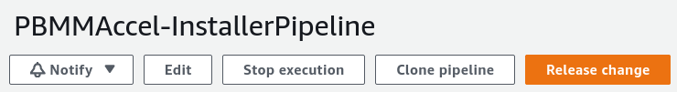
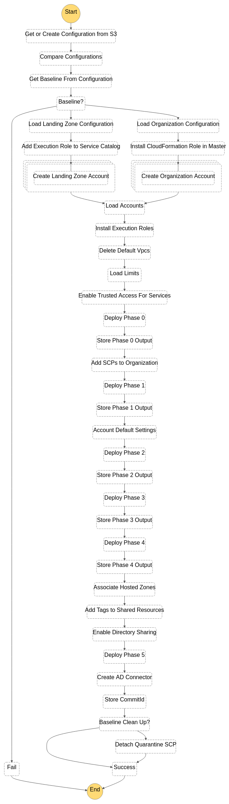

# Operations & Troubleshooting Guide

## System Overview

### Accelerator Installer

The installer stack contains the necessary resources to deploy the Accelerator in the AWS account.

It consists of the following resources:

- `PBMMAccel-InstallerPipeline`: this is a `AWS::CodePipeline::Pipeline` that pulls the latest Accelerator code from
  GitHub. It launches the CodeBuild project `PBMMAccel-InstallerProject_pl` and launches the Accelerator state machine.
- `PBMMAccel-InstallerProject_pl`: this is a `AWS::CodeBuild::Project` that installs the Accelerator in AWS account.
- `PBMMAccel-Installer-StartExecution`: this is a `AWS::Lambda::Function` that launches the Accelerator after
  CodeBuild deploys the Accelerator.

The `PBMMAccel-InstallerPipeline` starts when first installed using the CloudFormation template. The pipeline also runs
after every GitHub update for the configured branch. The administrator can also start the pipeline manually by clicking
the `Release Change` button in the AWS Console.

After pulling the source from GitHub the pipeline needs manual approval from the administrator to continue deploying
the Accelerator in the AWS account.

After the administrator approves the change, the `PBMMAccel-InstallerProject_pl` CodeBuild project starts. The CodeBuild
project uses the GitHub source artifact. The CodeBuild projects spins up a new Linux instances and installs the
Accelerator dependencies and starts the deployment of the Accelerator using the AWS Cloud Development Kit (CDK[1](#cdk)).

CDK bootstraps its environment and creates the `CDKToolkit` stack in the AWS account. It creates the S3 bucket `cdktoolkit-stagingbucket-*`
and the ECR repository `aws-cdk/assets`.

CDK copies assets to the bootstrap bucket and bootstrap repository that are used by the Accelerator. The assets that are
stored on S3 include default IAM policies, default SCPs, default firewall configuration. The assets that are pushed to ECR
include the Accelerator Docker build image. This Docker image is responsible for deploying Accelerator resources using the CDK.

CDK finally deploys the Accelerator stack, or Initial Setup stack, and launches the Accelerator state machine. The
Accelerator state machine is described in the next section.

### Accelerator

*a.k.a "Initial Setup"*

The Accelerator consists of a state machine that executes various steps to create Accelerator resources in your AWS
organization. You can find the latest steps in the state machine in the image below.

The state machine contains three types of steps:

1. steps that execute a Lambda function;
2. steps that start another state machine, e.g. `Create Accounts` step;
3. steps that start a CodeBuild project, e.g. the `Phase {0,1,2,3,4,5}` steps.

State Machine
  - `Get or Create Configuration from S3`
  - `Compare Configurations`
  - `Load Configuration`

State Machines
  - Main State Machine
  - Create Account
  - Create AD Connector
  - Install Execution Roles
  - Start CodeBuild Project
Lambda functions backing the steps in the Main State Machine
  - ...
CodeBuild step to run CDK deploy
  - AWS::CodeBuild::Project PBMMAccel-DeployPrebuilt
Secrets
  - accelerator/accounts
  - accelerator/outputs
  - accelerator/limits
Roles
  - PBMMAccel-L-SFN-MasterRole

### Phases

## Troubleshooting

<a name="cdk">[1]</a>: https://docs.aws.amazon.com/cdk/latest/guide/home.html
