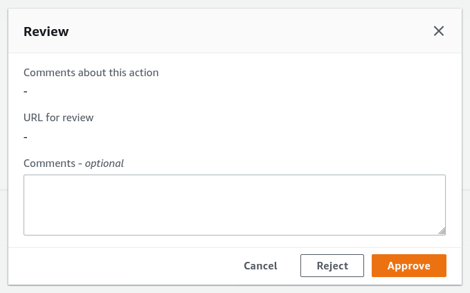

# Operations & Troubleshooting Guide

## System Overview

**TODO**(ggindera): Diagram showing the complete system overview

AWS Landing Zone (ALZ)

### Accelerator Installer

The installer stack contains the necessary resources to deploy the Accelerator in an AWS account. This AWS account will be referred to as the 'master' account in this document.

It consists of the following resources:

- `PBMMAccel-InstallerPipeline`: this is a `AWS::CodePipeline::Pipeline` that pulls the latest Accelerator code from
  GitHub. It launches the CodeBuild project `PBMMAccel-InstallerProject_pl` and launches the Accelerator state machine.
- `PBMMAccel-InstallerProject_pl`: this is a `AWS::CodeBuild::Project` that installs the Accelerator in AWS account.
- `PBMMAccel-Installer-StartExecution`: this is a `AWS::Lambda::Function` that launches the Accelerator after
  CodeBuild deploys the Accelerator.

The `PBMMAccel-InstallerPipeline` starts when first installed using the CloudFormation template. The pipeline also runs after every GitHub update for the configured branch. The administrator can also start the pipeline manually by clicking the `Release Change` button in the AWS Console.

After pulling the source from GitHub the pipeline needs manual approval from the administrator to continue deploying the Accelerator in the AWS account.

After the administrator approves the change, the `PBMMAccel-InstallerProject_pl` CodeBuild project starts. The CodeBuild project uses the GitHub source artifact. The CodeBuild projects spins up a new Linux instances and installs the Accelerator dependencies and starts the deployment of the Accelerator using the AWS Cloud Development Kit (CDK[1](#cdk)).

CDK bootstraps its environment and creates the `CDKToolkit` stack in the AWS account. It creates the S3 bucket `cdktoolkit-stagingbucket-*` and the ECR repository `aws-cdk/assets`.

CDK copies assets to the bootstrap bucket and bootstrap repository that are used by the Accelerator. The assets that are stored on S3 include default IAM policies, default SCPs, default firewall configuration. The assets that are pushed to ECR include the Accelerator Docker build image. This Docker image is responsible for deploying Accelerator resources using the CDK.

CDK finally deploys the Accelerator stack, or Initial Setup stack, and launches the Accelerator state machine. The Accelerator state machine is described in the next section.

### Accelerator

_a.k.a "Initial Setup"_

The Accelerator stack, named `PBMMAccel-InitialSetup`, consists of a state machine that executes various steps to create Accelerator resources in your AWS organization.

The stack additionally consists of the following resources:

**TODO**(ggindera): Describe all resources in the `PBMMAccel-InitialSetup` stack.

- AWS::CodeBuild::Project
  - `PipelineCdkDeploy9603AB0D`
- AWS::IAM::Policy
  - `PipelineRoleDefaultPolicyC7A05455`
  - `PipelinePBMMAccelInstallCloudFormationExecutionRoleMastersmRoleDefaultPolicy13BF73B9`
  - `PipelinePBMMAccelInstallRolessmRoleDefaultPolicy964DA86C`
  - `PipelineDeleteDefaultVpcsSfnRoleDefaultPolicy335F7958`
  - `PipelinePBMMAccelCodeBuildsmRoleDefaultPolicyF05B4B60`
  - `PipelineCreateConfigRecorderSfnRoleDefaultPolicy4E9A1EA7`
  - `PipelineStateMachineRoleDefaultPolicy24D0EC77`
  - `PBMMAccelALZCreateAccountsmRoleDefaultPolicy27034798`
  - `PBMMAccelOrgCreateAccountsmRoleDefaultPolicy768D01A0`
  - `CreateAdConnectorStateMachineRoleDefaultPolicy387FD63`
- AWS::IAM::Role
  - `PipelineRoleD68726F7`
  - `PipelinePBMMAccelInstallCloudFormationExecutionRoleMastersmRoleE45008CF`
  - `PipelinePBMMAccelInstallRolessmRole05505FBD`
  - `PipelineDeleteDefaultVpcsSfnRole8F3DE028`
  - `PipelinePBMMAccelCodeBuildsmRoleEBDDD6AA`
  - `PipelineCreateConfigRecorderSfnRole32854AF7`
  - `PipelineStateMachineRole61BEBDFF`
  - `PBMMAccelALZCreateAccountsmRole56EC6522`
  - `PBMMAccelOrgCreateAccountsmRole26E7C18E`
  - `CreateAdConnectorStateMachineRole09ED397`
- AWS::Lambda::Function
  - `PipelineGetorCreateConfigurationfromS3HandlerD6C37838`
  - `PipelineCompareConfigurationsHandlerF832CED4`
  - `PipelineGetBaselineFromConfigurationHandler6ABE854F`
  - `PipelineLoadLandingZoneConfigurationHandler0CE0E932`
  - `PipelineLoadOrganizationConfigurationHandler9B6789A9`
  - `PipelineAddExecutionRoletoServiceCatalogHandler0D5B7B71`
  - `PipelineLoadOrganizationalUnitsHandlerD5ECBCAF`
  - `PipelineLoadAccountsHandlerA56D6821`
  - `PipelineDeployHandler654D8D26`
  - `PipelineVerifyHandler9903FB4E`
  - `PipelineStartStackSetCreationHandlerEEC951EC`
  - `PipelineVerifyStackSetCreationHandler0DB4299B`
  - `PipelineStartStackSetInstanceCreationHandler109CE627`
  - `PipelineVerifyStackSetInstancesCreationHandler5024B8E1`
  - `PipelineStartStackSetInstanceUpdateHandler90889CA2`
  - `PipelineVerifyStackSetInstancesUpdateHandler92946670`
  - `PipelineStartStackSetInstanceDeletionHandler79238751`
  - `PipelineVerifyStackSetInstancesDeletionHandler1FA210B7`
  - `PipelineDeleteDefaultVPCHandler4B0726A4`
  - `PipelineDeleteDefaultVPCVerifyHandler0CBFEDFB`
  - `PipelineLoadLimitsHandlerCD5668AB`
  - `PipelineOUValidationHandler9FAD90E1`
  - `PipelineAddSCPstoOrganizationHandler7947D3D9`
  - `PipelineDetachQuarantineSCPHandler8A457FE9`
  - `PipelineEnableTrustedAccessForServicesHandlerEF04DC80`
  - `PipelineStartBuildHandlerED7B28EC`
  - `PipelineVerifyBuildStatusHandler60D0322A`
  - `PipelineStorePhase0OutputHandlerE000DCB0`
  - `PipelineStorePhase1OutputHandlerA0CE5D9C`
  - `PipelineStorePhase2OutputHandlerAA94C2DF`
  - `PipelineStorePhase3OutputHandler6A6214FE`
  - `PipelineStorePhase4OutputHandlerD0CB959B`
  - `PipelineCreateConfigRecorderHandler7C4AADC7`
  - `PipelineCreateConfigRecorderVerifyHandler3278C2EF`
  - `PipelineAccountDefaultSettingsHandler07805DCC`
  - `PipelineVerifyFilesHandler94297FAB`
  - `PipelineAssociateHostedZonesHandler80E4D9D7`
  - `PipelineAddTagstoSharedResourcesHandler0E760D29`
  - `PipelineEnableDirectorySharingHandler9B561AC0`
  - `PipelineStoreCommitIdHandlerBC796F0D`
  - `StartLandingZoneAccountCreationHandler5F256B57`
  - `VerifyALZAccountCreationHandler2F3CF42F`
  - `StartAccountCreationHandler0DEE7DD4`
  - `VerifyAccountCreationHandler805A0D9C`
  - `AttachQuarantineSCPToAccountHandler33BA748E`
  - `MoveAccounttoOrganizationalUnitHandler2FD2DD12`
  - `StartADConnectorCreationHandlerCC7CABF7`
  - `VerifyAdConnectorCreationHandler5E6246E7`
- AWS::SecretsManager::Secret
  - `PipelineAccounts6F731F1B`
  - `PipelineStackOutput2E5FAB66`
  - `PipelineLimits17A3164F`
  - `PipelineOrganizations9C07D3D8`
- AWS::StepFunctions::StateMachine
  - `PipelinePBMMAccelInstallCloudFormationExecutionRoleMastersm89F5ED94`
  - `PipelinePBMMAccelInstallRolessmDB4160B8`
  - `PipelineDeleteDefaultVpcsSfn8AB641BA`
  - `PipelinePBMMAccelCodeBuildsmE7A2602F`
  - `PipelineCreateConfigRecorderSfnE7EF6172`
  - `PipelineStateMachine1814BD05`
  - `PBMMAccelALZCreateAccountsm507818BA`
  - `PBMMAccelOrgCreateAccountsmD1394A74`
  - `CreateAdConnectorStateMachineC04DDC61`
- IAM
  - PBMMAccel-L-SFN-MasterRole
- Step Functions
  - Main State Machine
  - Create Account
  - Create AD Connector
  - Install Execution Roles
  - Start CodeBuild Project
- Lambda
  - Lambda functions backing the steps in the Main State Machine
  - ...
- CodeBuild
  - CodeBuild step to run CDK deploy
  - AWS::CodeBuild::Project PBMMAccel-DeployPrebuilt
- Secrets Manager
  - accelerator/accounts
  - accelerator/outputs
  - accelerator/limits

You can find the steps in the state machine in the image below.

The state machine contains three types of steps:

1. steps that execute a Lambda function;
2. steps that start another state machine, e.g. `Create Accounts` step;
3. steps that start another state machine that starts a CodeBuild project, e.g. the `Phase {0,1,2,3,4,5}` steps.

#### Get or Create Configuration from S3

This step is a Lambda function that finds or creates the configuration repository. Finds the configuration file in the repository. If the configuration file cannot be found in the repository it is copied from the customer's configuration bucket. If the copy is successful then the configuration file in the S3 bucket will be removed.

The configuration file is parsed and validated. This step will fail if the configuration file is not valid JSON or does not adhere to the configuration file specification.

#### Compare Configurations

This step is a Lambda function that compares the previous version of the configuration file with the current version of the configuration file. The previous configuration file version is stored in the secret `accelerator/config/last-successful-commit` in AWS Secrets Manager in the master account.

The following configuration file changes are not allowed:

- changing ALZ baseline;
- changing master account or region;
- changing central log services account or region;
- changing the organizational unit, name or email address of an account;
- removing an account;
- changing the name, CIDR or region of a VPC;
- disabling a VPC;
- changing the name, availability zone, CIDR of a subnet;
- disabling a subnet;
- removing a subnet;
- changing the name, ASN, region or features of a transit gateway;
- changing the ID, VPC, subnet, region, size, DNS, Netbios of a Managed Active Directory;
- disabling a Managed Active Directory;
- changing the ASN of a virtual private gateway;
- changing the sharing to accounts of a VPC;
- changing the NACLs of a subnet.

**TODO**(ggindera): It is possible to ignore certain configuration file changes.

    {
      'ov-global-options': true,
      'ov-del-accts': true,
      'ov-ren-accts': true,
      'ov-acct-email': true,
      'ov-acct-ou': true,
      'ov-acct-vpc': true,
      'ov-acct-subnet': true,
      'ov-tgw': true,
      'ov-mad': true,
      'ov-ou-vpc': true,
      'ov-ou-subnet': true,
      'ov-share-to-ou': true,
      'ov-share-to-accounts': true,
      'ov-nacl': true
    }

#### Get Baseline from Configuration

This step is a Lambda function that gets the `alz-baseline` of the configuration file to decide which path in the state machine will be taken.

#### Load Landing Zone Configuration

_Executed only when using AWS Landing Zone baseline_

This step is a Lambda function that validates the ALZ deployment and configuration.

This step fails when

- an existing ALZ deployment in the master account can not be found;
- an organizational unit that is used by ALZ or the Accelerator can not be found;
- an account is present in the Accelerator configuration but does not exist in AWS Organizations;
- an account has a name, email address or organizational unit that is different from the ALZ configuration;
- an account has a name, email address or organizational unit that is different from the Accelerator configuration;
- the organizational units in the ALZ configuration are different from the ones in AWS Organizations;
- the account type of ALZ configuration accounts can not be detected;
- the accounts of type `primary`', `security`, `log-archive`, `shared-services` are missing from the ALZ configuration.

#### Add Execution Role to Service Catalog

_Executed only when using AWS Landing Zone baseline_

This step is a Lambda function that adds the state machine's IAM role to the ALZ Account Vending Machine (AVM) service catalog portfolio.

#### Create Landing Zone Account

_Executed only when using AWS Landing Zone baseline_

This step starts the `PBMMAccel-ALZCreateAccount_sm` state machine. This state machine is responsible for creating an account using the AVM and waits for the account to be created and configured.

#### Load Organization Configuration

This step is a Lambda function that validates the Accelerator deployment and configuration.

This step fails when

- an organizational unit that is used by the Accelerator can not be found;
- an account is present in the Accelerator configuration but does not exist in AWS Organizations;
- an account has a name, email address or organizational unit that is different from the Accelerator configuration.

_Executed only when using AWS Organizations baseline_

#### Install CloudFormation Role in Master

_Executed only when using AWS Organizations baseline_

This step starts the `PBMMAccel-InstallCfnRoleMaster_sm` state machine. This state machine is responsible for creating the IAM role `AWSCloudFormationStackSetAdministrationRole` in the master account. You can read more about why this role is created [here](https://docs.aws.amazon.com/AWSCloudFormation/latest/UserGuide/stacksets-prereqs.html).

#### Create Organization Account

_Executed only when using AWS Organizations baseline_

This step starts the `PBMMAccel-OrgCreateAccount_sm` state machine. This state machine is responsible for creating an account using the AWS Organizations and waits for the account to be created and configured. The newly created account will be moved to the correct organizational unit and will have an the `PBMMAccel-Quarantine-New-Object` Service Control Policy (SCP) attached to it. The SCP will only be removed after the Accelerator state machine has completed.

**TODO**(bmycroft): Explain why the SCP is attached.

#### Load Accounts

This step is a Lambda function that loads all accounts and organizational units. The accounts and organizational units are stored in the secret `accelerator/accounts` and `accelerator/organizations` in AWS Secrets Manager in the master account. The accounts and organizational units will later be used to deploy stacks in the correct accounts.

#### Install Execution Roles

This step is a Lambda function that creates stack sets in all Accelerator accounts. This stack sets contains a single resource, i.e. an IAM role `PBMMAccel-PipelineRole` that can be assumed by the `PBMMAccel-L-SFN-MasterRole`. This IAM role allows the master account to administer the Accelerator accounts.

#### Delete Default VPCs

This step is a Lambda function that ...

#### Load Limits

This step is a Lambda function that ...

#### Enable Trusted Access for Services

This step is a Lambda function that ...

#### Deploy Phase 0

#### Store Phase 0 Output

This step is a Lambda function that stores the outputs from the deployed stacks in subaccounts in the secret `accelerator/outputs` in AWS Secrets Manager in the master account.

#### Add SCPs to Organization

This step is a Lambda function that ...

#### Deploy Phase 1

#### Store Phase 1 Output

#### Account Default Settings

This step is a Lambda function that ...

#### Deploy Phase 2

#### Store Phase 2 Output

#### Deploy Phase 3

#### Store Phase 3 Output

#### Deploy Phase 4

#### Store Phase 4 Output

#### Associate Hosted Zones

This step is a Lambda function that ...

#### Add Tags to Shared Resources

This step is a Lambda function that ...

#### Enable Directory Sharing

This step is a Lambda function that ...

#### Deploy Phase 5

#### Create AD Connector

This step is a Lambda function that ...

#### Store Commit ID

This step is a Lambda function that ...

#### Detach Quarantine SCP

_Executed only when using AWS Organizations baseline_

This step is a Lambda function that ...

## Troubleshooting

**TODO**(ggindera): How to troubleshoot issues in:

- Step Functions step that is backed by a Lambda function
  - CloudWatch
- Step Functions step that is backed by another state machine
  - Step Functions
- Step Functions step that is backed by a CodeBuild project
  - CodeBuild logs
  - CloudFormation stack
    - Native resource failure
    - Custom resource failure
      - Lambda service token
        - CloudWatch

<a name="cdk">[1]</a>: https://docs.aws.amazon.com/cdk/latest/guide/home.html
