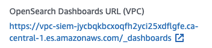

# SIEM on Amazon OpenSearch Service for the ASEA

This AWS Cloud Development Kit ([CDK](https://aws.amazon.com/cdk/)) project integrates the [SIEM on Amazon OpenSearch Service](https://github.com/aws-samples/siem-on-amazon-opensearch-service) with the AWS Secure Environment Accelerator (ASEA). The goal is to make it easier to deploy the _SIEM on Amazon OpenSearch Service_ github project into the ASEA default multi-account architecture.

At a highlevel, the deployment steps consist of the following:

- Updating the ASEA config.json
- Running the ASEA State Machine
- Updating the **SiemConfig.json** associated with this project
- Using CDK to deploy two different CloudFormation stacks
- OpenSearch Configuration

The total deployment time takes approximately 30 minutes (+ ASEA State Machine execution time). The AWS resources deployed extend beyond the AWS Free tier; you will incur AWS charges when this solution is deployed.

The following diagram details the ASEA + OpenSIEM Add-On logging architecture. The OpenSIEM Add-On components are documented in turquoise on the right side of the diagram in both the log-archive and the operations accounts.


## Prerequisites

1. ASEA v1.5.1 or above

   - prior versions do not have access to the ELB log bucket, CloudWatch Log sources were not easily consumed, Security Hub logs were not published to S3, and a Cognito API call was blocked

2. Permissions:

   1. Organization Management Account - ability to update ASEA config file and run ASEA state machine
   2. Operations Account - Administrator Access\*
   3. Log Archive Account - Administrator Access\*

      \* does NOT require the use of a special role which bypasses ASEA SCP's. An AWS SSO based role is preferable.

3. Node v14.5.0 or above (install using nvm is recommended)
4. AWS CLI installed
5. git

## Configuration

The **SiemConfig.json** file is used to configure how this solution is deployed into the Operations and LogArchive AWS accounts. The structure of the siem config file is shown below. The token **----- REPLACE -----** highlights values that require customer replacement before deployment. This is followed by a table describing the different values in detail.

```
{
    "operationsAccountId": "----- REPLACE -----",
    "logArchiveAccountId": "----- REPLACE -----",
    "vpcId": "----- REPLACE -----",
    "region": "ca-central-1",
    "s3LogBuckets": [
        "asea-logarchive-phase0-aescacentral1------ REPLACE -----",
        "asea-logarchive-phase0-cacentral1------ REPLACE -----"
    ],
    "securityGroups": [
        {
            "name": "OpenSearch-SIEM-SG",
            "inboundRules": [
                {
                    "description": "Allow Traffic Inbound",
                    "tcpPorts": [
                        443
                    ],
                    "source": [
                        "------ REPLACE -----",
                        "10.0.0.0/8",
                        "100.96.252.0/23",
                        "100.96.250.0/23"
                    ]
                }
            ],
            "outboundRules": [
                {
                    "description": "All Outbound",
                    "type": [
                        "ALL"
                    ],
                    "source": [
                        "0.0.0.0/0"
                    ]
                }
            ]
        }
    ],
    "appSubnets": [
       "subnet------ REPLACE -----",
       "subnet------ REPLACE -----"
    ],
    "lambdaLogProcessingRoleArn": "arn:aws:iam::----- REPLACE -----:role/SIEM-Lambda-Processor",
    "cognitoDomainPrefix": "asea-siem------ REPLACE -----",
    "openSearchDomainName": "siem",
    "openSearchInstanceTypeMainNodes": "c6g.xlarge.search",
    "openSearchInstanceTypeDataNodes": "r6g.xlarge.search",
    "openSearchCapacityMainNodes": 3,
    "openSearchCapacityDataNodes": 4,
    "openSearchVolumeSize": 100,
    "openSearchConfiguration": "opensearch-config.json",
    "maxmindLicense": "license.txt",
    "s3NotificationTopicNameOrExistingArn": "----- REPLACE -----",
    "enableLambdaSubscription": false,
    "organizationId": "----- REPLACE -----"
    "siemVersion": "v2.6.1a"
}
```

| Config                                | Description                                                                                                                                                                                                                                                                                                                                                                                  |
| ------------------------------------- | -------------------------------------------------------------------------------------------------------------------------------------------------------------------------------------------------------------------------------------------------------------------------------------------------------------------------------------------------------------------------------------------- |
| operationsAccountId                   | This is the AWS Account ID for the Operations account                                                                                                                                                                                                                                                                                                                                        |
| logArchiveAccountId                   | This is the AWS Account ID for the Log Archive account                                                                                                                                                                                                                                                                                                                                       |
| vpcId                                 | This is the VPC Id, within the Operations account, where the OpenSearch Domain will be deployed                                                                                                                                                                                                                                                                                              |
| region                                | This is the ASEA primary or home region                                                                                                                                                                                                                                                                                                                                                      |
| s3LogBuckets                          | This contains a string array of the S3 Bucket names, in the Log Archive account, that will have S3 Notifications configured. In the default ASEA architecture, there are 2 S3 buckets that should be added here.                                                                                                                                                                             |
| securityGroups                        | This structure is similar to what is used in the ASEA config file, but with reduced implementation. The security groups here will be applied to the Lambda Functions and OpenSearch domain. The Security Groups will be created by this project. The inbound rules should be updated to reflect the allowed IPs. In the example, the IP range is the VPC CIDR in the Operations AWS account. |
| appSubnets                            | These are the SubnetIds of existing subnets within the VPC. The Lambda Functions and OpenSearch domain will be deployed into the Subnets defined here.                                                                                                                                                                                                                                       |
| lambdaLogProcessingRoleArn            | This is the IAM Role that the **Lambda Processor** will use to download S3 Objects from the Log Archive and write documents to OpenSearch. This is a protected role that is referenced by this project, but created by the ASEA. More details below. This value must be an IAM ARN.                                                                                                          |
| cognitoDomainPrefix                   | Amazon Cognito is used to provision user access to the OpenSearch Dashboards. The value specified here will be used as the domain; it must be regionally unique. (You can't use the text aws, amazon, or cognito, in the domain prefix)                                                                                                                                                      |
| openSearchDomainName                  | This is the name for the OpenSearch domain                                                                                                                                                                                                                                                                                                                                                   |
| openSearchInstanceTypeMainNodes       | This specifies the OpenSearch instance type for the main nodes. ([Supported Types](https://docs.aws.amazon.com/opensearch-service/latest/developerguide/supported-instance-types.html))                                                                                                                                                                                                      |
| openSearchInstanceTypeDataNodes       | This specifies the OpenSearch instance type for the data nodes. ([Supported Types](https://docs.aws.amazon.com/opensearch-service/latest/developerguide/supported-instance-types.html))                                                                                                                                                                                                      |
| openSearchCapacityMainNodes           | This specifies the number of OpenSearch main nodes to provision.                                                                                                                                                                                                                                                                                                                             |
| openSearchInstanceTypeDataNodes       | This specifies the number of OpenSearch data nodes to provision.                                                                                                                                                                                                                                                                                                                             |
| openSearchVolumeSize                  | This specifies the amount of storage (GB) provisioned for the data nodes. This impacts the amount of available storage for the Domain. Note there are [limits](https://docs.aws.amazon.com/opensearch-service/latest/developerguide/limits.html) for EBS size for instance types.                                                                                                            |
| openSearchConfiguration               | This is the file name of the SIEM search configuration. This file should reside in the _config_ folder. This json file mirrors the content found in the _SIEM on Amazon OpenSearch Service_ corresponding INI file.                                                                                                                                                                          |
| maxmindLicense                        | This is the file name of the MaxMind license file. This file should reside in the _config_ folder. This is an optional configuration that enables IP to Geo which enables map visualizations. Leave blank ("") to skip the deployment of this functionality.                                                                                                                                 |
| s3NotificationTopicNameOrExistingArn  | Specify the desired name of a SNS topic (ex: siem-s3-notifications) to create a NEW SNS topic. This will also create a new KMS key for SNS encryption. Alternatively, provide the ARN to an existing SNS topic.  (See additional details below)                                                                                                                                              |
| enableLambdaSubscription              | On initial deployment, this value should be false. When true, the Lambda Processor function will be updated to subscribe to the SNS Topic.                                                                                                                                                                                                                                                   |
| organizationId                        | This is the AWS Organization ID. It can be retrieved with `aws organizations describe-organization --query 'Organization.Id'`. When a new SNS Topic is created, this value is used to support cross-account SNS Subscription.                                                                                                                                                                |
| siemVersion                           | This is a label used to identitfy the _SIEM on Amazon OpenSearch Service_ or your own version/configuration of the Lambdas. This applies an environment variable to the Lambdas and a change to this value will execute the lambdas on CDK deployment.                                                                                                                                       |

---

## Deployment

### 1. ASEA Config

---

The ASEA Config needs to be updated to provision an IAM role that has cross-account access to the Log Archive S3 Buckets. Attempting to do this outside the ASEA config would encounter Service Control Policy (SCP) guardrails and the possibility of changes being reverted on subsequent State Machine executions. The role that will be created will have permissions to OpenSearch, S3, LambdaVPC, and the LogArchive S3 buckets and KMS key. Its trust policy will allow Lambda to assume it; it will be used by the **Lambda Processor**.

- Add the following to the **roles** array within the **operations** account section in the ASEA config file.

```
{
   "role": "SIEM-Lambda-Processor",
   "type": "lambda",
   "ssm-log-archive-read-only-access": true,
   "policies": [
      "AmazonOpenSearchServiceFullAccess",
      "service-role/AWSLambdaVPCAccessExecutionRole",
      "AmazonS3ReadOnlyAccess",
      "SIEM-Custom-Policy"
   ],
   "boundary-policy": "Default-Boundary-Policy"
}
```

- Update the **siem-custom-permission-policy.txt** document. The primary region and operations account id must be replaced.

```
arn:aws:sqs:<region>:<operations account id>:opensearch-siem-dlq
```

- In the root AWS account, locate the ASEA config S3 bucket.
- Create a folder (if it doesn't exist) called **iam-policy**
- Upload the **siem-custom-permission-policy.txt** file into the **iam-policy** folder.
- Add the folling to the **policies** array within the **operations** account section in the ASEA config file.

```
{
    "policy-name": "SIEM-Custom-Policy",
    "policy": "siem-custom-permission-policy.txt"
}
```

- Run the ASEA State Machine and wait until completion.
- Get the ARN for the role after the State Machine completes (found in the **operations** account).
  - You will use this ARN to populate the **lambdaLogProcessingRoleArn** value in the **SiemConfig.json** in the next step.

### 2. SIEM OpenSearch Config

---

1. Clone the github repo locally.
1. Change directory to **reference-artifacts/Add-ons/opensiem**.
1. Update the **SiemConfig.json** file, replacing all sample values with desired values.
1. You can add country information as well as latitude/longitude location information to each IP address. To get location information, SIEM on OpenSearch Service downloads and uses GeoLite2 Free by [MaxMind](https://www.maxmind.com/). You must either:
   1. If you want to add location information, get your free license from MaxMind and place the license file named **license.txt** in the **config** sub-folder.
      - The license file must only contain a single line containing the license key (approx. 16 characters) (no key value pairs)
      - There must be outbound internet connectivity from the VPC in the operations account for this feature to work; or
   2. Set the `maxmindLicense` field to blank ("") to skip the deployment of this functionality.

### 3. Deploy the OpenSearch Stack (Operations account)

---

1. Ensure you are in the directory **reference-artifacts/Add-ons/opensiem**
2. Apply AWS credentials for the **operations** AWS account to a command terminal.
3. Set the default region example:

**mac/linux**

```
  > export AWS_DEFAULT_REGION=ca-central-1
```

**windows (command window)**

```
  > set AWS_DEFAULT_REGION=ca-central-1
```

2. Confirm AWS credentials are applied for the working command terminal. The output should show credentials for the **operations** AWS account.

```
 > aws sts get-caller-identity
```

3. Install the code library dependencies:

```
 > npm install
```

4. Build the CDK solution and Lambdas

**mac/linux**

```
 > npm run install:packages
 > npm run build
```

**windows (command window)**

```
> cd lambdas/common && npm install && npm run build && cd ..\..
> cd lambdas/siem-geoip && npm install && npm run build && cd ..\..
> cd lambdas/siem-config && npm install && npm run build && cd ..\..
```

5. Provision the OpenSearch Service Linked Role

```
 > aws iam create-service-linked-role --aws-service-name es.amazonaws.com
```

6. Deploy the CDK Bootstrap. This will deploy a cdkbootstrap CloudFormation stack.

```
> npx cdk bootstrap --toolkit-stack-name orgcdktoolkit
```

7. Deploy the CDK OpenSearch Stack. This will take approximately 20 minutes.

```
> npx cdk deploy --toolkit-stack-name orgcdktoolkit OpenSearchSiemStack
```

### 4. Amazon Simple Notification Service (SNS) Configuration

---

Amazon S3 Notifications currently does not support duplicate S3 Event + Suffix configurations, thus limiting options to have multiple Lambda targets for S3 Notifications. This solution implements/supports a fan-out architecture using SNS.
Instead of having S3 Notifications invoke Lambda, they are published to a SNS Topic, and the Lambda(s) is subscribed to receive those messages. This add-on supports two configuration options:

#### OPTION 1: Add-on creates and configures the SNS topic

This option will create a new SNS Topic in the Log Archive account. It will also create a new KMS Customer Managed Key (CMK), update its Key Policy, and configure the SNS Topic to use it for encryption. The S3 Notifications will be configured to publish events to this new SNS Topic.

To use this option, update the config value (**s3NotificationTopicNameOrExistingArn**) with the desired name of the SNS Topic to create. Here's an example:

```
"s3NotificationTopicNameOrExistingArn": "siem-s3-notifications",
```

#### OPTION 2: Add-on uses an existing SNS topic

This option will use an existing SNS Topic in the Log Archive account. The SNS Topic Access Policy and KMS Key Policy (if using KMS CMK encryption) need to be updated before deployment, or the deployment will fail. The S3 Notifications will be configured to publish events to this existing SNS Topic. 

If a SNS Topic is already configured on the S3 buckets, update the **s3NotificationTopicNameOrExistingArn** config setting, ensure that the SNS Topic Access Policies are updated as described below, but do not execute the steps in section 5. Proceed to the steps in section 6.

To use this option, update the config value (**s3NotificationTopicNameOrExistingArn**) with the existing SNS Topic's ARN. Here's an example:

```
"s3NotificationTopicNameOrExistingArn": "arn:aws:sns:ca-central-1:444111222555:my-existing-sns-topic",
```

The following are the SNS Topic Access Policies that need to be added to an existing SNS Topic. There must be permissions assigned for each bucket defined in the **s3LogBuckets** config. In this example, there are 2.
```
{
    "Sid": "Allow SIEM Subscription of Topic",
    "Effect": "Allow",
    "Principal": {
        "AWS": "*"
    },
    "Action": "sns:Subscribe",
    "Resource": "arn:aws:sns:ca-central-1:444111222555:my-existing-sns-topic ----- REPLACE -----",
    "Condition": {
        "StringEquals": {
            "aws:PrincipalOrgID": "o-tb8rqaev51 ----- REPLACE -----"
        }
    }
},
{
    "Sid": "1",
    "Effect": "Allow",
    "Principal": {
        "Service": "s3.amazonaws.com"
    },
    "Action": "sns:Publish",
    "Resource": "arn:aws:sns:ca-central-1:444111222555:my-existing-sns-topic ----- REPLACE -----",
    "Condition": {
        "ArnLike": {
            "aws:SourceArn": "arn:aws:s3:::asea-logarchive-phase0-aescacentral1 ----- REPLACE -----"
        }
    }
},
{
    "Sid": "2",
    "Effect": "Allow",
    "Principal": {
        "Service": "s3.amazonaws.com"
    },
    "Action": "sns:Publish",
    "Resource": "arn:aws:sns:ca-central-1:444111222555:my-existing-sns-topic ----- REPLACE -----",
    "Condition": {
        "ArnLike": {
            "aws:SourceArn": "arn:aws:s3:::asea-logarchive-phase0-cacentral1 ----- REPLACE -----"
        }
    }
}
```

If the existing SNS Topic is configured with KMS CMK encryption, the following KMS Key Policy statement needs to be added:
```
{
    "Sid": "Allow S3 use of the CMK",
    "Effect": "Allow",
    "Principal": {
        "Service": "s3.amazonaws.com"
    },
    "Action": [
        "kms:Decrypt",
        "kms:GenerateDataKey*"
    ],
    "Resource": "*"
}
```


### 5. Deploy the S3 Notifications Stack (Log Archive account)

---

1. Ensure you are in the directory **reference-artifacts/Add-ons/opensiem**
2. Apply AWS credentials for the **log archive** AWS account to a command terminal.
3. Set the default region example:

**mac/linux**

```
  > export AWS_DEFAULT_REGION=ca-central-1
```

**windows (command window)**

```
  > set AWS_DEFAULT_REGION=ca-central-1
```

4. Confirm AWS credentials are applied for the working command terminal. The output should show credentials for the log archive AWS account.

```
 > aws sts get-caller-identity
```

5. Deploy the CDK Bootstrap. This will deploy a cdkbootstrap CloudFormation stack. Reminder: This is being deployed in the log archive AWS Account.

```
> npx cdk bootstrap --toolkit-stack-name orgcdktoolkit
```

6. Deploy the CDK S3 Notifications Stack. 

```
> npx cdk deploy --toolkit-stack-name orgcdktoolkit OpenSearchSiemS3NotificationsStack
```

### 6. Enable the Lambda Processor Subscription

---

This step will configure the Lambda Processor to subscribe to the SNS Topic. When this completes, messages will start to write to OpenSearch. 

> As of v2.6.1 of the _SIEM on Amazon OpenSearch Service_ project, the Lambda Processor code does not support messages from SNS. The copy of the code in this project contains an addition to support it. This contribution is submitted back to the original repository with Pull Request [232](https://github.com/aws-samples/siem-on-amazon-opensearch-service/pull/232).


1. Ensure you are in the directory **reference-artifacts/Add-ons/opensiem**
2. Apply AWS credentials for the **operations** AWS account to a command terminal.
3. Set the default region example:

**mac/linux**

```
  > export AWS_DEFAULT_REGION=ca-central-1
```

**windows (command window)**

```
  > set AWS_DEFAULT_REGION=ca-central-1
```

4. Confirm AWS credentials are applied for the working command terminal. The output should show credentials for the **operations** AWS account.

```
 > aws sts get-caller-identity
```

5. Update the SiemConfig.json **enableLambdaSubscription** to true

```
"enableLambdaSubscription": true
```

6. Update the CDK OpenSearch Stack.

```
> npx cdk deploy --toolkit-stack-name orgcdktoolkit OpenSearchSiemStack
```

### 7. Cognito Configuration (Operations account)

---

Amazon Cognito is used to add authentication and protection to the OpenSearch Service, and it is configured as part of this automation. To gain access to the OpenSearch Dashboards, a user must be created and configured in the Cognito User Pool, in the Operations account.


1. Login to the Operations account
2. Create an MFA enabled user in the Cognito OpenSearchSiemUserPool
   - This solution enables MFA on the Cognito user pool, but, account limits for SMS and SNS may prevent MFA from functioning. You can temporarily change the user pool to "Optional" MFA enforcement, and set each user to "Do not require MFA". Once you raise limits, these changes should be reverted.
   - GUI generated users have a forced password reset on first login, if this causes login challenges, the following command will force a permanent password reset:
   ```
   > aws cognito-idp admin-set-user-password --user-pool-id <your-user-pool-id> --username <username> --password "<password>" --permanent
   ```

### 8. OpenSearch Dashboards

---

The OpenSearch Dashboards can only be accessed privately; the end point is not public. Here are a few options on how that is possible:

- Establish a Site to Site VPN or Direct Connect
- Deploy a ClientVPN solution
- Deploy a Windows EC2 instance and use it as a bastion host
  - use SSM Session Manager to securely connect
  - use SSM Fleet Manager to securely connect

After establishing private connectivity, get the **OpenSearch Dashboards URL (VPC)** from the AWS Console in the Operations account for the SIEM OpenSearch domain.



You need to use this URL to access the OpenSearch Dashboards. You will be redirected to Cognito for authentication. Use the login credentials setup in the previous step. After authenticating, you will redirected to OpenSearch.

In OpenSearch:

1. When you login for the first time:
   - the Welcome screen is displayed, select "Add Data"
   - "Select your tenant" is displayed, select "Global" and click "Confirm"
     - In future, you can select "Private" instead of "Global" to customize the configuration and dashboards for each user.
2. Upload the preconfigured SIEM visualizations
   - For convenience, **dashboard.ndjson** is provided in this repository, but the latest versions can be found on the [SIEM on Amazon OpenSearch Service](https://github.com/aws-samples/siem-on-amazon-opensearch-service) github project in the **source/saved_objects** folder

- In the OpenSeach console, select the hamburg icon in the top left
- select "Stack Management" at the bottom of the left menu pane
- choose "Saved Objects", and then select "Import" on the top-right
- under "Select a file to import", and click "Import"
- navigate to your desired **dashboard.ndjson** file
- leave "Check for existing objects", "Automatically overwrite conflicts" selected
- click Import, click Done
- Log out of the OpenSearch console (click circle icon on the top right, click Log out) to enable the imported configurations take effect

3. Log back into the OpenSearch Console
   - Select OpenSearch Dashboards, Dashboard to see a list of the preconfigured SIEM visualizations

## 9. Log Ingestion

The _SIEM on Amazon OpenSearch Service_ log ingestion to OpenSearch is driven by logs uploaded/put to S3. The S3 object key is used to determine what type of log file and what type of OpenSearch mapping should be applied. ASEA v1.5.1 introduces a new feature to place log files into different folders based on a string match in the S3 object key. Here's the v1.5.1 new configuration that should be applied:

```
"dynamic-s3-log-partitioning": [
        {
          "logGroupPattern": "/${ACCELERATOR_PREFIX_ND}/MAD",
          "s3Prefix": "managed-ad"
        },
        {
          "logGroupPattern": "/${ACCELERATOR_PREFIX_ND}/rql",
          "s3Prefix": "rql"
        },
        {
          "logGroupPattern": "/${ACCELERATOR_PREFIX_ND}/SecurityHub",
          "s3Prefix": "security-hub"
        },
        {
          "logGroupPattern": "/${ACCELERATOR_PREFIX_ND}/Nfw",
          "s3Prefix": "nfw"
        },
        {
          "logGroupPattern": "/${ACCELERATOR_PREFIX_ND}/rsyslog",
          "s3Prefix": "rsyslog"
        },
        {
          "logGroupPattern": "/${ACCELERATOR_PREFIX_ND}/SSM",
          "s3Prefix": "ssm"
        }
      ]
```

As an example, if the Amazon Data Kinesis Firehose, that centrally processes CloudWatch Logs, is processing logs that came from a log group with a name containing'ASEA/rql', then it will add the 's3Prefix' value 'rql' to the S3 object. In other words, rql logs will be placed into a 'rql' folder in the central log archive S3 bucket.

The **Log Processor** needs to be configured to know what keyword in the S3 object key maps to which known log type. This has already been done based on the above sample confguration. However, if you are adding something new and want to have it ingested into OpenSearch, it must be configured (in addition to index mapping creation). The _os-loader.zip_ contains a configuration file _aws.ini_. Here is an example of a snippet showing just the rql S3 configuration defined in that file:

```
[route53resolver]
s3_key = /rql/
file_format = json
via_cwl = True
```

Note that the _s3_key_ has a value of _/rql/_. This matches the above _dynamic-s3-log-partitioning_ for rql files. The **Log Processor** will process that S3 log file expecting it to be a rql file, in the file format of JSON, and was written to CloudWatch Logs first (opposed to directly written to the S3 bucket).

## 10. Cleaning up

---

This section provides details to delete/remove the OpenSiem solution, should it be no longer required by a customer.

The following AWS resources are retained when deleting the solution:

- Cloudwatch Log Groups
- KMS Key and Alias
- CDK Bootstrap stacks (Operations and Log Archive accounts)

1. In the log archive account
   1. navigate to CloudFormation and delete the **OpenSearchSiemS3NotificationsStack** stack
2. In the operations account
   1. navigate to S3, open the S3 bucket prefixed with **opensearchsiemstack-**, and delete all the objects inside
   1. navigate to CloudFormation and delete the **OpenSearchSiemStack** stack
