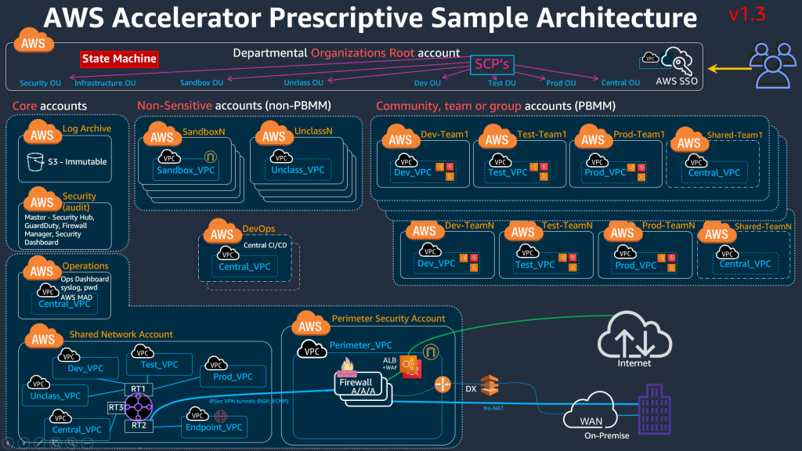
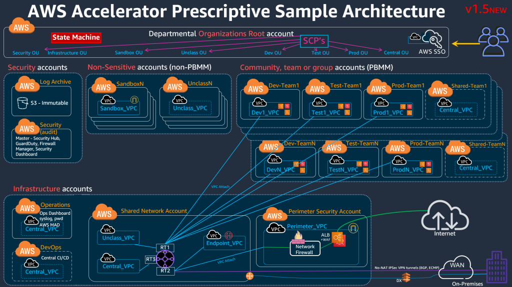
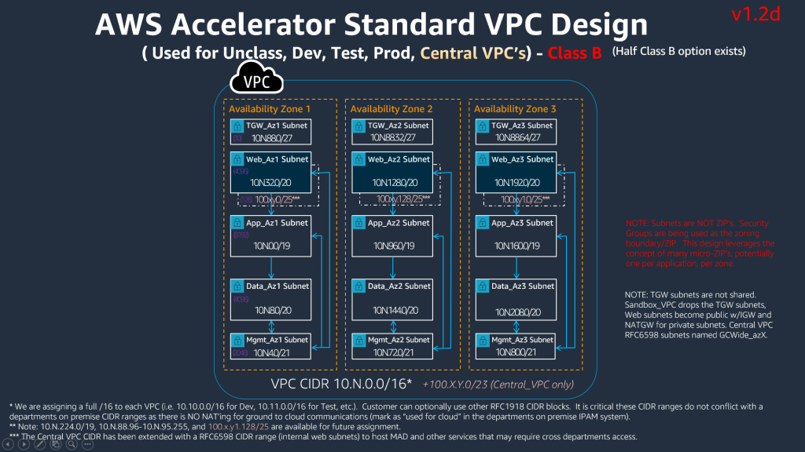
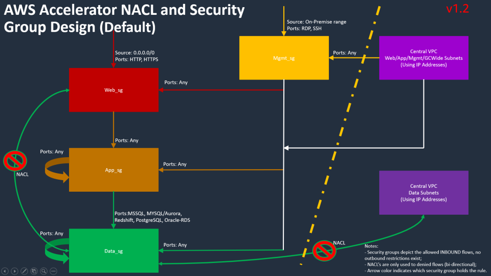
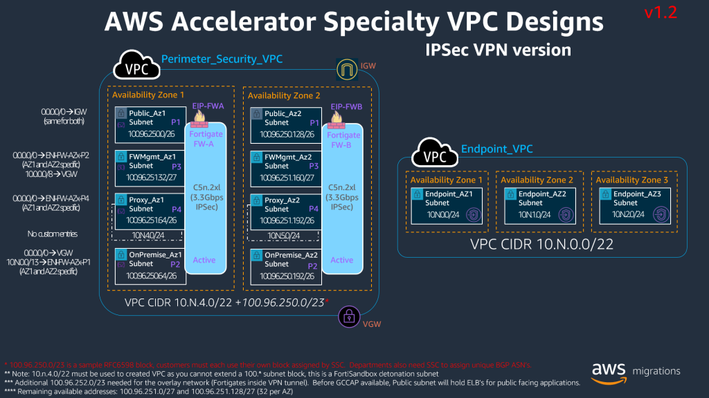
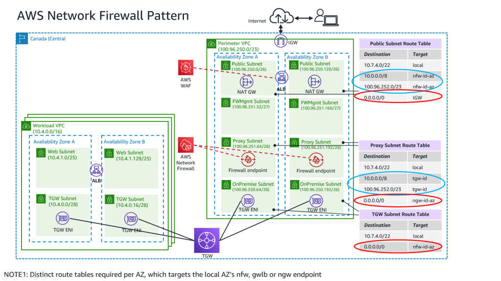
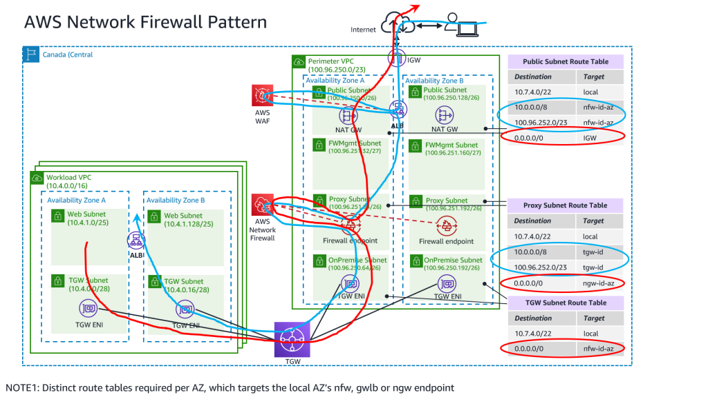
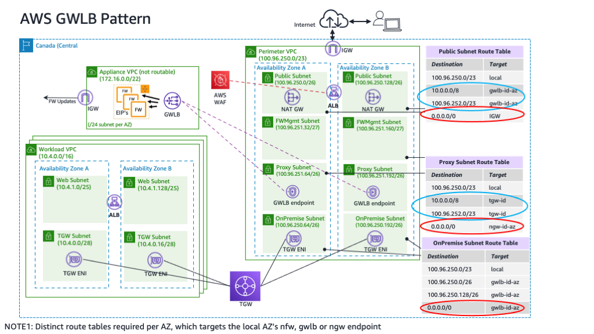
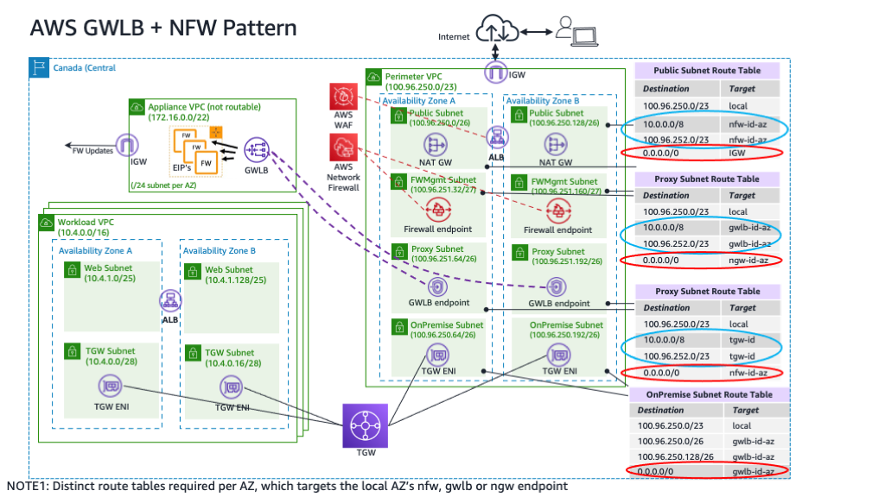

# 1. Prescriptive Sample Architecture Diagrams

## 1.1. Shared VPC Architecture

## 1.2. Spoke VPC Architecture

## 1.3. VPC and Security Group Patterns

## 1.4. Additional Perimeter Patterns

