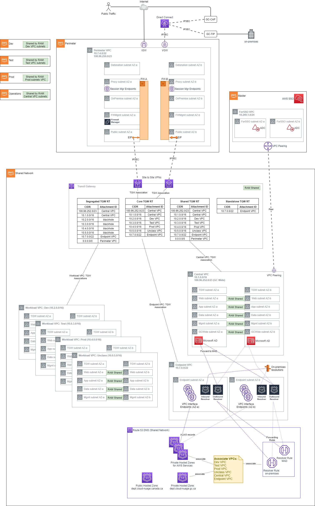
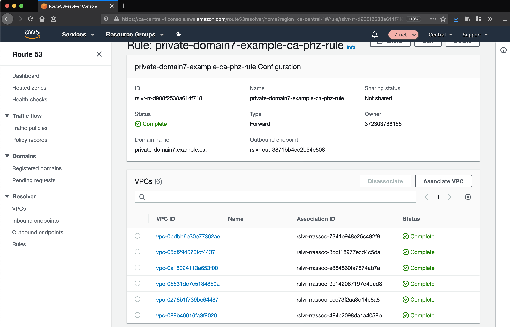

# 1. Networking

## 1.1. Overview

The _AWS Secure Environment Architecture_ networking is built on a principle of centralized on-premises and Internet ingress/egress, while enforcing data plane isolation between workloads in different environments. Connectivity to on-prem environments, internet egress, shared resources and AWS APIs are mediated at a central point of ingress/egress via the use of a [Transit Gateway][aws_tgw]. Consider the following overall network diagram:



All functional accounts use RAM-shared networking infrastructure as depicted above. The workload VPCs (Dev, Test, Prod, etc) are hosted in the Shared Network account and made available to the appropriate OU in the Organization.

## 1.2. Perimeter

The perimeter VPC hosts the Organization's perimeter security services. The Perimeter VPC is used to control the flow of traffic between AWS Accounts and external networks for IaaS workloads: both public (internet) and in some cases private (access to on-premises datacenters). This VPC hosts Next Generation Firewalls (NGFW) that provide perimeter security services including virus scanning / malware protection, Intrusion Protection services, TLS Inspection and Web Application Firewall protection. If applicable, this VPC also hosts reverse proxy servers.

Note that this VPC is in its own isolated account, separate from Shared Network, in order to facilitate networking and security 'separation of duties'. Internal networking teams may administer the cloud networks in Shared Network without being granted permission to administer the security perimeter itself.

### 1.2.1. IP Ranges

-   **Primary Range**: The _AWS Secure Environment Architecture_ recommends that the perimeter VPC have a primary range in the [RFC1918][1918] block (e.g. `10.7.4.0/22`), used only for subnets dedicated to 'detonation' purposes. This primary range, in an otherwise-unused [RFC1918][1918] range, is not intended to be routable outside of the VPC, and is reserved for future use with malware detonation capabilities of NGFW devices.
-   **Secondary Range**: This VPC should also have a secondary range in the [RFC6598][6598] block (e.g. `100.96.250.0/23`) used for the overlay network (NGFW devices inside VPN tunnel) for all other subnets. This secondary range is assigned by an external entity (e.g. Shared Services Canada), and should be carefully selected in order to co-exist with _AWS Secure Environment Architecture_ deployments that exist at peer organizations; for instance other government departments that maintain a relationship with the same shared entity in a carrier-grade NAT topology. Although this is a 'secondary' range in VPC parlance, this VPC CIDR should be interpreted as the more 'significant' of the two with respect to Transit Gateway routing; the Transit Gateway will only ever interact with this 'secondary' range.


This VPC has four subnets per AZ, each of which hosts a port used by the NGFW devices, which are deployed in an HA pair. The purpose of these subnets is as follows.

-   **Detonation**: This is an unused subnet reserved for future use with malware detonation capabilities of the NGFW devices.
    -   e.g. `10.7.4.0/24` - not routable except local.
-   **Proxy**: This subnet hosts reverse proxy services for web and other protocols. It also contains the [three interface endpoints][ssm_endpoints] necessary for AWS Systems Manager Session Manager, which enables SSH-less CLI access to authorized and authenticated principals in the perimeter account.
    -   e.g. `100.96.251.64/26`
-   **On-Premises**: This subnet hosts the private interfaces of the firewalls, corresponding to connections from the on-premises network.
    -   e.g. `100.96.250.192/26`
-   **FW-Management**: This subnet is used to host management tools and the management of the Firewalls itself.
    -   e.g. `100.96.251.160/27` - a smaller subnet is permissible due to modest IP requirements for management instances.
-   **Public**: This subnet is the public-access zone for the perimeter VPC. It hosts the public interface of the firewalls, as well as application load balancers that are used to balance traffic across the firewall pair. There is one Elastic IPv4 address per public subnet that corresponds to the IPSec Customer Gateway (CGW) for the VPN connections into the Transit Gateway in Shared Networking.
    -   e.g. `100.96.250.0/26`

Outbound internet connections (for software updates, etc.) can be initiated from within the workload VPCs, and use the transparent proxy feature of the next-gen Firewalls.

**Note on VPN Tunnel Redundancy**: Each NGFW device manifests as a unique CGW on the AWS side (shared network account) of the IPSec VPNs. Moreover, there are **two** _Site-to-Site VPNs_ in this architecture, each with one active tunnel (and one inactive tunnel); taken together, the pair is redundant. In many hybrid networking configurations, a single _Site-to-Site VPN_ resource is used with dual active tunnels. Customers may receive the following email notification from the AWS VPC service team:

> You're receiving this message because you have at least one VPN Connection in the ca-central-1 Region, for which your VPN Customer Gateway is not using both tunnels. This mode of operation is not recommended as you may experience connectivity issues if your active tunnel fails.

This message may be disregarded, as it is premised on a traditional hybrid configuration with dual tunnels. Customers may create a VPN support case (in shared network account) requesting that these informational emails are disabled.

## 1.3. Shared Network

The shared network account, and the AWS networking resources therein, form the core of the cloud networking infrastructure across the account structure. Rather than the individual accounts defining their own networks, these are instead centralized here and shared out to the relevant OUs. Principals in a Dev OU will have access to a Dev VPC, Test OU will have access to a Test VPC and so on - all of which are owned by this account.

You can share AWS Transit Gateways, Subnets, AWS License Manager configurations, and Amazon Route 53 Resolver rules resources with AWS Resource Access Manager (RAM). The RAM service eliminates the need to create duplicate resources in multiple accounts, reducing the operational overhead of managing those resources in every single account.

### 1.3.1. Transit Gateway

The Transit Gateway is a central hub that performs several core functions within the Shared Network account.

1. Routing of permitted flows; for example a Workload to On-premises via the Perimeter VPC.
    - All routing tables in SharedNetwork VPCs send `0.0.0.0/0` traffic to the TGW, where its handling will be determined by the TGW Route Table (TGW-RT) that its attachment is associated with. For example:
        - an HTTP request to `registry.hub.docker.com` from the Test VPC will go to the TGW
        - The Segregated TGW RT will direct that traffic to the Perimeter VPC via the IPsec VPNs
        - The request will be proxied to the internet, via GC-CAP if appropriate
        - The return traffic will again transit the IPsec VPNs
        - The `10.3.0.0/16` bound response traffic will arrive at the Core TGW RT, where a propagation in that TGW RT will direct the response back to the Test VPC.
2. Defining separate routing domains that prohibit undesired east-west flows at the network level; for example, by prohibiting Dev to Prod traffic. For example:
    - All routing tables in SharedNetwork VPCs send `0.0.0.0/0` traffic to the TGW, which defines where the next permissible hop is. For example, `10.2.0.0/16` Dev traffic destined for the `10.0.4.0/16` Prod VPC will be blocked by the blackhole route in the Segregated TGW RT.
3. Enabling centralization of shared resources; namely a shared Microsoft AD installation in the Central VPC, and access to shared VPC Endpoints in the Endpoint VPC.
    - The Central VPC, and the Endpoint VPC are routable from Workload VPCs. This provides an economical way to share Organization wide resources that are nonetheless isolated into their own VPCs. For example:
        - a `git` request in the `Dev` VPC to `git.private-domain.ca` resolves to a `10.1.0.0/16` address in the `Central` VPC.
        - The request from the `Dev` VPC will go to the TGW due to the VPC routing table associated with that subnet
        - The TGW will send the request to the `Central` VPC via an entry in the Segregated TGW RT
        - The `git` response will go to the TGW due to the VPC routing table associated with that subnet
        - The Shared TGW RT will direct the response back to the `Dev` VPC

The four TGW RTs exist to serve the following main functions:

-   **Segregated TGW RT**: Used as the association table for the workload VPCs; prevents east-west traffic, except to shared resources.
-   **Core TGW RT**: Used for internet/on-premises response traffic, and Endpoint VPC egress.
-   **Shared TGW RT**: Used to provide `Central` VPC access east-west for the purposes of response traffic to shared workloads
-   **Standalone TGW RT**: Reserved for future use. Prevents TGW routing except to the Endpoint VPC.

Note that a unique BGP ASN will need to be available for the TGW.

### 1.3.2. Endpoint VPC

DNS functionality for the network architecture is centralized in the Endpoint VPC. It is recommended that the Endpoint VPC use a [RFC1918][1918] range - e.g. `10.7.0.0/22` with sufficient capacity to support 60+ AWS services and future endpoint expansion, and inbound and outbound resolvers (all figures per AZ).


### 1.3.3. Endpoint VPC: Interface Endpoints

The endpoint VPC hosts VPC Interface Endpoints (VPCEs) and associated Route 53 private hosted zones for all applicable services in the `ca-central-1` region. This permits traffic destined for an eligible AWS service; for example SQS, to remain entirely within the SharedNetwork account rather than transiting via the IPv4 public endpoint for the service:


From within an associated workload VPC such as `Dev`, the service endpoint (e.g. `sqs.ca-central-1.amazonaws.com`) will resolve to an IP in the `Endpoint` VPC:

```bash
sh-4.2$ nslookup sqs.ca-central-1.amazonaws.com
Server:         10.2.0.2                  # Dev VPC's .2 resolver.
Address:        10.2.0.2#53

Non-authoritative answer:
Name:   sqs.ca-central-1.amazonaws.com
Address: 10.7.1.190                       # IP in Endpoint VPC - AZ-a.
Name:   sqs.ca-central-1.amazonaws.com
Address: 10.7.0.135                       # IP in Endpoint VPC - AZ-b.
```

This cross-VPC resolution of the service-specific private hosted zone functions via the association of each VPC to each private hosted zone, as depicted above.

### 1.3.4. Endpoint VPC: Hybrid DNS

The Endpoint VPC also hosts the common DNS infrastructure used to resolve DNS queries:

-   within the cloud
-   from the cloud to on-premises
-   from on-premises to the cloud

#### 1.3.4.1. Within The Cloud

In-cloud DNS resolution applies beyond the DNS infrastructure that is put in place to support the Interface Endpoints for the AWS services in-region. Other DNS zones, associated with the Endpoint VPC, are resolvable the same way via an association to workload VPCs.

#### 1.3.4.2. From Cloud to On-Premises

DNS Resolution from the cloud to on-premises is handled via the use of a Route 53 Outbound Endpoint, deployed in the Endpoint VPC, with an associated Resolver rule that forwards DNS traffic to the outbound endpoint. Each VPC is associated to this rule.



#### 1.3.4.3. From On-Premises to Cloud

Conditional forwarding from on-premises networks is made possible via the use of a Route 53 Inbound Endpoint. On-prem networks send resolution requests for relevant domains to the endpoints deployed in the Endpoint VPC:


### 1.3.5. Workload VPCs

The workload VPCs are where line of business applications ultimately reside, segmented by environment (`Dev`, `Test`, `Prod`, etc). It is recommended that the Workload VPC use a [RFC1918][1918] range (e.g. `10.2.0.0/16` for `Dev`, `10.3.0.0/16` for `Test`, etc).


Note that security groups are recommended as the primary data-plane isolation mechanism between applications that may coexist in the same VPC. It is anticipated that unrelated applications would coexist in their respective tiers without ever permitting east-west traffic flows.

The following subnets are defined by the _AWS Secure Environment Architecture_:

-   **TGW subnet**: This subnet hosts the elastic-network interfaces for the TGW attachment. A `/27` subnet is sufficient.
-   **Web subnet**: This subnet hosts front-end or otherwise 'client' facing infrastructure. A `/20` or larger subnet is recommended to facilitate auto-scaling.
-   **App subnet**: This subnet hosts app-tier code (EC2, containers, etc). A `/19` or larger subnet is recommended to facilitate auto-scaling.
-   **Data subnet**: This subnet hosts data-tier code (RDS instances, ElastiCache instances). A `/21` or larger subnet is recommended.
-   **Mgmt subnet**: This subnet hosts bastion or other management instances. A `/21` or larger subnet is recommended.

Each subnet is associated with a Common VPC Route Table, as depicted above. Gateway Endpoints for relevant services (Amazon S3, Amazon DynamoDB) are installed in the Common route tables of all Workload VPCs. Aside from local traffic or gateway-bound traffic, `0.0.0.0/0` is always destined for the TGW.

#### 1.3.5.1. Security Groups

Security Groups are instance level firewalls, and represent a foundational unit of network segmentation across AWS networking. Security groups are stateful, and support ingress/egress rules based on protocols and source/destinations. While CIDR ranges are supported by the latter, it is preferable to instead use other security groups as source/destinations. This permits a higher level of expressiveness that is not coupled to particular CIDR choices and works well with autoscaling; e.g.

> "permit port 3306 traffic from the `App` tier to the `Data` tier"

versus

> "permit port 3306 traffic from `10.0.1.0/24` to `10.0.2.0/24`.

Security group egress rules are often used in 'allow all' mode (`0.0.0.0/0`), with the focus primarily being on consistently whitelisting required ingress traffic. This ensures day to day activities like patching, access to DNS, or to directory services access can function on instances without friction. The provided sample security groups in the workload accounts offers a good balance that considers both security, ease of operations, and frictionless development. They allow developers to focus on developing, enabling them to simply use the pre-created security constructs for their workloads, and avoid the creation of wide-open security groups. Developers can equally choose to create more appropriate least-privilege security groups more suitable for their application, if they are skilled in this area. It is expected as an application is promoted through the SDLC cycle from Dev through Test to Prod, these security groups will be further refined by the extended customers teams to further reduce privilege, as appropriate. It is expected that each customer will review and tailor their Security Groups based on their own security requirements.

#### 1.3.5.2. NACLs

Network Access-Control Lists (NACLs) are stateless constructs used sparingly as a defense-in-depth measure in this architecture. AWS generally discourages the use of NACLs given the added complexity and management burden, given the availability and ease of use provided by security groups. Each network flow often requires four NACL entries (egress from ephemeral, ingress to destination, egress from destination, ingress to ephemeral). The architecture recommends NACLs as a segmentation mechanism for `Data` subnets; i.e. `DENY` all inbound traffic to such a subnet except that which originates in the `App` subnet for the same VPC. As with security groups, we encourage customers to review and tailor their NACLs based on their own security requirements.

### 1.3.6. Central VPC

The Central VPC is a network for localizing operational infrastructure that may be needed across the Organization, such as code repositories, artifact repositories, and notably, the managed Directory Service (Microsoft AD). Instances that are domain joined will connect to this AD domain - a network flow that is made possible from anywhere in the network structure due to the inclusion of the Central VPC in all relevant association TGW RTs.

It is recommended that the Central VPC use a [RFC1918][1918] range (e.g. `10.1.0.0/16`) for the purposes of routing from the workload VPCs, and a secondary range from the [RFC6598][6598] block (e.g. `100.96.252.0/23`) to support the Microsoft AD workload.

Note that this VPC also contains a peering relationship to the `ForSSO` VPC in the Organization Management (root) account. This exists purely to support connectivity from an AD-Connector instance in the Organization Management (root) account, which in turn enables AWS SSO for federated login to the AWS control plane.


#### 1.3.6.1. Domain Joining

An EC2 instance deployed in the Workload VPCs can join the domain corresponding to the Microsoft AD in `Central` provided the following conditions are all true:

1. The instance needs a network path to the Central VPC (given by the Segregated TGW RT), and appropriate security group assignment
2. The Microsoft AD should be 'shared' with the account the EC2 instance resides in (The _AWS Secure Environment Architecture_ recommends these directories are shared to workload accounts)
3. The instance has the AWS managed policies `AmazonSSMManagedInstanceCore` and `AmazonSSMDirectoryServiceAccess` attached to its IAM role, or runs under a role with at least the permission policies given by the combination of these two managed policies.
4. The EC2's VPC has an associated resolver rule that directs DNS queries for the AD domain to the Central VPC.

### 1.3.7. Sandbox VPC

A sandbox VPC, not depicted, may be included in the _AWS Secure Environment Architecture_. This is **not** connected to the Transit Gateway, Perimeter VPC, on-premises network, or other common infrastructure. It contains its own Internet Gateway, and is an entirely separate VPC with respect to the rest of the _AWS Secure Environment Architecture_.

The sandbox VPC should be used exclusively for time-limited experimentation, particularly with out-of-region services, and never used for any line of business workload or data.

[pbmm]: https://www.canada.ca/en/government/system/digital-government/modern-emerging-technologies/cloud-services/government-canada-security-control-profile-cloud-based-it-services.html#toc4
[ops_guide]: https://github.com/aws-samples/aws-secure-environment-accelerator/blob/main/docs/operations/index.md
[dev_guide]: https://github.com/aws-samples/aws-secure-environment-accelerator/blob/main/docs/developer/developer-guide.md
[accel_tool]: https://github.com/aws-samples/aws-secure-environment-accelerator/blob/main/README.md
[aws_org]: https://aws.amazon.com/organizations/
[aws_scps]: https://docs.aws.amazon.com/organizations/latest/userguide/orgs_manage_policies_type-auth.html#orgs_manage_policies_scp
[aws_vpn]: https://docs.aws.amazon.com/vpn/latest/s2svpn/VPC_VPN.html
[aws_dc]: https://aws.amazon.com/directconnect/
[aws_vpc]: https://aws.amazon.com/vpc/
[aws_tgw]: https://aws.amazon.com/transit-gateway/
[aws_r53]: https://aws.amazon.com/route53/
[ssm_endpoints]: https://aws.amazon.com/premiumsupport/knowledge-center/ec2-systems-manager-vpc-endpoints/
[1918]: https://tools.ietf.org/html/rfc1918
[6598]: https://tools.ietf.org/html/rfc6598
[root]: https://docs.aws.amazon.com/general/latest/gr/aws_tasks-that-require-root.html
[iam_flow]: https://docs.aws.amazon.com/IAM/latest/UserGuide/reference_policies_evaluation-logic.html
[scps]: https://docs.aws.amazon.com/organizations/latest/userguide/orgs_manage_policies_scps-about.html
[ct-digest]: https://docs.aws.amazon.com/awscloudtrail/latest/userguide/cloudtrail-log-file-validation-intro.html
[ebs-encryption]: https://docs.aws.amazon.com/AWSEC2/latest/UserGuide/EBSEncryption.html#encryption-by-default
[s3-block]: https://docs.aws.amazon.com/AmazonS3/latest/dev/access-control-block-public-access.html#access-control-block-public-access-options
[flow]: https://docs.aws.amazon.com/vpc/latest/userguide/flow-logs.html
[gd-org]: https://docs.aws.amazon.com/guardduty/latest/ug/guardduty_organizations.html
[config]: https://docs.aws.amazon.com/config/latest/developerguide/WhatIsConfig.html
[config-org]: https://docs.aws.amazon.com/organizations/latest/userguide/services-that-can-integrate-config.html
[found]: https://docs.aws.amazon.com/securityhub/latest/userguide/securityhub-standards-fsbp-controls.html
[pci]: https://docs.aws.amazon.com/securityhub/latest/userguide/securityhub-pci-controls.html
[cis]: https://docs.aws.amazon.com/securityhub/latest/userguide/securityhub-cis-controls.html
[ssm]: https://docs.aws.amazon.com/systems-manager/latest/userguide/session-manager.html
