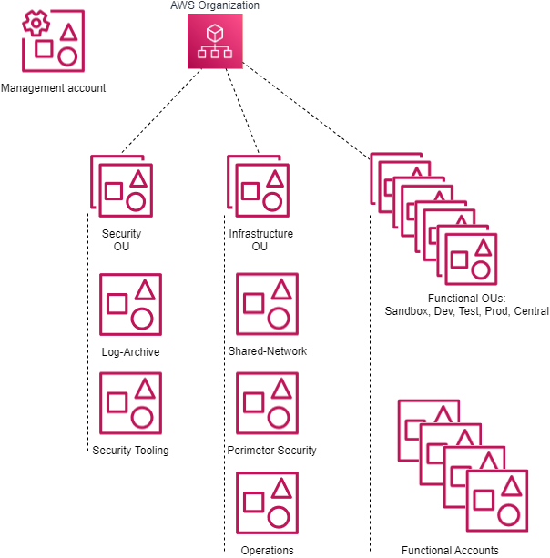
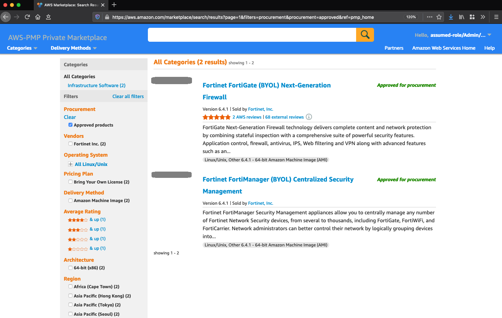

# 1. Account Structure

## 1.1. Overview

AWS accounts are a strong isolation boundary; by default there is no control plane or data plane access from one AWS account to another. AWS accounts provide different AWS customers an isolated private cloud tenancy inside the AWS commercial cloud. It is worth noting that users and roles reside within AWS accounts, and are the constructs used to grant permissions within an AWS account to people, services and applications. AWS Organizations is a service that provides centralized billing across a fleet of accounts, and optionally, some integration-points for cross-account guardrails and cross-account resource sharing. The _AWS Secure Environment Accelerator Architecture_ uses these features of AWS Organizations to realize its outcomes.

## 1.2. Organization structure

The _AWS Secure Environment Accelerator Architecture_ includes the following default AWS organization and account structure.

Note that the AWS account structure is strictly a control plane concept - nothing about this structure implies anything about the network architecture or network flows.



### 1.2.1. Organization Management (root) AWS Account

The AWS Organization resides in the Organization Management (root) AWS account and is traditionally an organization's first AWS account. This account is not used for workloads - it functions primarily as a billing aggregator, and a gateway to the entire cloud footprint for high-trust principals. Access to the Management account must be strictly controlled to a small set of highly trusted individuals from the organization. Additionally, the Organization Management account is where the automation engine or tooling is installed to automate the deployment of the ASEA architecture and its security guardrails. There exists a trust relationship which is used by the automation engine between child AWS accounts in the organization and the Organization Management (root) account; from the Management account, users and roles can assume a role of the following form in child accounts:

```json
{
    "Role": {
        "Path": "/",
        "RoleName": "OrganizationAccountAccessRole",
        "Arn": "arn:aws:iam::111111111111:role/OrganizationAccountAccessRole", // Child account
        "AssumeRolePolicyDocument": {
            "Version": "2012-10-17",
            "Statement": [
                {
                    "Effect": "Allow",
                    "Principal": {
                        "AWS": "arn:aws:iam::123456789012:root" // Organization Management (root) account may assume this role
                    },
                    "Action": "sts:AssumeRole"
                }
            ]
        }
    }
}
```

Note: this is the default role installed by AWS Organizations (`OrganizationAccountAccessRole`) when new AWS accounts are created using AWS organizations. This role changes to `AWSControlTowerExecution` when Control Tower is being leveraged.

### 1.2.2. AWS SSO

AWS Single Sign-On (SSO) resides in the Organization Management account. Once deployed from the Organization Management account it is recommended that AWS SSO administration is delegated to the Operations account (sometimes referred to as the Shared Services account). AWS SSO is where you create, or connect, your workforce identities in AWS, once, and manage access centrally across your AWS organization. You can create user identities directly in AWS SSO, or you can bring them from your Microsoft Active Directory or a standards-based identity provider, such as Okta Universal Directory or Azure AD. AWS SSO provides a unified administration experience to define, customize, and assign fine-grained access. Your workforce users get a user portal to access all of their assigned AWS accounts. The AWS SSO service deploys IAM roles into accounts in the organization and associates them with the designated workforce identities . More details on SSO are available in the **Authentication and Authorization** section of this document.

## 1.3. Organizational Units

Underneath the root of the organization, Organizational Units (OUs) provide a mechanism for grouping accounts into logical collections. Aside from the benefit of the grouping itself, these collections serve as the attachment points for SCPs (preventative API-blocking controls), and Resource Access Manager sharing (cross-account resource sharing). Additionally, the ASEA leverages OUs to assign AWS accounts a persona which includes a consistent security personality.

The OU an AWS account is placed in determines the account's purpose, its security posture and the applicable guardrails. An account placed in the Sandbox OU would have the least restrictive, most agile, and most cloud native functionality, whereas an account placed in the Prod OU would have the most restrictive set of guardrails applied.

OUs are NOT designed to reflect an organization's structure, and should instead reflect major shifts in permissions. OUs should not be created for every stage in the SDLC cycle, but those that represent a major permissions shift. For example, organizations that have multiple test stages would often locate the Test and QA Test instances of a workload within the same AWS test account. Customers with a Pre-Prod requirement would often either place their Pre-Prod workloads into their Prod account (alongside the Prod workloads), or in cases requiring more extensive isolation, in a second AWS account located in the Prod OU.


Example use cases are as follows:

-   An SCP is attached to the Infrastructure OU to prevent the deletion of Transit Gateway resources in the associated accounts.
-   The Shared Network account uses RAM sharing to share the development line-of-business VPC with accounts in the development OU. This makes the VPC available to a functional account in that OU used by developers, despite residing logically in the shared network account.

OUs may be nested (to a total depth of five), with SCPs and RAM sharing being controlled at the top level by the automation tooling. A typical _AWS Secure Environment Accelerator Architecture_ environment will have the following OUs:

### 1.3.1. Security OU

The accounts in this OU are considered administrative in nature with access often restricted to _IT security personnel_.

The Security OU is used to hold AWS accounts containing AWS security resources shared or utilized by the rest of the organization. The accounts in the security OU (Log-Archive and Security Tooling) often represent the core or minimum viable set of accounts for organizations wishing to slim the architecture down. No application accounts or application workloads are intended to exist within this OU.

### 1.3.2. Infrastructure OU

The accounts in this OU are also considered administrative in nature with access often restricted to _IT operations personnel_.

The Infrastructure OU is used to hold AWS accounts containing AWS infrastructure resources shared or utilized by the rest of the organization. The accounts in the Infrastructure OU are also considered core accounts, including accounts like the centralized Shared Network account, the Perimeter Security centralized ingress/egress account, and the Operations account. No application accounts or application workloads are intended to exist within this OU.

These accounts can be optionally removed depending on the outcomes a customer desires. For example, some small customers merge the Operations account into the Security Tooling account, while others may deploy local account-based networking instead of using the Shared Network account and may at the same time drop the central ingress/egress requirements supported by the Perimeter Security account. Eliminating these three accounts should only be considered in the smallest of organizations.

### 1.3.3. Functional OUs

It is envisioned that most major applications, groups of workloads or teams will work across a set of three or four dedicated AWS accounts provisioned across different functional OUs (Dev, Test, Prod and optionally Central). As new teams, major applications or groups of workloads are onboarded to AWS, they will be provided with this group of new AWS accounts. New teams, groups of applications and major workloads do not share AWS accounts, they each get their own group of unique AWS accounts providing strong segregation and isolation both between stages in the SDLC cycle and between other workloads or teams.

### 1.3.4. Functional OU: Sandbox

Accounts in this OU are used by development and IT teams for proof of concept / prototyping work. The Sandbox OU offers the most cloud native, agile experience and is used for experimentation. It is not to be used to hold production workloads or sensitive data as it offers the fewest security controls.

These accounts are isolated at a network level and are not connected to the VPCs hosting development, test, production, or shared workloads, nor do they have on-premises network connectivity. These accounts have direct internet access via an internet gateway (IGW). They do not route through the Perimeter Security services account or VPC for internet access.

### 1.3.5. Functional OU: Dev

The Dev OU is used to hold accounts at the Development or similarly permissioned stage of the SDLC cycle, often containing sensitive data and workloads.

This is the primary account type that an organization's developers would typically work within and hosts development tools and line of business application solutions that are in active development. These accounts are provided internet access for IaaS based workloads via the Perimeter Security account.

### 1.3.6. Functional OU: Test

The Test OU is used to hold accounts at the test or similarly permissioned (i.e. QA) stage of the SDLC cycle and typically contain sensitive data and workloads. Accounts in this OU host testing tools and line of business application solutions that are being tested prior to promotion to production. These accounts are provided internet access for IaaS based workloads via the Perimeter Security account. As test workloads can easily be destroyed and recreated between test cycles, and temporarily scaled on-demand during performance testing, accounts in the Test OU are generally small in comparison to their Dev and Prod counterparts.

### 1.3.7. Functional OU: Prod

The Prod OU is used to hold accounts at the Production or similarly permissioned (i.e. Pre-Prod) stage of the SDLC cycle containing sensitive unclassified data or workloads.

Accounts in this OU host production tools and production line of business application solutions. These accounts are provided internet access for IaaS based workloads via the Perimeter Security account. Accounts in this OU are ideally locked down with only specific Operations and Security personnel having access.

### 1.3.8. Central OU

The Central OU is used to optionally hold AWS accounts which contain group or team resources used and shared across functional OUs or SDLC boundaries like CI/CD or code promotion tools and software development tooling (source control, testing infrastructure, asset repositories). The architecture supports creating a single central CI/CD or DevOps account, a DevOps account per set of team or application accounts, or combinations in-between. The account structure can be customized to meet each organization's own code promotion and shared tooling requirements. These accounts are provided internet access for IaaS based workloads via the Perimeter Security account.

### 1.3.9. Functional OU: UnClass (Optional)

Non-sensitive workloads should generally be placed with sensitive workloads (Dev/Test/Prod/Central OUs), gaining the extra security benefits of these environments. This OU is used when an organization needs to provide AWS console access to users (internal or external) without appropriate security clearance, to enable deploying and testing AWS services not approved for use with sensitive data, or when services are not available in the local AWS regions which support data locality and sovereignty requirements. These accounts are provided internet access for IaaS based workloads via the Perimeter Security account. Unless this specific use case applies, we generally discourage the use of this OU.

### 1.3.10. Suspended OU

A suspended OU is created to act as a container for end-of-life accounts which have been closed or suspended, as suspended accounts continue to appear in AWS organizations even after they have been closed and suspended. The `DenyAll` SCP is applied, which prevents all control-plane API operations from taking place by any account principal. Should a suspended account be unintentionally re-activated, no API operations can be performed without intervention of the cloud team.

## 1.4. Mandatory Accounts

The _AWS Secure Environment Accelerator Architecture_ is an opinionated architecture, which partly manifests in the accounts that are deemed mandatory within the organization. The following accounts are assumed to exist, and each has an important function with respect to the goals of the overall Architecture.


### 1.4.1. Organization Management (root)

This is the Organization Management or root AWS account. Access to this account must be highly restricted, and should not contain customer resources.

As discussed above, the Organization Management (root) account functions as the root of the AWS Organization, the billing aggregator, and attachment point for SCPs. Workloads are not intended to run in this account.

**Note:** Customers deploying the _AWS Secure Environment Accelerator Architecture_ via the [ASEA automation engine][accel_tool] will deploy into this account.

### 1.4.2. Perimeter Security

This account is used for internet facing IaaS based ingress/egress security services. The perimeter account, and in particular the perimeter VPC therein, functions as the single point of IaaS based ingress/egress from the sensitive cloud environment to the public internet and, in some cases, on-premises networks. This provides a central point of network control through which all workload-generated IaaS traffic, both ingress and egress, must transit. The perimeter VPC can host AWS and/or 3rd party next-generation firewalls that provide security services such as virus scanning, malware protection, intrusion protection, TLS inspection, and web application firewall functionality. More details can be found in the Networking section of this document.

### 1.4.3. Shared Network

This account is used for centralized or shared networking resources. The shared network account hosts the vast majority of the AWS-side of the networking resources throughout the _AWS Secure Environment Accelerator Architecture_. Workload-scoped VPCs (`Dev`, `Test`, `Prod`, etc.) are deployed in the Shared Network account, and shared via RAM sharing to the respective workload accounts based on their associated OUs. A Transit Gateway provides connectivity from the workloads to the internet or on-premises, without permitting cross-environment (AKA "East/West traffic") traffic (e.g. the Transit Gateway provides VRF like separation between the `Dev` VPC, the `Test` VPC, and the `Prod` VPC). More details can be found in the Networking section of this document.

### 1.4.4. Operations (or alternatively called Shared Services)

This account is used for centralized IT Operational resources (Active Directory, traditional syslog tooling, ITSM, etc.). The operations account provides a central location for the cloud team to provide cloud operation services to other AWS accounts across the organization and is where an organizations cloud operations team "hangs out" or delivers tooling applicable across all accounts in the organization. The Operations account has View-Only access to CloudWatch logs and metrics across the organization. It is where centralized Systems Manager Session Manager Automation (remediation) documents are located. It is where organizations centralize backup automation (if automated), SSM inventory and patch jobs are automated, and where AWS Managed Active Directory would typically be deployed and accessible to all workloads in the organization. In some AWS documentation this is referred to as the Shared Services account.

### 1.4.5. Log Archive

The Log archive account is used to centralize and store immutable logs for the organization. The Log Archive account provides a central aggregation and secure storage point for all audit logs created within the AWS Organization. This account contains a centralized storage location for copies of every account’s audit, configuration compliance, and operational logs. It also provides a storage location for any other audit/compliance logs, as well as application/OS logs.

As this account is used to provide long-term retention and immutable storage of logs, it is generally recommended nobody have access to this account. Logs should generally be made directly available for local use by teams working in any account on a shorter-term retention basis. Logs will be auto-ingested into a SIEM-like solution as they are centralized into the Log Archive account for analysis and correlation by auditors and security teams. Access to the Log Archive account would be restricted to deep forensic analysis of logs by auditors and security teams during a forensic investigation.

### 1.4.6. Security Tooling

This account is used to centralize access to AWS security tooling and consoles, as well as provide View-Only access for investigative purposes into all accounts in the organization. The security account is restricted to authorized security and compliance personnel, and related security or audit tools. This is an aggregation point for security services, including AWS Security Hub, GuardDuty, Macie, Config, Firewall Manager, Detective, Inspector, and IAM Access Analyzer.

### 1.4.7. DevOps account and/or Shared Team/Application accounts

These accounts are used to deliver CI/CD capabilities or shared tooling - two patterns are depicted in the architecture diagram in section 1.2.2 of the Overview - The first has a single organization wide central CI/CD or shared tooling account (named the DevOps account), the other has a CI/CD and shared tooling account per major application team/grouping of teams/applications (named Shared-Team-N). Which pattern is used will depend entirely on the organization's size, maturity model, delegation model of the organization and their team structures. We still generally recommend CI/CD tooling in each developer account (i.e. using Code Commit). When designated branch names are leveraged, the branch/PR will automatically be pulled into the centralized CI/CD tooling account. After approval(s), the code will again be automatically pushed through the SDLC cycle to the Test and/or Prod accounts, as appropriate. Refer to [this](https://aws.amazon.com/blogs/devops/aws-building-a-secure-cross-account-continuous-delivery-pipeline/) blog for more details on automating this pattern.

### 1.4.8. End User or Desktop account

When an organization configures hybrid on-premises to cloud networking, end-users can directly access the cloud environment using their on-premises organization provided desktops or laptops. When hybrid access is not available, or to enable access from locations and devices whose posture may be not be fully assessed, users can access the organization’s cloud environment via virtualized desktops and/or virtual applications provisioned through the End User or Desktop account. The End User or Desktop account is used to provide your organization’s end-user community access to the applications running in the environment.

A dedicated Workstation VPC would be created within the End User account to hold the virtual desktops. Virtual desktops would be created within a security group that prevents and blocks all lateral movement or communications between virtual desktops.

Different pools of desktops would exist, with most users only being provisioned desktops which could access the front-end of production applications (or the web tier). Additional pools would be created that provide developers full access to their development environments.

## 1.5. Functional Accounts

Functional accounts are created on demand, and placed into an appropriate OU in the organization structure. The purpose of functional accounts is to provide a secure and managed environment where project teams can use AWS resources. They provide an isolated control plane so that the actions of one team in one account cannot inadvertently affect the work of other teams in other accounts.

Functional accounts will gain access to the RAM shared resources based on their respective parent OU. Accounts created for `systemA` and `systemB` in the `Dev` OU would have control plane isolation from each other; however these would both have access to the `Dev` VPC (shared from the `Shared Network` account).

Data plane isolation within the same VPC is achieved by default, by using appropriate security groups whenever ingress is warranted. For example, the app tier of `systemA` should only permit ingress from the `systemA-web` security group, not an overly broad range such as `0.0.0.0/0`, or even the entire VPCs address range.

## 1.6. Account Level Security Settings

The _AWS Secure Environment Accelerator Architecture_ enables certain account-wide features on account creation. Namely, these include:

1. [S3 Public Access Block][s3-block]
2. [Default encryption of EBS volumes][ebs-encryption] using a customer managed local account KMS key

## 1.7. Private Marketplace

The _AWS Secure Environment Accelerator Architecture_ enables the AWS Private Marketplace for the organization. Private Marketplace helps administrators govern which products they want their users to run on AWS by making it possible to see only products that have been allow-listed by the organization based on compliance with an organization's security and procurement policies. When Private Marketplace is enabled, it will replace the standard AWS Marketplace for all users, with the new custom branded and curated Private Marketplace.



[ebs-encryption]: https://docs.aws.amazon.com/AWSEC2/latest/UserGuide/EBSEncryption.html#encryption-by-default
[s3-block]: https://docs.aws.amazon.com/AmazonS3/latest/dev/access-control-block-public-access.html#access-control-block-public-access-options
