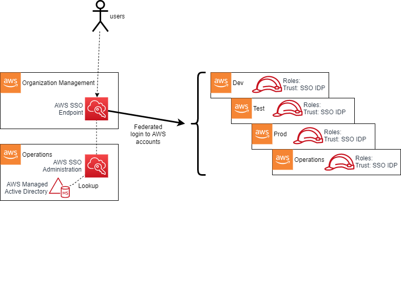
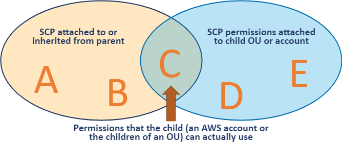

# 1. Authorization and Authentication

## 1.1. Overview

The _AWS Secure Environment Accelerator Architecture_ makes extensive use of AWS authorization and authentication primitives from the Identity and Access Management (IAM) service as a means to enforce the guardrail objectives of the _AWS Secure Environment Accelerator Architecture_, and govern access to the set of accounts that makes up the organization.

## 1.2. Relationship to the Organization Management (root) AWS Account

AWS accounts, as a default position, are entirely self-contained with respect to IAM principals - their Users, Roles, Groups are independent and scoped only to themselves. Accounts created by AWS Organizations deploy a default role with a trust policy back to the Organization Management account. While it can be customized, by default this role is named the `OrganizationAccountAccessRole` (or `AWSControlTowerExecution` when Control Tower is deployed).

As discussed, the AWS Organization resides in the Organization Management (root) account. This account is not used for workloads and is primarily a gateway to the entire cloud footprint for a high-trust principal. It is therefore crucial that all Organization Management account credentials be handled with extreme diligence, and with a U2F hardware key enabled as a second-factor (and stored in a secure location such as a safe) for all users created within this account, including the root user, regardless of privilege level assigned directly within the Management account.

## 1.3. Break Glass Accounts

The Organization Management account is used to provide break glass access to AWS accounts within the organization. Break glass (which draws its name from breaking the glass to pull a fire alarm) refers to a quick means for a person who does not have access privileges to certain AWS accounts to gain access in exceptional circumstances, using an approved process.
Access to AWS accounts within the organization is provided through AWS SSO. The use and creation of IAM users is highly discouraged, with one exception, break glass users. It is generally recommended that organizations create between 2 to 4 IAM break glass users within the Organization Management account. These users would have hardware based MFA enabled and would be leveraged in exceptional circumstances to gain access to the Organization Management account or sub-accounts within the organization by assuming a role. Use cases for break glass access include failure of the organizations IdP, an incident involving the organizations IdP, a failure of AWS SSO, or a disaster involving the loss of an organization’s entire cloud or IdP teams.

To re-iterate, access to the Organization Management account grants ‘super admin’ status, given the organizational-wide trust relationship to the management account. Therefore access to the 2 to 4 break glass IAM users must be tightly controlled, yet accessible via a predefined and strict process. This process often involves one trusted individual having access to a safe containing the password and a different trusted individual having access to a safe with the hardware MFA key – requiring 2 people to access the break glass credentials.

It is worth noting that AWS SCPs are not applicable to the Organization Management account. It is also worth noting that from within the Organization Management account, roles can be assumed in any account within the organization which include broad exclusions from the SCPs (discussed below). These roles are needed to allow the automation tooling to apply and update the guardrails as required, to troubleshoot and resolve issues with the automation tooling, and to bypass the guardrails under approved exception scenarios.

Two primary roles are available for access across the organization from the Management account: the {AcceleratorPrefix}PipelineRole which is excluded from the majority of the SCPs to enable the automation tooling to deploy, manage and update the guardrails and provide access to troubleshoot and resolve issues with the automation tooling; and the standard OrganizationAccountAccessRole which has been only been excluded from SCPs which strictly deliver preventative security controls. The OrganizationAccountAccessRole is within the bounds of the SCPs which protect automation tooling deployed guardrails and functionality. Access to either of these roles is available to any IAM users or roles in the Organization Management account.

## 1.4. Multi-Factor Authentication

The following are commonly used MFA mechanisms, supported by AWS:

-   RSA tokens are a strong form of hardware based MFA authentication but can only be assigned on a 1:1 basis. A unique token is required for every user in every account. You cannot utilize the same token for multiple users or across AWS accounts.
-   Yubikeys are U2F compliant devices and also a strong form of hardware based MFA authentication. Yubikeys have the advantage of allowing many:1 assignment, with multiple users and accounts able to use a single Yubikey.
-   Virtual MFA like Google Authenticator on a mobile device is generally considered a good hardware based MFA mechanism, but is not considered as strong as tokens or Yubikeys. Virtual MFA also adds considerations around device charge and is not suitable for break glass type scenarios.
-   SMS text messages and email based one time tokens are generally considered a weak form of MFA based authentication, but still highly desirable over no MFA.

MFA should be used by all users regardless of privilege level with some general guidelines:

-   Yubikeys provide the strongest form of MFA protection and are strongly encouraged for all account root users and all IAM users in the Organization Management (root) account;
-   the Organization Management (root) account requires a dedicated Yubikey, such that when access is required to a sub-account root user, you do not expose the Organization Management account’s Yubikey;
-   every ~50 sub-accounts requires a dedicated Yubikey to protect the root user, minimizing the required number of Yubikeys and the scope of impact should a Yubikey be lost or compromised;
-   each IAM break glass user requires a dedicated Yubikey, as do any additional IAM users in the Organization Management (root) account. While some CSPs do not recommend MFA on the break glass users, it is strongly encouraged in AWS;
-   the MFA devices for all account root users including the management account and the IAM break glass users should be securely stored, with well defined access policies and procedures;
-   all other AWS users (AWS SSO, IAM in sub-accounts, etc.) regardless of privilege level should leverage virtual MFA devices (like Google Authenticator on a mobile device).

## 1.5. Control Plane Access via AWS SSO

The vast majority of end-users of the AWS cloud within the organization will never use or interact with the Organization Management account, or the root users of any child account in the organization. The _AWS Secure Environment Accelerator Architecture_ recommends instead that AWS SSO be provisioned in the Organization Management account (a rare case where Organization Management account deployment is mandated). SSO administration is then delegated to the Operations account, to further minimize access to the highly restricted management account. Once delegation is in place, the location of the AWS SSO identity source is also delegated, enabling AWS SSO to directly connect to a Managed Active Directory (AD) or other IdP in the Operations account (this previously required an AWS Directory Connector deployed in the Organization Management account).

Users will login to AWS via the web-based endpoint for the AWS SSO service:

AWS SSO then authenticates the user based on the connected Managed Microsoft AD installation (in the Operations account). Based on group membership, the user will be presented with a set of roles to assume into assigned accounts. For example, a developer may be placed into groups that permit Administrative access in a specific developer account and Read-Only access in a test account; meanwhile an IT Cloud Administrator may have high-privilege access to most, or all, accounts. In effect, AWS SSO adds SAML IdP capabilities to the AWS Managed Microsoft AD, with the AWS Console acting as a service-provider (SP) in SAML parlance. Other SAML-aware SPs may also be used with AWS SSO.

### 1.5.1. SSO User Roles

AWS SSO automatically creates an identity provider (IdP) and associated roles in each account in the organization. The roles used by end users have a trust policy to this IdP. When a user authenticates to AWS SSO (via the underlying Managed AD) and selects a role to assume based on their group membership, the SSO service provides the user with temporary security credentials unique to the role session. In such a scenario, the user has no long-term credentials (e.g. password, or access keys) and instead uses their temporary security credentials.

Users, via their AD group membership, are ultimately assigned to SSO user roles via the use of AWS SSO permission sets. A permission set is an assignment of a particular permission policy to an AWS account. For example:

An organization might decide to use **AWS Managed Policies for Job Functions** that are located within the SSO service as the baseline for role-based-access-control (RBAC) separation within an AWS account. This enables job function policies such as:

-   **Administrator** - This policy provides full access to all AWS services and resources in the account;
-   **Power User** - Provides full access to AWS services and resources, but does not allow management of users, groups and policies;
-   **Database Administrator** - Grants full access permissions to AWS services and actions required to set up and configure AWS database services;
-   **View-Only User** - This policy grants permissions to view resources and basic metadata across all AWS services. It does not provide access to get or read workload data.

### 1.5.2. Principal Authorization

Having assumed a role, a user’s permission level within an AWS account with respect to any API operation is governed by the IAM policy evaluation logic flow ([detailed here][iam_flow]):

Having an `allow` to a particular API operation on the role (i.e. session policy) does not necessarily imply that API operation will succeed. As depicted above, a **deny** at any level in the evaluation logic will block access to the API call; for example a restrictive permission boundary or an explicit `deny` at the resource or SCP level will block the call. SCPs are used extensively as a guardrailing mechanism in the _AWS Secure Environment Accelerator Architecture_, and are discussed in a later section.

## 1.6. Root Authorization

Every AWS account has a set of root credentials. These root credentials are generated on account creation with a random 64-character password. It is important that the root credentials for each account be recovered and MFA enabled via the AWS root credential password reset process using the account’s unique email address. To further protect these credentials, the AWS Secure Environment Accelerator Architecture specifically denies the use of the root user via SCP. Root credentials authorize all actions for all AWS services and for all resources in the account (except anything denied by SCPs). There are some actions which only root has the capability to perform which are found within the [AWS documentation](https://docs.aws.amazon.com/general/latest/gr/aws_tasks-that-require-root.html). These are typically rare operations (e.g. creation of X.509 keys), and should not be required in the normal course of business. Root credentials should be handled with extreme diligence, with MFA enabled per the guidance in the previous section.

## 1.7. Service Roles

A service role is an IAM role that a service assumes to perform actions in an account on the user’s behalf. When a user sets up an AWS service, the user must define an IAM role for the service to assume. This service role must include all the permissions that are required for the service to access the AWS resources that it needs. Service roles provide access only within a single account and cannot be used to grant access to services in other accounts. Users can create, modify, and delete a service role from within the IAM service. For example, a user can create a role that allows Amazon Redshift to access an Amazon S3 bucket on the user’s behalf and then load data from that bucket into an Amazon Redshift cluster. In the case of SSO, during the process in which AWS SSO is enabled, the AWS Organizations service grants AWS SSO the necessary permissions to create subsequent IAM roles.

## 1.8. Service Control Policies

Service Control Policies are a key preventative control used by the _AWS Secure Environment Accelerator Architecture_. It is crucial to note that SCPs, by themselves, never _grant_ permissions. They are most often used to `Deny` certain actions at an OU, or account level within an AWS Organization. Since `deny` always overrides `allow` in the IAM policy evaluation logic, SCPs can have a powerful effect on all principals in any account, and can wholesale deny entire categories of actions irrespective of the permission policy attached to the principal itself - even the root user of the account.

SCPs follow an inheritance pattern from all levels of the hierarchy down to the account of the organization:

In order for any principal to be able to perform an action A, it is necessary (but not sufficient) that there is an `Allow` on action A from all levels of the hierarchy down to the account, and no explicit `Deny` anywhere. This is discussed in further detail in [How SCPs Work][scps].

The _AWS Secure Environment Accelerator Architecture_ leverages the following SCPs in the organization:

### 1.8.1. Sensitive policy

This is a comprehensive policy whose main goal is to provide a compliant cloud environment for medium sensitivity workloads, namely prohibiting any non-centralized networking, data-at-rest encryption and mandating data residency in the home region. It should be attached to all top-level OUs with the exception of Unclassified and Sandbox.

| Policy Statement ID (SID) | Description                                                                                                                                                                                                             |
| ------------------------- | ----------------------------------------------------------------------------------------------------------------------------------------------------------------------------------------------------------------------- |
| `PMP`                     | Prevents the modification or creation of AWS Private Marketplace                                                                                                                                                        |
| `ROOT`                    | Prevents the use of the root user                                                                                                                                                                                       |
| `EBS1`                    | Prevents starting EC2 instances without volume level encryption                                                                                                                                                         |
| `EBS2`                    | Prevents the creation of an unencrypted EBS volume                                                                                                                                                                      |
| `EFS1`                    | Prevents the creation of an unencrypted EFS volume                                                                                                                                                                      |
| `RDS`                     | Prevents the creation of an unencrypted RDS instance                                                                                                                                                                    |
| `AUR`                     | Prevents the creation of an unencrypted RDS Aurora cluster                                                                                                                                                              |
| `OTHS`                    | Blocks miscellaneous operations and services including Leave Organization, Modify Payment Methods, Object Sharing, Disabling SSO, and Lightsail, Sumerian, Gamelift, AppFlow, and IQ.                                   |
| `NET2`                    | Prevents the creation of any networking infrastructure such as VPCs, gateways, peering, VPN, etc. Additionally blocks making objects public (RDS, EMR, EC2, etc.) and the creation of IAM users, groups and access keys |
| `GBL2`                    | Within services that are exempted from GBL1, scope the use of those services to the us-east-1 region (ACM, KMS, SNS)                                                                                                    |
| `GBL1`                    | Prevents the use of any service in any non-approved AWS region with the exception of services that are considered global; e.g. CloudFront, IAM, STS, etc.                                                               |

#### 1.8.1.1. Encryption at Rest

Note that the Encryption SCP statements above, taken together, mandate encryption at rest for block storage volumes used in EC2 and RDS instances.

### 1.8.2. Unclassified policy

This policy is only used on the Unclassified OU. This policy is broadly similar to Sensitive; however it relaxes the requirement for non-approved region usage to include additional approved regions. The `GLBL2` services are moved into the `GLBL1` policy.

### 1.8.3. Sandbox policy

This policy is only used on the Sandbox OU and is only appropriate for accounts in which AWS service experimentation is taking place. This policy is broadly similar to Unclassified; however it does not prohibit network infrastructure creation (e.g. VPCs, IGWs), dropping the `NET2` section.

### 1.8.4. Guardrail Protection (Parts 0 and 1)

These guardrails apply across the organization and protect the guardrails and infrastructure deployed by the automation tooling. Note that this policy is split into two parts due to a current limitation of SCP sizing, but logically it should be considered a single policy.

| Policy Statement ID (SID) | Description                                                                                                                                                                    |
| ------------------------- | ------------------------------------------------------------------------------------------------------------------------------------------------------------------------------ |
| `TAG1`                    | Prevents creation, deletion and modification of a protected security group                                                                                                     |
| `TAG2`                    | Prevents creation, deletion and modification and use of any protected IAM resource                                                                                             |
| `S3`                      | Prevents deletion and modification of any S3 bucket used by the automation tooling incl. centralized logs                                                                      |
| `CFN`                     | Prevents creation, deletion or modification of any CloudFormation stacks deployed by the automation tooling                                                                    |
| `ALM`                     | Prevents deletion and modification of protected cloudwatch alarms which alert on significant control plane events                                                              |
| `ROL`                     | Prevents any IAM operation on protected IAM resources                                                                                                                          |
| `SSM`                     | Prevents creation, deletion or modification of any SSM resource deployed by the automation tooling                                                                             |
| `LOG`                     | Prevents the deletion and modification of any CloudWatch Log groups and VPC flow logs                                                                                          |
| `LOG2`                    | Additional CloudWatch Log group protections                                                                                                                                    |
| `LAM`                     | Prevents the creation, deletion and modification of any Lambda functions deployed by the automation tooling                                                                    |
| `NET1`                    | Prevents deletion of any protected networking (VPC) constructs like subnets and route tables                                                                                   |
| `NFW`                     | Prevents destructive operations on protected AWS Network Firewalls                                                                                                             |
| `CT`                      | Prevents deletion and modification of protected Cloud Trails                                                                                                                   |
| `CON`                     | Protects AWS Config configuration from modification or deletion                                                                                                                |
| `CWE`                     | Prevents deletion and modification of protected CloudWatch events                                                                                                              |
| `RUL`                     | Protects AWS Config rules from modification or deletion                                                                                                                        |
| `Deny`                    | Protects deletion and modification of protected KMS keys                                                                                                                       |
| `IAM`                     | Protects creation, deletion, and modification of protected IAM policies                                                                                                        |
| `ACM`                     | Prevents deletion of a protected certificates and Load Balancers                                                                                                               |
| `SEC`                     | Prevents the deletion and modification to AWS security services like GuardDuty, Security Hub, Macie, Firewall Manager, Access Analyzer, password policies, and resource shares |
| `SNS`                     | Prevents creation, deletion and modification of a protected SNS topics                                                                                                         |
| `RDGW`                    | Prevents the modification of the role used for Remote Desktop Gateway                                                                                                          |
| `KIN`                     | Prevents creation, deletion and modification of a protected Kinesis streams                                                                                                    |

Note: Two versions of the Part-0 policy exist (`CoreOUs` and `WkldOUs`), with the Wkld OUs version of the policy removing `SNS`, `RDGW`, and `KIN` sections as they are not relevant outside the Security and Infrastructure OUs.

### 1.8.5. Quarantine New Object

This policy is attached to an account to ‘quarantine’ it - to prevent any AWS operation from taking place. This is useful in the case of an account with credentials which are believed to have been compromised. This policy is also applied to new accounts upon creation. After the installation of guardrails, it is removed. In the meantime, it prevents all AWS control plane operations except by principals required to deploy guardrails.

| Policy Statement ID (SID)                 | Description                                                                      |
| ----------------------------------------- | -------------------------------------------------------------------------------- |
| `DenyAllAWSServicesExceptBreakglassRoles` | Blanket denial on all AWS control plane operations for all non-break-glass roles |

[root]: https://docs.aws.amazon.com/general/latest/gr/aws_tasks-that-require-root.html
[iam_flow]: https://docs.aws.amazon.com/IAM/latest/UserGuide/reference_policies_evaluation-logic.html
[scps]: https://docs.aws.amazon.com/organizations/latest/userguide/orgs_manage_policies_scps-about.html
