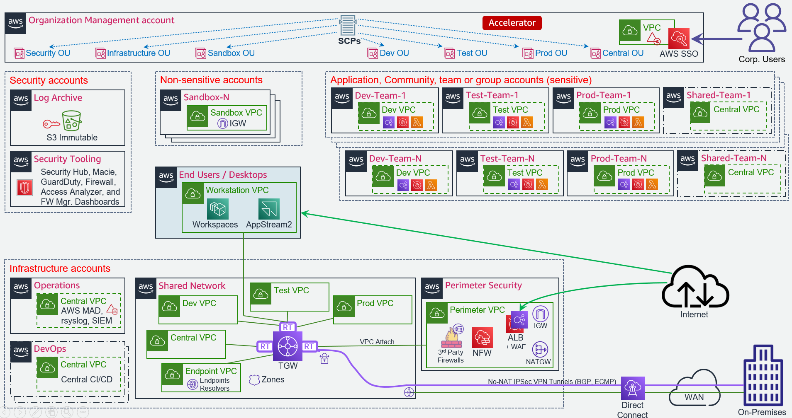
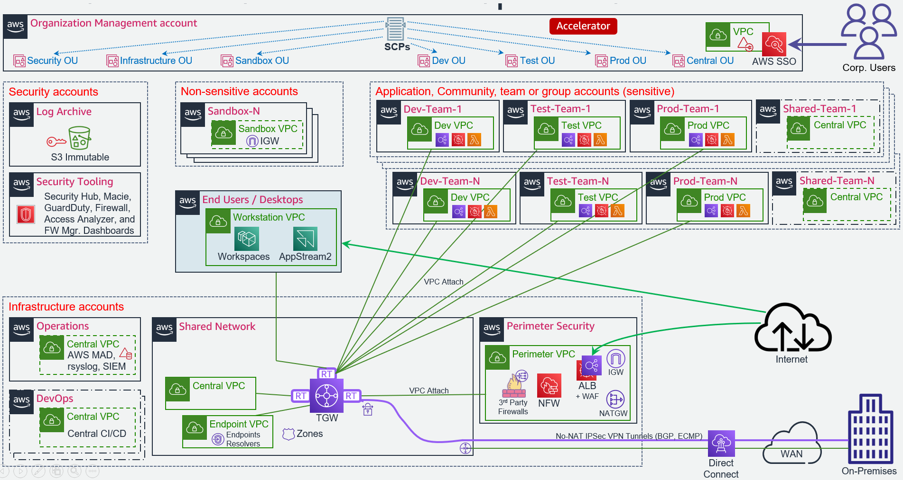

# 1. AWS Secure Environment Accelerator Reference Architecture

## 1.1. Overview

The _AWS Secure Environment Accelerator (ASEA) Reference Architecture_ is a comprehensive, multi-account AWS cloud architecture, which was designed working backwards from AWS customers with high compliance requirements like federal, provincial and municipal governments. The _ASEA Reference Architecture_ has been designed to address central identity and access management, governance, data security, comprehensive logging, and network design/segmentation per security frameworks like NIST 800-53, ITSG-33, FEDRAMP Moderate, IRAP and other [Sensitive][sensitive] or Medium level security profiles.

This document is solely focused on the deployed or resulting reference architecture and does NOT talk about the tooling, mechanisms, or automation engine used to deploy the architecture. The [AWS Secure Environment Accelerator](https://github.com/aws-samples/aws-secure-environment-accelerator) (ASEA) is one tool capable of deploying this architecture (along with many other architectures), but customers are free to choose whichever mechanism they deem appropriate to deploy it. Readers should refer to the [ASEA documentation](https://aws-samples.github.io/aws-secure-environment-accelerator/index.html) for references to the ASEA architecture, design, operation, and troubleshooting. If using the ASEA automation engine, this document reflects the resulting architecture deployed using one of the Medium ASEA sample configuration files. This architecture document should stand on its own in depicting the `deployed` architecture.

The _ASEA Architecture_ is a standalone architecture, irrespective of how it was delivered into a customer AWS environment. It is nonetheless anticipated that most customers will choose to realize their _ASEA Architecture_ via the delivery mechanism of the _ASEA_ automation engine. Except where absolutely necessary, this document will refrain from referencing the _ASEA_ automation engine further.

## 1.2. Introduction

The _AWS Secure Environment Accelerator (ASEA) Reference Architecture_ has been built with the following design principles:

1. Deliver security outcomes aligned with a medium level security control profile;
2. Maximize agility, scalability, and availability, while minimizing cost;
3. Enable the full capabilities of the AWS cloud;
4. Be adaptable to evolving technological capabilities in the underlying platform being used in the _AWS Secure Environment Accelerator Architecture_;
5. Allow for seamless auto-scaling and provide unbounded bandwidth as bandwidth requirements increase (or decrease) based on actual customer load (a key aspect of the value proposition of cloud computing);
6. Architect for high availability: the design stretches across two physical AWS Availability Zones (AZ), such that the loss of any one AZ does not impact application availability. The design can be easily extended to a third availability zone;
7. Operate as least privilege: all principals in the accounts are intended to operate with the lowest-feasible permission set.

### 1.2.1. Purpose of Document

This document is intended to outline the technical measures that are delivered by the _AWS Secure Environment Accelerator Reference Architecture_. This includes a summary of the major architectural decisions.

### 1.2.2. Architecture Summary

The central features of the _AWS Secure Environment Accelerator Architecture_ are as follows:

-   **AWS Organization with multiple-accounts:** An [AWS Organization][aws_org] is a grouping construct for a number of separate AWS accounts that are controlled by a single customer entity. This provides consolidated billing, account grouping using organizational units, and facilitates the deployment of pan-organizational guardrails such as API logging with CloudTrail and preventative controls using AWS Service Control Policies (SCPs). Separate AWS accounts provide strong control-plane and data-plane isolation between workloads and/or environments, as if they were owned by different AWS customers. The solution provides a prescriptive AWS account structure, giving different accounts different security personas based on its grouping.

-   **Preventative security controls:** Protect the architecture, prevent the disablement of guardrails, and block undesirable user behavior. These are implemented using AWS Service Control Policies ([SCPs][aws_scps]). SCPs provide a guardrail mechanism principally used to deny specific or entire categories of API operations at an AWS account, OU, or organization level. These can be used to ensure workloads are deployed only in prescribed regions, or deny access to specific AWS services. The solution provides prescriptive SCPs.

-   **Encryption:** AWS Key Management Service (KMS) with customer-managed keys is used to encrypt data stored at rest using FIPS 140-2 validated encryption, whether in S3 buckets, EBS volumes, RDS databases, or other AWS services storing data. Data in-transit is protected using TLS 1.2 or higher encryption.

-   **Centralized, isolated networking:** [AWS Virtual Private Clouds][aws_vpc] (VPCs) are used to create data-plane isolation between workloads, centralized in a shared-network account. Centralization enables strong segregation of duties and cost optimization. Connectivity to on-premises environments, internet egress, shared resources and AWS APIs are mediated at a central point of ingress/egress via the use of [Transit Gateway][aws_tgw], [Site-to-Site VPN][aws_vpn], Next-Gen Firewalls, and [AWS Direct Connect][aws_dc] (where applicable). The centralized VPC architecture is not for all customers; for customers less concerned with cost optimization, an option exists for local account based VPCs interconnected via the Transit Gateway in the central shared-network account. Under both options, the architecture prescribes moving AWS public API endpoints into the customer's private VPC address space, using centralized endpoints for cost efficiency.

-   **Segmentation and Separation:** Not only does the architecture provide strong segmentation and separation between workloads belonging to different stages of the SDLC cycle, or between different IT administrative roles (like between networking, ingress/egress firewalls, and workloads), it offers a strong network zoning architecture, micro-segmenting the environment by wrapping every instance or component in a stateful firewall which is enforced in the hardware of the AWS Nitro System. All flows are tightly enforced, with lateral movement prevented between applications, tiers within an application, and nodes in a tier of an application unless explicitly allowed. Further, routing is prevented between Dev, Test, and Prod with recommendations on a CI/CD architecture to enable developer agility and ease code promotion between environments with appropriate approvals.

-   **Centralized DNS management:** [Amazon Route 53][aws_r53] is used to provide unified public and private hosted zones across the cloud environment. Inbound and Outbound Route 53 Resolvers extend this unified view of DNS to on-premises networks.

-   **Centralized logging:** CloudTrail logs are enabled organization-wide to provide full control plane auditability across the cloud environment. CloudWatch Logs, AWS' cloud natice logging service is used to capture a wide variety of logs including OS and application logs, VPC flow logs, and DNS logs which are then centralized and deletion is prevented using SCPs. The architecture prescribes comprehensive log collection and centralization across AWS services and accounts.

-   **Centralized security monitoring:** Compliance drift and security threats are surfaced across the customer's AWS organization via the automatic deployment of a multitude of different types of detective security controls. This includes enabling the multitude of AWS security services in every account in the customers AWS organization including Amazon GuardDuty, AWS Security Hub, AWS Config, AWS Firewall Manager, Amazon Macie, Access Analyzer, CloudWatch Alarms with control and visibility delagated across the multi-account environment to a single central security tooling account for easy organization-wide visibility to all security findings and compliance drift. In addition, the security account has been provided View-Only access across the organization (including access to each account's CloudWatch console) to enable investigation during an incident. View-Only access is different from Read-Only access in that it does not provide any access to any data. Finally, an optional add-on is available to consume the comprehensive set of centralized logs making them searchable, providing correlation and basic dashboards.

-   **Single Sign-On**: AWS SSO is used to provide centralized IAM role assumption into AWS accounts across the organization for authorized principals. An organization's existing identities can be sourced from a customer's existing Active Directory identity store or other 3rd party identity provider (IdP). AWS enables MFA enforcement using Authenticator apps, Security keys and built-in authenticators, supporting WebAuthn, FIDO2, and U2F based authentication and devices.

-   **Centralized ingress/egress IaaS inspection:** It is common to see centralized ingress/egress requirements for IaaS based workloads. The architecture provides said functionality, enabling customers to decide if native AWS ingress/egress firewall inspection services meet their requirements, or to augment those capabilities with 3rd party firewall appliances. The architecture supports starting with an AWS firewall, switching to a 3rd party firewall, or a combination of ingress/egress firewall technologies.

-   **Automation:** Automation is a critical component of the architecture. It ensures guardrails are consistently applied as new AWS accounts are added to the organization as new teams and workloads are brought onboard. It remediates compliance drift and provides guardrails in the root organization account.

The following diagram illustrates the AWS ASEA reference architecture:



The following diagram illustrates an alternative AWS ASEA reference architecture which uses spoke VPCs (instead of centralized VPCs):



### 1.2.3. Relationship to other AWS reference architectures

The _AWS Secure Environment Accelerator Architecture_ builds upon AWS standardized design patterns and best practices. The architecture aligns with AWS multi-account guidance, the foundation provided by AWS Control Tower, the AWS Secure Environment Accelerator sample architecture, and the AWS Security reference architecture.

### 1.2.4. Document Conventions

The following conventions are used throughout this document.

#### 1.2.4.1. AWS Account Numbers

AWS account numbers are decimal-digit pseudorandom identifiers with 12 digits (e.g. `651278770121`). This document will use the convention that an AWS Organization Management (root) account has the account ID `123456789012`, and child accounts are represented by `111111111111`, `222222222222`, etc.

For example the following ARN would refer to a VPC subnet in the `ca-central-1` region in the Organization Management (root) account:

    arn:aws:ec2:ca-central-1:123456789012:subnet/subnet-024759b61fc305ea3

#### 1.2.4.2. JSON Annotation

Throughout the document, JSON snippets may be annotated with comments (starting with `//`). The JSON language itself does not define comments as part of the specification; these must be removed prior to use in most situations, including the AWS Console and APIs.

For example:

```jsonc
{
    "Effect": "Allow",
    "Principal": {
        "AWS": "arn:aws:iam::123456789012:root" // Trust the Organization Management (root) account.
    },
    "Action": "sts:AssumeRole"
}
```

The above is not valid JSON without first removing the comment on the fourth line.

#### 1.2.4.3. IP Addresses

The design makes use of [RFC1918][1918] addresses (e.g. `10.1.0.0/16`) and [RFC6598][6598] (e.g. `100.96.250.0/23`) for various networks; these will be labeled accordingly. Any specific range or IP shown is purely for illustration purposes only.

### 1.2.5. Customer Naming

This document will make no reference to specific AWS customers. Where naming is required (e.g. in domain names), this document will use a placeholder name as needed; e.g. `example.ca`.

[sensitive]: https://www.canada.ca/en/government/system/digital-government/modern-emerging-technologies/cloud-services/government-canada-security-control-profile-cloud-based-it-services.html#toc4
[aws_org]: https://aws.amazon.com/organizations/
[aws_scps]: https://docs.aws.amazon.com/organizations/latest/userguide/orgs_manage_policies_type-auth.html#orgs_manage_policies_scp
[aws_vpn]: https://docs.aws.amazon.com/vpn/latest/s2svpn/VPC_VPN.html
[aws_dc]: https://aws.amazon.com/directconnect/
[aws_vpc]: https://aws.amazon.com/vpc/
[aws_tgw]: https://aws.amazon.com/transit-gateway/
[aws_r53]: https://aws.amazon.com/route53/
[1918]: https://tools.ietf.org/html/rfc1918
[6598]: https://tools.ietf.org/html/rfc6598
