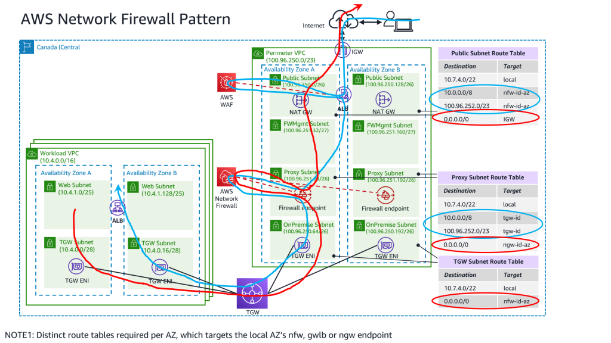

# 1. Accelerator Basic Operation and Frequently asked Questions

## 1.1. Operational Activities

??? faq "1.1.1. How do I add new AWS accounts to my AWS Organization?"

    #### How do I add new AWS accounts to my AWS Organization?

    We offer three options and all can be used in the same Accelerator deployment. All options work with AWS Control Tower, ensuring the account is both ingested into Control Tower and all Accelerator guardrails are automatically applied.

    No matter the mechanism you choose, new accounts will automatically be blocked from use until fully guardrailed, the Accelerator will automatically execute, and accounts will automatically be ingested into AWS Control Tower (if deployed).

    **Option 1**

    Users can simply add the following five lines to the configuration file `workload-account-configs` section and rerun the state machine. The majority of the account configuration will be picked up from the OU the AWS account has been assigned. You can also add additional account specific configuration, or override items like the default OU budget with an account specific budget. This mechanism is often used by customers that wish to programmatically create AWS accounts using the Accelerator and allows for adding many new accounts at one time.

    ```json
    "fun-acct": {
      "account-name": "TheFunAccount",
      "email": "myemail+aseaT-funacct@example.com",
      "src-filename": "config.json",
      "ou": "Sandbox"
    }
    ```

    **Option 2**

    We've heard consistent feedback that our customers wish to use native AWS services and do not want to do things differently once security controls, guardrails, or accelerators are applied to their environment. In this regard, simply create your new AWS account in AWS Organizations as you did before\*\*, either by a) using the AWS Console or b) by using standard AWS account creation API's, CLI or 3rd party tools like Terraform.

    - \*\* **IMPORTANT:** When creating the new AWS account using AWS Organizations, you need to specify the role name provided in the Accelerator configuration file `global-options\organization-admin-role`, otherwise we cannot bootstrap the account. In Control Tower  installations, this **MUST** be set to **_`AWSControlTowerExecution`_**, for customers who installed prior to v1.2.5 this value is **_`AWSCloudFormationStackSetExecutionRole`_** and after v1.2.5 we were recommending using the role **_`OrganizationAccountAccessRole`_** as this role is used by default by AWS Organizations if no role name is specified when creating AWS accounts through the AWS console or cli.
    - On account creation we will apply a quarantine SCP which prevents the account from being used by anyone until the Accelerator has applied the appropriate guardrails
    - Moving the account into the appropriate OU triggers the state machine and the application of the guardrails to the account, once complete, we will remove the quarantine SCP.
        - **NOTE:** Accounts CANNOT be moved between OU's to maintain compliance, so select the proper top-level OU with care
        - In AWS Organizations, select ALL the newly created AWS accounts and move them all (preferably at once) to the correct destination OU (assuming the same OU for all accounts)
        - In case you need to move accounts to multiple OU's we have added a 2 minute delay before triggering the State Machine
        - Any accounts moved after the 2 minute window will NOT be properly ingested, and will need to be ingested on a subsequent State Machine Execution.

    **Option 3**

    Create your account using Account Factory in the AWS Control Tower console.

??? faq "1.1.2. I tried to enroll a new account via Control Tower but it failed?"

    #### I tried to enroll a new account via Control Tower but it failed?

    or "The state machine failed during the 'Load Organization Configuration' step with the error 'The Control Tower account: ACCOUNT_NAME is in a failed state ERROR'"

    If account enrollment fails within Control Tower, you will need to follow the troubleshooting steps [here](https://docs.aws.amazon.com/controltower/latest/userguide/troubleshooting.html). A common reason for this is not having the `ControlTowerExectution` role created in the account you are trying to enroll. Even after you successfully enroll the account, it is possible the state machine will fail at `Load Organization Configuration`. If you look at the CloudWatch logs you will see the error message:

    ```text
    There were errors while loading the configuration: The Control Tower account: ACCOUNT_NAME is in a failed state ERROR.
    ```

    This is because the Accelerator checks that there are no errors with Control Tower before continuing. In some cases Control Tower can leave an orphaned Service Catalog product in an **Error** state. You need to cleanup Control Towers Service Catalogs Provisioned Products so there are no products remaining in an error or tainted state before you can successfully re-run the state machine.

??? faq "1.1.3. Can I use AWS Organizations for all tasks I currently use AWS Organizations for?"

    #### Can I use AWS Organizations for all tasks I currently use AWS Organizations for?

    In AWS Organizations you can continue to:

    - create and rename AWS accounts
    - move AWS accounts between OU's
    - create, delete and rename OU's, including support for nested OU's
    - create, rename, modify, apply and remove SCP's

    What can't I do:

    - modify Accelerator or Control Tower controlled SCP's
    - add/remove SCP's on top-level OU's (these are Accelerator and/or Control Tower controlled)
        - users can change SCP's on non-top-level OU's and non-Accelerator controlled accounts as they please
    - add/remove SCP's on specific accounts that have Accelerator controlled SCPs
    - move an AWS account between top-level OU's (i.e. `Sandbox` to `Prod` is a security violation)
        - moving between `Prod/sub-ou-1` to `Prod/sub-ou2` or `Prod/sub-ou2/sub-ou2a/sub-ou2ab` is fully supported
    - create a top-level OU (need to validate, as they require config file entries)
    - remove quarantine SCP from newly created accounts
    - we do not support forward slashes (`/`) in OU names, even though the AWS platform does

    More details:

    - If an AWS account is renamed, an account email is changed, or an OU is renamed, on the next state machine execution, the config file will automatically be updated.
    - If you edit an Accelerator controlled SCP through Organizations, we will reset it per what is defined in the Accelerator configuration files.
    - If you add/remove an SCP from a top-level OU or Accelerator controlled account, we will put them back as defined in the Accelerator configuration file.
    - If you move an account between top-level OU's, we will put it back to its original designated top-level OU.
    - The Accelerator fully supports nested OU's, customers can create any depth OU structure in AWS Organizations and add/remove/change SCP's _below_ the top-level as they desire or move accounts between these OU's without restriction. Users can create OU's to the full AWS OU structure/depth
    - Except for the Quarantine SCP applied to specific accounts, we do not 'control' SCP's below the top level, customers can add/create/customize SCP's
        - as of v1.3.3 customers can optionally control account level SCP's through the configuration file

??? faq "1.1.4. How do I make changes to items I defined in the Accelerator configuration file during installation?"

    #### How do I make changes to items I defined in the Accelerator configuration file during installation?

    Simply update your configuration file in CodeCommit and rerun the state machine! In most cases, it is that simple.

    If you ask the Accelerator to do something that is not supported by the AWS platform, the state machine will fail, so it needs to be a supported capability. For example, the platform does not allow you to change the CIDR block on a VPC, but you can accomplish this as you would today by using the Accelerator to deploy a new second VPC, manually migrating workloads, and then removing the deprecated VPC from the Accelerator configuration.

    Below we have also documented additional considerations when creating or updating the configuration file.

    It should be noted that we have added code to the Accelerator to block customers from making many 'breaking' or impactful changes to their configuration files. If someone is positive they want to make these changes, we also provide override switches to allow these changes to be attempted forcefully.

??? faq "1.1.5. Can I update the config file while the State Machine is running? When will those changes be applied?"

    #### Can I update the config file while the State Machine is running? When will those changes be applied?

    Yes. The state machine captures a consistent input state of the requested configuration when it starts. The running Accelerator instance does not see or consider any configuration changes that occur after it has started. All configuration changes occurring after the state machine is running will only be leveraged on the _next_ state machine execution.

??? faq "1.1.6. What if I really mess up the configuration file?"

    #### What if I really mess up the configuration file?

    The Accelerator is designed with checks to compare your current configuration file with the version of the config file from the previous successful execution of the state machine. If we believe you are making major or breaking changes to the config file, we will purposefully fail the state machine. See [Config file and Deployment Protections](../installation/customization-index.md#15-config-file-and-deployment-protections) for more details.

    With the release of v1.3.0 we introduced state machine scoping capabilities to further protect customers, detailed [here](../installation/sm_inputs.md).

??? faq "1.1.7. What if my State Machine fails? Why? Previous solutions had complex recovery processes, what's involved?"

    #### What if my State Machine fails? Why? Previous solutions had complex recovery processes, what's involved?

    If your main state machine fails, review the error(s), resolve the problem and simply re-run the state machine. We've put a huge focus on ensuring the solution is idempotent and to ensure recovery is a smooth and easy process.

    Ensuring the integrity of deployed guardrails is critical in operating and maintaining an environment hosting protected data. Based on customer feedback and security best practices, we purposely fail the state machine if we cannot successfully deploy guardrails.

    Additionally, with millions of active customers each supporting different and diverse use cases and with the rapid rate of evolution of the AWS platform, sometimes we will encounter unexpected circumstances and the state machine might fail.

    We've spent a lot of time over the course of the Accelerator development process ensuring the solution can roll forward, roll backward, be stopped, restarted, and rerun without issues. A huge focus was placed on dealing with and writing custom code to manage and deal with non-idempotent resources (like S3 buckets, log groups, KMS keys, etc.). We've spent a lot of time ensuring that any failed artifacts are automatically cleaned up and don't cause subsequent executions to fail. We've put a strong focus on ensuring you do not need to go into your various AWS sub-accounts and manually remove or cleanup resources or deployment failures. We've also tried to provide usable error messages that are easy to understand and troubleshoot. As new scenarios are brought to our attention, we continue to adjust the codebase to better handle these situations.

    Will your state machine fail at some point in time, likely. Will you be able to easily recover and move forward without extensive time and effort, YES!

??? faq "1.1.8. How do I update some of the supplied sample configuration items found in reference-artifact, like SCPs and IAM policies?"

    #### How do I update some of the supplied sample configuration items found in reference-artifact, like SCPs and IAM policies?

    To override items like SCP's or IAM policies, customers simply need to provide the identically named file in their input bucket. As long as the file exists in the correct folder in the customers input bucket, the Accelerator will use the customers supplied version of the configuration item, rather than the Accelerator version. Customer SCP's need to be placed into a folder named `scp` and IAM policies in a folder named `iam-policy` (case sensitive).

    The Accelerator was designed to allow customers complete customization capabilities without any requirement to update code or fork the GitHub repo. Additionally, rather than forcing customers to provide a multitude of config files for a standard or prescriptive installation, we provide and auto-deploy with Accelerator versions of most required configuration items from the reference-artifacts folder of the repo. If a customer provides the required configuration file in their Accelerator S3 input bucket, we will use the customer supplied version of the configuration file rather than the Accelerator version. At any time, either before initial installation, or in future, a customer can place new or updated SCPs, policies, or other supported file types into their input bucket and we will use those instead of or in addition to Accelerator supplied versions. Customer only need to provide the specific files they wish to override, not all files.

    Customers can also define additional SCPs (or modify existing SCPs) using the name, description and filename of their choosing, and deploy them by referencing them on the appropriate organizational unit in the config file.

    Prior to v1.2.5, if we updated the default files, we overwrote customers customizations during upgrade. Simply updating the timestamp _after_ upgrade on the customized versions and then rerunning the state machine re-instates customer customizations. In v1.2.5 we always use the customer customized version from the S3 bucket. Its important customers assess newly provided defaults during an upgrade process to ensure they are incorporating all the latest fixes and improvements. If a customer wants to revert to Accelerator provided default files, they will need to manually copy it from the repo into their input bucket.

    NOTE: Most of the provided SCPs are designed to protect the Accelerator deployed resources from modification and ensure the integrity of the Accelerator. Extreme caution must be exercised if the provided SCPs are modified. In v1.5.0 we restructured the SCPs based on a) customer requests, and b) the addition of Control Tower support for new installs.

    - we reorganized and optimized our SCP's from 4 SCP files down to 3 SCP files, without removing any protections or guardrails;
    - these optimizations have resulted in minor enhancements to the SCP protections and in some cases better scoping;
    - the first two SCP files (Part-0 and Part-1) contain the controls which protect the integrity of the Accelerator itself;
    - the third file (Sensitive, Unclass, Sandbox) contains customer data protection specific guardrails, which may change based on workload data classification or customer profiles and requirements;
    - this freed the fourth SCP for use by Control Tower. As Control Tower leverages 2 SCP files on the Security OU, we have moved some of our SCP's to the account level.

??? faq "1.1.9. I deployed AWS Managed Active Directory (MAD) as part of my deployment, how do I manage Active Directory domain users, groups, and domain policies after deployment?"

    #### I deployed AWS Managed Active Directory (MAD) as part of my deployment, how do I manage Active Directory domain users, groups, and domain policies after deployment?

    Customers have clearly indicated they do NOT want to use the Accelerator to manage their Active Directory domain or change the way they manage Active Directory on an ongoing basis. Customer have also indicated, they need help getting up and running quickly. For these reasons, the Accelerator only sets the domain password policy, and creates AD users and groups on the initial installation of MAD. After the initial installation, customers must manage Windows users and groups using their traditional tools. A bastion Windows host is deployed as a mechanism to support these capabilities. Passwords for all newly created MAD users have been stored, encrypted, in AWS Secrets Manager in the Management (root) Organization AWS account.

    To create new users and groups:

    - RDP into the ASEA-RDGW bastion host in the Ops account
        - Run ADUC and create users and groups as you please under the NETBIOSDOMAIN (example) tree
    - Or run the appropriate PowerShell command
    - Go to AWS SSO and map the Active Directory group to the appropriate AWS account and permission set

    The Accelerator will not create/update/delete new AD users or groups, nor will it update the domain password policy after the initial installation of Managed Active Directory. It is your responsibility to rotate these passwords on a regular basis per your organizations password policy. (NOTE: After updating the admin password it needs to be stored back in secrets manager).

??? faq "1.1.10. How do I suspend an AWS account?"

    #### How do I suspend an AWS account?

    Suspending accounts is blocked via SCP and purposely difficult, two options exist:

    1. Modify SCP method (not desired)
    2. Leverage the UnManaged OU

        - validate your config file contains the value: `"ignored-ous": ["UnManaged"]`
            - the state machine must be executed at least once after this value is added to the config file
        - In AWS Organizations create an OU named `UnManaged` in the root of the OU tree, if it does not exist
        - Change to the `us-east-1` region and open CloudWatch and navigate to Rules
            - Select the `PBMMAccel-MoveAccount_rule`, select actions, select `Disable`
        - In Organizations move the account to be suspended to the `UnManaged` OU
        - Change to the `us-east-1` region and open CloudWatch and navigate to Rules
            - Select the `PBMMAccel-MoveAccount_rule`, select actions, select `Enable`
        - login to the account to be suspended as the account root user
        - suspend the account through `My Account`
        - Run the state machine (from the Organization management account), the account will:
            - have a deleted=true value added to the config file
            - be moved to the suspended OU (OU value and path stays the same in the config file)
            - deleted=true causes OU validation to be skipped on this account on subsequent SM executions
        - If the AWS account was listed in the mandatory-accounts section of the config file the SM will fail (expected)
            - after the above tasks have been completed, remove all references to the suspended mandatory account from the config file
            - rerun the state machine, specifying: `{ "overrideComparison": true }`
        - Deleted accounts will continue to appear under the `Suspended` OU for 90-days

??? faq "1.1.11. I need a new VPC, where shall I define it?"

    #### I need a new VPC, where shall I define it?

    You can define a VPC in one of four major sections of the Accelerator configuration file:

    - within an organization unit (this is the recommended and preferred method);
    - within an account in mandatory-account-configs;
    - within an account in workload-account-configs;
    - defined within an organization unit, but opted-in within the account config.

    We generally recommend most items be defined within organizational units, such that all workload accounts pickup their persona from the OU they are associated and minimize per account configuration. Both a local account based VPC (as deployed in the Sandbox OU accounts), or a central shared VPC (as deployed in the Dev/Test/Prod OU accounts in many of the example configs) can be defined at the OU level.

    As mandatory accounts often have unique configuration requirements, for example the centralized Endpoint VPC, they must be configured within the account's configuration. Customers can define VPC's or other account specific settings within any account's configuration, but this requires editing the configuration file for each account configuration.

    Prior to v1.5.0, local VPC's defined at the OU level were each deployed with the same CIDR ranges and therefor could not be connected to a TGW. Local VPC's requiring centralized networking (i.e. TGW connectivity) were required to be defined in each account config, adding manual effort and bloating the configuration file.

    The addition of `dynamic` and `lookup` CIDR sources in v1.5.0 resolves this problem. Local VPCs can be defined in an OU, and each VPC will be dynamically assigned a unique CIDR range from the assigned CIDR pool, or looked up from the DynamoDB database. Customers can now ensure connected, templated VPCs are consistently deployed to every account in an OU, each with unique IP addresses.

    v1.5.0 also added a new opt-in VPC capability. A VPC is defined in an OU and a new config file variable is added to this VPC `opt-in: true`. When opt-in is set to true, the state machine does NOT create the VPC for the accounts in the OU, essentially ignoring the VPC definition. Select accounts in the OU can then be opted-in to the VPC(s) definition, by adding the value `accountname\opt-in-vpcs: [“opt-in-vpc-name1”, “opt-in-vpc-name2”, “opt-in-vpc-nameN”]` to the specific accounts which need the VPC(s). A VPC definition with the specified name (i.e. `opt-in-vpc-name1`) and the value `opt-in: true`, must exist in the OU config for the specified account. When these conditions apply, the VPC will be created in the account per the OU definition. Additional opt-in VPCs can be added to an account, but VPC's cannot be removed from the opt-in-vpcs array. VPC's can be TGW attached, assuming `dynamic` cidr-src is utilized, or DynamoDB is prepopulated with the required CIDR ranges using `lookup` mode. `cidr-src` provided is suitable for disconnected Sandbox type accounts.

    The Future: While Opt-In VPCs are powerful, we want to take this further. Why not deploy an AWS Service Catalog template which contains the names of all the available opt-in VPCs for the accounts OU, inside each account. An account end user could then request a new VPC for their account from the list of available opt-in patterns. A user's selection would be sent to a centralized queue for approval (w/auto-approval options), which would result in the opt-in-vpc entry in that account being updated with the end users requested VPC pattern and the personalized VPC being created in the account and attached to the centralized TGW (if part of the pattern). This would ensure all VPC's conformed to a set of desirable design patterns, but also allow the end-user community choices based on their desired development and app patterns. If you like this idea, please +1 [this](https://github.com/aws-samples/aws-secure-environment-accelerator/issues/738) feature request.

??? faq "1.1.12. How do I modify and extend the Accelerator or execute my own code after the Accelerator provisions a new AWS account or the state machine executes?"

    #### How do I modify and extend the Accelerator or execute my own code after the Accelerator provisions a new AWS account or the state machine executes?

    Flexibility:

    - The AWS Secure Environment Accelerator was developed to enable extreme flexibility without requiring a single line of code to be changed. One of our primary goals throughout the development process was to avoid making any decisions that would result in users needing to fork or branch the Accelerator codebase. This would help ensure we had a sustainable and upgradable solution for a broad customer base over time.
    - Functionality provided by the Accelerator can generally be controlled by modifying the main Accelerator configuration file.
    - Items like SCP's, rsyslog config, PowerShell scripts, and iam-policies have config files provided and auto-deployed as part of the Accelerator to deliver on the prescriptive architecture (these are located in the \reference-artifacts folder of the GitHub repo for reference). If you want to alter the functionality delivered by any of these additional config files, you can simply provide your own by placing it in your specified Accelerator bucket in the appropriate sub-folder. The Accelerator will use your provided version instead of the supplied repo reference version.
    - As SCP's and IAM policies are defined in the main config file, you can simply define new policies, pointing to new policy files, and provide these new files in your bucket, and they will be used.
    - While a sample firewall config file is provided in the \reference-artifacts folder, it must be manually placed in your S3 bucket/folder on new Accelerator deployments
    - Any/all of these files can be updated at any time and will be used on the next execution of the state machine
    - Over time, we predict we will provide several sample or reference architectures and not just the current single PBMM architecture (all located in the \reference-artifacts\SAMPLE_CONFIGS folder).

    Extensibility:

    - Every execution of the state machine sends a state machine status event to a state machine SNS topic
    - These status events include the Success/Failure status of the state machine, and on success, a list of all successfully processed AWS accounts
    - While this SNS topic is automatically subscribed to a user provided email address for user notification, users can also create additional SNS subscriptions to enable triggering their own subsequent workflows, state machines, or custom code using any supported SNS subscription type (Lambda, SQS, Email, HTTPS, HTTPS)
    - Additionally, objects deployed within an account have been populated in Parameter Store, see answer 1.3.2 for details

    Example:

    - One of our early adopter customers has developed a custom user interface which allows their clients to request new AWS environments. Clients provide items like cost center, budget, and select their environment requirements (i.e. Sandbox, Unclass or full sensitive SDLC account set). On appropriate approval, this pushes the changes to the Accelerator configuration file and triggers the state machine.
    - Once the state machine completes, the SNS topic triggers their follow-up workflow, validates the requested accounts were provisioned, updates the customer's account database, and then executes a collection of customer specific follow-up workflow actions on any newly provisioned accounts.

??? faq "1.1.13. How can I easily access my virtual machines or EC2 instances?"

    #### How can I easily access my virtual machines or EC2 instances?

    The preferred and recommended method to connect to instances within the Accelerator is by using AWS Systems Manager Session Manager. Session Manager allows access to instances without the need to have any open firewall ports. Session Manager allows for Command line access to instances (both Windows and Linux) directly through the AWS console, with all activity logged to CloudWatch Logs. Session Manager enables customers to connect to Windows instances with a native RDP client and Linux instances with a native SSH client, if desired. Customers can gain quick access to instances through the AWS console, or using their preferred clients.

    **General**

    - Both the RDGW and rsyslog instances deployed in the Ops account are properly configured for Systems Manager Session Manager
    - We have implemented automation such that all instances are also automatically configured for Session Manager (i.e. configured with the appropriate launch role, has a recent session manager agent installed (most amazon AMI's do), has access to an SSM endpoint)

    **NEW** - System Manager Fleet Manager is now available, which allows connecting graphically to Windows desktops directly from the AWS console without the need for any command line access or tools, and without any requirement for an RDSH/RDP client. As the Accelerator configures Systems Manager, this feature "simply works" for most instances deployed within the Accelerator.

        - Navigate to Systems Manager, open Fleet Manager, select an instance, click "Node Actions" and select "Connect with Remote Desktop". If you are logging in via AWS SSO, you can seamlessly connect. IAM users must supply valid credentials.

    **Connecting to an Instance**

    - From the AWS Console
        - Go to: EC2, Instances, select the instance (i.e. ASEA-RDGW), click “Connect”, select Session Manager, Connect
        - Ideal for Linux or Windows PowerShell users
        - Everything is fully logged for future reference
    - Directly through local RDP client using Session Managers tunnel capability:
        - Provides direct access to your instances/host without any open internet ports on the RDGW instance, using a local/fat client tool
        - Install AWS CLI v2 on your PC - available [here](https://docs.aws.amazon.com/cli/latest/userguide/install-cliv2.html) (uninstall CLIv1 first, if installed)
        - Install the SSM plugin on your PC - available [here](https://docs.aws.amazon.com/systems-manager/latest/userguide/session-manager-working-with-install-plugin.html)
        - Get AWS temporary credentials from AWS SSO for the account your workload resides (i.e. Ops account when accessing the ASEA-RDGW instance) by selecting “Command line or programmatic access” instead of “Management Console” and paste them into a command prompt
            - i.e. via logging in here: <https://xxxxxxx.awsapps.com/start> or
            - This [blog](https://aws.amazon.com/blogs/developer/aws-cli-v2-now-supports-aws-single-sign-on/) describes the process to use SSO to get credentials for the AWS CLI directly without the GUI
        - Then enter: aws ssm start-session --target "i-12345678901234567" --document-name AWS-StartPortForwardingSession --parameters portNumber="3389",localPortNumber="56789"--region ca-central-1
            - Command syntax is slightly different on Linux/Mac
            - Replace i-1111adddce582b23c with the instance id of your RDGW instance
            - A tunnel will open
            - As these are tunnels to proprietary protocols (i.e. RDP/screen scraping) session content is not logged.
        - Run mstsc/rdp client and connect to 127.0.0.1:56789
            - By replacing 3389 with a new port for another applications (i.e. SSH running on a Linux instance), you can connect to a different application type
            - You can change the local port by changing 56789 to any other valid port number (i.e. connecting to multiple instances at the same time)
        - Login with the windows credentials discussed above in the format NETBIOSDOMAIN\User1 (i.e. example\user1)
            - Your Netbios domain is found here in your config file: "netbios-domain": "example",
    - Connect to your desktop command line to command line interface of remote Windows or Linux servers, instead of through console (i.e. no tunnel):
        - aws ssm start-session --target "i-090c25e64c2d9d276""--region ca-central-1
        - Replace i-xxx with your instance ID
        - Everything is fully logged for future reference
    - If you want to remove the region from your command line, you can:
        - Type: “aws configure” from command prompt, hit {enter} (key), {enter} (secret), enter: ca-central-1, {enter}

??? faq "1.1.14. I ran the state machine but it failed when it tried to delete the default VPC?"

    #### I ran the state machine but it failed when it tried to delete the default VPC? The state machine cannot delete the default VPC (Error: VPC has dependencies and cannot be deleted)

    You need to ensure that resources don’t exist in the default VPC or else the state machine won't be able to delete it. If you encounter this error, you can either delete the resources within the VPC or delete the default VPC manually and run the state machine again.

## 1.2. Existing Accounts / Organizations

??? faq "1.2.1. How do I import an existing AWS account into my Accelerator managed AWS Organization (or what if I created a new AWS account with a different Organization trust role)?"

    #### How do I import an existing AWS account into my Accelerator managed AWS Organization (or what if I created a new AWS account with a different Organization trust role)?

    - Ensure you have valid administrative privileges for the account to be invited/added
    - Add the account to your AWS Organization using standard processes (i.e. Invite/Accept)
        - this process does NOT create an organization trust role
        - imported accounts do NOT have the quarantine SCP applied as we don't want to break existing workloads
    - Login to the account using the existing administrative credentials
    - Execute the Accelerator provided CloudFormation template to create the required Accelerator bootstrapping role - in the GitHub repo here: `reference-artifacts\Custom-Scripts\Import-Account-CFN-Role-Template.yml`
        - add the account to the Accelerator config file and run the state machine
    - If you simply created the account with an incorrect role name, you likely need to take extra steps:
        - Update the Accelerator config file to add the parameter: `global-options\ignored-ous` = `["UnManagedAccounts"]`
        - In AWS Organizations, create a new OU named `UnManagedAccounts` (case sensitive)
        - Move the account to the `UnManagedAccounts` OU
        - You can now remove the Quarantine SCP from the account
        - Assume an administrative role into the account
        - Execute the Accelerator provided CloudFormation template to create the required Accelerator bootstrapping role

??? faq "1.2.2. Is it possible to deploy the Accelerator on top of an AWS Organization that I have already installed the AWS Landing Zone (ALZ) solution into?"

    #### Is it possible to deploy the Accelerator on top of an AWS Organization that I have already installed the AWS Landing Zone (ALZ) solution into?

    Existing ALZ customers are required to uninstall their ALZ deployment before deploying the Accelerator. Please work with your AWS account team to find the best mechanism to uninstall the ALZ solution (procedures and scripts exist). It is often easier to migrate AWS accounts to a new Accelerator Organization, per the process detailed in the next FAQ question.  Additionally, please reference the following [section](../installation/existing-orgs.md) of the Installation Guide for additional considerations.

??? faq "1.2.3. What if I want to move an account from an AWS Organization that has the ALZ deployed into an AWS Organization running the Accelerator?"

    #### What if I want to move an account from an AWS Organization that has the ALZ deployed into an AWS Organization running the Accelerator?

    Before removing the AWS account from the source organization, terminate the AWS Service Catalog product associated with the member account that you're interested in moving. Ensuring the product terminates successfully and that there aren't any remaining CloudFormation stacks in the account that were deployed by the ALZ. You can then remove the account from the existing Organization and invite it into the new organization. Accounts invited into the Organization do NOT get the `Deny All` SCP applied, as we do not want to break existing running workloads. Moving the newly invited account into its destination OU will trigger the state machine and result in the account being ingested into the Accelerator and having the guardrails applied per the target OU persona.

    For a detailed procedure, please review this [document](../operations/operations-import-ALZAccount.md).

## 1.3. End User Environment

??? faq "1.3.1. Is there anything my end users need to be aware of? Why do some of my end users struggle with CloudWatch Log groups errors?"

    #### Is there anything my end users need to be aware of? Why do some of my end users struggle with CloudWatch Log groups errors?

    CloudWatch Log group deletion is prevented for security purposes and bypassing this rule would be a fundamental violation of security best practices. This protection does NOT exist solely to protect ASEA logs, but ALL log groups. Users of the Accelerator environment will need to ensure they set CloudFormation stack Log group retention type to RETAIN, or stack deletes will fail when attempting to delete a stack (as deleting the log group will be blocked) and users will encounter errors. As repeated stack deployments will be prevented from recreating the same log group name (as it already exists), end users will either need to check for the existence of the log group before attempting creation, or include a random hash in the log group name. The Accelerator also sets log group retention for all log groups to value(s) specified by customers in the config file and prevents end users from setting or changing Log group retentions. When creating new log groups, end users must either _not_ configure a retention period, or set it to the default `NEVER expire` or they will also be blocked from creating the CloudWatch Log group. If applied by bypassing the guardrails, customer specified retention periods on log group creation will be overridden with the Accelerator specified retention period.

    While a security best practice, some end users continue to request this be changed, but you need to ask: Are end users allowed to go in and clean out logs from Windows Event Viewer (locally or on domain controllers) after testing? Clean out Linux kernel logs? Apache log histories? The fundamental principal is that all and as many logs as possible will be retained for a defined retention period (some longer). In the "old days", logs were hidden deep within OS directory structures or access restricted by IT from developers - now that we make them all centralized, visible, and accessible, end users seem to think they suddenly need to clean them up. Customers need to establish a usable and scalable log group naming standard/convention as the first step in moving past this concern, such that they can always find their active logs easily. As stated, to enable repeated install and removal of stacks during test cycles, end user CloudFormation stacks need to set log groups to RETAIN and leverage a random hash in log group naming (or check for existence, before creating).

    The Accelerator provided SCPs (guardrails/protections) are our recommendations, yet designed to be fully customizable, enabling any customer to carefully override these defaults to meet their individual requirements. If insistent, we'd suggest only bypassing the policy on the Sandbox OU, and only for log groups that start with a very specific prefix (not all log groups). When a customer wants to use the delete capability, they would need to name their log group with the designated prefix - i.e. opt-in to allow CloudWatch log group deletes.

??? faq "1.3.2. How can I leverage Accelerator deployed objects in my IaC? Do I need to manually determine the arn's and object id's of Accelerator deployed objects to leverage them in my IaC?"

    #### How can I leverage Accelerator deployed objects in my IaC? Do I need to manually determine the arn's and object id's of Accelerator deployed objects to leverage them in my IaC?

    Objects deployed by the Accelerator which customers may need to leverage in their own IaC have been populated in parameters in AWS parameter store for use by the IaC tooling of choice. The Accelerator ensures parameters are deployed consistently across accounts and OUs, such that a customer's code does not need to be updated when it is moved between accounts or promoted from Dev to Test to Prod.

    Objects of the following types and their associated values are stored in parameter store: VPC, subnet, security group, ELB (ALB/NLB w/DNS address), IAM policy, IAM role, KMS key, ACM cert, SNS topic, and the firewall replacement variables.

    Additionally, setting "populate-all-elbs-in-param-store": true for an account will populates all Accelerator wide ELB information into parameter store within that account. The sample PBMM configuration files set this value on the perimeter account, such that ELB information is available to configure centralized ingress capabilities.

??? faq "1.3.3. How do I deploy AWS Elastic Beanstalk instances?"

    #### How do I deploy AWS Elastic Beanstalk instances?

    If your deployed environment contains an SCP enforcing volume encryption of EC2 instances, your Elastic Beanstalk deployment will fail.

    The SCP will contain an entry like this:

    ```json
    {
      "Sid": "EBS1",
      "Effect": "Deny",
      "Action": "ec2:RunInstances",
      "Resource": "arn:aws:ec2:*:*:volume/*",
      "Condition": {
        "Bool": {
          "ec2:Encrypted": "false"
        }
      }
    },

    ```
    A solution is to encrypt the root volume of the AMI that Elastic Beanstalk uses for your selected platform, and perform a custom AMI deployment of your Elastic Beanstalk application.

    You can gather the AMI that Elastic Beanstalk uses via CLI with the following command:

    ```bash
    aws elasticbeanstalk describe-platform-version --region <YOUR_REGION> --platform-arn <ARN_EB_PLATFORM>
    ```

    Once you have gathered the AMI ID successfully, go to the EC2 console and:
    
    - Click on the ‘AMIs’ option in the left navigation pane 
    - Search for your AMI after selecting ‘Public Images’ from the dropdown list. 
    - Select the AMI 
    - Go to Actions and Copy AMI
    - Click on the checkbox to enable ‘Encryption’ and then select "Copy AMI".

    Once the AMI is successfully copied, you can use this AMI to specify a custom AMI in your Elastic Beanstalk environments with root volume encrypted.
	
	
## 1.4. Upgrades

??? faq "1.4.1. Can I upgrade directly to the latest release, or must I perform upgrades sequentially?"

    #### Can I upgrade directly to the latest release, or must I perform upgrades sequentially?

    Yes, currently customers can upgrade from whatever version they have deployed to the latest Accelerator version. There is no requirement to perform sequential upgrades. In fact, we strongly discourage sequential upgrades.

    Given the magnitude of the v1.5.0 release, we have added a one-time requirement that all customers upgrade to a minimum of v1.3.8 before attempting to upgrade to v1.5.0.

??? faq "1.4.2. Why do I get the error "There were errors while comparing the configuration changes:" when I update the config file?"

    #### Why do I get the error "There were errors while comparing the configuration changes:" when I update the config file?

    In v1.3.0 we added protections to allow customers to verify the scope of impact of their intended changes to the configuration file. In v1.3.0 and above, the state machine does not allow changes to the config file (other than new accounts) without providing the `scope` parameter. Please refer to the [State Machine behavior and inputs Guide](../installation/sm_inputs.md) for more details.

## 1.5. Support Concerns

??? faq "1.5.1. The Accelerator is written in CDK and deploys CloudFormation, does this restrict the Infrastructure as Code (IaC) tools that I can use?"

    #### The Accelerator is written in CDK and deploys CloudFormation, does this restrict the Infrastructure as Code (IaC) tools that I can use?

    No. Customers can choose the IaC framework or tooling of their choice. The tooling used to deploy the Accelerator has no impact on the automation framework customers use to deploy their applications within the Accelerator environment. It should be noted that the functionality deployed by the Accelerator is extremely platform specific and would not benefit from multi-platform IaC frameworks or tooling.

??? faq "1.5.2. What happens if AWS stops enhancing the Accelerator?"

    #### What happens if AWS stops enhancing the Accelerator?

    The Accelerator is an open source project, should AWS stop enhancing the solution for any reason, the community has access to the full codebase, its roadmap and history. The community can enhance, update, fork and take ownership of the project, as appropriate.

    The Accelerator is an AWS CDK based project and synthesizes to native AWS CloudFormation. AWS sub-accounts simply contain native CloudFormation stacks and associated custom resources, when required. The Accelerator architecture is such that all CloudFormation stacks are native to each AWS account with no links or ties to code in other AWS accounts or even other stacks within the same AWS account. This was an important initial design decision.

    The Accelerator codebase can be completely uninstalled from the organization management (root) account, without any impact to the deployed functionality or guardrails. In this situation, guardrail updates and new account provisioning reverts to a manual process. Should a customer decide they no longer wish to utilize the solution, they can remove the Accelerator codebase without any impact to deployed resources and go back to doing things natively in AWS as they did before they deployed the Accelerator. By adopting the Accelerator, customers are not locking themselves in or making a one-way door decision.

??? faq "1.5.3. What level of Support will the ASEA have from AWS Support?"

    #### What level of Support will the ASEA have from AWS Support?

    The majority of the solution leverages native AWS services which are fully supported by AWS Support. Additionally, the Accelerator is an AWS CDK based project and synthesizes to native AWS CloudFormation. AWS sub-accounts simply contain native CloudFormation stacks and associated custom resources (when required). The Accelerator architecture is such that all CloudFormation stacks are native to each AWS account with no direct links or ties to code in other AWS accounts (no stacksets, no local CDK). This was an important project design decision, keeping deployed functionality in independent local CloudFormation stacks and decoupled from solution code, which allows AWS support to effectively troubleshoot and diagnose issues local to the sub-account.

    As the Accelerator also includes code, anything specifically related to the Accelerator codebase will be only supported on a "best effort" basis by AWS support, as AWS support does not support custom code. The first line of support for the codebase is typically your local AWS team (your SA, TAM, ProServe and/or AWS Partner). As an open source project, customers can file requests using GitHub Issues against the Accelerator repository or open a discussion in GitHub discussions. Most customer issues arise during installation and are related to configuration customization or during the upgrade process.

??? faq "1.5.4. What does it take to support the Accelerator?"

    #### What does it take to support the Accelerator?

    We advise customers to allocate a 1/2 day per quarter to upgrade to the latest Accelerator release.

    Customers have indicated that deploying the Accelerator reduces their ongoing operational burden over operating in native AWS, saving hours of effort every time a new account is provisioned by automating the deployment of the persona associated with new accounts (guardrails, networking and security). The Accelerator does NOT alleviate a customer's requirement to learn to effectively operate in the cloud (like monitoring security tooling/carrying out Security Operation Center (SOC) duties). This effort exists regardless of the existence of the Accelerator.

??? faq "1.5.5. Is the Accelerator only designed and suitable for Government of Canada or PBMM customers?"

    #### Is the Accelerator only designed and suitable for Government of Canada or PBMM customers?

    No. The Accelerator is targeted at **_any AWS customer_** that is looking to automate the deployment and management of a comprehensive end-to-end multi-account environment in AWS. It is ideally suited for customers interested in achieving a high security posture in AWS.

    The Accelerator is a sophisticated deployment framework that allows for the deployment and management of virtually any AWS multi-account "Landing Zone" architecture without any code modifications. The Accelerator is actually delivering two separate and distinct products which can each be used on their own:

    1. the Accelerator the tool, which can deploy virtually any architecture based on a provided config file (no code changes), and;
    2. the Government of Canada (GC) prescriptive PBMM architecture which is delivered as a sample configuration file and documentation.

    The tooling was purposely built to be extremely flexible, as we realized that some customers may not like some of the opinionated and prescriptive design decisions we made in the GC architecture. Virtually every feature being deployed can be turned on/off, not be used or can have its configuration adjusted to meet your specific design requirements.

    We are working on building a library of sample config files to support additional customer needs and better demonstrate product capabilities and different architecture patterns. In no way is it required that the prescriptive GC architecture be used or deployed. Just because we can deploy, for example, an AWS Managed Active Directory, does not mean you need to use that feature of the solution. Disabling or changing these capabilities also requires zero code changes.

    While the prescriptive sample configuration files were originally developed based on GC requirements, they were also developed following AWS Best Practices. Additionally, many security frameworks around the world have similar and overlapping security requirements (you can only do security so many ways). The provided architecture is applicable to many security compliance regimes around the world and not just the GC.

## 1.6. Deployed Functionality

??? faq "1.6.1. I wish to be in compliance with the 12 GC TBS Guardrails, what don't you cover with the provided sample architecture?"

    #### I wish to be in compliance with the 12 GC TBS Guardrails, what don't you cover with the provided sample architecture?

    The AWS SEA allows for a lot of flexibility in deployed architectures. If used, the provided PBMM sample architecture was designed to help deliver on the technical portion of _all_ 12 of the GC guardrails, when automation was possible.

    What don't we cover? Assigning MFA to users is a manual process. Specifically, you need to procure Yubikeys for your root/break glass users, and enable a suitable form of MFA for _all_ other users (i.e. virtual, email, other). The guardrails also include some organizational processes (i.e. break glass procedures, or signing an MOU with CCCS) which customers will need to work through independently.

    While AWS is providing the tools to help customer be compliant with the 12 PBMM guardrails (which were developed in collaboration with the GC) - it's up to each customers ITSec organization to assess and determine if the deployed controls actually meet their security requirements.

    Finally, while we started with a goal of delivering on the 12 guardrails, we believe we have extended well beyond those security controls, to further help customers move towards meeting the full PBMM technical control profile (official documentation is weak in this area at this time).

??? faq "1.6.2. Does the ALB perform SSL offloading?"

    #### Does the ALB perform SSL offloading?

    As configured - the perimeter ALB decrypts incoming traffic using its certificate and then re-encrypts it with the certificate for the back-end ALB. The front-end and back-end ALB's can use the same or different certs. If the Firewall needs to inspect the traffic, it also needs the backend certificate be manually installed.

??? faq "1.6.3. What is the recommended approach to manage the ALB certificates deployed by the Accelerator?"

    #### What is the recommended approach to manage the ALB certificates deployed by the Accelerator?

    The Accelerator installation process allows customers to provide their own certificates (either self-signed or generated by a CA), to enable quick and easy installation and allowing customers to test end-to-end traffic flows. After the initial installation, we recommend customers leverage AWS Certificate Manager (ACM) to easily provision, manage, and deploy public and private SSL/TLS certificates. ACM helps manage the challenges of maintaining certificates, including certificate rotation and renewal, so you don’t have to worry about expiring certificates.

    The Accelerator provides 3 mechanisms to enable utilizing certificates with ALB's:

    - **Method 1** - IMPORT a certificate into AWS Certificate Manager from a 3rd party product

        - When using a certificate that does not have a certificate chain (usually this is the case with Self-Signed)

        ```json
          "certificates": [
              {
                "name": "My-Cert",
                "type": "import",
                "priv-key": "certs/example1-cert.key",
                "cert": "certs/example1-cert.crt"
              }
            ]
        ```

        - When using a certificate that has a certificate chain (usually this is the case when signed by a Certificate Authority with a CA Bundle)

        ```json
          "certificates": [
              {
                "name": "My-Cert",
                "type": "import",
                "priv-key": "certs/example1-cert.key",
                "cert": "certs/example1-cert.crt",
                "chain": "certs/example1-cert.chain"
              }
            ]
        ```

        - this mechanism allows a customer to generate certificates using their existing tools and processes and import 3rd party certificates into AWS Certificate Manager for use in AWS
        - Self-Signed certificates should NOT be used for production (samples were provided simply to demonstrate functionality)
        - both a `.key` and a `.crt` file must be supplied in the customers S3 input bucket
        - "cert" must contain only the certificate and not the full chain
        - "chain" is an optional attribute that contains the certificate chain. This is generally used when importing a CA signed certificate
        - this will create a certificate in ACM and a secret in secrets manager named `accelerator/certificates/My-Cert` in the specified AWS account(s), which points to the newly imported certificates ARN

    - **Method 2** - REQUEST AWS Certificate Manager generate a certificate

        ```json
        "certificates": [
          {
            "name": "My-Cert",
            "type": "request",
            "domain": "*.example.com",
            "validation": "DNS",
            "san": ["www.example.com"]
          }
        ]
        ```

        - this mechanism allows a customer to generate new public certificates directly in ACM
        - both `DNS` and `EMAIL` validation mechanisms are supported (DNS recommended)
        - this requires a **_Public_** DNS zone be properly configured to validate you are legally entitled to issue certificates for the domain
        - this will also create a certificate in ACM and a secret in secrets manager named `accelerator/certificates/My-Cert` in the specified AWS account(s), which points to the newly imported certificates ARN
        - this mechanism should NOT be used on new installs, skip certificate and ALB deployment during initial deployment (removing them from the config file) and simply add on a subsequent state machine execution
        - Process:
            - you need a public DNS domain properly registered and configured to publicly resolve the domain(s) you will be generating certificates for (i.e. example.com)
                - domains can be purchased and configured in Amazon Route53 or through any 3rd party registrar and DNS service provider
            - in Accelerator phase 1, the cert is generated, but the stack does NOT complete deploying (i.e. it waits) until certificate validation is complete
            - during deployment, go to the AWS account in question, open ACM and the newly requested certificate. Document the authorization CNAME record required to validate certificate generation
            - add the CNAME record to the zone in bullet 1 (in Route53 or 3rd party DNS provider) (documented [here](https://docs.aws.amazon.com/acm/latest/userguide/gs-acm-validate-dns.html))
            - after a few minutes the certificate will validate and switch to `Issued` status
            - Accelerator phase 1 will finish (as long as the certificate is validated before the Phase 1 credentials time-out after 60-minutes)
            - the ALB will deploy in a later phase with the specified certificate

    - **Method 3** - Manually generate a certificate in ACM

        - this mechanism allows a customer to manually generate certificates directly in the ACM interface for use by the Accelerator
        - this mechanism should NOT be used on new installs, skip certificate and ALB deployment during initial deployment (removing them from the config file) and simply add on a subsequent state machine execution
        - Process:
            - go to the AWS account for which you plan to deploy an ALB and open ACM
            - generate a certificate, documenting the certificates ARN
            - open Secrets manager and generate a new secret of the format `accelerator/certificates/My-Cert` (of type `Plaintext` under `Other type of secrets`), where `My-Cert` is the unique name you will use to reference this certificate

    - In all three mechanisms a secret will exist in Secrets Manager named `accelerator/certificates/My-Cert` which contains the ARN of the certificate to be used.
    - In the Accelerator config file, find the definition of the ALB for that AWS account and specify `My-Cert` for the ALB `cert-name`

    ```json
    "alb": [
      {
        "cert-name": "My-Cert"
      }
    ]
    ```

    - The state machine will fail if you specify a certificate in any ALB which is not defined in Secrets Manager in the local account.

    We suggest the most effective mechanism for leveraging ACM is by adding CNAME authorization records to the relevant DNS domains using Method 2, but may not appropriate right for all customers.

??? faq "1.6.4. Why do we have rsyslog servers? I thought everything was sent to CloudWatch?"

    #### Why do we have rsyslog servers? I thought everything was sent to CloudWatch?

    The rsyslog servers are included to accept logs for appliances and third party applications that do not natively support the CloudWatch Agent from any account within a customers Organization. These logs are then immediately forwarded to CloudWatch Logs within the account the rsyslog servers are deployed (Operations) and are also copied to the S3 immutable bucket in the log-archive account. Logs are only persisted on the rsyslog hosts for 24 hours. The rsyslog servers are required to centralize the 3rd party firewall logs (Fortinet Fortigate).

??? faq "1.6.5. Can you deploy the solution without Fortinet Firewall Licenses?"

    #### Can you deploy the solution without Fortinet Firewall Licenses?

    Yes, if license files are not provided, the firewalls will come up configured and route traffic, but customers will have no mechanism to manage the firewalls/change the configuration until a valid license file is added. If invalid licence files are provided, the firewalls will fail to load the provided configuration, will not enable routing, will not bring up the VPN tunnels and will not be manageable. Customers will need to either remove and redeploy the firewalls, or manually configure them. If performing a test deployment, please work with your local Fortinet account team to discuss any options for temporary evaluation licenses.

    Additionally, several additional firewall options are now available, including using AWS Network Firewall, a native AWS service.

??? faq "1.6.6. I installed additional software on my Accelerator deployed RDGW / rsyslog host, where did it go?"

    #### I installed additional software on my Accelerator deployed RDGW / rsyslog host, where did it go?

    The RDGW and rsyslog hosts are members of auto-scaling groups. These auto-scaling groups have been configured to refresh instances in the pool on a regular basis (7-days in the current sample config files). This ensures these instances are always clean. Additionally, on every execution of the Accelerator state machine the ASG are updated to the latest AWS AMI for the instances. When the auto-scaling group refreshes its instances, they will be redeployed with the latest patch release of the AMI/OS. It is recommended that the state machine be executed monthly to ensure the latest AMI's are always in use.

    Customers wanting to install additional software on these instances should either a) update the automated deployment scripts to install the new software on new instance launch, or b) create and specify a custom AMI in the Accelerator configuration file which has the software pre-installed ensuring they are also managing patch compliance on the instance through some other mechanism.

    At any time, customers can terminate the RDGW or rsyslog hosts and they will automatically be re-created from the base images with the latest patch available at the time of the last Accelerator State Machine execution.

??? faq "1.6.7. Some sample configurations provide NACLs and Security Groups. Is that enough?"

    #### Some sample configurations provide NACLs and Security Groups. Is that enough?

    Security group egress rules are often used in 'allow all' mode (`0.0.0.0/0`), with the focus primarily being on consistently allow listing required ingress traffic (centralized ingress/egress controls are in-place using the perimeter firewalls). This ensures day to day activities like patching, access to DNS, or to directory services access can function on instances without friction.

    The Accelerator provided sample security groups in the workload accounts offer a good balance that considers both security, ease of operations, and frictionless development. They allow developers to focus on developing, enabling them to simply use the pre-created security constructs for their workloads, and avoid the creation of wide-open security groups. Developers can equally choose to create more appropriate least-privilege security groups more suitable for their application, if they are skilled in this area. It is expected as an application is promoted through the SDLC cycle from Dev through Test to Prod, these security groups will be further refined by the extended customers teams to further reduce privilege, as appropriate. It is expected that each customer will review and tailor their Security Groups based on their own security requirements. The provided security groups ensures day to day activities like patching, access to DNS, or to directory services access can function on instances without friction, with the understanding further protections are providing by the central ingress/egress firewalls.

    The use of NACLs are general discouraged, but leveraged in this architecture as a defense-in-depth mechanism. Security groups should be used as the primary access control mechanism. As with security groups, we encourage customers to review and tailor their NACLs based on their own security requirements.

??? faq "1.6.8. Can I deploy the solution as the account root user?"

    #### Can I deploy the solution as the account root user?

    No, you cannot install as the root user. The root user has no ability to assume roles which is a requirement to configure the sub-accounts and will prevent the deployment. As per the [installation instructions](../installation/index.md), you require an IAM user with the `AdministratorAccess` policy attached.

??? faq "1.6.9. Is the Organizational Management root account monitored similarly to the other accounts in the organization?"

    #### Is the Organizational Management root account monitored similarly to the other accounts in the organization?

    Yes, all accounts including the Organization Management or root account have the same monitoring and logging services enabled. When supported, AWS security services like GuardDuty, Macie, and Security Hub have their delegated administrator account configured as the "security" account. These tools can be used within each local account (including the Organization Management account) within the organization to gain account level visibility or within the Security account for Organization wide visibility. For more information about monitoring and logging refer to [architecture documentation](../architectures/sensitive/logging.md).

??? faq "1.6.10. How are the perimeter firewall configurations and licensing managed after deployment?"

    #### How are the perimeter firewall configurations and licensing managed after deployment?

    While you deploy the perimeter firewalls with the Accelerator you will continue to manage firewall updates, configuration changes, and license renewals from the respective firewall management interface and not from the Accelerator config file. As these changes are not managed by the Accelerator you do not need to rerun the state machine to implement or track any of these changes. You can update the AMI of the 3rd party firewalls using the Accelerator, you must first remove the existing firewalls and redeploy them (as the Elastic IP's (EIP's) will block a parallel deployment) or deploy a second parallel firewall cluster and de-provision the first cluster when ready.

??? faq "1.6.11. Can the Fortinet Firewall deployments use static private IP address assignments?"

    #### Can the Fortinet Firewall deployments use static private IP address assignments?

    Yes, the `"port"` stanza in the configuration file can support a private static IP address assignment from the AZ and subnet. Care must be exercised to assure the assigned IP address is within the correct subnet and availability zone. Consideration must also be given to the Amazon reserved IP addresses (first three addresses, and the last) within subnets when choosing an IP Address to assign.

    Using the `config.example.json` as a reference, static IP Assignments would look like this in the `ports:` stanza of the firewall deployment.

    ```json
    "ports": [
      {
        "name": "Public",
        "subnet": "Public",
        "create-eip": true,
        "create-cgw": true,
        "private-ips": [
          {
            "az": "a",
            "ip": "100.96.250.4"
          },
          {
            "az": "b",
            "ip": "100.96.250.132"
          }
        ]
      },
      {
        "name": "OnPremise",
        "subnet": "OnPremise",
        "create-eip": false,
        "create-cgw": false,
        "private-ips": [
          {
            "az": "a",
            "ip": "100.96.250.68"
          },
          {
            "az": "b",
            "ip": "100.96.250.196"
          }
        ]
      }
      ...
    ],
    ```

    Where `private-ips` are not present for the subnet or availability zone an address will be assigned automatically from available addresses when the firewall instance is created.

??? faq "1.6.12. I've noticed CloudTrail logs and in certain situation VPC flow logs are stored in the centralized log-archive account logging bucket twice?"

    #### I've noticed CloudTrail logs and in certain situation VPC flow logs are stored in the centralized log-archive account logging bucket twice?

    Yes. CloudTrail is configured to send its logs directly to S3 for centralized immutable log retention. CloudTrail is also configured to send it's logs to a centralized Organizational CloudWatch Log group such that the trail can be a) easily queried online using CloudWatch Insights across all AWS accounts in the organization, and b) to enable alerting based on undesirable API activity using CloudWatch Metrics and Alarms. All CloudWatch Log groups are also configured to be sent, using Amazon Kinesis, to S3 for centralized immutable log retention.

    VPC flow log destinations can be configured in the config file. The example config files are set to send the VPC flow logs to both S3 and CloudWatch Logs by default for the same reasons as CloudTrail.

    To reduce the duplicate long-term storage of these two specific CloudWatch Log types, customers can set `cwl-glbl-exclusions` under `central-log-services` to: `["/${ACCELERATOR_PREFIX_ND}/flowlogs/*", "/${ACCELERATOR_PREFIX_ND}/CloudTrail*"]` to prevent these specifically named log groups from being stored on S3. This setting also prevents the Accelerator from setting the customer desired log group retention period defined in the config file, once implemented, for those log groups. Therefore, we do not recommend this exception be applied during the initial installation, as the retention setting on these CWL groups will remain the default (infinite). If `cwl-glbl-exclusions` is set after initial install, the defined retention will be configured during install and will remain set to the value present when the exception was applied to those log groups. This allows logs to be stored in CloudWatch Logs for quick and easy online access (short-retention only), and stored in S3 for long-term retention and access.

    Side note: CloudTrail S3 data plane logs are enabled at the Organizational level, meaning all S3 bucket access is logged. As CloudTrail is writing to a bucket within the Organization, CloudTrail itself is accessing the bucket, seemingly creating a cyclical loop. As CloudTrail writes to S3 in 5-10min batches, CloudTrail will actually only cause one extra log 'entry' every 5-10minutes and not per S3 event, mitigating major concerns. Today, with an Organization trail logging data plane events for all buckets - there is no way to exclude any one bucket. But - having clear view of who accessed/changed logs, including AWS services, is important.

??? faq "1.6.13. I need a Route53 Private Hosted Zone in my workload account. How shall I proceed?"

    #### I need a Route53 Private Hosted Zone in my workload account. How shall I proceed?

    The workload account requires creating a temporary local VPC before creating the Private Hosted Zone (PHZ). Creating a PHZ in Route53 requires association with a VPC. You cannot specify a shared VPC when creating the PHZ, hence the need for this workaround.

    **Create the temporary workload account VPC**

    You can create the temporary VPC during AWS account creation via the ASEA config (preferred way). Insert the "vpc" JSON object like shown below when using the ASEA config to create an AWS account.

    If you don't use the ASEA config you will need to assume the proper ASEA elevated IAM role in the workload account in order to create the VPC manually.

    ```json
    "mydevacct": {
        "account-name": "MyDev1",
        "email": "dev1-main@super-corp.co",
        "src-filename": "config.json",
        "ou": "dev",
        "vpc": [
            {
                "deploy": "local",
                "name": "Local",
                "description": "This VPC Temp VPC to create the local hosted zone.",
                "cidr-src": "provided",
                "cidr": [
                    {
                        "value": "192.168.100.0/24"
                    }
                ],
                "region": "${HOME_REGION}"
            }
        ]
    }
    ```

    **Create in the workload account a Private Hosted Zone**

    Using an IAM role assumed in the workload account:

    List the VPCs.

    ```bash
     aws ec2 describe-vpcs
    ```

    Then retrieve the VpcId attribute for the newly created VPC as well as the Id for the shared VPC.

    Create the Private Hosted Zone

    ```bash
    aws route53 create-hosted-zone --name <MY_DOMAIN> --hosted-zone-config PrivateZone=true --vpc VPCRegion=<VPC_REGION>,VPCId=<VPC_ID> --caller-reference <YOUR_REFERENCE_ID>
    ```

    Insert the proper values for:

    - `<MY_DOMAIN>`
    - `<VPC_REGION>`
    - `<VPC_ID>` (id of new the local VPC)
    - `<YOUR_REFERENCE_ID>` (can be any value)

    Take note of the newly created hosted zone id by looking at the output of the command.
    The Id is the value after `/hostedzone/` from the Id attribute.
    For example, the value is `Z0123456NWOWQ4HNN40U` from `"Id": "/hostedzone/Z0123456NWOWQ4HNN40U"`.

    **Create an authorization to associate with this new zone**

    While still in the workload account; you need to create an association request authorization to allow the shared VPC to associate with this newly created Route53 PHZ.

    ```bash
    aws route53 create-vpc-association-authorization --hosted-zone-id <ZONE_ID> --vpc VPCRegion=<SHARED_VPC_REGION>,VPCId=<SHARED_VPC_ID>
    ```

    Insert the proper values for:

    - `<ZONE_ID>`
    - `<SHARED_VPC_REGiON>`
    - `<SHARED_VPC_ID>`

    **Confirm the association request for the shared VPC**

    After switching to an IAM role in the SharedNetwork account associate the Private Hosted Zone from the workload account.

    ```bash
    aws route53 associate-vpc-with-hosted-zone --hosted-zone-id <ZONE_ID> --vpc VPCRegion=<SHARED_VPC_REGION>,VPCId=<SHARED_VPC_ID>
    ```

    Insert the proper values for:

    - `<ZONE_ID>`
    - `<SHARED_VPC_REGiON>`
    - `<SHARED_VPC_ID>`

    **Validate Association and clean-up**

    Back in the workload account and assuming its IAM role, validate the association using the below command. You should see two VPCs attached. The local VPC and the shared VPC.

    ```bash
    aws route53 get-hosted-zone --id <ZONE_ID>
    ```

    Insert the proper values for:

    - `<ZONE_ID>`

    You can now dissociate the local VPC from the zone.

    ```bash
    aws route53 disassociate-vpc-from-hosted-zone --hosted-zone-id <ZONE_ID> --vpc VPCRegion=<VPC_REGION>,VPCId=<VPC_ID>
    ```

    Insert the proper values for:

    - `<ZONE_ID>`
    - `<VPC_REGiON>`
    - `<VPC_ID>`

    You can now delete the local VPC. We recommend you leverage the ASEA configuration file.
    Simply the remove the `vpc` section from the workload account:

    ```json
    "mydevacct": {
        "account-name": "MyDev1",
        "email": "dev1-main@super-corp.co",
        "src-filename": "config.json",
        "ou": "dev"
    }
    ```

    and rerun the State Machine.

??? faq "1.6.14. How do I create a role which has read access to the log-archive bucket to enabling log forwarding to my favorite SIEM solution?"

    #### How do I create a role which has read access to the log-archive bucket to enabling log forwarding to my favorite SIEM solution?

    You can update the ASEA config file to provision an IAM role that has cross-account access to the Log Archive S3 Buckets. Attempting to do this outside the ASEA config file is blocked by security guardrails. Additionally, even if the guardrails are bypassed, it is likely the ASEA will revert any manual changes on subsequent State Machine executions. The below example creates a Lambda role which is provided permissions to Amazon OpenSearch, S3 Read Only, Lambda VPC Execution, the Log Archive S3 buckets and the KMS key. Update the below example with the least-privilege policies needed to meet the requirements of your chosen SIEM solution.

    The primary trick, is the use of the `"ssm-log-archive-read-only-access": true` flag.

    As we generally recommend the SIEM be deployed into the Operations account, add the following to the roles array within the **Operations** account section in the ASEA config file:

    ```json
    {
       "role": "SIEM-Lambda-Processor",
       "type": "lambda",
       "ssm-log-archive-read-only-access": true,
       "policies": [
          "AmazonOpenSearchServiceFullAccess",
          "service-role/AWSLambdaVPCAccessExecutionRole",
          "AmazonS3ReadOnlyAccess"
       ],
       "boundary-policy": "Default-Boundary-Policy"
    }
    ```

??? faq "1.6.15. How do I create a role for use by Azure Sentinel using the new S3 Connector method?"

    #### How do I create a role for use by Azure Sentinel using the new S3 Connector method?

    This process is very similar to FAQ #1.6.14, except we need to allow for a cross-cloud role assumption. This will be done in the Log Archive account, instead of the Operations account.

    The following config snippet should be added to the roles array within the **Log Archive** account section in the ASEA config file:

    ```json
              {
                  "role": "MicrosoftSentinelRole",
                  "type": "account",
                  "ssm-log-archive-read-only-access": true,
                  "policies": [
                      "AmazonSQSReadOnlyAccess",
                      "service-role/AWSLambdaSQSQueueExecutionRole",
                      "AmazonS3ReadOnlyAccess"
                  ],
                  "boundary-policy": "Default-Boundary-Policy",
                  "trust-policy": "sentinel-trust-policy.json",
                  "source-account": "log-archive",
                  "source-account-role": "OrganizationAccountAccessRole"
              }
    ```

    - The value of the `source-account-role` above needs to be replaced with the value of `organization-admin-role` from your config file (OrganizationAccountAccessRole, AWSCloudFormationStackSetExecutionRole, or AWSControlTowerExecution).

    The above role uses a custom trust policy, and also requires a file of the name `sentinel-trust-policy.json` be placed into the `iam-policy` folder of the customers S3 input bucket. This file must contain the following text:

    ```json
    {
        "Version": "2012-10-17",
        "Statement": [
            {
                "Effect": "Allow",
                "Principal": {
                    "AWS": "arn:aws:iam::197857026523:root"
                },
                "Action": "sts:AssumeRole",
                "Condition": {
                    "StringEquals": {
                        "sts:ExternalId": "{CUSTOMER-VALUE-HERE}"
                    }
                }
            }
        ]
    }
    ```

    - The IAM account number listed above is a value provided by Microsoft in their documentation (hard-coded to the same value for all customers).
    - The value of `sts:ExternalId`, shown as `{CUSTOMER-VALUE-HERE}` above, must be replaced with the ID of the Log Analytics Workspace in your Azure tenant.
    - This information is based on the requirements published [here](https://docs.microsoft.com/en-us/azure/sentinel/connect-aws?tabs=s3#create-an-aws-assumed-role-and-grant-access-to-the-aws-sentinel-account) as of 2022-03-10.

??? faq "1.6.16. Does the ASEA include a full SIEM solution?"

    #### Does the ASEA include a full SIEM solution?

    We've found a diverse set of differing customer needs and requirements across our customer base. The ASEA:

    - enables AWS security services like Amazon GuardDuty (a Cloud native IDS solution) and centralizes the consoles of these tools in the Security account;
    - audits the entire environment for compliance and consolidates findings from AWS security services in the Security Hub console in the Security account;
    - sends prioritized email alerts for Security Hub Findings, Firewall Manager alerts and customizable CloudWatch Alarms;
    - centralizes logs across the environment in a central bucket in the Log Archive account;
    - in addition, retains logs locally in CloudWatch Logs for simple query using CloudWatch Insights.

    This makes it extremely simple to layer a customer's preferred SIEM solution on top of the ASEA, enabling easy consumption of the comprehensive set of collected logs and security findings.

    Customers ask for examples of what this integration looks like. We've also had a number of customers ask for a reasonably functional and comprehensive open source SIEM-like solution to provide more advanced dashboarding, log correlation and search capabilities.

    While not a part of the ASEA, we've made the [SIEM on Amazon OpenSearch Service](https://github.com/aws-samples/siem-on-amazon-opensearch-service) available as an ASEA **Add-on** to satisfy these requirements.

    This independent solution can easily and quickly be deployed on top of the ASEA by following the documentation and using the scripts available [here](https://github.com/aws-samples/aws-secure-environment-accelerator/tree/main/reference-artifacts/Add-ons/opensiem). This process takes less than an hour.

    The overall logging architecture is represented in this diagram:

    

??? faq "1.6.17. Why are only select interface endpoints provisioned in the sample configuration files?"

    #### Why are only select interface endpoints provisioned in the sample configuration files? 
   
   For economic reasons, most of the sample configuration files only include the following minimum set of required interface endpoints:
   
   "ec2", "ec2messages", "ssm", "ssmmessages", "secretsmanager", "cloudformation", "kms", "logs", "monitoring"
   
   The full sample configuration file included all interface endpoints that existed in the Canada (Central) region at the time the configuration file was originally developed:
   
   "access-analyzer", "acm-pca", "application-autoscaling", "appmesh-envoy-management", "athena", "autoscaling", "autoscaling-plans", "awsconnector", "cassandra", "clouddirectory", "cloudformation", "cloudtrail", "codebuild", "codecommit", "codepipeline", "config", "datasync", "ebs", "ec2", "ec2messages", "ecr.api", "ecr.dkr", "ecs", "ecs-agent", "ecs-telemetry", "elasticbeanstalk", "elasticbeanstalk-health", "elasticfilesystem", "elasticloadbalancing", "elasticmapreduce", "email-smtp", "events", "execute-api", "git-codecommit", "glue", "kinesis-firehose", "kinesis-streams", "kms", "license-manager", "logs", "macie2", "monitoring", "notebook", "sagemaker.api", "sagemaker.runtime", "secretsmanager", "servicecatalog", "sms", "sns", "sqs", "ssm", "ssmmessages", "states", "storagegateway", "sts", "synthetics", "transfer", "transfer.server", "workspaces"
   
   Since that time these additional endpoints have been launched in the ca-central-1 region and can be optionally added to customer configuration files to make them accessible from private address space: 
   
   "airflow.api", "airflow.env", "airflow.ops", "app-integrations", "appstream.api", "appstream.streaming", "auditmanager", "backup", "backup-gateway", "batch", "cloudhsmv2", "codedeploy", "codedeploy-commands-secure", "codestar-connections.api", "comprehend", "comprehendmedical", "databrew", "dms", "elasticache", "emr-containers", "finspace", "finspace-api", "fis", "fsx", "greengrass", "imagebuilder", "inspector2", "iot.data", "iot.fleethub.api", "iotsitewise.api", "iotsitewise.data", "kendra", "lakeformation", "lambda", "memory-db", "mgn", "models-v2-lex", "nimble", "panorama", "profile", "qldb.session", "rds", "rds-data", "redshift", "redshift-data", "rekognition", "runtime-v2-lex", "sagemaker.featurestore-runtime", "securityhub", "servicecatalog-appregistry", "ssm-contacts", "ssm-incidents", "sync-states", "textract", "transcribe", "transcribestreaming", "translate", "xray"
   
   The aws.sagemaker.ca-central-1.studio interface endpoint was also launched, but cannot be auto-deployed by the Accelerator at this time as it does not utilize standardized naming and requires a code update to enable deployment.
   
   Additional endpoints may exist in other AWS regions.  Any endpoint can be added to any Accelerator configuration file, as long as it follows the standardized endpoint naming convention (e.g. com.amazonaws.{region}.{service}).


??? faq "1.6.18. How can centralized EC2 patch management be deployed?"

    #### How can centralized EC2 patch management be deployed?

    With Quick Setup, a capability of AWS Systems Manager, you can create patch policies powered by Patch Manager. A patch policy defines the schedule and baseline to use when automatically patching your Amazon Elastic Compute Cloud (Amazon EC2) instances and other managed nodes. This solution needs modification to deploy into the ASEA. See the guide [here](https://github.com/aws-samples/aws-secure-environment-accelerator/blob/v1.5.7/src/mkdocs/docs/guides/ssm-quick-setup-patching/ssm-quick-setup-patching-configuration.md) to learn how.

## 1.7. Network Architecture

??? faq "1.7.1. We want to securely connect our on-premises networks/datacenters to our AWS Cloud PBMM tenancy, what does AWS you recommend?"

    #### We want to securely connect our on-premises networks/datacenters to our AWS Cloud PBMM tenancy, what does AWS you recommend?

    We recommend customers create a new AWS sub-account in your organization in the Infrastructure OU to “own” the Direct Connect (DX), segregating Direct Connect management and billing from other organization activities. Once provisioned you would create a Public VIF on the DX in this account. You can also create additional Private VIF’s when and if required, and share them directly with any sub-account that needs to consume them.

    We recommend customers then inter-connect directly to the Transit Gateway, in the Shared Network sub-account, from your on-premises network/datacenters.

    - Initiate IPSec VPN tunnels from on-premises to the TGW using BGP w/ECMP to scale and balance the traffic. Equal Cost Multi-Pathing (ECMP) is used to balance the traffic across the available VPN tunnels.
    - You need to create as many VPN attachments to the TGW as is required to meet your bandwidth requirements or DX capacity. Today IPSec attachments are limited to 1.25 Gbps each (10 Gbps would require 8 attachments) and is scalable to 50 Gbps.
    - Each VPN attachment would comprise two tunnels (active/passive), each connecting to a different on-premises firewall/VPN appliance.

    The VPN attachments would then be connected to an appropriately configured route table on the TGW. TGW route tables provide VRF like segregation capabilities, allowing customers to control which of their cloud based networks are allowed to communicate on-premises, or visa-versa.

    This architecture is fully managed and easy to manage, highly available, scalable, cost effective, and enables customers to reserve all their 3rd party Perimeter firewall capacity for public or internet facing traffic.

    (This guidance will be updated once MACSEC is broadly available across AWS transit centers)

??? faq "1.7.2. Does this configuration violate PBMM / ITSG-22/38/33 principals?"

    #### Does this configuration violate PBMM / ITSG-22/38/33 principals?

    No. Data center interconnects are not zoning boundaries (or ZIPs). Additionally, in many cases the on-premises VPN termination device used to interconnect to the cloud either contains, or is placed in-line with firewall and/or inspection devices. Customers insistent on placing a firewall between datacenters can enable the appropriate filtering or inspection on these on-premise devices. Enabling the same capabilities inside AWS would mean a customer is inspecting both ends of the same wire, a pointless activity. The TGW approach is being used by several gov’t PBMM customers.

    Additionally, it should be noted that workloads in all the AWS accounts are fully protected using AWS Security Groups (stateful firewalls) wrapped around each and every instance comprising a workload.

??? faq "1.7.3. Why do you NOT recommend using a VGW on the perimeter VPC?"

    #### Why do you NOT recommend using a VGW on the perimeter VPC?

    The VGW solution was not designed to support an enterprise cloud environment – it was designed to provide single VPC connectivity. The VGW solution offers lower availability than other options as it relies on VPC route tables to steer traffic, which need to be updated using custom scripts in the event the failure of an appliance or availability zone. The VGW solution is typically harder to maintain and troubleshoot. The VGW solution has limited scalability, as the VGW only supports a single active connection and does not support BGP or ECMP (i.e. supports a maximum bandwidth of 1.25Gbps). Most customers providing enterprise cloud connectivity have switch away from this approach. This approach is highly discouraged.

??? faq "1.7.4. Why do you NOT recommend connecting directly to the 3rd party firewall cluster in the perimeter account? (not GWLB, not NFW)"

    #### Why do you NOT recommend connecting directly to the 3rd party firewall cluster in the perimeter account? (not GWLB, not NFW)

    This approach was common with AWS customers before the TGW was introduced, with many customers upgrading or considering upgrading to the TGW approach. We also have some customers using this architecture based on a very specific limitation of the customer’s Direct Connect architecture, these customers would also like to migrate to the TGW approach, if they could.

    While viable, this approach adds unneeded complexity, reduces cloud availability, is expensive to scale, and reduces bandwidth to internet facing workloads. This solution doubles the IPSec VPN tunnels using BGP w/ECMP requirements as it needs tunnels on both sides of the firewall. In this configuration each firewall appliance typically only provides a single pair of IPSec connections supporting marginally more bandwidth than the TGW VPN attachments. Adding tunnels and bandwidth requires adding firewall appliances. Stateful capabilities typically need to be disabled due to performance and asymmetric routing challenges. This typically means a very expensive device is being deployed inside AWS simply to terminate a VPN tunnel.

??? faq "1.7.5. What if I really want to inspect this traffic inside AWS, but like the TGW architecture?"

    #### What if I really want to inspect this traffic inside AWS, but like the TGW architecture?

    Customers who insist on inspecting the ground to cloud traffic inside AWS _can_ do this with the proposed TGW architecture. The TGW route tables can be adjusted to hairpin the traffic through either a dedicated Inspection VPC, or to the Perimeter account firewall cluster for inspection. The Inspection VPC option could leverage 3rd party firewalls in an autoscaling group behind a Gateway Load Balancer, or leverage AWS network firewall to inspection traffic. To maximize internet throughput, the Inspection VPC option is generally recommended. While we do not feel inspection is needed in this situation, it is possible.

??? faq "1.7.6. What does the traffic flow look like for an application running in a workload account?"

    #### What does the traffic flow look like for an application running in a workload account?

    The perimeter (ingress/egress) account typically contains two ALB's, one for production workloads and another for Dev/Test workloads. The Dev/Test ALB should be locked to restrict access to on-premises users (using a security group) or have authentication enabled to prevent Dev/Test workloads from being exposed to the internet. Additionally, each workload account (Dev/Test/Prod) contains a local (back-end) ALB.

    AWS Web Application Firewall (WAF) should be enabled on both front-end and back-end ALB's. The Front-end WAF would contain rate limiting, scaling and generic rules. The back-end WAF would contain workload specific rules (i.e. SQL injection). As WAF is essentially a temporary fix for broken applications before a developer can fix the issue, these rules typically require the close involvement of the application team. Rules can be centrally managed across all WAF instances using AWS Firewall Manager from the Security account.

    The front-end ALB is then configured to target the back-end ALB using the process described in the [Post Installation](../installation/install.md#17-post-installation) section of the installation guide, step 2 `(Configure the new alb-forwarding feature (added in v1.5.0)`. This enables configuring different DNS names and/or paths to different back-end ALB's using the ASEA's alb-forwarder. We recommend moving away from the NAT to DNS mechanism used in previous released as it was too complex, does not work with bump-in-the-wire inspection devices (NFW, GWLB), and only available on a limited number of 3rd party firewalls.

    This implementation allows workload owners to have complete control of workloads in a local account including the ELB configuration, and allow site names and paths to be defined and setup at sub-account creation time (instead of during development) to enable publishing publicly or on-premises in a rapid agile manner.

    This overall flow is depicted in this diagram:

    

??? faq "1.7.7. How does CloudFront and API Gateway fit with the answer from question 1.7.6?"

    #### How does CloudFront and API Gateway fit with the answer from question 1.7.6?

    The perimeter account is focused on protecting legacy IaaS based workloads. Cloud Native applications including CloudFront and API Gateway should be provisioned directly in the same account as the workload and should NOT traverse the perimeter account.

    These services must still be appropriately configured. This includes ensuring both WAF and logging are enabled on each endpoint.

    The GC guidance on Cloud First patterns and anti-patterns can be downloaded [here](https://wiki.gccollab.ca/images/7/7a/API_First_Architecture_Patterns_EN_Endorsed.docx).
