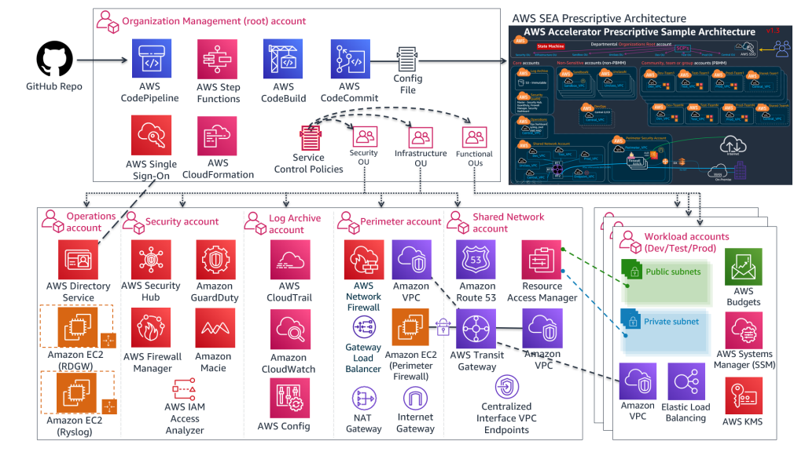

# 1. AWS Secure Environment Accelerator

## 1.1. Overview

The AWS Accelerator is a tool designed to help deploy and operate secure multi-account, multi-region AWS environments on an ongoing basis. The power of the solution is the configuration file that drives the architecture deployed by the tool. This enables extensive flexibility and for the completely automated deployment of a customized architecture within AWS without changing a single line of code.

While flexible, the AWS Accelerator is delivered with a sample configuration file which deploys an opinionated and prescriptive architecture designed to help meet the security and operational requirements of many governments around the world. Tuning the parameters within the configuration file allows for the deployment of customized architectures and enables the solution to help meet the multitude of requirements of a broad range of governments and public sector organizations.

The installation of the provided prescriptive architecture is reasonably simple, deploying a customized architecture does require extensive understanding of the AWS platform. The sample deployment specifically helps customers meet NIST 800-53 and/or CCCS Medium Cloud Control Profile (formerly PBMM).

## 1.2. What specifically does the Accelerator deploy and manage?

A common misconception is that the AWS Secure Environment Accelerator only deploys security services, not true. The Accelerator is capable of deploying a complete end-to-end hybrid enterprise multi-region cloud environment.

Additionally, while the Accelerator is initially responsible for deploying a prescribed architecture, it more importantly allows for organizations to operate, evolve, and maintain their cloud architecture and security controls over time and as they grow, with minimal effort, often using native AWS tools. While the Accelerator helps with the deployment of technical security controls, it’s important to understand that the Accelerator is only part of your security and compliance effort.  We encourage customers to work with their AWS account team, AWS Professional Services or an AWS Partner to determine how to best meet the remainder of your compliance requirements.

The Accelerator is designed to enable customers to upgrade across Accelerator versions while maintaining a customer’s specific configuration and customizations, and without the need for any coding expertise or for professional services. Customers have been able to seamlessly upgrade their AWS multi-account environment from the very first Accelerator beta release to the latest release (across more than 50 releases), gaining the benefits of bug fixes and enhancements while having the option to enable new features, without any loss of existing customization or functionality.

Specifically the accelerator deploys and manages the following functionality, both at initial accelerator deployment and as new accounts are created, added, or onboarded in a completely automated but customizable manner:

### 1.2.1. Creates AWS Account

-   Core Accounts - as many or as few as your organization requires, using the naming you desire. These accounts are used to centralize core capabilities across the organization and provide `Control Panel` like capabilities across the environment. Common core accounts include:
    -   Shared Network
    -   Operations
    -   Perimeter
    -   Log Archive
    -   Security Tooling
-   Workload Accounts - automated concurrent mass account creation or use AWS organizations to scale one account at a time. These accounts are used to host a customer's workloads and applications.
-   Scalable to 1000's of AWS accounts
-   Supports AWS Organizations nested [OU's](https://docs.aws.amazon.com/organizations/latest/userguide/orgs_manage_ous.html) and importing existing AWS accounts
-   Performs 'account warming' to establish initial limits, when required
-   Automatically submits limit increases, when required (complies with initial limits until increased)
-   Leverages AWS Control Tower

### 1.2.2. Creates Networking

-   Transit Gateways and TGW route tables (incl. inter-region TGW peering)
-   Centralized and/or Local (bespoke) VPC's
-   Subnets, Route tables, NACLs, Security groups, NATGWs, IGWs, VGWs, CGWs
-   **NEW** Outpost, Local Zone and Wavelength support
-   VPC Endpoints (Gateway and Interface, Centralized or Local)
-   Route 53 Private and Public Zones, Resolver Rules and Endpoints, VPC Endpoint Overloaded Zones
-   All completely and individually customizable (per account, VPC, subnet, or OU)
-   Layout and customize your VPCs, subnets, CIDRs and connectivity the way you want
-   Static or Dynamic VPC and subnet CIDR assignments
-   Deletes default VPC's (worldwide)
-   AWS Network Firewall

### 1.2.3. Cross-Account Object Sharing

-   VPC and Subnet sharing, including account level re-tagging (Per account security group 'replication')
-   VPC attachments and peering (local and cross-account)
-   Zone sharing and VPC associations
-   Managed Active Directory sharing, including R53 DNS resolver rule creation/sharing
-   Automated TGW inter-region peering
-   Populate Parameter Store with all `user` objects to be used by customers' IaC
-   Deploy and share SSM documents (4 provided out-of-box, ELB Logging, S3 Encryption, Instance Profile remediation, Role remediation)
    -   customer can provide their own SSM documents for automated deployment and sharing

### 1.2.4. Identity

-   Creates Directory services (Managed Active Directory and Active Directory Connectors)
-   Creates Windows admin bastion host auto-scaling group
-   Set Windows domain password policies
-   Set IAM account password policies
-   Creates Windows domain users and groups (initial installation only)
-   Creates IAM Policies, Roles, Users, and Groups
-   Fully integrates with and leverages AWS SSO for centralized and federated login

### 1.2.5. Cloud Security Services

-   Enables and configures the following AWS services, worldwide w/central designated admin account:
    -   GuardDuty w/S3 protection
    -   Security Hub (Enables designated security standards, and disables individual controls)
    -   Firewall Manager
    -   CloudTrail w/Insights and S3 data plane logging
    -   Config Recorders/Aggregator
    -   Conformance Packs and Config rules (95 out-of-box NIST 800-53 rules, 2 custom rules, customizable per OU)
    -   Macie
    -   IAM Access Analyzer
    -   CloudWatch access from central designated admin account (and setting Log group retentions)

### 1.2.6. Other Security Capabilities

-   Creates, deploys and applies Service Control Policies
-   Creates Customer Managed KMS Keys (SSM, EBS, S3), EC2 key pairs, and secrets
-   Enables account level default EBS encryption and S3 Block Public Access
-   Configures Systems Manager Session Manager w/KMS encryption and centralized logging
-   Configures Systems Manager Inventory w/centralized logging
-   Creates and configures AWS budgets (customizable per OU and per account)
-   Imports or requests certificates into AWS Certificate Manager
-   Deploys both perimeter and account level ALB's w/Lambda health checks, certificates and TLS policies
-   Deploys & configures 3rd party firewall clusters and management instances (leverages marketplace)
    -   Gateway Load Balancer w/auto-scaling and VPN IPSec BGP ECMP deployment options
-   Protects Accelerator deployed and managed objects
-   Sets Up SNS Alerting topics (High, Medium, Low, Blackhole priorities)
-   Deploys CloudWatch Log Metrics and Alarms
-   Deploys customer provided custom config rules (2 provided out-of-box, no EC2 Instance Profile/Permissions)

### 1.2.7. Centralized Logging and Alerting

-   Deploys an rsyslog auto-scaling cluster behind a NLB, all syslogs forwarded to CloudWatch Logs
-   Centralized access to "Cloud Security Service" Consoles from designated AWS account
-   Centralizes logging to a single centralized S3 bucket (enables, configures and centralizes)
    -   VPC Flow logs w/Enhanced metadata fields (also sent to CWL)
    -   Organizational Cost and Usage Reports
    -   CloudTrail Logs including S3 Data Plane Logs (also sent to CWL)
    -   All CloudWatch Logs (includes rsyslog logs)
    -   Config History and Snapshots
    -   Route 53 Public Zone Logs (also sent to CWL)
    -   GuardDuty Findings
    -   Macie Discovery results
    -   ALB Logs
    -   SSM Inventory
    -   Security Hub findings
    -   SSM Session Logs (also sent to CWL)
    -   Resolver Query Logs (also sent to CWL)
-   Email alerting for CloudTrail Metric Alarms, Firewall Manager Events, Security Hub Findings incl. GuardDuty Findings
- **NEW** Optionally collect Organization and ASEA configuration and metadata in a new restricted log archive bucket

## 1.3. Relationship with AWS Landing Zone Solution (ALZ)

The ALZ was an AWS Solution designed to deploy a multi-account AWS architecture for customers based on best practices and lessons learned from some of AWS' largest customers. The AWS Accelerator draws on design patterns from the Landing Zone, and re-uses several concepts and nomenclature, but it is not directly derived from it, nor does it leverage any code from the ALZ. The Accelerator is a standalone solution with no dependence on ALZ.

## 1.4. Relationship with AWS Control Tower

The AWS Secure Environment Accelerator now leverages AWS Control Tower!

With the release of v1.5.0, the AWS Accelerator adds the capability to be deployed on top of AWS Control Tower. Customers get the benefits of the fully managed capabilities of AWS Control Tower combined with the power and flexibility of the Accelerators Networking and Security orchestration.

## 1.5. Accelerator Installation Process (Summary)

This summarizes the installation process, the full installation document can be found in the documentation section below.

-   Create a config.json (or config.yaml) file to represent your organizations requirements ([several samples provided](./installation/customization-index.md))
-   Create a Secrets Manager Secret which contains a GitHub token that provides access to the Accelerator code repository
-   Create a unique S3 input bucket in the management account of the region you wish to deploy the solution and place your config.json and any additional custom config files in the bucket
-   Download and execute the latest [release](https://github.com/aws-samples/aws-secure-environment-accelerator/releases) installer CloudFormation template in your management accounts preferred 'primary' / 'home' region
-   Wait for:
    -   CloudFormation to deploy and start the Code Pipeline (~5 mins)
    -   Code Pipeline to download the Accelerator codebase and install the Accelerator State Machine (~10 mins)
    -   The Accelerator State Machine to finish execution (~1.25 hrs Standalone version, ~2.25 hrs Control Tower Version)
-   Perform required one-time [post installation](./installation/install.md#17-post-installation) activities (configure AWS SSO, set firewall passwords, etc.)
-   On an ongoing basis:
    -   Use AWS Organizations to create new AWS accounts, which will automatically be guardrailed by the Accelerator
    -   Update the config file in CodeCommit and run the Accelerator State Machine to:
        -   deploy, configure and guardrail multiple accounts at the same time (~25 min Standalone, ~50 min/account Control Tower)
        -   change Accelerator configuration settings (~25 min)
