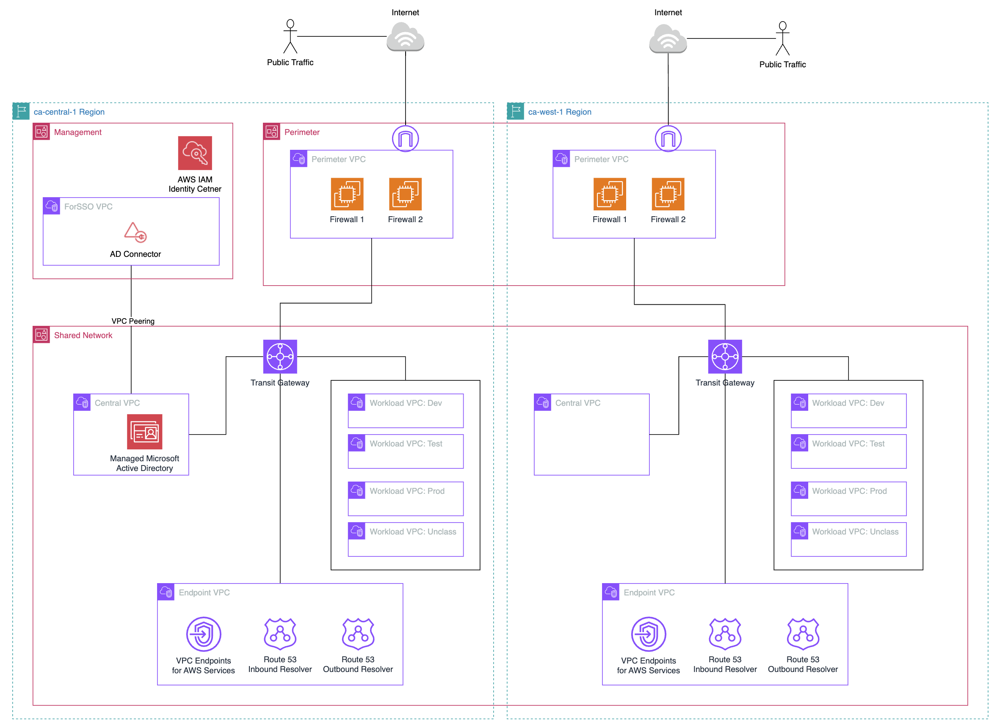

# 1. CA-West-1 (Calgary) Region Configurations and Customizations

## 1.1. Introduction

### 1.1.1 Summary

The configurations described in this documentation section explains how to enable the Calgary (ca-west-1) region. This currently depends on ASEA version > 1.6.1, and extends into ca-west-1 (i.e. ca-west-1 is NOT the home region). Before applying any of the configuration below, be sure to review the networking architecture, and deploy in a test ASEA instance first if possible. 

### 1.1.2 Activating the Calgary opt-in Region

Since March 20, 2019, when AWS adds a Region, the new Region is disabled by default. If you want your users to be able to create and manage resources in a new Region, you first need to enable that Region. The Calgary region (ca-west-1) is an 'Opt-in' region that requires enablement configuration for all AWS accounts. 

To update the enabled Regions for member accounts of your AWS Organizations, perform the steps in the following procedure.
1. _Requires:_ Enable trusted access for the AWS Account Management service. To set this up, see [Enabling trusted access for AWS Account Management.](https://docs.aws.amazon.com/accounts/latest/reference/using-orgs-trusted-access.html)
2. Sign in to the AWS Organizations console with your organization's management account credentials.
3. On the AWS accounts page, select the account that you want to update.
4. Choose the Account settings tab.
5. Under Regions, select the Region you want to enable or disable.
6. Choose Actions, and then choose either Enable or Disable option.
7. If you chose the Enable option, review the displayed text and then choose Enable region.
   
This can also be executed using the AWS CLI & SDKs, review this [page](https://docs.aws.amazon.com/accounts/latest/reference/manage-acct-regions.html#manage-acct-regions-update-account-enabled) for detail. Alternatively, you can also use the sample script provided here (insert hyperlink to reference artifacts) to enable or disable the Opt-in region programatically using the following instructions:

1. Log into the AWS console as a Full Administrator to the Organization Management account.
2. Start a CloudShell session.
3. Create a virtual python environment. `python3 -m venv env`
4. Activate the python environment. `source env/bin/activate`
5. Install the python3 required libaries (ex: `pip install -r requirements.txt`)
6. Make the Python script executable (ex: `chmod +x region_optin.py`)
7. Execute the script with the following parameters: 
    `--OptInRegion` *region*
    `--Action`      *enable / disable / status*
    
    Optional:
    `--IgnoreOU` *ou* 

    Example: `python3 region_optin.py --OptInRegion ca-west-1 --Action=enable`

**Note:** These instructions will need to be repeated for all new accounts that are added in the future and that will be used for workloads that use the ca-west-1 region

## 1.2. Network Architecture -- Mirrored from Home Region


The _Mirrored from Home Region_ network architecture mirrors the network architecture from the home region (e.g. ca-central-1). In the diagram above, ca-west-1 has its own Transit Gateway, same set of VPCs, Endpoint configuration, and Perimeter VPC/Firewall configuration. Additionaly, this configuration sample does not connect ca-central-1 with ca-west-1 via Transit Gateway Peering (see #1.3 below). Note that in the sample config provided, the IP CIDR ranges are different than the home region. 

## 1.3. Network Architecture -- Cross Region Peering


The cross Region peering network architecture adds cross Region peering to enable cross Region communication. To continue following the [Government of Canada Cloud guardrail](https://www.tbs-sct.canada.ca/pol/doc-eng.aspx?id=32787) "segment and separate" the workload VPCs would need individual segregated Transit Gateway Route Tables instead of the common Segregated route table to maintain segregation across Regions.


The sample segregated route tables have routes to shared resources in the central and endpoint VPCs of each region and only to the corresponding workload VPC in the remote region. Internet bound traffic would route to the local Region Perimeter firewalls. For example, lets look at the dev workload VPC and what it's allowed to route to based on the sample config. 
```
    dev (ca-central-1) <--> dev (ca-west-1)
    dev (ca-central-1 and ca-west-1) <--> central (ca-central-1 and ca-west-1)
    dev (ca-central-1 and ca-west-1) <--> endpoint (ca-central-1 and ca-west-1)
    dev (ca-central-1) <--> perimeter (ca-central-1)
    dev (ca-west-1) <--> perimeter (ca-west-1)
```


## 1.4. How to apply Mirrored from Home Region configuration
The general strategy is to compare your existing deployed configuration (**config.json** in CodeCommit) with the sample provided [here](https://github.com/aws-samples/aws-secure-environment-accelerator/tree/main/reference-artifacts/SAMPLE_CONFIGS/config.lite-VPN-multi-region-ca-west-1-example.json). Using your preferred file compare tool (e.g. Visual Studio Code), you will see differences that need to be applied. Here is a list of changes that should be made:
1. Add the use of '${ALT_REGION}' 
2. Set '${ALT_REGION}': 'ca-west-1'
3. Add 'ca-west-1' to list of Supported Regions
4. Add 'ca-west-1' to list of Macie Excluded Regions (until service is launched in region)
5. 'fw-mgr-alert-level': 'None'
6. Add 'ca-west-1' to additional-cwl-regions
7. Add '${ALT_REGION}' to list of ssm-automation regions (global and OU config sections)
8. Add '${ALT_REGION}' cidr-pools
9. Add TGW for '${ALT_REGION}'
10. Add firewalls (Fortinet) to deploy in '${ALT_REGION}'
    1.  Follow ASEA installation instructions for Marketplace and enabling the Fortigate Subscriptions in ca-west-1
11. AWS Config configuration is split into supported region rules. Remediate-regions updated with '${ALT_REGION}'
12. Endpoint VPC created in Shared-Network account in '${ALT_REGION}'. Note available Interface Endpoints is a subset of ca-central-1. Sample deploys minimum needed.
13. Dev/Test/Prod VPCs created in Shared-Network account in '${ALT_REGION}' with TGW attachments

Current Known Limitations:

1. Managed Active Directory should be manually 'shared' to ca-west-1 once the service is updated to support ca-west-1
2. Rsyslog servers (used as an option for Fortigate logging destination) can only be deployed to a single region. This would need to be configured outside ASEA (manually or with your own created IaC).
3. Fortigate firewalls config use c6i EC2 instance types in lieu of c5n until it becomes available in ca-west-1.

## 1.5. How to apply Cross Region Peering configuration
The general strategy is to compare your existing deployed configuration (**config.json** in CodeCommit) with the sample provided [here](https://github.com/aws-samples/aws-secure-environment-accelerator/tree/main/reference-artifacts/SAMPLE_CONFIGS/config.lite-VPN-multi-region-ca-west-1-tgw-peering-example.json). Using your preferred file compare tool (e.g. Visual Studio Code), you will see differences that need to be applied. Here is a list of changes that should be made:

## 1.5.1 Create Segregated Route Tables and Propogations
In preparation for the Transit Gateway peering, you need to create a segregated route table for each workload VPC in each Region. This allows you the flexibility to customize the routes specific to each workload VPC which is used to only allow routing to the corresponding workload VPC in the remote Region. You also need to propagate the routes from the Endpoint VPC, Central VPC, and Firewall attachments to maintain communication to these locations.
1. Create workload segregated Transit Gateway route tables by adding them to the home Region Transit Gateway `["mandatory-account-configs"]["shared-network"].deployments.tgw[0]["route-tables"]` and remote Region Transit Gateway `["mandatory-account-configs"]["shared-network"].deployments.tgw[1]["route-tables"]` sections.
```json
            "route-tables": [
              "core",
              "shared",
              "standalone",
              "segregated",
              "dev_segregated",
              "test_segregated",
              "prod_segregated",
              "unclass_segregated"
            ],
```
2. Add the workload segregated Transit Gateway route tables to the `tgw-rt-propagated` section under `tgw-attach` for the Endpoint VPCs, Central VPCs, and the Firewalls Transit Gateway attachments in Perimeters of each Region.
```json
            "tgw-rt-propagate": [
              "core",
              "shared",
              "standalone",
              "segregated",
              "dev_segregated",
              "test_segregated",
              "prod_segregated",
              "unclass_segregated"
            ],
```
3. Commit the changes and run the `ASEA-MainStateMachine_sm` State Machine (SM) with the input of `{"scope": "FULL", "mode": "APPLY", "verbose": "0"}`. Wait for successful completion.
4. Verify the new TGW route tables are created and have the routes to central, endpoint and firewall tgw attachments. 

## 1.5.2 Associate Workload VPC to Workload Segregated Transit Gateway Route Table
This process will switch the workload VPC from the segregated TGW route table to the workload specific segregated TGW route table.

>**NOTE:** Following this process will isolate the respective resources in the workload VPC. Any communication within the VPC will be unaffected however any communication that has to transfer through the Transit Gateway will be interrupted. Recommend performing this process on one workload VPC at a time during a maintenance window. For example, only start with the Dev VPC.

1. Undeploy the TGW attachment by prefixing the `tgw-attach` with "xx" to be `xxtgw-attach` to the corresponding workload VPC. This will be an unknown field, which is the same a deleting the section.
```json
          "xxtgw-attach": {
            "associate-to-tgw": "Main",
            "account": "shared-network",
            "associate-type": "ATTACH",
            "tgw-rt-associate": ["segregated"],
            "tgw-rt-propagate": ["core", "shared"],
            "blackhole-route": true,
            "attach-subnets": ["TGW"],
            "options": ["DNS-support"]
          }
```
2. Commit the changes and run the `ASEA-MainStateMachine_sm` State Machine (SM) with the input of `{"scope": "FULL", "mode": "APPLY", "verbose": "0"}`. Wait for successful completion.
3. Redeploy the TGW attachment by removing the "xx" to be `tgw-attach` and update the `tgw-rt-associate` with the respective workload segregated TGW route table. For example changing from `segregated` to `dev_segregated`. 
```json
          "tgw-attach": {
            "associate-to-tgw": "Main",
            "account": "shared-network",
            "associate-type": "ATTACH",
            "tgw-rt-associate": ["dev_segregated"],
            "tgw-rt-propagate": ["core", "shared"],
            "blackhole-route": true,
            "attach-subnets": ["TGW"],
            "options": ["DNS-support"]
          }
```
4. Commit the changes and run the `ASEA-MainStateMachine_sm` State Machine (SM) with the input of `{"scope": "FULL", "mode": "APPLY", "verbose": "0"}`. Wait for successful completion.
5. Validate communication has been restored to original status.
6. Repeat steps 1-5 for each workload VPC.

## 1.5.3 Configure Transit Gateway Peering
The Transit Gateway peering process is achieved by creating a TGW peering attachment and creating static routes in each of the TGW route tables.
1. Create the Transit Gateway peering attachment by adding the following section to the remote Region TGW deployment section to associate to TGW in home Region.
 ```json
    "tgw-attach": {
        "associate-to-tgw": "Main",
        "account": "shared-network",
        "region": "${HOME_REGION}",
        "tgw-rt-associate-local": ["core"],
        "tgw-rt-associate-remote": ["core"]
    },
```            
2. Commit the changes and run the `ASEA-MainStateMachine_sm` State Machine (SM) with the input of `{"scope": "FULL", "mode": "APPLY", "verbose": "0"}`. Wait for successful completion.
3. Create static routes for each of the TGW route tables in each Region. You are creating these routes to allow workload traffic to its workload VPC peer, Central VPC and Endpoint VPC in remote Region.  Refer to the `Segregated Route Tables` above and the sample multi-region config file for examples [here](https://github.com/aws-samples/aws-secure-environment-accelerator/tree/main/reference-artifacts/SAMPLE_CONFIGS/config.lite-VPN-multi-region-ca-west-1-tgw-peering-example.json). This is an example of the static routes in the `dev_segregated` TGW route table in the home Region assuming CIDR ranges follows example above. 
```json
              {
                "name": "dev_segregated",
                "routes": [
                  {
                    "destination": "10.3.0.0/16",
                    "blackhole-route": true
                  },
                  {
                    "destination": "10.4.0.0/16",
                    "blackhole-route": true
                  },
                  {
                    "destination": "10.5.0.0/16",
                    "blackhole-route": true
                  },
                  {
                    "destination": "10.96.0.0/22",
                    "target-tgw": "Main-${ALT_REGION}"
                  },
                  {
                    "destination": "10.97.0.0/16",
                    "target-tgw": "Main-${ALT_REGION}"
                  },
                  {
                    "destination": "10.98.0.0/16",
                    "target-tgw": "Main-${ALT_REGION}"
                  },
                  {
                    "destination": "10.99.0.0/16",
                    "blackhole-route": true
                  },
                  {
                    "destination": "10.100.0.0/16",
                    "blackhole-route": true
                  }
                ]
              },
```
4. Commit the changes and run the `ASEA-MainStateMachine_sm` State Machine (SM) with the input of `{"scope": "FULL", "mode": "APPLY", "verbose": "0"}`. Wait for successful completion.
5. Validate communication across the TGW peering connection between Regions.

