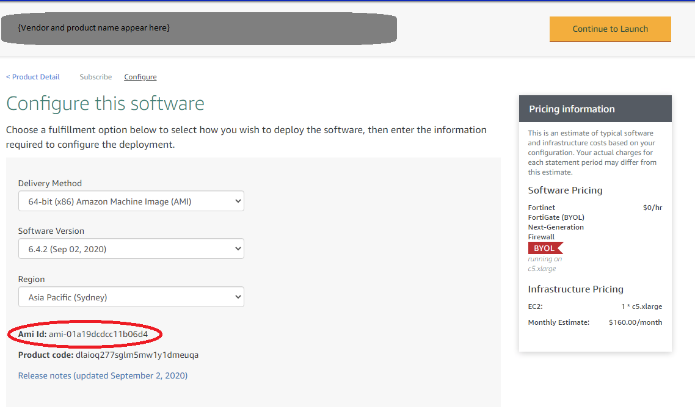
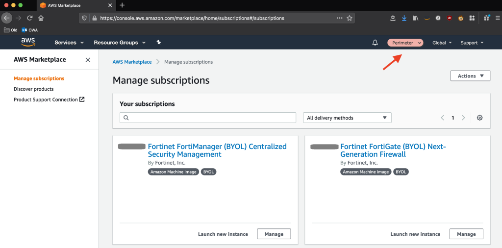

# 1. Accelerator Installation Guide

## 1.1. Overview

**_We encourage customers installing the Accelerator to get the support of their local AWS account team (SA, TAM, CSM, ProServe) to assist with the installation of the Accelerator, as the Accelerator leverages, deploys, or orchestrates over 50 different AWS services._**

_Users are strongly encouraged to also read the [Accelerator Operations/Troubleshooting Guide](../operations/index.md) before installation and the [FAQ](../faq/index.md) while waiting for the installation to complete. The Operations/Troubleshooting Guide provides details as to what is being performed at each stage of the installation process, including detailed troubleshooting guidance._

These installation instructions assume one of the prescribed architectures is being deployed.

## 1.2. Prerequisites

### 1.2.1. General

-   Management or root AWS Organization account (the AWS Accelerator cannot be deployed in an AWS sub-account)
    -   No additional AWS accounts need to be pre-created before Accelerator installation
-   If required, a limit increase to support your desired number of new AWS sub-accounts (default limit is 10 sub-accounts)
    -   **recent changes to new AWS account limits are causing accelerator installation failures, please work with your local account team to increase your limits**
-   Valid Accelerator configuration file, updated to reflect your requirements (see below)
-   Determine your primary or Accelerator `control` or `home` region, this is the AWS region in which you will most often operate
-   Government of Canada customers are still required to do a standalone installation at this time, please request standalone installation instructions from your Account SA or TAM
-   The Accelerator _can_ be installed into existing AWS Organizations - see caveats and notes [here](./existing-orgs.md)
-   Existing AWS Landing Zone Solution (ALZ) customers are required to remove their ALZ deployment before deploying the Accelerator. Scripts are available to assist with this process.
-   Changes to the Accelerator codebase are strongly discouraged unless they are contributed and accepted back to the solution. Code customization will block the ability to upgrade to the latest release and upgrades are encouraged to be done between quarterly to semi-annually. The solution was designed to be extremely customizable without changing code, existing customers following these guidelines have been able to upgrade across more than 50 Accelerator releases, while maintaining their customizations and gaining the latest bug fixes, features and enhancements without any developer or professional services based support. Please see [this](../faq/index.md#how-do-i-modify-and-extend-the-accelerator-or-execute-my-own-code-after-the-accelerator-provisions-a-new-aws-account-or-the-state-machine-executes) FAQ for more details.

## 1.3. Production Deployment Planning

### 1.3.1. General

**For any deployment of the Accelerator which is intended to be used for production workloads, you must evaluate all these decisions carefully. Failure to understand these choices could cause challenges down the road. If this is a "test" or "internal" deployment of the Accelerator which will not be used for production workloads, you can leave the default config values.**

**Config file [schema](https://aws-samples.github.io/aws-secure-environment-accelerator/schema/en/index.html) documentation** (Draft)

### 1.3.2. OU Structure Planning

Plan your OU and core account structure carefully. By default, we suggest: `Security, Infrastructure, Central, Sandbox, Dev, Test, Prod`.

-   The `Security` OU will contain the `Security` account, the `Log Archive` account, and the Organization `Management` account.
-   The `Infrastructure` OU will hold the remainder of the accounts shared or utilized by the rest of the organization (`Shared Network`, `Perimeter`, and `Operations`).
-   The remainder of the OUs correspond with major permission shifts in the SDLC cycle and NOT every stage an organization has in their SDLC cycle (i.e. QA or pre-prod would be included in one of the other OUs).
-   The `Central` OU is used to hold accounts with workloads shared across Dev, Test, and Prod environments like centralized CI/CD tooling.
-   The v1.5.0+ releases align the Accelerator OU and account structure with AWS multi-account guidance, splitting the `core` OU into the `Security` and `Infrastructure` OUs.

**Note:** While OUs can be renamed or additional OUs added at a later point in time, deployed AWS accounts CANNOT be moved between top-level OUs (guardrail violation), nor can top-level OUs easily be deleted (requires deleting all AWS accounts from within the OU first).

### 1.3.3. Network Configuration Planning

If deploying the prescriptive architecture using the Full or Lite sample config files, you will need the following network constructs:

1. Six (6) RFC1918 Class B address blocks (CIDR's) which do not conflict with your on-premise networks (a single /13 block works well)

    - VPC CIDR blocks cannot be changed after installation, this is simply the way the AWS platform works, given everything is built on top of them. Carefully consider your address block selection.
    - one block for each OU, except Sandbox which is not routable (Sandbox OU will use a 7th non-routed address block)
    - the "core" Class B range will be split to support the Endpoint VPC and Perimeter VPC (with extra addresses remaining for future use)
    - Given a shared VPC architecture is leveraged (prevents stranded islands of CIDR blocks and reduces networking costs), we have assigned a class B address block to each VPC to future proof the deployment. Smaller customers can successfully deploy with a half class B CIDR block per shared VPC.

2. Two (2) RFC6598 /23 address blocks (Government of Canada (GC) requirement only)

    - Used for AWS Managed Active Directory (MAD) deployment and perimeter underlay network
    - non-GC customers can replace the RFC6598 address space with the extra unused addresses from the above RFC1918 CIDR range above (the App2 subnets in the Central VPC and the Perimeter VPC address space)

3. BGP ASN's for network routing, one for each of:

    - Transit Gateway (one unique ASN per TGW, multi-region example requires a second ASN)
    - IPSec VPN Firewall Cluster (if deployed)
    - VGW for Direct Connect connectivity (only shown in the config.multi-region-example.json)

    - For example: the Control Tower with Network Firewall example config requires a single BGP ASN for the TGW, the IPSec VPN example requires two BGP ASN's, and the multi-region example requires five unique BGP ASN's.

NOTE: Prior to v1.5.0 CIDR ranges were assigned to each VPC and subnet throughout the config file. This required customers to perform extensive updates across the config file when needing to move to specific IP ranges compatible with a customer's existing on-premise networks.

While this is still supported for those wanting to control exactly what address is used on every subnet, the solution has added support for dynamic CIDR assignments and the sample config files have been updated to reflect. New installs will have CIDR's pulled from CIDR pools, defined in the global-options section of the config file with state maintained in DynamoDB.

The v1.5.0 [custom upgrade guide](./v150-Upgrade.md) will provides details on the upgrade process and requirements to migrate to the new CIDR assignment system, if desired. A [script](https://github.com/aws-samples/aws-secure-environment-accelerator/tree/main/reference-artifacts/Custom-Scripts/Update-Scripts/v1.3.8_to_v1.5.0) was created to assist with this migration.

### 1.3.4. DNS, Domain Name, TLS Certificate Planning

If deploying the prescriptive architecture, you must decide on:

1. A unique Windows domain name (`organizationaws`/`organization.aws`, `organizationcloud`/`organization.cloud`, etc.). Given this is designed as the primary identity store and used to domain join all cloud hosted workloads, changing this in future is difficult. Pick a Windows domain name that does NOT conflict with your on-premise AD domains, ensuring the naming convention conforms to your organizations domain naming standards to ensure you can eventually create a domain trust between the MAD and on-premise domains/forests
2. DNS Domain names and DNS server IP's for on-premise private DNS zones requiring cloud resolution (can be added in future)
3. DNS Domain for a cloud hosted public zone `"public": ["organization.cloud-nuage.canada.ca"]` (can be added in future)
4. DNS Domain for a cloud hosted private zone `"private": ["organization.cloud-nuage.gc.ca"]` (can be added in future)
5. Wildcard TLS certificate for each of the 2 previous zones (can be added/changed in future)

### 1.3.5. Email Address Planning

1. While you require a minimum of 6 **_unique_** email addresses (1 per sub-account being created), we recommend at least 20 **_unique_** email ALIASES associated with a single mailbox, never used before to open AWS accounts, such that you do not need to request new email aliases every time you need to create a new AWS account and they can all be monitored via a single mailbox. These email addresses can **_never_** have been used to previously open an AWS account.
2. You additionally require email addresses for the following additional purposes (these can be existing monitored mailboxes and do not need to be unique):
    - Accelerator execution (state machine) notification events (1 address)
    - High, Medium and Low security alerts (3 addresses if you wish to segregate alerts)
    - Budget notifications

### 1.3.6. Centralized Ingress/Egress Firewalls

As of v1.5.0 the Accelerator offers multiple automated firewall deployment options:

a) AWS Network Firewall (native AWS Cloud service)

    - Defined in the config file as part of a VPC

b) 3rd party firewalls interconnected to the cloud tenancy via IPSec VPN (Active/Active using BGP + ECMP)

-   Defined in the config file under deployments w/TGW VPN attachments
-   this was the only automated option prior to v1.5.0
-   a sample Fortinet Fortigate configuration is provided (both PAYGO and BYOL supported)
-   For Fortinet BYOL, requires minimum 2 valid license files (evaluation licenses adequate) (can be added in future)

c) 3rd party firewalls interconnected to the cloud tenancy via Gateway Load Balancer (GWLB) in an auto-scaling group

-   Defined in the config file under both deployments and load balancers
-   a sample Checkpoint CloudGuard configuration is provided (both PAYGO and BYOL supported)

d) Customer gateway (CGW) creation, to enable connectivity to on-premises firewalls or manually deployed cloud firewalls

-   Defined in the config file under deployments w/TGW VPN attachments (but without an AMI or VPC association)

Examples of each of the firewall options have been included as variants of the Lite config file [example](./customization-index.md#12-sample-configuration-files-with-descriptions).

Note: While we only provide a single example for each 3rd party implementation today, the implementations are generic and should be usable by any 3rd party firewall vendor, assuming they support the required features and protocols. The two examples were driven by customer demand and heavy lifting by the 3rd party vendor. We look forward to additional vendors developing and contributing additional sample configurations. For new 3rd party integrations, we encourage the use of the GWLB approach.

### 1.3.7. Other

1. We recommend installing with the default Accelerator Name (`ASEA`) and Accelerator Prefix (`ASEA-`), but allow customization. Prior to v1.5.0 the defaults were (`PBMM`) and (`PBMMAccel-`) respectively.
    - the Accelerator name and prefix **_CANNOT_** be changed after the initial installation;
    - the Accelerator prefix including the mandatory dash cannot be longer than 10 characters.
2. New installations, which now leverage Control Tower, require the `organization-admin-role` be set to `AWSControlTowerExecution`. Existing standalone installations will continue to utilize their existing role name for the `organization-admin-role`, typically `OrganizationAccountAccessRole`, as this role is used by AWS Organizations by default when no role name is specified while creating AWS accounts through the AWS console.
    - the Accelerator leverages this role name to create all new accounts in the organization;
    - this role name, as defined in the config file, **_MUST_** be utilized when manually creating all new sub-accounts in the Organization;
    - existing installs wishing to change the role name are required to first deploy a new role with a trust to the root account, in all accounts in the organization.

## 1.4. Accelerator Pre-Install Steps

### 1.4.1. General

Before installing, you must first:

1. Login to the Organization **Management (root) AWS account** with `AdministratorAccess`.
2. **_Set the region to your desired `home` region_** (i.e. `ca-central-1`)
3. Install AWS Control Tower:
    - Government of Canada customers are _required_ to skip this step
    - OU and account names can ONLY be customized during initial installation. These values MUST match with the values supplied in the Accelerator config file.
        1. Go to the AWS Control Tower console and click `Set up landing zone`
        2. Select your `home` region (i.e. `ca-central-1`) - the Accelerator home region must match the Control Tower home region
        3. Leave the Region deny setting set to `Not enabled` - the Accelerator needs a customized region deny policy
        4. Select _all_ regions for `Additional AWS Regions for governance`, click `Next`
            - The Control Tower and Accelerator regions MUST be properly aligned
            - If a region is not `governed` by Control Tower, it must NOT be listed in `control-tower-supported-regions`
            - To manage a region requires the region:
                - be enabled in Control Tower (if supported)
                - added to the config file `control-tower-supported-regions` list (if supported)
                - added to the config file `supported-regions` list (even if not supported by Control Tower, as the Accelerator can manage regions not yet supported by Control Tower, but only when NOT listed in `control-tower-supported-regions`)
                - While we highly recommend guardrail deployment for all AWS enabled by default regions, at minimum
                    - the home region MUST be enabled in Control Tower and must be listed in `control-tower-supported-regions`
                    - both the home-region and ${GBL\*REGION} must be listed in `supported-regions`
        5. For the `Foundational OU`, leave the default value `Security`
        6. For the `Additional OU` provide the value `Infrastructure`, click `Next`
        7. Enter the email addresses for your `Log Archive` and `Audit` accounts, change the `Audit` account name to `Security`, click `Next` - OU and account names can ONLY be customized during initial installation. OU names, account names and email addresses \_must\* match identically with the values supplied in the Accelerator config file.
        8. Select `Enabled` for AWS CloudTrail configuration (if not selected), click `Next`
        9. Click `Set up landing zone` and wait ~60 minutes for the Control Tower installation to complete
        10. Select `Add or register organizational units`, Click `Add an OU`
        11. Type `Dev`, click `Add`, wait until the OU is finished provisioning (or it will error)
        12. Repeat step 9 for each OU (i.e. `Test`, `Prod`, `Central`, `Sandbox`)
        13. Select `Account factory`, Edit, Subnets: 0, Deselect all regions, click `Save`
        14. In AWS Organizations, move the Management account from the `root` OU into the `Security` OU
4. Verify:
    1. AWS Organizations is enabled in `All features` mode
        - if required, navigate to AWS Organizations, click `Create Organization`, `Create Organization`
    2. Service Control Policies are enabled
        - if required, in Organizations, select `Policies`, `Service control policies`, `Enable service control policies`
5. Verify the Organization Management (root) account email address
    - In AWS Organizations, Settings, ["Send Verification Request"](https://aws.amazon.com/blogs/security/aws-organizations-now-requires-email-address-verification/)
    - Once it arrives, complete the validation by clicking the validation link in the email
6. Create a new KMS key to encrypt your source configuration bucket (you can use an existing key)
    - AWS Key Management Service, Customer Managed Keys, Create Key, Symmetric, and then provide a key name (`ASEA-Source-Bucket-Key`), Next
    - Select a key administrator (Admin Role or Group for the Organization Management account), Next
    - Select key users (Admin Role or Group for the Organization Management account), Next
    - Validate an entry exists to "Enable IAM User Permissions" (critical step if using an existing key)
        - `"arn:aws:iam::123456789012:root"`, where `123456789012` is your **_Organization Management_** account ID.
    - Click Finish
    - Select the new key, Select `Key Rotation`, `Automatically rotate this CMK every year`, click Save.
7. Enable `"Cost Explorer"` (My Account, Cost Explorer, Enable Cost Explorer)
    - With recent platform changes, Cost Explorer _may_ now be auto-enabled (unable to confirm)
8. Enable `"Receive Billing Alerts"` (My Account, Billing Preferences, Receive Billing Alerts)
9. It is **_extremely important_** that **_all_** the account contact details be validated in the Organization Management (root) account before deploying any new sub-accounts.

    - This information is copied to every new sub-account on creation.
    - Subsequent changes to this information require manually updating it in **_each_** sub-account.
    - Go to `My Account` and verify/update the information lists under both the `Contact Information` section and the `Alternate Contacts` section.
    - Please ESPECIALLY make sure the email addresses and Phone numbers are valid and regularly monitored. If we need to reach you due to suspicious account activity, billing issues, or other urgent problems with your account - this is the information that is used. It is CRITICAL it is kept accurate and up to date at all times.

### 1.4.2. Create GitHub Personal Access Token and Store in Secrets Manager

As of v1.5.0, the Accelerator offers deployment from either GitHub or CodeCommit:

**GitHub** (recommended)

1. You require a GitHub access token to access the code repository
2. Instructions on how to create a personal access token are located [here](https://docs.github.com/en/github/authenticating-to-github/creating-a-personal-access-token).
3. Select the scope `public_repo` underneath the section `repo: Full control over private repositories`.
4. Store the personal access token in Secrets Manager as plain text. Name the secret `accelerator/github-token` (case sensitive).
    - Via AWS console
        - Store a new secret, and select `Other type of secrets`, `Plaintext`
        - Paste your secret with no formatting no leading or trailing spaces (i.e. completely remove the example text)
        - Select the key you created above (`ASEA-Source-Bucket-Key`),
        - Set the secret name to `accelerator/github-token` (case sensitive)
        - Select `Disable rotation`

**CodeCommit** (alternative option)

Multiple options exist for downloading the GitHub Accelerator codebase and pushing it into CodeCommit. As this option is only for advanced users, detailed instructions are not provided.

1. In your AWS Organization Management account, open CodeCommit and create a new repository named `aws-secure-environment-accelerator`
2. Go to GitHub and download the repository `Source code` zip or tarball for the [release](https://github.com/aws-samples/aws-secure-environment-accelerator/releases) you wish to deploy
    - Do NOT download the code off the main GitHub branch, this will leave you in a completely unsupported state (and with beta code)
3. Push the extracted codebase into the newly created CodeCommit repository, maintaining the file/folder hierarchy (ensuring that the root of the repository on code commit looks the same as the root of the repository on github)
4. Set the default CodeCommit branch for the new repository to main
5. Create a branch following the Accelerator naming format for your release (i.e. `release/v1.5.5`)

### 1.4.3. AWS Internal (Employee) Accounts Only

If deploying to an internal AWS employee account and installing the solution with a 3rd party firewall, you need to enable Private Marketplace (PMP) before starting:

1. In the Organization Management account go here: <https://aws.amazon.com/marketplace/privatemarketplace/create>
2. Click `Create a Private Marketplace`, and wait for activation to complete
3. Go to the "Account Groups" sub-menu, click `Create account group`
4. Enter an Account Group Title (i.e. `Default`) and `Add` the Management (root) account number in `Associate AWS account`
5. Associate the default experience `New Private Marketplace`, then click `Create account group` and wait for it to create
6. Go to "Experiences" sub-menu, select `New Private Marketplace`
7. Select the "Settings" sub-tab, and click the `Not Live` slider to make it `Live` and wait for it to complete
8. Ensure the "Software requests" slider is set to `Requests off` and wait for it to complete
9. Change the name field (i.e. append `-PMP`) and change the color, so it is clear PMP is enabled for users, click `Update`
10. Go to the "Products" sub-tab, then select the `All AWS Marketplace products` nested sub-tab
11. Search Private Marketplace for the Fortinet or Checkpoint products and select

    - `Fortinet FortiGate (BYOL) Next-Generation Firewall` and
    - `Fortinet FortiManager (BYOL) Centralized Security Management` **or**
    - `CloudGuard Network Security for Gateway Load Balancer - BYOL` and
    - `Check Point Security Management (BYOL)`

12. Select "Add" in the top right

    - Due to PMP provisioning delays, this sometimes fails when attempted immediately following enablement of PMP or if adding each product individually - retry after 20 minutes.

13. While not used in this account, you must now subscribe to the two subscriptions and accept the EULA for each product (you will need to do the same in the perimeter account, once provisioned below)
    - To subscribe, select the "Approved products" tab
    - Click on the product you want to subscribe, in this case `Fortinet FortiGate (BYOL) Next-Generation Firewall` and `Fortinet FortiManager (BYOL Centralized Security Management` **or** `CloudGuard Network Security for Gateway Load Balancer - BYOL` and `Check Point Security Management (BYOL)`
    - Click on "Continue to Subscribe"
    - Click on "Accept Terms" and wait for subscription to be completed
    - If you are deploying in any region except ca-central-1 or wish to switch to a different license type, you need the new AMI IDs. After successfully subscribing, continue one more step and click the “Continue to Configuration”. When you get the below screen, select your region and version (**Fortinet** `v6.4.7`, **Checkpoint Mgmt** `R81.10-335.883` and **CloudGuard** `R80.40-294.374` recommended at this time). Marketplace will provide the required AMI ID. Document the two AMI IDs, as you will need to update them in your config.json file below.



## 1.5. Basic Accelerator Configuration

1. Select a sample config file as a baseline starting point
    - **IMPORTANT: Use a config file from the GitHub code branch you are deploying from, as valid parameters change over time. The `main` branch is NOT the current release and often will not work with the GA releases.**
    - sample config files can be found in [this](https://github.com/aws-samples/aws-secure-environment-accelerator/tree/main/reference-artifacts/SAMPLE_CONFIGS/) folder;
    - descriptions of the sample config files and customization guidance can be found [here](./customization-index.md);
    - unsure where to start, use the `config.lite-CTNFW-example.json`, where CTNFW is for Control Tower w/NFW;
    - These configuration files can be used, as-is, with only minor modification to successfully deploy the sample architectures;
    - On upgrades, compare your deployed configuration file with the latest branch configuration file for any new or changed parameters;
2. At minimum, you MUST update the AWS account names and email addresses in the sample file:
    - For existing accounts, they _must_ match identically to both the account names and email addresses defined in AWS Organizations (including the management account);
    - For new accounts, they must reflect the new account name/email you want created;
    - All new AWS accounts require a unique email address which has never before been used to create an AWS account;
    - When updating the budget or SNS notification email addresses within the sample config, a single email address for all is sufficient;
    - Update the IP address in the "alarm-not-ip" variable with your on-premise IP ranges (used for the AWS-SSO-Authentication-From-Unapproved-IP alarm);
    - If deploying the Managed AD, update the dns-domain, netbios-domain, log-group-name, as well as the AD users and groups that will be created;
    - For a test deployment, the remainder of the values can be used as-is;
    - While it is generally supported, we recommend not adding more than 1 or 2 workload accounts to the config file during the initial deployment as it will increase risks of hitting a limit. Once the Accelerator is successfully deployed, add the additional accounts to the config file and rerun the state machine.
    - More information [here](./customization-index.md#16-summary-of-example-config-file-minimum-changes-for-new-installs) on the fields in the config file that need to be updated.
3. A successful deployment of the prescriptive architecture requires VPC access to 9 AWS endpoints, you cannot remove both the perimeter firewalls (all public endpoints) and the 9 required central VPC endpoints from the config file (ec2, ec2messages, ssm, ssmmessages, cloudformation, secretsmanager, kms, logs, monitoring).
4. When deploying to regions other than `ca-central-1`, you need to modify your config file as follows (for Canada Central 1, the AMI IDs are pre-populated for you):
    1. Update the firewall and firewall manager AMI IDs to reflect your home regions regional AMI IDs (see 2.3.3, item 13), making sure you select the right version and region per the recommendations.
    2. Validate all the Interface Endpoints defined in your config file are supported in your home region (i.e. Endpoint VPC). Remove unsupported endpoints from the config file, add additional endpoints as available.
    3. If you are installing into a home region which is explicitly named in any of the replacements\addl_regions_x, remove it from the list. If deploying in us-east-1, remove ${GBL_REGION}.
5. Create an S3 bucket in your Organization Management account `your-bucket-name`
    - you must supply this bucket name in the CFN parameters _and_ in the config file (`global-options\central-bucket`)
    - the bucket name _must_ be the same in both spots
    - the bucket must have versioning enabled
    - the bucket must be `S3-KMS` encrypted using the `ASEA-Source-Bucket-Key` created above
6. Place your customized config file(s), named `config.json` (or `config.yaml`), in your new bucket
7. If required, place the firewall configuration and license files in the folder and path defined in the config file
    - For AWS Network Firewall: `nfw/nfw-example-policy.json`
    - For Fortinet: `firewall/firewall-example.txt`, `firewall/license1.lic` and `firewall/license2.lic`
        - We have made a sample available [here](https://github.com/aws-samples/aws-secure-environment-accelerator/tree/main/reference-artifacts/Third-Party/): `./reference-artifacts/Third-Party/`
        - the sample configures an active / active firewall pair with two tunnels per firewall
        - If you updated your perimeter VPC subnet names, you must also make these changes in your firewall-example.txt file
        - If you don't have any license files, update the config file with an empty array (`"license": []`). Do NOT use the following: `[""]`.
    - The basic Checkpoint configuration is stored directly in config.json
8. Place any defined certificate files in the folder and path defined in the config file
    - i.e. `certs/example1-cert.key`, `certs/example1-cert.crt`
    - Sample available [here](https://github.com/aws-samples/aws-secure-environment-accelerator/tree/main/reference-artifacts/Certs-Sample/): `./reference-artifacts/Certs-Sample/*`
    - Ideally you would generate real certificates using your existing certificate authority
    - Should you wish, instructions are provided to aid in generating your own self-signed certificates (Self signed certificates are NOT secure and simply for demo purposes)
    - Use the examples to demonstrate Accelerator TLS functionality only
9. Detach **_ALL_** SCPs (except `FullAWSAccess` which remains in place) from all OU's and accounts before proceeding
    - For Control Tower based installs do NOT detach Control Tower SCPs (i.e. aws-guardrails-xxxxxx)
    - Installation **will fail** if this step is skipped

## 1.6. Installation

1. You can find the latest release in the repository [here](https://github.com/aws-samples/aws-secure-environment-accelerator/releases).
    - We only support new installations of v1.5.5 or above (older releases continue to function)
2. Download the CloudFormation (CFN) template for the release you plan to install (either `AcceleratorInstallerXXX.template.json` for GitHub or `AcceleratorInstallerXXX-CodeCommit.template.json` for CodeCommit)
3. Use the provided CloudFormation template to deploy a new stack in your Management (root) AWS account
    - As previously stated we do not support installation in sub-accounts
4. Login to your Organization Management account and **_make sure you are in your desired `home` region_** (i.e. `ca-central-1`) (your desired primary or control region)
5. Navigate to **CloudFormation** in the AWS Console and click `Create stack with new resources (standard)`, then
    - Select "Template is ready"
    - For the "Specify template" select "Upload a template file"
    - Select the `*.template.json` file you downloaded in step 2 above
    - Click Next
6. Fill out the required parameters - **_LEAVE THE DEFAULTS UNLESS SPECIFIED BELOW_**
    - Specify `Stack Name` STARTING with `ASEA-` (case sensitive) suggest a suffix of `orgname` or `username`
    - Change `ConfigS3Bucket` to the name of the bucket you created above `your-bucket-name`
    - Add an `Email` address to be used for State Machine Status notification
    - The `GitHub Branch` should point to the release you selected
        - if upgrading, change it to point to the desired release
        - the latest stable branch is currently `release/v1.5.5`, case sensitive
        - click `Next`
7. Finish deploying the stack
    - Apply a tag on the stack, Key=`Accelerator`, Value=`ASEA` (case sensitive).
    - **ENABLE STACK TERMINATION PROTECTION** under `Stack creation options`
    - Click `Next`, Acknowledge resource creation, and click `Create stack`
    - The stack typically takes under 5 minutes to deploy.
8. Once deployed, you should see a CodePipeline project named `ASEA-InstallerPipeline` in your account. This pipeline connects to GitHub, pulls the code from the prescribed branch and deploys the Accelerator state machine.
    - if the CloudFormation fails to deploy with an `Internal Failure`, or, if the pipeline fails connecting to GitHub, then:
        - fix the issue with your GitHub secret created in section 2.3.2, then delete the Installer CloudFormation stack you just deployed, and restart at step 3 of this section.
9. For new stack deployments, when the stack deployment completes, the Accelerator state machine will automatically execute (in Code Pipeline). When upgrading you must manually `Release Change` to start the pipeline.
10. **While the pipeline is running:**
    - review the list of [Known Installation Issues](#161-known-installation-issues) in the section below
    - review the Accelerator Basic Operation and Frequently Asked Questions [(FAQ) Document](../faq/index.md)
11. Once the pipeline completes (~10 mins), the main state machine, named `ASEA-MainStateMachine_sm`, will start in Step Functions
12. The state machine time is dependent on the quantity of resources being deployed. On an initial installation of a more complex sample configuration files, it takes approximately 2 hours to execute (depending on the configuration file). Timing for subsequent executions depends entirely on what resources are changed in the configuration file, but often takes as little as 20 minutes.
    - While you can watch the state machine in Step Functions, you will also be notified via email when the State Machine completes (or fails). Successful state machine executions include a list of all accounts which were successfully processed by the Accelerator.
13. The configuration file will be automatically moved into Code Commit (and deleted from S3). From this point forward, you must update your configuration file in CodeCommit.
14. You will receive an email from the State Machine SNS topic and the 3 SNS alerting topics. Please confirm all four (4) email subscriptions to enable receipt of state machine status and security alert messages. Until completed, you will not receive any email messages (must be completed within 7-days).
15. If the state machine **fails**:

    - Refer to the [Troubleshooting Guide](../operations/troubleshooting.md) for instructions on how to inspect and retrieve the error
    - You can also refer to the [FAQ](../faq/index.md) and [Known Installation Issues](#161-known-installation-issues)
    - Once the error is resolved, re-run the step function `ASEA-MainStateMachine_sm` using `{"scope": "FULL","mode": "APPLY"}` as input

16. If deploying a prescriptive architecture with 3rd party firewalls, after the perimeter account is created in AWS Organizations, but before the Accelerator reaches Stage 2:

    1. NOTE: If you miss the step, or fail to execute it in time, no need to be concerned, you will simply need to re-run the main state machine (`ASEA-MainStateMachine_sm`) to deploy the firewall (no SM input parameters required)
    2. Login to the **perimeter** sub-account (Assume your `organization-admin-role`)
    3. Activate the 3rd party vendor firewall and firewall manager AMI's in the AWS Marketplace
        - Navigate back to your private marketplace
        - Note: Employees should see the private marketplace, including the custom color specified in prerequisite step 4 above.
        - Select "Discover products" from the side bar, then in the "Refine Results" select "Private Marketplace => Approved Products"
        - Subscribe and Accept the Terms for each product (firewall and firewall manager)
        - When complete, you should see the marketplace products as subscriptions **in the Perimeter account**:

    

17. If deploying the prescriptive architecture, once the main state machine (`ASEA-MainStateMachine_sm`) completes successfully, confirm the status of your perimeter firewall deployment
    - If you have t2.micro ec2 instances running in any account which had the account-warming flag set to true, they will be removed on the next state machine execution;
    - If your perimeter firewalls were defined but not deployed on first run, you will need to rerun the state machine. This happens when:
        1. you were unable to activate the firewall AMI's before stage 2 (step 16)
        2. we were not able to fully activate your account before we were ready to deploy your firewalls. This case can be identified by a running EC2 micro instance in the account, or by looking for the following log entry 'Minimum 15 minutes of account warming required for account'.
        3. In these cases, simply select the `ASEA-MainStateMachine_sm` in Step Functions and select `Start Execution` (no SM input parameters required)

### 1.6.1. Known Installation Issues

Current Issues:

-   If dns-resolver-logging is enabled, VPC names containing spaces are not supported at this time as the VPC name is used as part of the log group name and spaces are not supported in log group names. By default in many of the sample config files, the VPC name is auto-generated from the OU name using a variable. In this situation, spaces are also not permitted in OU names (i.e. if any account in the OU has a VPC with resolver logging enabled and the VPC is using the OU as part of its name)

-   On larger deployments we are occasionally seeing state machine failures when `Creating Config Recorders`. Simply rerun the state machine with the input of `{"scope": "FULL", "mode": "APPLY"}`.

-   Occasionally CloudFormation fails to return a completion signal. After the credentials eventually fail (1 hr), the state machine fails. Simply rerun the state machine with the input of `{"scope": "FULL", "mode": "APPLY"}`

-   If the State Machine fails on an initial execution of NEW-ACCOUNTS, it must be re-run to target the failed accounts (i.e. with `{"scope": "FULL", "mode": "APPLY"}`) or the new sub-accounts will fail to be properly guardrailed

Issues in Older Releases:

-   New installs to releases prior to v1.5.5 are no longer supported.
-   Upgrades to releases prior to v1.5.5 are no longer supported.
-   Upgrades to v1.3.9 in preparation for an upgrade to v1.5.5 may be possible with manual workarounds.
-   FROM 2022-08-07 to 2022-10-12: An issue with the version of cfn-init in the "latest" AWS standard Windows AMI will cause the state machine to fail during a new installation when deploying an RDGW host. RDGW hosts in existing deployments will fail to fully initialize if the state machine is or has been recently run and the auto-scaling group subsequently refreshes the host (default every 7 days).

    -   To temporarily workaround this issue, assume an administrative role in your `operations` account, open Systems Manager Parameter Store, and `Create parameter` with a Name of `/asea/windows-ami` and a value of `ami-0d336ea070bc06fb8` (which is the previous good AMI in ca-central-1), accepting the other default values. Update your config file to point to this new parameter by changing `image-path` (under \deployments\mad) to `/asea/windows-ami` instead of `/aws/service/ami-windows-latest/Windows_Server-2016-English-Full-Base`. Rerun your state machine. If you have an existing RDGW instance it should be terminated to allow the auto-scaling group to redeploy it. In other regions you will need to lookup the previous working ami-id (you cannot use `ami-0d336ea070bc06fb8`)
    -   **This issue was resolved with the 2022-10-12 Windows AMI [release](https://docs.aws.amazon.com/AWSEC2/latest/WindowsGuide/ec2-windows-ami-version-history.html). Customers that implemented this workaround must revert the above config file entry and rerun their state machines (the above AMI has been deprecated).**

## 1.7. Post Installation

The Accelerator installation is complete, but several manual steps remain:

1.  Enable and configure AWS SSO in your `home` region (i.e. ca-central-1)

    -   **NOTE: AWS SSO has been renamed to AWS IAM Identity Center (IdC). The IdC GUI has also been reworked. The below steps are no longer click-by-click accurate. An update to the below documentation is planned, which will also include instructions to delegate AWS IdC administration to the Operations account enabling connecting IdC directly to MAD, rather than through an ADC.**

    -   Login to the AWS Console using your Organization Management account
    -   Navigate to AWS Single Sign-On, click `Enable SSO`
    -   Set the SSO directory to AD ("Settings" => "Identity Source" => "Identity Source" => click `Change`, Select Active Directory, and select your domain from the list)
    -   Under "Identity Source" section, Click `Edit` beside "Attribute mappings", then set the `email` attribute to: `${dir:email}` and click `Save Changes`
    -   Configure Multi-factor authentication, we recommend the following minimum settings:
        -   Every time they sign in (always-on)
        -   Security key and built-in authenticators
        -   Authenticator apps
        -   Require them to provide a one-time password sent by email to sign in
        -   Users can add and manage their own MFA devices
    -   Create all the default permission sets and any desired custom permission sets
        -   e.g. Select `AWS accounts` from the side bar, select "Permission sets" tab then `Create permission set`
            -   `Use an existing job function policy` => Next
            -   Select job function policy `AdministratorAccess`
            -   Add Tags, Review and Create
            -   repeat for each default permission set and any required custom permission sets
    -   For Control Tower based installations, remove the orphaned Permission Sets from each AWS accounts (select the account, expand Permission Sets, click Remove for each)
    -   Map MAD groups to permission sets and accounts
        -   Select `AWS accounts` from the side bar and select `AWS organization` tab
        -   Select the accounts you want to map to each MAD group and click `Assign users`
        -   Select your DNS domain e.g. `example.local`, and search for the group you would like to assign (e.g. `aws-` for the pre-created groups) and click `Search connected directory`
        -   Select the desired group `aws-log-archive-View`
        -   Select the permission set you would like to assign to the MAD group to (e.g. `ViewOnlyAccess`)
        -   Click `Finish` (Note: if it fails during provisioning, simply select the failed accounts and click on "Retry changes")
    -   AWS SSO should be the primary mechanism for all access to all AWS accounts in your Organization, to determine or update the login page for your organization:
        -   Click on `Dashboard` within the AWS SSO console and note the `User portal URL`
        -   Share this url with all your users
        -   NOTE: the url prefix can only be changed ONCE (ever) using the settings tab, so update with caution
    -   Any pre-created AWS MAD users passwords are available in secrets manager in the AWS management account. To reset these passwords login to the Operations account through AWS SSO, then:
        -   Navigate to "Directory Service" , select the directory => Actions => Reset user password
        -   Users can change their passwords from any MAD domain connected instance

2.  Configure the new alb-forwarding feature (added in v1.5.0)

    -   AWS ALB's are published using DNS names which resolve to backing IP's which could silently change at any time due to a scaling event, maintenance, or a hardware failure. While published as a DNS name, ALB's can only target IP addresses. This presents a challenge as we need the ALB's in the perimeter account to target ALB's in the various back-end workload accounts;
    -   Alb-forwarding solves this problem by executing a small snippet of code every 60 seconds which updates managed ALB listeners with any IP changes, ensuring any managed flows do not go offline. This removes the requirement to leverage a 3rd party appliance to perform NAT to a DNS name;
    -   Alb-forwarding is enabled on the perimeter VPC in the perimeter account in many of the sample configs and can be used with Accelerator created or customer created ALB's. This setting causes a new DynamoDB table named `ASEA-Alb-Ip-Forwarding-vpc-*` to be created in the perimeter account. Additionally the parameter store in the perimeter account contains the details of all Accelerator deployed ALB's across the environment for easy reference;
    -   Steps to configure:
        -   First you need to manually create a listener on the front-end ALB (without a target group), multiple listeners are supported;
        -   Next, for each application that needs to be published, a record needs to be added to the DynamoDB table, see sample below;
        -   Records can be added to the table for any ALB in the account running the alb-forwarding tool. Records can be added at any time. DDB change logs will trigger the initial creation of the appropriate target group(s) and IP addresses will be verified and updated every 60 seconds thereafter.

    <details><summary>Sample DynamoDB JSON to add an entry to the table:</summary>

    ```json
    {
        "id": "App1",
        "targetAlbDnsName": "internal-Core-mydevacct1-alb-123456789.ca-central-1.elb.amazonaws.com",
        "targetGroupDestinationPort": 443,
        "targetGroupProtocol": "HTTPS",
        "vpcId": "vpc-0a6f44a80514daaaf",
        "rule": {
            "sourceListenerArn": "arn:aws:elasticloadbalancing:ca-central-1:123456789012:listener/app/Public-DevTest-perimeter-alb/b1b12e7a0c412bf3/ef9b022a4fdd8bdf",
            "condition": {
                "paths": ["/img/*", "/myApp2"],
                "hosts": ["aws.amazon.com"],
                "priority": 30
            }
        }
    }
    ```

        -   where `id` is any unique text, `targetAlbDnsName` is the DNS address for the backend ALB for this application (found in parameter store), `vpcId` is the vpc ID containing the front-end ALB (in this account), `sourceListenerArn` is the arn of the listener of the front-end ALB, `paths` and `hosts` are both optional, but one of the two must be supplied. Finally, `priority` must be unique and is used to order the listener rules. Priorities should be spaced at least 40 apart to allow for easy insertion of new applications and forwarder rules.

        -   the provided `targetAlbDnsName` must resolve to addresses within a [supported](https://docs.aws.amazon.com/elasticloadbalancing/latest/application/load-balancer-target-groups.html) IP address space.

    </details>

3.  On a per role basis, you need to enable the CWL Account Selector in the Security and the Operations accounts, in each account:

    -   Go to CloudWatch, Settings, Under `Cross-account cross-region` select `Configure`, Under `View cross-account cross-region` select `Edit`, choose `AWS Organization account selector`, click `Save changes`

4.  Configure central Ingress/Egress firewalls, if deployed

    -   Layer 3/4 `appliance` based inspection is an optional feature

    **General**

    -   If deployed, login to any 3rd party firewalls and firewall manager appliances and update any default passwords;
    -   Tighten security groups on the 3rd party firewall instances (using the Accelerator configuration file), further limiting access to firewall management interfaces to a set of designated and controlled CIDR ranges;
    -   Update the firewall configuration per your organization's security requirements and best practices;
    -   Diagrams reflecting perimeter traffic flows when NFW and/or GWLB are used can be found [here](../architectures/sensitive/diagrams.md) on slides 6 through 9.

    **AWS Network Firewall**

    -   The AWS Network Firewall policies and rules deployed by the Accelerator, can only be updated using the Accelerator. Customers wishing to manage the AWS Network Firewall from the console GUI, must create a new policy with new rules created through the console and then manually associate this new policy to the Accelerator deployed Network Firewall. Customers can choose either option, but they cannot be mixed to ensures that Accelerator updates do not overwrite console based updates.

    **Fortinet**

    -   Manually update firewall configuration to forward all logs to the Accelerator deployed NLB addresses fronting the rsyslog cluster
        -   login to each firewall, select `Log Settings`, check `Send logs to syslog`, put the NLB FQDN in the `IP Address/FQDN` field (stored in parameter store of perimeter account)
    -   Manually update the firewall configuration to connect perimeter ALB high port flows through to internal account ALB's
        -   Note: while this option is still available, a new alb-forwarding mechanism is available in v1.5.0+ (see section 2 above) which simplifies and eliminates this more complicated "NAT to DNS name" option;
        -   login to each firewall, switch to `FG-traffic` vdom, select `Policies & Objects`, select `Addresses`, Expand `Addresses`
            -   Set `Prod1-ALB-FQDN` to point to a reliable sub-account ALB FQDN, this is used for full-path health checks on **_all_** ALB's
            -   Set additional `DevX-ALB-FQDN`, `TestX-ALB-FQDN` and `ProdX-ALB-FQDN` to point to workload account ALB FQDNs
                -   Two of each type of ALB FQDN records have been created, when you need more, you need to create BOTH an additional FQDN and a new VIP, per ALB
                -   Each new VIP will use a new high port (i.e. 7007, 7008, etc.), all of which map back to port 443
            -   Detailed steps can be read [here](https://github.com/aws-samples/aws-secure-environment-accelerator/blob/v1.5.6-a/src/mkdocs/docs/guides/fortigate/public-facing-workload-via-fortigate.md).

    **Checkpoint**

    -   Download and install Checkpoint SmartConsole client on your PC (only available for Windows, if you have a Mac, you can use Workspaces to install the client)
    -   Retrieve the firewall and firewall manager SSL certificate from secrets manager in the perimeter account and save to a pem file (convert to ppk on Windows)
        -   Login to the `AWS Console` for the `Perimeter` account
        -   Navigate to `Secrets Manager` and select `Secrets`
        -   Look for Secret name `ASEA/keypair/ASEA-Appliances` and click on it
        -   Go to the `Secret value` section and click on `Retrieve secret value`
        -   Make sure you have the `Plaintext` tab selected and copy the content to a .pem file using your preferred text editor. (the file will need to be converted to ppk format on Windows)
    -   Wait approx. 25 min. after the managers "Launch time" and then SSH into the Firewall Manager using the SSL certificate (.pem file retrieved above) and login user `admin`
        -   The firewall manager EC2 instance name is `ASEA-Checkpoint-FirewallMgr`
        -   Once you SSH successfully, execute the following commands:
            -   `set user admin password`
            -   `set expert-password`
            -   `set user admin shell /bin/bash`
            -   `save config`
    -   The following commands are useful for troubleshooting (in expert mode):
        -   `autoprov_cfg -v` (check cme at Take 155 or greater)
        -   `autoprov_cfg show all` (check cme configuration)
        -   `cat /var/log/aws-user-data.log` (validate bootstrap, file should end with `"Publish operation" succeeded (100%)`)
        -   `tail -f /var/log/CPcme/cme.log` (watch to ensure it finds the instances, establishes SIC and adds the nodes)
    -   Login to SmartConsole, and update the firewall policy per your organizations security requirements
        -   An outbound rule allowing http and https should exist
        -   From the RDGW host in Operations, test to see if outbound web browsing is enabled
    -   NOTES:
        -   No best practice or security configuration has been configured on the Checkpoint firewalls. These firewalls have been configured to work with GWLB, but otherwise have the default/basic Checkpoint out-of-box configuration installed
        -   Do NOT reboot the Checkpoint appliances until bootstrap is complete (~25 minutes for the manager), or you will be required to redeploy the instance

5.  Recover root passwords for all sub-accounts and apply strong passwords

    -   Process documented [here](https://docs.aws.amazon.com/IAM/latest/UserGuide/id_credentials_access-keys_retrieve.html#reset-root-password)

6.  Enable MFA for **all** IAM users and **all** root account users, recommendations:

    -   Yubikeys provide the strongest form of MFA protection and are strongly encouraged for all account root users and all IAM users in the Organization Management (root) account
    -   the Organization Management (root) account requires a dedicated Yubikey (if access is required to a sub-account root user, we do not want to expose the Organization Management accounts Yubikey)
    -   every ~50 sub-accounts requires a dedicated Yubikey (minimize the required number of Yubikeys and the scope of impact should a Yubikey be lost or compromised)
    -   each IAM breakglass user requires a dedicated Yubikey, as do any additional IAM users in the Organization Management (root) account. While some CSPs do not recommend MFA on the breakglass users, it is strongly encouraged in AWS
    -   all other AWS users (AWS SSO, IAM in sub-accounts, etc.) can leverage virtual MFA devices (like Google Authenticator on a mobile device)

7.  Customers are responsible for the ongoing management and rotation of all passwords on a regular basis per their organizational password policy. This includes the passwords of all IAM users, MAD users, firewall users, or other users, whether deployed by the Accelerator or not. We do NOT automatically rotate any passwords, but strongly encourage customers do so, on a regular basis.

8.  During the installation we request required limit increases, resources dependent on these limits will not be deployed

    1. Limit increase requests are controlled through the Accelerator configuration file `"limits":{}` setting
    2. The sample configuration file requests increases to your EIP count in the perimeter account and to the VPC count and Interface Endpoint count in the shared-network account
    3. You should receive emails from support confirming the limit increases
    4. On the next state machine execution, resources blocked by limits should be deployed (i.e. additional VPC's and Endpoints)
    5. If more than 2 days elapses without the limits being increased, on the next state machine execution, they will be re-requested

9.  Note: After a successful install the Control Tower `Organizational units'` dashboard will indicate `2 of 3` in the `Accounts enrolled` column for the Security OU, as it does not enable enrollment of the management account in guardrails. The Accelerator compliments Control Tower and enables guardrails in the management account which is important to high compliance customers.

## 1.8. Other Operational Considerations

-   The Organization Management (root) account does NOT have any preventative controls to protect the integrity of the Accelerator codebase, deployed objects or guardrails. Do not delete, modify, or change anything in the Organization Management (root) account unless you are certain as to what you are doing. More specifically, do NOT delete, or change _any_ buckets in the Organization Management (root) account.
-   While generally protected, do not delete/update/change S3 buckets with cdk-asea-, or asea- in _any_ sub-accounts.
-   ALB automated deployments only supports Forward and not redirect rules.
-   AWS generally discourages cross-account KMS key usage. As the Accelerator centralizes logs across an entire organization as a security best practice, this is an exception/example of a unique situation where cross-account KMS key access is required.
-   Only 1 auto-deployed MAD in any mandatory-account is supported today.
-   VPC Endpoints have no Name tags applied as CloudFormation does not currently support tagging VPC Endpoints.
-   If the Organization Management (root) account coincidentally already has an ADC with the same domain name, we do not create/deploy a new ADC. You must manually create a new ADC (it won't cause issues).
-   3rd party firewall updates are to be performed using the firewall OS based update capabilities. To update the AMI using the Accelerator, you must first remove the firewalls and then redeploy them (as the EIP's will block a parallel deployment), or deploy a second parallel FW cluster and de-provision the first cluster when ready.
-   When adding more than 100 accounts to an OU which uses shared VPC's, you must _first_ increase the Quota `Participant accounts per VPC` in the shared VPC owner account (i.e. shared-network). Trapping this quota before the SM fails has been added to the backlog.
-   The default limit for Directory Sharing is 125 accounts for an Enterprise Managed Active Directory (MAD), a quota increase needs to be manually requested through support from the account containing the MAD before this limit is reached. Standard MAD has a sharing limit of 5 accounts (and only supports a small quota increase). The MAD sharing limit is not available in the Service Quota's tools.
