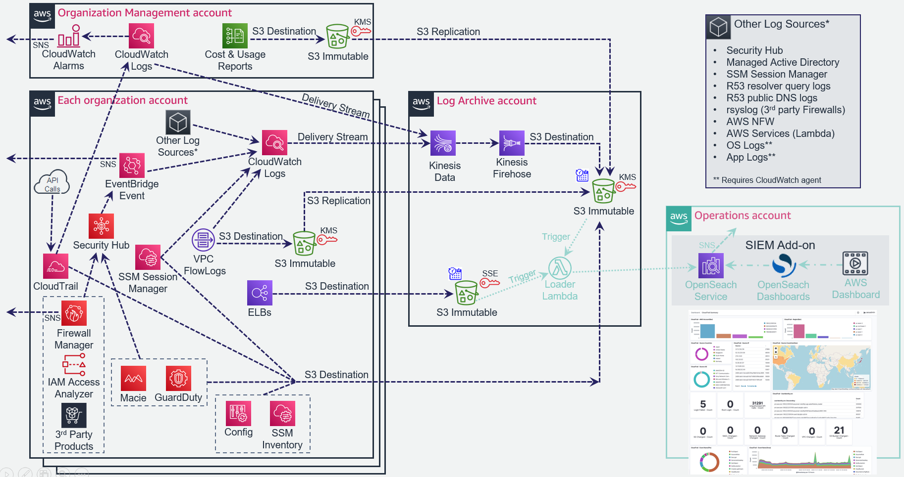

# 1. Accelerator Central Logging Implementation and File Structures

The following diagram details the ASEA central logging implementation:

## 1.1. Accelerator Central Logging Buckets

---

| Bucket Type          | Bucket Name                                               | Purpose                                                 |
| -------------------- | --------------------------------------------------------- | ------------------------------------------------------- |
| AES Encrypted Bucket | pbmmaccel-logarchive-phase0-aescacentral1-1py9vr4cdwuxu   | ALB Logs - ALB's do not support logging to a KMS bucket |
| KMS Encrypted Bucket | pbmmaccel-logarchive-phase0-cacentral1-1tr23emhncdzo      | All other AWS Accelerator initiated logs                |
| AES or KMS Encrypted | aws-controltower-logs-123456789012-ca-central-1           | All Control Tower initiated logs                        |
| AES or KMS Encrypted | aws-controltower-s3-access-logs-123456789012-ca-central-1 | S3 Access logs for the Control Tower logs bucket        |

---

### 1.1.1. Notes

-   Every customer has two Accelerator logging buckets
-   Control Tower installations have an additional two Control Tower logging buckets
-   Customers could use any account name for their central logging account
-   Bucket name format is: {Accel-Prefix}-{Account-Name}-{Accel-Phase}-xxx{Region}-{Random}
    -   {Accel-Prefix} defaults to 'asea' (previously 'pbmmaccel' for Canada)
    -   {Accel-Phase} should always be 'phase0'
    -   {region} should always be 'cacentral1' for Canada
    -   {account} is likely to be 'log-archive'
    -   xxx is either "aes" or "" (nothing)

## 1.2. Accelerator Bucket Folders

---

| Log Type                | Folder Path                                                                                  | Example                                                                                                                                                                                                                                                                                                                             |
| ----------------------- | -------------------------------------------------------------------------------------------- | ----------------------------------------------------------------------------------------------------------------------------------------------------------------------------------------------------------------------------------------------------------------------------------------------------------------------------------- |
| ELB (in AES bucket)     | {account#}/elb-{elbname}/AWSLogs/{account#}/\*                                               | <ul><li> s3://pbmmaccel-logarchive-phase0-aescacentral1-1py9vr4ucwuxu/123456789012/elb-Core-mydevacct1-alb/AWSLogs/123456789012/ELBAccessLogTestFile </li></ul><ul><li>s3://pbmmaccel-logarchive-phase0-aescacentral1-1py9vr4ucwuxu/123456789013/elb-Public-Prod-perimeter-alb/AWSLogs/123456789013/ELBAccessLogTestFile </li></ul> |
| VPC Flow Logs           | {account#}/{vpc-name}/AWSLogs/{account#}/vpcflowlogs/{region}/{year}/{month}/{day}/\*        | <ul><li> s3://pbmmaccel-logarchive-phase0-cacentral1-1tr23emhncdzo/123456789012/Test-East-lcl/AWSLogs/123456789012/vpcflowlogs/us-east-1/2020/08/31/123456789012_vpcflowlogs_us-east-1_fl-04af3543c74402594_20200831T1720Z_73d3922a.log.gz </li></ul>                                                                               |
| Macie Reports           | {account#}/macietestobject                                                                   | <ul><li> s3://pbmmaccel-logarchive-phase0-cacentral1-1tr23emhncdzo/123456789014/macie-test-object </li></ul>                                                                                                                                                                                                                        |
| Cost and Usage Reports  | {account#}/cur/Cost-and-Usage-Report/\*                                                      | <ul><li> s3://pbmmaccel-logarchive-phase0-cacentral1-1tr23emhncdzo/123456789015/cur/Cost-and-Usage-Report/\* </li></ul>                                                                                                                                                                                                             |
| Config History\*        | AWSLogs/{account#}/Config/{region}/{year}/{month}/{day}/ConfigHistory/\*                     | <ul><li> s3://pbmmaccel-logarchive-phase0-cacentral1-1tr23emhncdzo/AWSLogs/123456789016/Config/ca-central-1/2020/8/31/ConfigHistory/123456789016_Config_ca-central-1_ConfigHistory_AWS::CloudFormation::Stack_20200831T011226Z_20200831T025845Z_1.json.gz </li></ul>                                                                |
| Config Snapshot\*       | AWSLogs/{account#}/Config/{region}/{year}/{month}/{day}/ConfigSnapshot/\*                    | <ul><li> s3://pbmmaccel-logarchive-phase0-cacentral1-1tr23emhncdzo/AWSLogs/123456789016/Config/ca-central-1/2020/8/30/ConfigSnapshot/123456789016_Config_ca-central-1_ConfigSnapshot_20200830T193058Z_5d173149-e6d0-41e4-af7f-031ff736f8c8.json.gz </li></ul>                                                                       |
| GuardDuty               | AWSLogs/{account#}/GuardDuty/{region}/{year}/{month}/{day}/\*                                | <ul><li> s3://pbmmaccel-logarchive-phase0-cacentral1-1tr23emhncdzo/AWSLogs/123456789014/GuardDuty/ca-central-1/2020/09/02/294c9171-4867-3774-9756-f6f6c209616f.jsonl.gz </li></ul>                                                                                                                                                  |
| CloudWatch Logs\*\*\*\* | CloudWatchLogs/{year}/{month}/{day}/{hour}/\*                                                | <ul><li> s3://pbmmaccel-logarchive-phase0-cacentral1-1tr23emhncdzo/CloudWatchLogs/2020/08/30/00/PBMMAccel-Kinesis-Delivery-Stream-1-2020-08-30-00-53-33-35aeea4c-582a-444b-8afa-848567924094 </li></ul>                                                                                                                             |
| CloudTrail Digest\*\*\* | {org-id}/AWSLogs/{org-id}/{account#}/CloudTrail-Digest/{region}/{year}/{month}/{day}/\*      | <ul><li> s3://pbmmaccel-logarchive-phase0-cacentral1-1tr23emhncdzo/o-fxozgwu6rc/AWSLogs/o-fxozgwu6rc/123456789016/CloudTrail-Digest/ca-central-1/2020/08/30/123456789016_CloudTrail-Digest_ca-central-1_PBMMAccel-Org-Trail_ca-central-1_20200830T190938Z.json.gz </li></ul>                                                        |
| CloudTrail Insights\*\* | {org-id}/AWSLogs/{org-id}/{account#}/CloudTrail-Insights/{region}/{year}/{month}/{day}/\*    | <ul><li> s3://pbmmaccel-logarchive-phase0-cacentral1-1tr23emhncdzo/o-fxozgwu6rc/AWSLogs/o-fxozgwu6rc/123456789015/CloudTrail-Insight/ca-central-1/2020/09/23/123456789015_CloudTrail-Insight_ca-central-1_20200923T0516Z_KL5e9VCV2SS7IqzB.json.gz </li></ul>                                                                        |
| CloudTrail\*\*\*        | {org-id}/AWSLogs/{org-id}/{account#}/CloudTrail/{region}/{year}/{month}/{day}/\*             | <ul><li> s3://pbmmaccel-logarchive-phase0-cacentral1-1tr23emhncdzo/o-fxozgwu6rc/AWSLogs/o-fxozgwu6rc/123456789016/CloudTrail/ca-central-1/2020/08/30/123456789016_CloudTrail_ca-central-1_20200830T0115Z_3YQJxwt5qUaOzMtL.json.gz </li></ul>                                                                                        |
| CT S3 Access Logs       | {no folders}                                                                                 | <ul><li> s3://aws-controltower-s3-access-logs-123456789012-ca-central-1/2021-04-26-18-11-21-8647E1080048E5CB </li></ul>                                                                                                                                                                                                             |
| SSM Inventory           | ssm-inventory/{ssm-inventory-type}/accountid={account#}/region={region}/resourcetype={rt}/\* | <ul><li> s3://asea-logarchive-phase0-cacentral1-1tr23emhncdzo/ssm-inventory/AWS:Application/accountid=123456789012/region=ca-central-1/resourcetype=ManagedInstanceInventory/i-001188b4e152aecaf.json                                                                                                                               |

---

### 1.2.1. Notes

\* Located in Control Tower bucket when installed, Control Tower adds the {org-id} (i.e. o-h9ho05hcxl/) as the top level folder

\*\* Only available in Accelerator Standalone deployments

\*\*\* CloudTrail control plane logs located in Control Tower bucket when installed, Control Tower drops the {org-id} (i.e. o-h9ho05hcxl/) from the middle of the folder path. This may change when Control Tower migrates to Organization Trails. CloudTrail data plane logs remain in the Accelerator bucket.

\*\*\*\* v1.5.1 introduces the capability to split CloudWatch log groups starting with specific prefixes out into customer named subfolders. The folder/file structure is otherwise identical. The v1.5.1 example config files separate out MAD, RQL, Security Hub, NFW, rsyslog, and SSM logs by default. Example: Security Hub logs will be in the following structure: `CloudWatchLogs/security-hub/{year}/{month}/{day}/{hour}/`

-   Account number is sometimes duplicated in path because logs replicated from another account always need to start with the source account number
-   Macie reports will only appear in the {account#} for the central security account, and only if a customer schedules PII discovery reports
-   All CloudWatch Logs from all accounts are mixed in the same folder, the embedded log format contains the source account information as documented here: <https://docs.aws.amazon.com/AmazonCloudWatch/latest/logs/ValidateLogEventFlow.html>
-   With the exception of CloudWatch Logs, all logs are in the original format provided by the log source/service.
