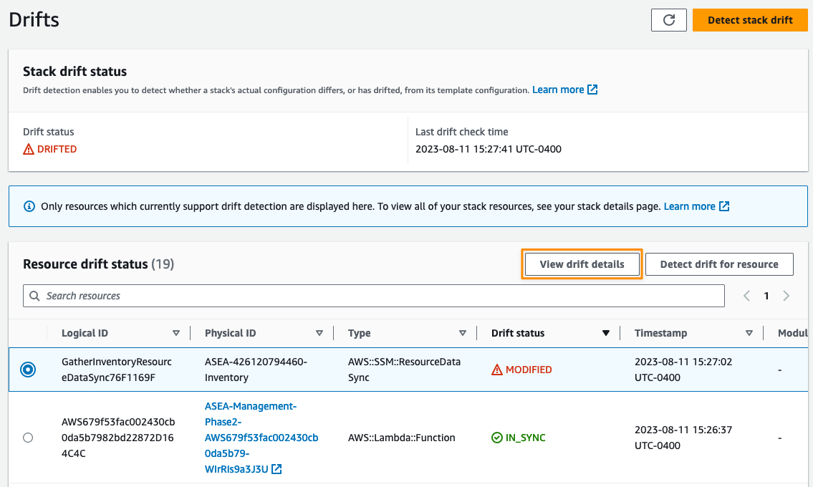

# Handling Drift from Resource Mapping

After executing the Resource Mapping and Drift Detection Scripts you need to check the status of drifted resources and properly handle each case.

At the root of the **Mapping Output Bucket** a file named `AllDriftDetectedResources.csv` is created with a summary of all ASEA resources that have drifted. Download this file and inspect each row.

For a more granular look at Drift Detection, this is available on an account/region/stack basis as well:

- Navigate to `migration/<account-name>/<region>/<stack-name>/<stack-name>-drift-detection.csv`
- The possible values for the resources are:
    - IN_SYNC - there is no drift detected in the CloudFormation Resource
    - MODIFIED - drift has been detected in the CloudFormation Resource. The metadata in the `PropertyDifferences` column describes the drift that needs to be fixed.
    - NOT_SUPPORTED means that CloudFormation does not support drift-detection on that specific resource.
- If there is drift detected, this drift needs to be manually fixed. The specific resource and configurations which need to be addressed will be available in the drift-detection.csv file under `PropertyDifferences` or by Detecting Drift manually in the CloudFormation console (https://docs.aws.amazon.com/AWSCloudFormation/latest/UserGuide/detect-drift-stack.html)

### Inspect the drifted resources

You can find more details about each occurrence by inspecting the drift results in AWS Console.

- Login to your Management Account
- Use the **Switch role** feature to switch to the target account using the management role (i.e. `ASEA-PipelineRole`)
- Go to the CloudFormation console and find the relevant stack
- The **Drift status** should be **Drifted**. In the **Stack actions** menu, select **View drift results**

  

- Find the resources in the **Modified** state, select the radio button on the left and click **View drift details**

  

- The next screen will show the detailed differences. For most resources you will also have a link to open the resource in the console

### Analyze and fix the drifted resources

Each change should be analyzed, confirm if it is expected and why and determine if a corrective action is needed

- Some changes are expected as part of ASEA operations and can be safely ignored (see next section)
- If a change was manually done outside of the ASEA config file:
    - If it could have been done through the config file, you should update the config file accordingly and re-run the state machine to remove the drift
    - If the change was done manually because it cannot be done through ASEA (i.e. Direct Connect configuration, adding rules to ALB listeners, etc.) you should document the change in a central registry. Special attention should be given to those elements during the upgrade and in the post-upgrade testing phase.

!!! warning
    Failure to detect and fix drift before the upgrade can result in the configuration of resources to be reverted to the state described in the configuration file.

Pay special attention to drift on networking resources such as route tables and security groups. Drift detection will only detect drift on resources deployed by ASEA and not all resource types support CloudFormation drift detection. (see the [Resource type support](https://docs.aws.amazon.com/AWSCloudFormation/latest/UserGuide/resource-import-supported-resources.html) table). Review the [Considerations when detecting drift](https://docs.aws.amazon.com/AWSCloudFormation/latest/UserGuide/using-cfn-stack-drift.html#drift-considerations) section to understand edge cases where CloudFormation may not be able to always return accurate drift results.

As an example, drift detection is not supported for resource type `AWS::EC2::SubnetRouteTableAssociation`. If you created route tables outside the accelerator and manually associated these route tables with an ASEA subnet, this change won't be detected in drift detection and the route table association will be reverted to the one defined in the configuration when installing LZA.

!!! warning
    Remember that drift detection is a tool to help you identify manual changes done outside the accelerator, but it won't identify every change. Carefully review and analyze ALL changes done to accelerator resources outside of the configuration file.

## Expected drift (can generally be ignored)

Some of the resources deployed by ASEA are modified by other mechanisms in the normal course of operations of the accelerator (e.g. the `EC2-INSTANCE-PROFILE-PERMISSIONS` Config Rule that dynamically attaches permissions to IAM instance profiles roles). These resources will show as drifted, but they can be safely ignored. A `CanIgnore` flag in `AllDriftDetectedResources.csv` can help you identify drift instances that can generally be safely ignored.

| Stack                                                 | LogicalResourceID               | Notes                                                                               |
| ----------------------------------------------------- | ------------------------------- | ----------------------------------------------------------------------------------- |
| _Multiple_                                            | GatherInventoryResourceDataSync | Multiple occurrence of this finding can be reported in multiple accounts and regions |
| ASEA-LogArchive-Phase0                                | CWLKinesisStreamRole            | Inline policy dynamically added to role                                             |
| ASEA-Perimeter-Phase1-VpcStackPerimeterNestedStack... | PerimeterTgwAttach              | Difference in tags                                                                  |
| ASEA-SharedNetwork-Phase1-VpcStack...                 | \*TgwAttach                     | Difference in tags                                                                  |
| ASEA-SharedNetwork-Phase2                             | FlowLog[VPC]cloudwatchlogs      | One occurrence per VPC. Difference in tags                                           |
| ASEA-SharedNetwork-Phase2-VpcEndpoints1               | EndpointEndpoint...             | Private hosted zone for interface endpoints are shared to additional VPCs          |
| ASEA-SharedNetwork-Phase3                             | _private domain name_           | Private hosted zone for interface endpoints are shared to additional VPCs          |

!!! tip "Note about tags and drift"
    ASEA uses CloudFormation stack-level tags to apply tags to all supported resources in a stack. Tags applied at stack-level can generate false positives on drift detection. You can review the column `PropertyDifferencesPaths` from the `AllDriftDetectedResources.csv` file to verify the properties that have drifted to confirm if only tags are drifted on the resource.