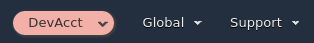
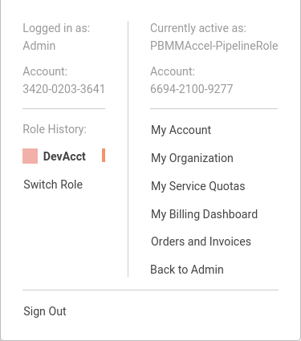

# 1. Common Tasks

## 1.1. Restart the State Machine

The state machine can be stopped and restarted at any time. The Accelerator has been design to be able to rollback to a stable state, such that should the state machine be stopped or fail for any reason, subsequent state machine executions can simply proceed through the failed step without manual cleanup or issues (assuming the failure scenario has been resolved). An extensive amount of effort was placed on ensuring seamless customer recovery in failure situations. The Accelerator is idempotent - it can be run as many or as few times as desired with no negative effect. On each state machine execution, the state machine, primarily leveraging the capabilities of CDK, will evaluate the delta's between the old previously deployed configuration and the new configuration and update the environment as appropriate.

The state machine will execute:

-   automatically after each execution of the Code Pipeline (new installs, code upgrades, or manual pipeline executions)
-   automatically when new AWS accounts are moved into any Accelerator controller OU in AWS Organizations
-   when someone manual starts it: `Step Functions`, `ASEA-MainStateMachine_sm`, `Start Execution`, `Start Execution` (leave default values in name and json box)

The state machine prevents users from accidentally performing certain major breaking changes, specifically unsupported AWS platform changes, changes that will fail to deploy, or changes that could be catastrophic to users. If someone knows exactly what they are doing and the full implications of these changes, we provide the option to override these checks. Customers should expect that items we have blocked CANNOT be changed after the Accelerator installation.

**_These flags should be used with extreme caution. Specifying any of these flags without proper guidance will likely leave your Accelerator in a state of disrepair. These flags were added for internal purposes only - we do NOT support customers providing these flags._**

Providing this parameter to the state machine overrides _all_ checks:

```json
{
    "overrideComparison": true
}
```

Providing any one or more of the following flags will only override the specified check(s):

```json
{
    "configOverrides": {
        "ov-global-options": true,
        "ov-del-accts": true,
        "ov-ren-accts": true,
        "ov-acct-email": true,
        "ov-acct-ou": true,
        "ov-acct-vpc": true,
        "ov-acct-subnet": true,
        "ov-tgw": true,
        "ov-mad": true,
        "ov-ou-vpc": true,
        "ov-ou-subnet": true,
        "ov-share-to-ou": true,
        "ov-share-to-accounts": true,
        "ov-nacl": true,
        "ov-nfw": true
    }
}
```

Providing this value allows for the forced rebuilding of the DynamoDB Outputs table:

```json
{
    "storeAllOutputs": true
}
```

## 1.2. Switch To a Managed Account

To switch from the root account to a managed account you can click on your account name in the AWS Console. Then choose `Switch Role` in the menu.


In the page that appears next you need to fill out the account ID of the managed account you want to switch to. Next, you need to enter the role name defined in `organization-admin-role` (default: `AWSCloudFormationStackSetAdministrationRole`). And lastly, you need to enter a relevant name so you can later switch roles by using this name.

**TBD: This role may be locked down starting in v1.2.5 - Update process once direction finalized**

**_Caution:_** This mechanism is ONLY to be used for troubleshooting Accelerator problems. This role is outside the Accelerator governance process and bypasses **all** the preventative guardrails that protect the Accelerator contructs and prevent users from performing activities in violation of the security guardrails. This role should NOT be used outside this context, all users should be authenticating and logging into the environment through AWS SSO.


After switching to the managed account, the AWS Console header will look like the following image.



You can switch to the same account again quickly by clicking the name you entered previously in the menu.


