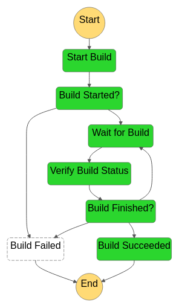

# 1. System Overview

This document is targeted at individuals installing or executing the AWS Secure Environment Accelerator. It is intended to guide individuals who are executing the Accelerator by providing an understanding as to what happens at each point throughout execution and to assist in troubleshooting state machine failures and/or errors. This is one component of the provided documentation package and should be read after the Installation Guide, but before the Developer Guide.

## 1.1. Overview

The system can be thought of in two levels. The first level of the system consists of Accelerator stacks and resources. Let's call these the Accelerator-management resource. The second level of the system consists of stacks and resources that are deployed by the Accelerator-management resource. Let's call these the Accelerator-managed resources. The Accelerator-management resources are responsible for deploying the Accelerator-managed resources.

There are two Accelerator-management stacks:

-   the `Installer` stack that is responsible for creating the next listed stack;
-   the `Initial Setup` stack. This stack is responsible for reading configuration file and creating Accelerator-managed resources in the relevant accounts.

There are multiple Accelerator-managed stacks. Currently there are as many as twelve Accelerator-managed stacks per managed account.

The figure below shows a zoomed-out overview of the Accelerator. The top of the overview shows the Accelerator-management resources, i.e. the `Installer` stack and the `Initial Setup` stack. The bottom of the overview shows the Accelerator-managed resources in the different accounts.

## 1.2. Installer Stack

The Accelerator-management `Installer` stack contains the necessary resources to deploy the Accelerator-management `Initial Setup` stack in an AWS account. This AWS account will be referred to as the 'root' account in this document.

The Installer stack consists of the following resources:

-   `ASEA-InstallerPipeline`: this is a `AWS::CodePipeline::Pipeline` that pulls the latest Accelerator code from GitHub. It launches the CodeBuild project `ASEA-InstallerProject_pl`, executes the `ASEA-Installer-SaveApplicationVersion` Lambda and launches the Accelerator state machine.
-   `ASEA-InstallerProject_pl`: this is a `AWS::CodeBuild::Project` that installs the Accelerator in AWS account.
-   `ASEA-Installer-SaveApplicationVersion`: this is a `AWS::Lambda::Function` that stores the current Accelerator version into Parameter Store.
-   `ASEA-Installer-StartExecution`: this is a `AWS::Lambda::Function` that launches the Accelerator after CodeBuild deploys the Accelerator.
-   Creation of AWS::DynamoDB::Table - `ASEA-Parameters` and `ASEA-Outputs` which are used for the internal operation of the Accelerator. `ASEA-Outputs` is used to share CloudFormation stack outputs between regions, stacks and phases. `ASEA-Parameters` is used to various configuration items like managed accounts, organizations structure, and limits.

The `ASEA-InstallerPipeline` starts when first installed using the CloudFormation template. The administrator can also start the pipeline manually by clicking the `Release Change` button in the AWS Console.

This starts the `ASEA-InstallerProject_pl` CodeBuild project. The CodeBuild project uses the GitHub source artifact. The CodeBuild projects spins up a new Linux instances and installs the Accelerator dependencies and starts the deployment of the Accelerator using the [AWS Cloud Development Kit](https://docs.aws.amazon.com/cdk/v2/guide/getting_started.html).

CDK bootstraps its environment and creates the `CDKToolkit` stack in the AWS account. It creates the S3 bucket `cdktoolkit-stagingbucket-*` and the ECR repository `aws-cdk/assets`.

CDK copies assets to the bootstrap bucket and bootstrap repository that are used by the Accelerator. The assets that are stored on S3 include default IAM policies, default SCPs, default firewall configuration. The assets that are pushed to ECR include the Accelerator Docker build image. This Docker image is responsible for deploying Accelerator resources using CDK.

CDK finally deploys the `Initial Setup` stack. The Accelerator state machine is described in the next section.

This diagram depicts the Accelerator Installer CodePipeline as of v1.2.1:

Once the Code Pipeline completes successfully:

-   the Accelerator codebase was pulled from GitHub
-   the Accelerator codebase was deployed/installed in the Organization Management (root) AWS account
-   parameter store `/accelerator/version` was updated with the new version information
    -   this provides a full history of all Accelerator versions and upgrades
-   the newly installed Accelerator state machine is started

At this time the resources deployed by the Installer Stack are no longer required. The Installer stack **could** be removed (which would remove the Code Pipeline) with no impact on Accelerator functionality.

If the Installer Stack was removed, it would need to be re-installed to upgrade the Accelerator. If the stack was not removed, an Accelerator codebase upgrade often only requires updating a single stack parameter to point to the latest Accelerator code branch, and re-releasing the pipeline. No files to manually copy, change or update, an upgrade can be initiated with a simple variable update.

## 1.3. Initial Setup Stack

The Accelerator-management `Initial Setup` stack, named `ASEA-InitialSetup`, consists of a state machine, named `ASEA-MainStateMachine_sm`, that executes various steps to create the Accelerator-managed stacks and resources in the Accelerator-managed accounts. Using a state machine, we can clearly define the deployment process and systematically control branches of execution and handle exceptions.

The Accelerator comprises a primary state machine `ASEA-MainStateMachine_sm`, and nine supporting state machines (as of v1.2.1). Customer will only ever Execute the `ASEA-MainStateMachine_sm`. All troubleshooting will also typically begin with the `ASEA-MainStateMachine_sm`.

The image below depicts the latest state `ASEA-MainStateMachine_sm` machine. Each green or white square in the image represents a step in the state machine. This all green diagram represents a successul Accelerator state machine execution.

Notice the extremely linear state machine design. This was done to reduce complexity and ease troubleshooting. You may notice a small fork in the state machine. The left path is executed if the Accelerator is deployed on top of an ALZ, The right path is executed if the Accelerator is deployed as a standalone solution. If we eventually add a Control Tower deployment option, it is likely it could also leverage the existing ALZ path.

The state machine contains three different types of steps:

1. steps that execute a Lambda function;
2. steps that start another state machine, e.g. `Create Accounts` step;
3. steps that start another state machine that starts a CodeBuild project, e.g. the `Phase {-1,0,1,2,3,4,5}` steps.

The stack additionally consists of the following resources:

-   AWS::CodeBuild::Project
    -   `ASEA-Deploy` or `ASEA-DeployPrebuilt`
-   AWS::CodeCommit::Repository
    -   `ASEA-Config-Repo`
-   AWS::IAM::Role
    -   `ASEA-L-SFN-MasterRole`
    -   `ASEA-L-SFN-Execution`
-   AWS::Lambda::Function
    -   A Lambda function for every Lambda function step in the state machine.
-   AWS::StepFunctions::StateMachine
    -   `ASEA-ALZCreateAccount_sm`: See [_Create Landing Zone Account_](#136-create-landing-zone-account);
    -   `ASEA-OrgCreateAccount_sm`: See [_Create Organization Account_](#1310-create-organization-account);
    -   `ASEA-InstallCfnRoleMaster_sm`: See [Install CloudFormation Execution Role](#139-install-cloudformation-role-in-root);
    -   `ASEA-InstallRoles_sm`: See [_Install Execution Roles_](#1313-install-execution-roles);
    -   `ASEA-DeleteDefaultVpcs_sfn`: See [_Delete Default VPCs_](#1314-delete-default-vpcs);
    -   `ASEA-CodeBuild_sm`: See [_Deploy Phase 0_](#1320-deploy-phase-0);
    -   `ASEA-CreateConfigRecorder_sfn`: See [_Create Config Recorders_](#1323-create-config-recorders);
    -   `ASEA-CreateAdConnector_sm`: See [_Create AD Connector_](#1338-create-ad-connector);
    -   `ASEA-StoreOutputs_sm`: See [_Share Outputs_](#1321-store-phase-0-output) - new in v1.2.1.

_Note: Most resources have a random suffix to their name. This is because we use CDK to deploy the resources. See [https://docs.aws.amazon.com/cdk/latest/guide/identifiers.html#identifiers_logical_ids]()_

### 1.3.1. Get or Create Configuration from S3

This step calls a Lambda function that finds or creates the configuration repository. Finds the configuration file(s) in the CodeCommit repository. If the configuration file cannot be found in the repository it is copied from the customer's S3 configuration bucket. If the copy is successful then the configuration file(s) in the S3 bucket will be removed.

The configuration file `config.json` or `config.yaml` is parsed and validated. This step will fail if both file types exist, the configuration file is not valid JSON or YAML or does not adhere to the configuration file specification. Internally the Accelerator always leverages JSON, but accepts JSON or YAML as the source input file and converts it to JSON prior to each execution, storing the converted and fully expanded file if in the raw folder.

### 1.3.2. Get Baseline from Configuration

This step calls a Lambda function that gets the `alz-baseline` of the configuration file to decide which path in the state machine will be taken.

### 1.3.3. Compare Configurations

This step calls a Lambda function that compares the previous version of the configuration file with the current version of the configuration file. The previous configuration file CodeCommit commit id is stored in the secret `accelerator/config/last-successful-commit` in AWS Secrets Manager in the root account.

The following configuration file changes are not allowed:

-   changing ALZ baseline;
-   changing root account or region;
-   changing central log services account or region;
-   changing the organizational unit, name or email address of an account;
-   removing an account;
-   changing the name, CIDR or region of a VPC;
-   disabling a VPC;
-   changing the name, availability zone, CIDR of a subnet;
-   disabling or removing a subnet;
-   changing the name, ASN, region or features of a transit gateway;
-   changing the ID, VPC, subnet, region, size, DNS, Netbios of a Managed Active Directory;
-   disabling a Managed Active Directory;
-   changing the ASN of a virtual private gateway;
-   changing the sharing to accounts of a VPC;
-   changing the NACLs of a subnet.

It is possible to ignore certain configuration file changes. See [Restart the State Machine](./common-tasks.md#11-restart-the-state-machine) how to pass these options to the state machine.

### 1.3.4. Load Landing Zone Configuration

_Executed only when using AWS Landing Zone baseline_

This step calls a Lambda function that validates the ALZ deployment and configuration.

This step fails when

-   an existing ALZ deployment in the root account can not be found;
-   an organizational unit that is used by ALZ or the Accelerator can not be found;
-   an account is present in the Accelerator configuration but does not exist in AWS Organizations;
-   an account has a name, email address or organizational unit that is different from the ALZ configuration;
-   an account has a name, email address or organizational unit that is different from the Accelerator configuration;
-   the organizational units in the ALZ configuration are different from the ones in AWS Organizations;
-   the account type of ALZ configuration accounts can not be detected;
-   the accounts of type `primary`', `security`, `log-archive`, `shared-services` are missing from the ALZ configuration.

### 1.3.5. Add Execution Role to Service Catalog

_Executed only when using AWS Landing Zone baseline_

This step calls a Lambda function that adds the state machine's IAM role to the ALZ Account Vending Machine (AVM) service catalog portfolio.

### 1.3.6. Create Landing Zone Account

_Executed only when using AWS Landing Zone baseline_

This step starts the `ASEA-ALZCreateAccount_sm` state machine. This state machine is responsible for creating an account using the AVM and waits for the account to be created and configured.

### 1.3.7. Organizational Unit (OU) Validation

_Executed only when using AWS Organizations baseline_

This step validates that the OU structure defined in the Accelerator configuration file matches the OU and account structure defined in AWS Organizations. Missing OUs are created. If any AWS Accounts or OUs have been renamed, this step updates the configuration file with the latest information. Accounts located in the incorrect top-level OU cause a state machine failure.

### 1.3.8. Load Organization Configuration

_Executed only when using AWS Organizations baseline_

This step calls a Lambda function that validates the Accelerator deployment and configuration.

This step fails when

-   an organizational unit that is used by the Accelerator can not be found;
-   an account is present in the Accelerator configuration but does not exist in AWS Organizations;
-   an account has a name, email address or organizational unit that is different from the Accelerator configuration.
-   **returns accounts that have not been created**
-   duplicates some validation functionality

### 1.3.9. Install CloudFormation Role in root

_Executed only when using AWS Organizations baseline_

This step starts the `ASEA-InstallCfnRoleMaster_sm` state machine. This state machine is responsible for creating the IAM role defined in `organization-admin-role` (default: `AWSCloudFormationStackSetAdministrationRole`) in the root account. You can read more about why this role is created [here](https://docs.aws.amazon.com/AWSCloudFormation/latest/UserGuide/stacksets-prereqs.html).

### 1.3.10. Create Organization Account

_Executed only when using AWS Organizations baseline_

This step starts the `ASEA-OrgCreateAccount_sm` state machine. This state machine is responsible for creating an account using the AWS Organizations and waits for the account to be created and configured. The newly created account will be moved to the correct organizational unit and will have an the `ASEA-Quarantine-New-Object` Service Control Policy (SCP) attached to it. The SCP will only be removed after the Accelerator state machine has completed.

Application of this SCP ensures that new AWS accounts cannot be used until they have been properly configured and had all Accelerator guardrails applied per the configuration file. It is important that guardrails be consistently in place from the time a user first accesses a new AWS account, until the account is decommissioned. Should the state machine fail, still be in-progress, or has not yet processed the account (for whatever reason), users who access it will be prevented from doing _anything_.

### 1.3.11. Load Organizational Units

This step calls a Lambda function that loads all Organizational Units. The Organizational Units are stored in the DynamoDB table `ASEA-Parameters` in the root account. The Organizational Units will later be used to determine which configuration file options apply to an AWS account.

### 1.3.12. Load Accounts

This step calls a Lambda function that loads all accounts. The accounts are stored in the DynamoDB table `ASEA-Parameters` in the root account. The accounts will later be used to deploy stacks in the correct accounts.

### 1.3.13. Install Execution Roles

This step calls a Lambda function that creates stack sets in all Accelerator accounts. This stack sets contains a single resource, i.e. an IAM role `ASEA-PipelineRole` that can be assumed by the `ASEA-L-SFN-MasterRole`. This IAM role allows the root account to administer the Accelerator accounts.

### 1.3.14. Delete Default VPCs

This step starts the `ASEA-DeleteDefaultVpcs_sfn` state machine. This state machine is responsible for deleting default subnets, internet gateways and VPCs for all regions and accounts in the Accelerator configuration.

This step fails when one or more default VPCs cannot be deleted. This step does not fail on the first error, it executes on all accounts/regions and then fails with a complete list of errors.

### 1.3.15. Load Limits

This step calls a Lambda function that loads service quotas and requests a service quota increase according to the configuration file. When a service quota increase request has been closed but not increased, then the service quota request will be issued again when the creation of the last request was at least two days ago.

### 1.3.16. Enable Trusted Access for Services

This step calls a Lambda function that is responsible for

-   enabling AWS service access in the organization;
-   enabling AWS Resource Access Manager sharing in the organization;
-   creating a service-linked role for AWS IAM Access Analyzer;
-   setting the security account as delegated administrator for AWS Firewall Manager;
-   setting the security account as delegated administrator for AWS IAM Access Analyzer;
-   setting the security account as delegated administrator for Amazon GuardDuty.

### 1.3.17. Store All Phase Outputs

This step only executes on the first run of the state machine after it has been upgraded to v1.2.0 or above. This step exists solely to support upgrades from Accelerator versions prior to v1.2.0 and can be removed when no existing customers are running versions older than v1.2.0. This steps populates the DynamoDB Outputs table with the outputs from previous executions which were previously stored in S3 (and at one time even stored in secrets manager).

### 1.3.18. Deploy Phase -1 (Negative one)

-   The following resources are deployed in phase -1:
    -   Creating required roles for macie custom resources
    -   Creating required roles for guardDuty custom resources
    -   Creating required roles for securityHub custom resources
    -   Creating required roles for IamCreateRole custom resource
    -   Creating required roles for createSSMDocument custom resource
    -   Creating required roles for createLogGroup custom resource
    -   Creating required roles for CWLCentralLoggingSubscriptionFilterRole custom resource
    -   Creating required roles for TransitGatewayCreatePeeringAttachment custom resource
    -   Creating required roles for TransitGatewayAcceptPeeringAttachment custom resource
    -   Creating required roles for createLogsMetricFilter custom resource
    -   Creating required roles for SnsSubscriberLambda custom resource

### 1.3.19. Store Phase -1 Output

This step calls a Lambda function that stores the outputs from the deployed stacks in sub-accounts in the DynamoDB table `ASEA-Outputs` in AWS Secrets Manager in the root account.

### 1.3.20. Deploy Phase 0

This step starts the `ASEA-CodeBuild_sm` state machine. This state machine is responsible for starting a CodeBuild execution that deploys CloudFormation stacks in Accelerator-managed accounts using CDK.

The same CodeBuild project is used to deploy all phases. The environment variable `ACCELERATOR_PHASE` in the CodeBuild execution decides which phase to deploy.

The following resources are deployed in phase 0:

-   create default EBS encryption key;
-   create an AWS log bucket with encryption key;
-   create the central log services bucket with encryption key;
-   create the Accelerator configuration bucket with encryption key;
-   copy artifacts to the Accelerator configuration bucket:
    -   SCPs;
    -   firewall configuration;
-   account warming (step 1);
-   set password policy (step 1);
-   create IAM users (step 1):
    -   create passwords and store in Secrets Manager;
-   create MAD deployment (step 1):
    -   create passwords and store in Secrets Manager;
    -   create service-linked role;
-   create `rsyslog` deployment (step 1);
-   create firewalls (step 1);
-   create budgets (step 1);
-   create transit gateways (step 1);
-   create Route53 DNS logging log group;
-   enable Macie (step 1);
-   enable GuardDuty;
-   enable Access Analyzer;

### 1.3.21. Store Phase 0 Output

This step calls a Lambda function that stores the outputs from the deployed stacks in sub-accounts in the secret `ASEA-Outputs` in AWS Secrets Manager in the root account.

### 1.3.22. Verify Files

This step verifies that all required files to complete the installation have been provided by the user. If any required files have not been provided, this step will fail and provide a list of _all_ missing files.

Why do we wait until so late in the state machine execution to perform this task?

1. we do not want to add or delete files from a customer supplied bucket
2. we do not want to force customers to need to copy and supply standard configuration files for 3. prescriptive installation
3. we want to allow customers to override the sample or standard configuration files
4. the config bucket is only created in Phase 0
5. we copy all the relevant sample files from reference-artifacts folders to our config bucket, and then, we copy any customer supplied config files over top of our sample files
6. This allows customers to override the sample configs, with customer custom configs without needing to either fork the repo, or supply the files on a vanilla install
7. Until we do this file copy, we cannot be sure that the combination of customer supplied and reference-artifact sample files provides all the required files.

### 1.3.23. Create Config Recorders

This step starts the `ASEA-CreateConfigRecorder_sfn` state machine. This state machine is responsible for creating Config recorders in all accounts and regions.

### 1.3.24. Add SCPs to Organization

This step calls a Lambda function that creates and attaches the SCPs listed in the Accelerator configuration. The SCP policies are loaded from the Accelerator configuration bucket.

This step fails when

-   an SCP policy cannot be found in the Accelerator configuration bucket;
-   an SCP could not be attached to an organizational unit or account, e.g. when the maximum number of attached SCPs is exceeded

### 1.3.25. Deploy Phase 1

-   Create S3 Bucket in all accounts and replicate to Log Account Bucket
-   Deploy VPC:
    -   Vpc
    -   Subnets
    -   Subnet sharing (RAM)
    -   Route tables
    -   Internet gateways
    -   NAT gateways
    -   Interface endpoints
    -   Gateway endpoints
    -   Transit Gateway Attachments
    -   IAM Role required for VPC Peering Auto accept
-   Firewall images subscription check
-   Creates the customer gateways for the EIPs of the firewall
-   Create IAM Roles, Users in account based on configuration
-   Creates the additional budgets for the account stacks.
-   Import Certificates
-   Setup SSMSessionManagerDocument
-   Create Cost and Usage reports
-   Enable Macie in root Account
-   GuardDuty setup in Security Account
-   Setup CWL Central Logging
-   Create Roles required for Flow Logs
-   Transit Gateway Peering
-   Create LogGroup required for DNS Logging

### 1.3.26. Store Phase 1 Output

See [_Deploy Phase 0_](#1320-deploy-phase-0).

### 1.3.27. Account Default Settings

This step calls a Lambda function that

-   enables and sets EBS default encryption for all accounts in the Accelerator configuration;
-   enables S3 object level ALZ CloudTrail logging;
-   enables Log Insight events;
-   enables KMS encryption using the CMK from the central logging account;
-   sets AWS Systems Manager Session Manager default configuration in every Accelerator-managed account in every region with a VPC.

### 1.3.28. Deploy Phase 2

-   Create CloudTrail in root account
-   Create VPC Peering Connection
-   Create Security Groups for shared VPC in sub accounts
-   Setup Security Hub in Security Account
-   Setup Cross Account CloudWatch logs sharing by creating roles in sub accounts
-   Enable VPC FlowLogs
-   Create Active Directory (MAD)
-   Create Firewall clusters
-   Create Firewall Management instance
-   Create Transit Gateway Routes, Association and Propagation
-   Enable Macie in Security account and Create Members, Update Config
-   GuardDuty - Add existing Org accounts as members and allow new accounts to be members and Publish
-   Create SNS Topics in Log Account
-   TGW Peering Attachments

### 1.3.29. Store Phase 2 Output

See [_Deploy Phase 0_](#1320-deploy-phase-0).

### 1.3.30. Deploy Phase 3

-   create peering connection routes;
-   create ALB (step 1);
-   create `rsyslog` deployment (step 2);
-   create hosted zones, resolver rules and resolver endpoints and Share;
-   Enable Security Hub and Invite Sub accounts as members;
-   TransitGateway Peering attachment and routes;
-   Macie update Session;

### 1.3.31. Store Phase 3 Output

See [_Deploy Phase 0_](#1320-deploy-phase-0).

### 1.3.32. Deploy Phase 4

-   SecurityHub Disable Controls
-   Creates CloudWatch Metrics on LogGroups
-   Associate Shared Resolver Rules to VPC
-   Associate Hosted Zones to VPC

### 1.3.33. Store Phase 4 Output

See [_Deploy Phase 0_](#1320-deploy-phase-0).

### 1.3.34. Associate Hosted Zones (Step removed in v1.2.1)

This step calls a Lambda function that associates the private zones, all the interface endpoint zones, and the resolver rules with each VPC that leverages endpoint services. This step was removed in v1.2.1 of the Accelerator codebase.

### 1.3.35. Add Tags to Shared Resources

This step calls a Lambda function that adds tags to shared resources in the share destination account. For example, when a subnet is shared into another account, this step will add the `Name` tag to the subnet in the shared account.

The supported resources are

-   VPCs;
-   subnets;
-   security groups;
-   transit gateway attachments.

### 1.3.36. Enable Directory Sharing

This step calls a Lambda function that shares Managed Active Directory according to the Accelerator configuration. The directory is shared from the source account to the target account. The directory will be accepted in the target account.

### 1.3.37. Deploy Phase 5

-   create Remote Desktop Gateway;
    -   create launch configuration;
    -   create autoscaling group;
-   enable central logging to S3 (step 2);
-   Create CloudWatch Events for moveAccount, policyChanges and createAccount
-   Creates CloudWatch Alarms

### 1.3.38. Create AD Connector

This step starts the `ASEA-DeleteDefaultVpcs_sfn` state machine. This state machine is responsible for creating AD connectors according to the Accelerator configuration.

This step fails when one or more AD connectors failed to be created.

### 1.3.39. Store Commit ID

This step calls a Lambda function that stores the commit ID of the configuration file for which the state machine ran.

### 1.3.40. Detach Quarantine SCP

_Executed only when using AWS Organizations baseline_

This step calls a Lambda function that stores the commit ID for which the state machine just ran.
