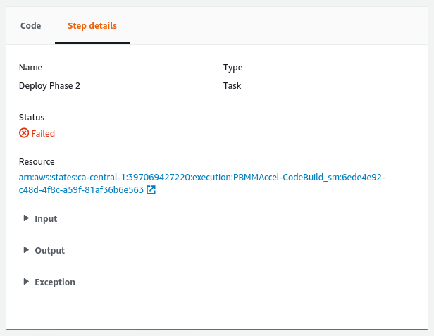
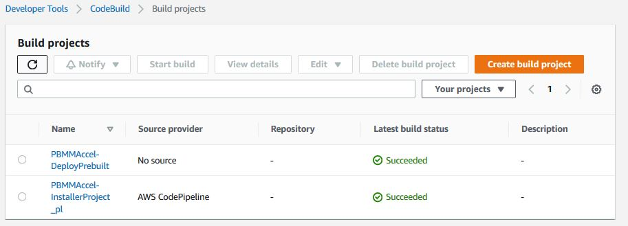
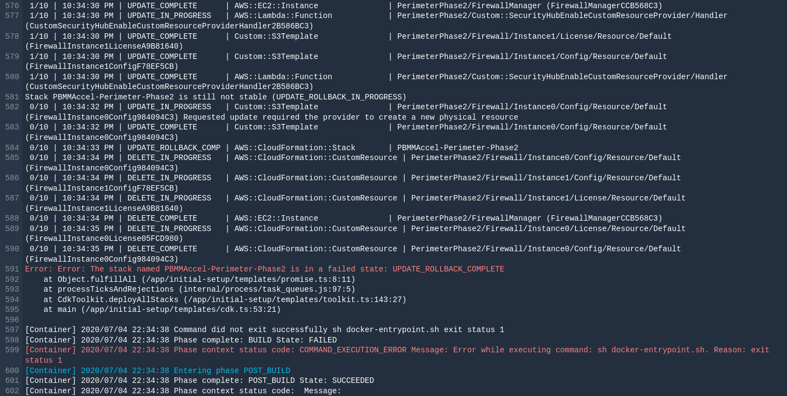
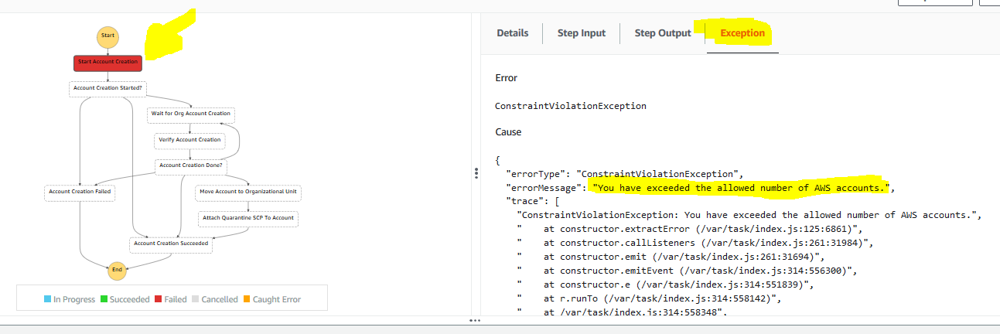
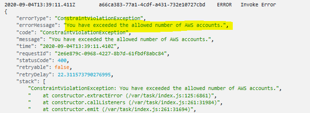
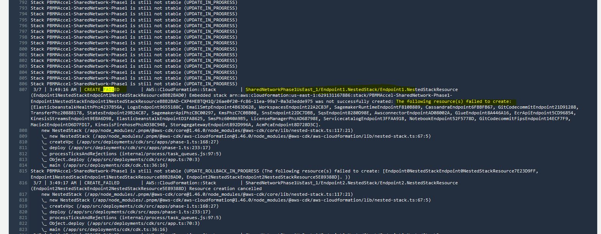

# 1. Troubleshooting

## 1.1. Overview

Issues could occur in different parts of the Accelerator. We'll guide you through troubleshooting these issues in this section.

## 1.2. Components

### 1.2.1. State Machine

Viewing the step function `Graph inspector` (depicted above in 2.2), the majority of the main state machine has a large colored box around which is the functionality to catch state machine failures `Main Try Catch block to Notify users`. This large outer box will be blue while the state machine is still executing, it will be green upon a successful state machine execution and will turn orange/yellow on a state machine failure.

What if my State Machine fails? Why? Previous solutions had complex recovery processes, what's involved?

If your main state machine fails, review the error(s), resolve the problem and simply re-run the state machine. We've put a huge focus on ensuring the solution is idempotent and to ensure recovery is a smooth and easy process.

Ensuring the integrity of deployed guardrails is critical in operating and maintaining an environment hosting protected data. Based on customer feedback and security best practices, we purposely fail the state machine if we cannot successfully deploy guardrails.

Additionally, with millions of active customers each supporting different and diverse use cases and with the rapid rate of evolution of the AWS platform, sometimes we will encounter unexpected circumstances and the state machine might fail.

We've spent a lot of time over the course of the Accelerator development process ensuring the solution can roll forward, roll backward, be stopped, restarted, and rerun without issues. A huge focus was placed on dealing with and writing custom code to manage and deal with non-idempotent resources (like S3 buckets, log groups, KMS keys, etc.). We've spent a lot of time ensuring that any failed artifacts are automatically cleaned up and don't cause subsequent executions to fail. We've put a strong focus on ensuring you do not need to go into your various AWS sub-accounts and manually remove or cleanup resources or deployment failures. We've also tried to provide usable error messages that are easy to understand and troubleshoot. As new scenario's are brought to our attention, we continue to adjust the codebase to better handle these situations.

Will your state machine fail at some point in time, likely. Will you be able to easily recover and move forward without extensive time and effort, YES!

As the state machine executes, each step will turn from white (not started), to blue (executing), to green (Success), or grey/red (failure). To diagnose the problem select the grey/red step that failed. If you miss the step and select the outer box, you will have selected the `Main Try Catch block to Notify users`. You need to carefully select the failed step.


As stated in section 2.2, the state machine contains 3 different types of states, which are each diagnosed differently.

a. If the step is calling a Lambda function then you will see the following after clicking the failed step.


In this case, you can see that the `Cause` section contains a useful message. This message will differ between Lambda functions. In case this message does not make the issue clear, you can click on the `CloudWatch Logs` link in the `Resource` section to view the output of the Lambda function that was called by the step. See the section [CloudWatch Logs](#125-cloudwatch). Note: The `Resource` section contains two links that blend together. You need to click the second link (`CloudWatch Logs`), not the first link which will open the actual resource/Lambda.

b. In case the failed step started another state machine, you will see the following after clicking the failed step.



To view the state machine execution that failed you can click the link in the `Resource` section.

In case the failed step started the CodeBuild state machine, `ASEA-CodeBuild_sm`, you will be able to see the CodeBuild project and execution ID that failed by looking at the output of the `Start Build` step in the `ASEA-CodeBuild_sm` state machine.

.

In the image above the execution of CodeBuild project `ASEA-DeployPrebuilt` with ID `ASEA-DeployPrebuilt:717584a9-c406-4569-9cc2-0d23e9ff9ef0` failed. See the [CodeBuild](#122-codebuild) section to troubleshoot.

### 1.2.2. CodeBuild

The Accelerator deploys and leverages two CodeBuild projects. The `ASEA-InstallerProject_pl` project is used by the Code Pipeline/Installer stack and `ASEA-DeployPrebuilt` which is used throughout the Accelerator state machine. Both are similar in that they use CDK to deploy stacks. The installer project will not exist, if the installer has been removed.



After a successful installation you will see the following in Codebuild, for the `ASEA-DeployPrebuilt` project:


When an error occurs you will see that the CodeBuild project execution fails when looking in the execution overview.


You can click on the name of the CodeBuild execution and then look inside the logs what caused the failure. These logs can be confusing. We are deploying multiple stacks in parallel and all the messages for all the parallel deployments are interleaved together, so make sure you are correlating the events back to the correct event source. Because we are deploying to 16 regions in parallel, you will also see messages for the same stack deployment interleaved. Even though a task may indicate it is complete and then another seemingly identical task indicates in-progress, the second message is coming from one of the alternate regions.



You can for example see the error message `The stack named ASEA-Perimeter-Phase2 is in a failed state: UPDATE_ROLLBACK_COMPLETE`. This means the stack `ASEA-Perimeter-Phase2` failed to update and it had to rollback. The error indicated at the bottom of the Codebuild screen is typically NOT the cause of the failure, just the end result. You need to scroll up and find the FIRST occurrence of an error in the log file. Often starting at the top of the log file and searching for the text `FAIL` (case sensitive), will allow you to find the relevant error message(s) quickly. The failure is typically listed in the CloudFormation update logs.


In this example we can see that the resource `FirewallManager` failed to create through CloudFormation. One way to solve this issue is to deprovision the firewall manager in the configuration file and then run the state machine. Next, provision the firewall manager and run the state machine again.

If the error message is not clear, or the error occurred in a nested stack, then a more detailed error will be available in the CloudFormation stack events. See the [CloudFormation](#123-cloudformation) section below.


### 1.2.3. CloudFormation

In case you want to troubleshoot errors that occurred in CloudFormation, the best way is to look in the CloudFormation stack's events. This requires you to assume a role into the relevant sub-account, and to locate the relevant failed, rolled-back, or deleted stack. Unfortunately, we are unable to log the region of the error message, so depending on what's being deployed, you may need to search all 16 regions for the failed stack.


When a native resource fails to create or update there are no additional logs available except what is displayed in the `Status reason` column. When a custom resource fails to create or update -- i.e. not a native CloudFormation resource but a resource backed by a custom Lambda function -- then we can find additional logs in CloudWatch.

Often the stack failure occurrs in a managed account instead of the root account. See [Switch To a Managed Account](./common-tasks.md#12-switch-to-a-managed-account) to switch to the CloudFormation console in the managed account.

### 1.2.4. Custom Resource

Custom resources are backed by a Lambda function that implements the creation, modification or deletion or the resource. Every Lambda function has a CloudWatch log group that contains logs about the custom resource creation. To troubleshoot errors in custom resource, you need to check the custom resource's log group.

Example custom resource log group names:

```
/aws/lambda/ASEA-Master-Phase1-CustomCurReportDefinitionL-14IHLQCC1LY8L
/aws/lambda/ASEA-Master-Phase2-AWS679f53fac002430cb0da5b7-Z75Q4GG9LIV5
/aws/lambda/ASEA-Operations-Phas-AWS679f53fac002430cb0da5-HMV2YF6OKJET
/aws/lambda/ASEA-Operations-Phas-CustomGetDetectorIdLambd-HEM07DR0DOOJ
```

### 1.2.5. CloudWatch

When you arrived in CloudWatch logs by clicking on the state machine's step `CloudWatch Logs` link you will immediately see the list of log streams. Every log stream represents an instance of the Lambda function.

You can find errors in multiple log groups using CloudWatch Log Insights.


```
fields @timestamp, @message
| sort @timestamp desc
| filter strcontains(@message, 'ERROR')
| limit 100
```

### 1.2.6. CodePipeline

-   "Internal Failure" incorrect Github token, repo or branch

## 1.3. Examples

Lets walk through a couple of example:

### 1.3.1. Example 1

State Machine failed (Lambda), click on the grey box, then click on the Resource object:

Click on the red failed box, click on `Step Input`. The error is clearly indicated, we could not delete a Default VPC because the default VPC had dependencies, in a specified account and region. In this case several dependencies exist and need to be cleaned up to proceed (EIP's and something less obvious like security groups).


### 1.3.2. Example 2

In the next example the state machine failed (sub-state machine) on the create accounts step. In this case rather than clicking on the `Graph inspector` we are going to scroll down through the `Execution event history` underneath the Graph inspector. We are going to find the FIRST failed task from the top of the list and then select the state machine from the prior task:

We will then click onn the red failed box, select `Exception` and we can see a clear error message - we have exceeded the maximum number of AWS accounts allowed in your organization:

Alternatively, in case the `Exception` error is not clear, we can select `Details` and then select `CloudWatch logs` for the **end** of the `Resource` section:

If you open the latest log stream in the opened log group (`/aws/lambda/ASEA-InitialSetup-StartAccountCreationHandler-1IZ2N4EP29D72`) and review the last several messages in the stream, the following clear message also appears:



### 1.3.3. Example 3

In the next example the state machine failed in one of the CodeBuild state machine steps, based on the `Resource` name of the failed step.

Rather than tracing this failure through the sub-state machine and then into the failed CodeBuild task, we are simply going to open AWS CodeBuild, and open the `ASEA-DeployPrebuilt` task. The failed task should be on the top of the Codebuild `build run` list. Open the build job.

Using your browser, from the top of the page, search for "FAIL", and we are immediately brought to the error. In this particular case we had an issue with the creation of VPC endpoints. We defined something not supported by the current configuration file. The solution was to simply remove the offending endpoints from the config file and re-run the state machine.

